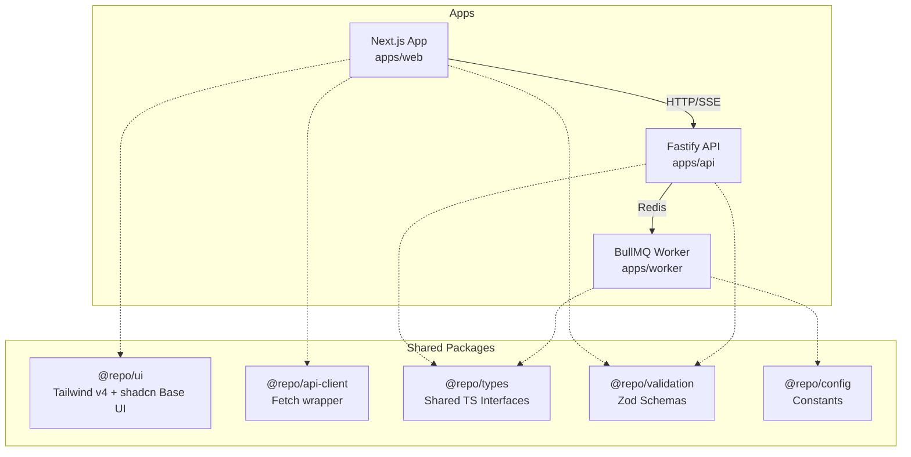

# ASC EHR

ASC EHR is a high-performance, strictly typed medical electronic health record system. It is built as a **Turborepo Monorepo** ensuring clean boundaries, code reuse, and zero duplication across the stack.

## Architecture



## Getting Started

To install dependencies and start the local development environment:

```sh
pnpm install
pnpm dev
```

### Key Commands

- `pnpm dev`: Starts all applications (Web, API, Worker) in development mode.
- `pnpm build`: Builds all applications and packages.
- `pnpm typecheck`: Runs strict TypeScript validation across the entire workspace.
- `pnpm lint`: Runs ESLint checks.

See [docs/ARCHITECTURE.md](docs/ARCHITECTURE.md) and [AGENTS.md](AGENTS.md) for strict contribution rules and project conventions.
