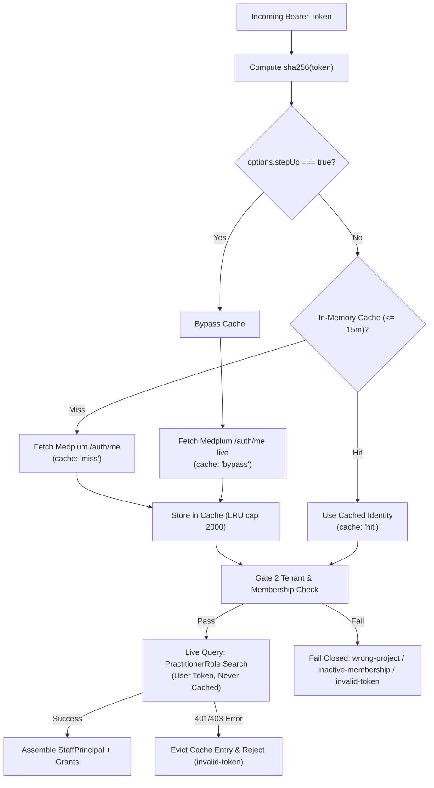

# API Identity Adapter & Authentication Pipeline (`apps/api/src/identity`)

This directory implements **Gate 2 (Identity Verification & Grant Extraction)** of the ASC EHR security spine, delivering Phase **P05i** and adopting **Decision #57**.

---

## 1. Two-Tier Authentication Pipeline

The API uses `MedplumIdentityPort` to verify bearer tokens on behalf of calling users at the configured Medplum server. Zero Medplum client secrets or confidential credentials exist in `apps/api`.

### Tier 1: Identity & Membership (`/auth/me`)
- **Keyed by Hash**: Cached in memory using `sha256(token)` as the key. Raw bearer tokens are **never** stored in cache keys or exposed in application logs.
- **Lifetime & Expiration**: TTL is derived from the JWT payload expiration (`exp`), capped at a maximum of 15 minutes (`MAX_TTL_MS = 15 * 60 * 1000`). Tokens that are already expired are evicted immediately and never stored.
- **Bounded Cache**: The cache is capped at `MAX_CACHE_ENTRIES = 2000`. When full, expired entries are pruned first; if still at capacity, the oldest entry is evicted (LRU behavior).

### Tier 2: Grants & Roles (`PractitionerRole`)
- **Zero Cross-Request Cache**: The user's active `PractitionerRole` resources are queried live against Medplum on **every single request** using the user's bearer token (`_count: 100`).
- **Instant Revocation**: Role changes or facility revocations take effect on the very next HTTP request. Live load tests measured this query at ~2ms per request with zero performance bottleneck.

---

## 2. Step-Up Authentication Semantics

High-assurance clinical operations (e.g., e-signing an operative note, administering controlled substances, altering surgical records) can pass `{ stepUp: true }` in `authenticate(token, tenant, options)`:

1. When `stepUp === true`, the in-memory `/auth/me` cache is bypassed (`activeCached = undefined`).
2. A live HTTP call to Medplum `/auth/me` is made, re-verifying that the user's token and account remain active at this exact instant.
3. The cache is updated with the fresh result, and `cache: "bypass"` is returned in `IdentityResult` for compliance and audit logging.

---

## 3. Cache Eviction & Error Handling Rules

- **Mid-Flight Revocation Eviction**: If a subsequent `PractitionerRole` query encounters HTTP 401 Unauthorized or 403 Forbidden (e.g., the user was revoked or the token was invalidated mid-flight), the cached `/auth/me` entry for that token is immediately deleted (`this.cache.delete(tokenHash)`).
- **Fail-Closed Gate 2 Tenant Validation**:
  - `me.project?.id !== tenant.medplumProjectId` $\rightarrow$ `{ ok: false, reason: "wrong-project" }` (fails closed if project ID is missing or mismatched).
  - `me.membership.active === false` $\rightarrow$ `{ ok: false, reason: "inactive-membership" }`.
  - Missing actor ID (`me.profile?.id ?? me.user?.id`) or missing `membership.id` $\rightarrow$ `{ ok: false, reason: "invalid-token" }` (no `"unknown"` fallbacks).
  - Network error or Medplum unreachable $\rightarrow$ `{ ok: false, reason: "unavailable" }` (HTTP 503; never serves stale entries).

---

## 4. Environment & Startup Guardrails

Identity adapter selection is governed by `apps/api/src/identity/select.ts`:

- **Development**: Uses `DevIdentityPort` (or local Medplum if configured).
- **Staging & Production**: Strictly requires `MEDPLUM_BASE_URL`.
- **Fail-Safe Startup**: If `MEDPLUM_BASE_URL` is omitted in production, `createIdentityPort` throws `IdentityAdapterRefusedError` and halts server startup.
- **Defense in Depth**: `assertIdentityAllowed(identity, production)` verifies that no fake adapter (`FakeIdentityPort` test double or dev identity) can ever be accepted in production, regardless of how the application server was constructed.
