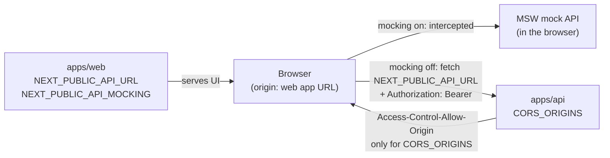

# Deployment Configuration — API URL, CORS and Demo Mocking

How `apps/web` finds `apps/api`, which browser origins the API accepts, and how the mock API is switched on or off — locally, on Vercel, and on Azure.

> Related: [Environments & deployment](ENVIRONMENTS_AND_DEPLOYMENT.md) · [ADR: env-driven API URL and CORS allowlist](decisions/2026-09-30-env-driven-api-url-and-cors-allowlist.md) · [Compliance & PHI](COMPLIANCE_AND_PHI.md)

---

## 1. The rule

**Code never changes between environments; only environment variables do.** Every URL, origin and switch below is parsed and validated in `@asc/config`. Moving from Vercel to Azure (or adding staging) means setting different values and redeploying.



## 2. Variable reference

### Web (`apps/web`) — build-time

`NEXT_PUBLIC_*` values are **inlined into the JavaScript bundle at build time**. Changing them needs a rebuild/redeploy, not a restart.

| Variable | What it does | Rules |
|---|---|---|
| `NEXT_PUBLIC_API_URL` | Base URL every `@asc/api-client` request (and every MSW mock) uses. | **Required for production builds** — `next build` fails if it is unset or not an absolute `http(s)` URL (`packages/config/src/build-env.ts`). A path prefix is allowed (`https://app.example.com/api`). Development falls back to `http://localhost:4000`. |
| `NEXT_PUBLIC_API_MOCKING` | Serves the MSW mock API in the browser instead of calling `apps/api`. | Development: **on** unless `disabled`. Production builds: **off** unless exactly `enabled` (`resolveApiMocking` in `packages/config/src/public-env.ts`). Only a hosted demo sets `enabled`. |

### API (`apps/api`) — runtime

Parsed once at startup by `apiEnvSchema` (`packages/config/src/env.ts`). An invalid value stops the process with the variable **name** only (values are never logged).

| Variable | What it does | Rules |
|---|---|---|
| `CORS_ORIGINS` | Browser origins allowed to call the API cross-origin. | Comma-separated **exact origins**: `https://app.example.com,https://staging.example.com`. No `*`, no path, no trailing slash — anything else fails startup. |
| *(unset)* | — | Development/test: `http://localhost:3000` (`next dev`). Deployed (`NODE_ENV=production`/`staging`): **no origin allowed** (deny by default). |

CORS policy (`apps/api/src/app.ts`): methods `GET POST PUT PATCH DELETE`; headers `Accept Authorization Content-Type X-Correlation-Id X-Request-Id`; preflight cached 10 minutes; **no credentials** — auth is an in-memory Bearer token, never a cookie (LM-004).

### Turborepo

All variables above are listed in `turbo.json` → `tasks.build.env`, so Turbo passes them to builds and includes them in the cache key. **When you add a variable that a build or deployment reads, add it there too** — otherwise Vercel warns *"set on your Vercel project, but missing from turbo.json"* and the value is not available.

## 3. Setups

### A. Local development (default — nothing to set)

```bash
pnpm install
pnpm dev            # web on :3000 (mock API on), api on :4000
```

The browser never reaches `apps/api`: MSW answers every request. To develop against the real API:

```bash
# apps/web/.env.local
NEXT_PUBLIC_API_MOCKING=disabled
NEXT_PUBLIC_API_URL=http://localhost:4000
```

`apps/api` already allows `http://localhost:3000` in development. If web runs on another port, set `CORS_ORIGINS=http://localhost:<port>` in `apps/api/.env`.

### B. Hosted demo on Vercel (today)

The demo runs entirely on the mock API; `apps/api` is deployed separately and only needs CORS for real endpoints (today: `/health`).

| Vercel project | Variable | Value |
|---|---|---|
| web | `NEXT_PUBLIC_API_URL` | `https://<api-project>.vercel.app` |
| web | `NEXT_PUBLIC_API_MOCKING` | `enabled` |
| api | `CORS_ORIGINS` | `https://asc-ehr.vercel.app` |

Set them for **Production** (and **Preview** if previews should work), then redeploy both projects.

- Vercel preview URLs change per deployment and are not in `CORS_ORIGINS`. That is fine while the demo is mocked; for real API calls from previews, add a stable branch alias (e.g. `https://asc-ehr-git-staging-<team>.vercel.app`) to the list.
- `apps/api` on Vercel runs as a Function: long-lived SSE streams are cut at the function's max duration, and there is no worker process. Real workloads belong on Azure (P06).

### C. Staging / production on Azure (later)

Use **custom domains under one parent domain** — e.g. `app.ascehr.com` and `api.ascehr.com` — rather than `*.azurewebsites.net`. The two hosts are then same-site, the CORS list stays one exact entry, and moving hosting never changes the URLs clients see.

| App | Variable | Staging | Production |
|---|---|---|---|
| web | `NEXT_PUBLIC_API_URL` | `https://api-staging.ascehr.internal` | `https://api.ascehr.com` |
| web | `NEXT_PUBLIC_API_MOCKING` | *(unset)* | *(unset)* |
| api | `CORS_ORIGINS` | `https://staging.ascehr.internal` | `https://app.ascehr.com` |

Templates: `apps/web/.env.{staging,production}.example`, `apps/api/.env.{staging,production}.example`.

**Alternative — one origin behind a reverse proxy.** If Azure Front Door / Application Gateway routes `https://app.ascehr.com/api/*` to the API, the browser sees a single origin and CORS is not involved:

```
web:  NEXT_PUBLIC_API_URL=https://app.ascehr.com/api
api:  CORS_ORIGINS unset (no cross-origin callers)
```

`buildUrl` keeps the `/api` prefix, so no code changes either way.

## 4. Verify a deployment

```bash
# 1. Preflight from the web origin must echo the origin back
curl -si -X OPTIONS https://<api>/health \
  -H "Origin: https://<web-origin>" \
  -H "Access-Control-Request-Method: GET" \
  -H "Access-Control-Request-Headers: authorization" | grep -i access-control
# expect: access-control-allow-origin: https://<web-origin>

# 2. Any other origin must NOT get access-control-allow-origin
curl -si -X OPTIONS https://<api>/health \
  -H "Origin: https://example.com" -H "Access-Control-Request-Method: GET" | grep -i allow-origin
# expect: no output
```

In the browser (DevTools → Network), API requests must go to `NEXT_PUBLIC_API_URL` — never `localhost` on a deployed site.

## 5. Troubleshooting

| Symptom | Cause | Fix |
|---|---|---|
| Deployed site calls `http://localhost:4000` and fails with a CORS error | Build ran without `NEXT_PUBLIC_API_URL` (now a build error) and mocking was off | Set `NEXT_PUBLIC_API_URL` (+ `NEXT_PUBLIC_API_MOCKING=enabled` for the demo) on the web project; redeploy |
| `next build` fails: `NEXT_PUBLIC_API_URL is not set` | Guard in `next.config.ts` | Set the variable for that environment (locally: `apps/web/.env.local` or copy `.env.example`) |
| Browser: *No 'Access-Control-Allow-Origin' header* | Web origin not in `CORS_ORIGINS`, or API not redeployed after changing it | Add the exact origin (scheme + host + port, no slash); redeploy the API |
| API exits: `CORS_ORIGINS (invalid)` | Wildcard, path or trailing slash in the list | Use exact origins only |
| Works locally, login 404s against the real API | `apps/api` has no auth routes yet (mock-only until P05) | Keep the demo on `NEXT_PUBLIC_API_MOCKING=enabled` |
| Changed `NEXT_PUBLIC_*` but nothing changed | Values are inlined at build time | Redeploy (rebuild) the web project |
| Vercel api build: `TS2688: Cannot find type definition file for 'node'` | Vercel type-checks through a temp tsconfig | Keep `typeRoots` in `apps/api/tsconfig.json` (LM-009) |

## 6. Adding a new setting

1. Add it to the right schema in `packages/config/src/env.ts` (server) or `public-env.ts` (browser, `NEXT_PUBLIC_*`, literal `process.env.X` access only). Only `@asc/config` reads `process.env` (LM-006).
2. Add tests in `packages/config/src/env.test.ts`.
3. List it in `turbo.json` → `tasks.build.env` if a build or deployment reads it.
4. Document it in the `.env*.example` files and in §2 above.
