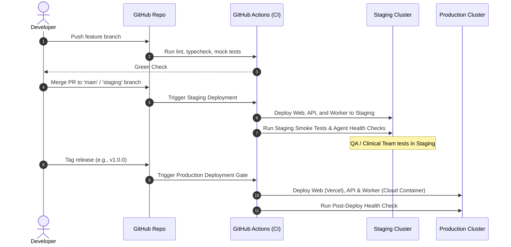

# Environments and Deployment Guide (Dev, Staging, Production)

This document provides a comprehensive analysis and operational roadmap for managing **Development**, **Staging**, and **Production** environments in the ASC EHR platform.

---

## 1. Executive Summary & Readiness Assessment

### Current State Assessment
- **Current Suitability Score: ~30%**
- **What is already suited**:
  - **Turborepo Monorepo Architecture**: Clean separation between `apps/web` (Next.js), `apps/api` (Fastify), `apps/worker` (BullMQ), and shared packages (`@repo/agents`, `@repo/config`, `@repo/types`, `@repo/validation`).
  - **Centralized Model Routing**: The agent package (`@repo/agents`) already routes model invocations through a centralized catalog and gateway, making it possible to plug in environment-aware routing rules in a single place.
- **What is missing / unsuited today**:
  - **No Environment Selectability**: No centralized runtime configuration or environment variable validator. The applications rely on unstructured `process.env["PORT"]` without type safety or missing-variable checks.
  - **No LLM Cost Controls for Staging/Testing**: The agents currently invoke live frontier models (Claude Opus 5.5, GPT-6 Astra, Gemini 3.8 Flash). Running automated regression tests or end-to-end user testing in Staging with these models will lead to high costs and potential rate limiting.
  - **No Staging Mocking / Fixtures**: No framework to record/replay agent responses or use deterministic mock language models during automated tests.
  - **No Database / Migration Pipeline**: Database persistence and migrations (Postgres) are not yet integrated.
  - **No CI/CD Automation**: No GitHub Actions workflows exist to test code, build container images, or trigger staging/production deployments.
  - **HIPAA Data Isolation**: No formal policy or synthetic data generation tools to ensure zero Protected Health Information (PHI) enters Staging.

---

## 2. Environment Architecture Overview

```mermaid
flowchart LR
    subgraph DevEnv ["1. Development (Local / Ephemeral)"]
        DevWeb["Next.js Web (localhost:3000)"]
        DevAPI["Fastify API (localhost:4000)"]
        DevWorker["BullMQ Worker"]
        DevRedis["Local Redis / Docker"]
        DevLLM["Sandbox / Mock Models / Personal Keys"]
    end

    subgraph StagingEnv ["2. Staging (QA, UAT, Testing)"]
        StageWeb["staging.ascehr.internal"]
        StageAPI["api-staging.ascehr.internal"]
        StageWorker["BullMQ Worker (Staging)"]
        StageRedis["Managed Redis (Staging instance)"]
        StageDB["PostgreSQL (Synthetic Clinical Data)"]
        StageLLM["Cost-Controlled LLM / Fixtures / Rate Limits"]
    end

    subgraph ProdEnv ["3. Production (Clinical Operations)"]
        ProdWeb["app.ascehr.com"]
        ProdAPI["api.ascehr.com"]
        ProdWorker["BullMQ Worker (Prod Cluster)"]
        ProdRedis["High-Availability Redis (VPC)"]
        ProdDB["HIPAA-Compliant Postgres (Multi-AZ, Encrypted)"]
        ProdLLM["Enterprise LLM Keys (BAA Enforced, Full Fallback Chain)"]
    end

    DevEnv -->|PR & Merge| StagingEnv
    StagingEnv -->|Approval & Tagged Release| ProdEnv
```



---

## 3. The Three Environments Defined

### A. Development (`development`)
- **Target Audience**: Individual software engineers and AI developers.
- **Host**: Local developer workstations or ephemeral cloud workspaces.
- **Data**: Minimal synthetic seed data.
- **LLM Strategy**: 
  - Mock language models (`MockLanguageModel` from AI SDK) for unit tests.
  - Low-cost models (e.g. Gemini 3.5 Flash Lite or GPT-5.6 Luna) for active development.
  - Developer sandbox API keys with strict budget limits.
- **How to Run**:
  ```bash
  pnpm dev
  ```

### B. Staging (`staging`)
- **Target Audience**: QA engineers, clinical reviewers, internal product testers, automated CI/CD runners.
- **Host**: Cloud environment mirroring production architecture (e.g., AWS ECS, GCP Cloud Run, or Railway/Render).
- **Data**: Extensive synthetic clinical data (patients, encounters, surgical notes, ICD-10 codes). **Zero real patient PHI.**
- **LLM Strategy**:
  - Deterministic evaluation test suites running on recorded response fixtures.
  - Real LLM calls for interactive testing using designated Staging API keys with spend alerts.
  - Opportunity to test model fallbacks and edge-case prompt degradation.
- **How to Run Locally in Staging Mode**:
  ```bash
  APP_ENV=staging pnpm dev
  ```

### C. Production (`production`)
- **Target Audience**: Surgical centers, clinical staff, billers, and anesthesiologists.
- **Host**: Multi-AZ, zero-trust cloud infrastructure with HIPAA Business Associate Agreements (BAAs).
- **Data**: Live encrypted patient health information (PHI). At-rest AES-256 and in-transit TLS 1.3 encryption.
- **LLM Strategy**:
  - Full multi-provider fallback chains (Anthropic Opus 5.5 → OpenAI GPT-6 Astra → Google Gemini 3.8).
  - Zero-data-retention enterprise agreements with AI providers (no training on clinical prompts).
  - Comprehensive telemetry, latency monitoring, and audit logging.

---

## 4. How Environments Can Be Made Easily Selectable

To make environment selection seamless and foolproof across local machines, CI/CD, and production servers, follow this four-tier strategy:

### 1. Unified Environment Variable Schema (`@repo/config/env`)
Create a single source of truth for environment validation using Zod in `@repo/config`:

```typescript
// packages/config/src/env.ts
import { z } from "zod";

export const AppEnvSchema = z.enum(["development", "staging", "production"]);
export type AppEnv = z.infer<typeof AppEnvSchema>;

export const ServerEnvSchema = z.object({
  APP_ENV: AppEnvSchema.default("development"),
  NODE_ENV: z.enum(["development", "production", "test"]).default("development"),
  PORT: z.coerce.number().default(4000),
  HOST: z.string().default("0.0.0.0"),
  REDIS_URL: z.string().url().default("redis://localhost:6379"),
  DATABASE_URL: z.string().url().optional(),
  
  // AI Keys (Required in Staging & Production, optional in Dev when mocking)
  OPENAI_API_KEY: z.string().min(1).optional(),
  ANTHROPIC_API_KEY: z.string().min(1).optional(),
  GOOGLE_GENERATIVE_AI_API_KEY: z.string().min(1).optional(),
});
```

### 2. Standardized Environment Files
Maintain discrete `.env` files:
- `.env.development` (or `.env.local` for local developer overrides)
- `.env.staging.example`
- `.env.production.example`

In Node.js 20+, load environment files natively without extra dependencies:
```bash
node --env-file=.env.staging --import ./dist/instrumentation.js dist/server.js
```

### 3. Environment-Aware Agent Routing in `@repo/agents`
Select a routing profile when creating the gateway:

```typescript
// Routing profiles live in packages/agents/src/config/routing.ts (`default`, `budget`).
// The app picks one from its parsed env config; @repo/agents never reads process.env.
import { createGateway } from '@repo/agents';

const gateway = createGateway({
  routingProfile: env.USE_BUDGET_MODELS ? 'budget' : 'default',
});
// PHI rules still apply in every profile: staging holds synthetic data only, and
// PHI calls are always filtered to BAA providers (validateAgentConfig checks
// that every profile keeps a BAA model for PHI tasks).
```

### 4. Turborepo Command Selection
In root `package.json`:
```json
{
  "scripts": {
    "dev": "turbo run dev",
    "dev:staging": "APP_ENV=staging turbo run dev",
    "build": "turbo run build",
    "start:staging": "APP_ENV=staging turbo run start",
    "start:prod": "APP_ENV=production turbo run start"
  }
}
```

---

## 5. Agentic AI Staging & Testing Guide

Testing AI agents in Staging differs significantly from testing traditional REST APIs:

| Challenge | Traditional API | Agentic AI (ASC EHR) | Staging Solution |
| :--- | :--- | :--- | :--- |
| **Determinism** | Same input = Same output | Non-deterministic text generation | Validate with **structured Zod schemas** (`executeAgentObject`) and semantic assertions rather than exact string matches. |
| **Cost** | Negligible computing cost | High token costs with frontier models | Use **Fixture Recording & Replay** for CI tests. Run live LLMs only on scheduled integration runs or manual QA. |
| **Latency** | 20ms - 200ms | 1s - 25s for multi-step reasoning | Staging background workers must have higher timeout thresholds (30s - 60s) in BullMQ. |
| **HIPAA Compliance** | Mock database records | Prompts sent to third-party LLMs | Absolutely NO live medical records in Staging. Use synthetic medical charts generated with tools like Synthea. |

### Recommended Staging Test Matrix:
1. **Tier 1 (Automated PR Check)**: Unit tests run against `MockLanguageModel` (instant, $0 cost).
2. **Tier 2 (Staging Nightly Evaluation)**: A sample of 50 synthetic clinical charts processed with live models to calculate accuracy metrics (F1 score on medical coding, recall on allergy extraction).
3. **Tier 3 (User Acceptance Testing)**: Clinicians and testers interact with Staging Web UI backed by live Staging API.

---

## 6. CI/CD Deployment Pipeline Blueprint



---

## 7. Immediate Actionable Checklist

To transition from the current basic setup to a production-ready multi-environment setup:

- [ ] **Step 1: Environment Schema (`@repo/config`)**: Implement Zod-based environment schema to validate `APP_ENV`, ports, Redis URLs, and API keys.
- [ ] **Step 2: Environment Templates**: Add `.env.staging.example` and `.env.production.example` to `apps/api`, `apps/worker`, and `apps/web`.
- [ ] **Step 3: Staging Fast-Fail Checks**: Ensure `apps/api` and `apps/worker` crash on startup if required keys for that environment are missing.
- [ ] **Step 4: AI SDK Mocking Suite**: Set up test fixtures in `packages/agents` for zero-cost automated tests.
- [ ] **Step 5: Dockerization**: Create multi-stage `Dockerfile` and `docker-compose.yml` for local staging simulation (API + Worker + Redis + Postgres).
- [ ] **Step 6: GitHub Actions Workflow**: Add `.github/workflows/ci.yml` to automate type checking, linting, and tests on all branches.
