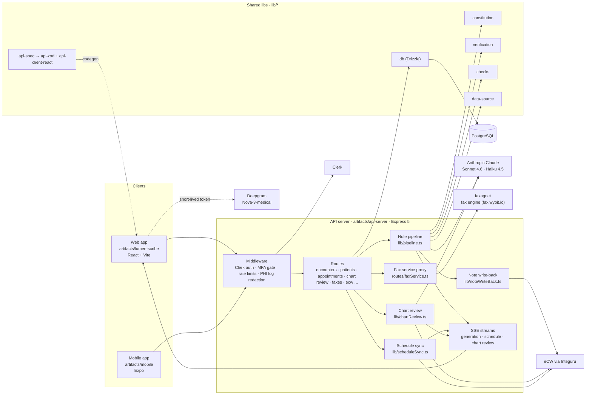
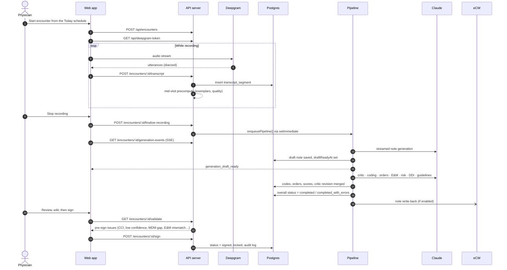
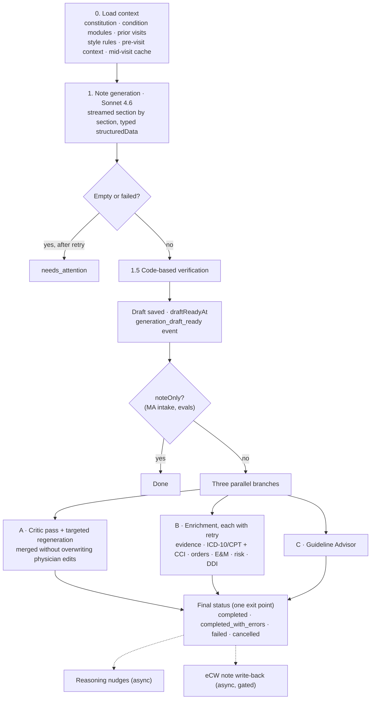
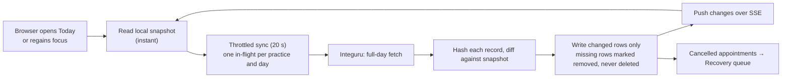
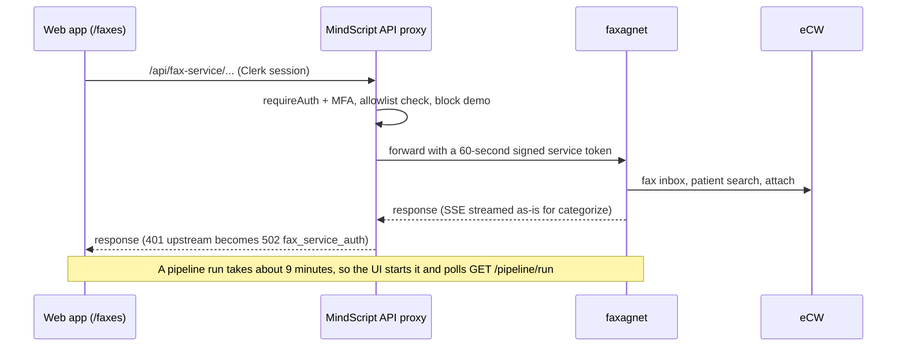
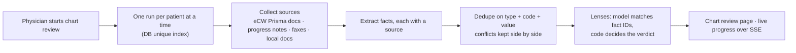
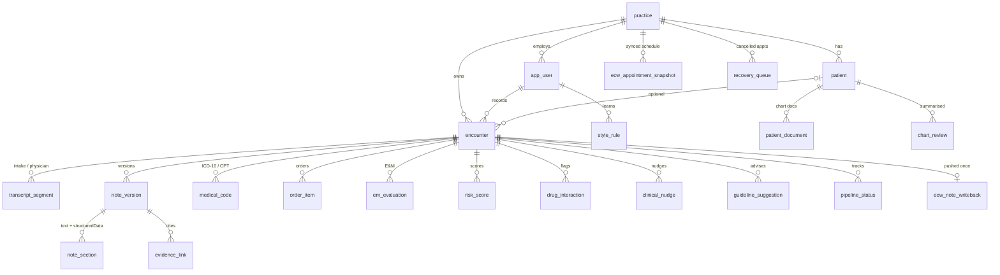

# MindScript — How It Works

*High-level overview · based on GitHub* `Wybit-LLC/MindScript`*, branch* `main`*, commit* `4468979` *(26 Sep 2026, PR #10) · app version 1.73.0*

## 1. Overview

MindScript (by Wybit) turns a recorded patient visit into a sign-ready, billable clinical note for ambulatory physicians. It transcribes the visit live, drafts the note with Claude, checks the draft with code and a critic pass, then codes it and flags billing risks before the physician signs.

MindScript works as an overlay on eClinicalWorks (eCW). It reads the eCW schedule and prior records, can write the finished note back into the eCW encounter, and gives staff one UI for incoming faxes.

- **Users:** ambulatory physicians, medical assistants and front-desk staff. Cardiology and gastroenterology have full specialty rule sets.
- **Input:** visit audio (live or uploaded), eCW schedule and chart documents, and incoming faxes.
- **Output:** a structured note, ICD-10 and CPT codes, orders, an E&M level, risk scores, drug-interaction alerts, reasoning nudges and guideline suggestions.
- **Clients:** a React web app (the main product) and an Expo mobile app.

## 2. System architecture

MindScript is a pnpm TypeScript monorepo with one Express API server, a React web app and an Expo mobile app, sharing a Postgres database and a set of domain libraries.

Four design choices shape the rest of the system:

- **Contract-first API.** `lib/api-spec/openapi.yaml` is the source of truth. Orval generates React Query hooks (`api-client-react`) and Zod schemas (`api-zod`).
- **In-process background work.** The pipeline, chart review and legacy fax analysis run inside the API process via `setImmediate`, not a job queue. At boot the server recovers interrupted runs (`reconcileInterruptedPipelines`, `reconcileInterruptedChartReviews`, `reconcileInterruptedFaxAnalyses`).
- **Code-based guardrails around the LLM.** Specialty rules, verification and must-not-miss checks are plain TypeScript libraries. Where accuracy matters most (guideline text, chart-review verdicts), the model only picks IDs and code builds everything else.
- **Fail loudly at boot.** `lib/dependencyCheck.ts` stops the server if a required env var or system binary is missing. `GET /api/health/detailed` reports the same checks for monitoring.

## 3. Key components

| Component            | Location                                                    | What it does                                                                                                                                                                                 |
| -------------------- | ----------------------------------------------------------- | -------------------------------------------------------------------------------------------------------------------------------------------------------------------------------------------- |
| Web app              | `artifacts/lumen-scribe`                                    | Today (schedule), Patients, Encounter workspace, Chart Review, Faxes (inbox, queues, analysis, audit, settings), Recovery queue, Practice, Library, Analytics, Teach, Audit, Settings, Demo. |
| Mobile app           | `artifacts/mobile`                                          | Expo app: sign-in, encounter list, encounter screen, profile.                                                                                                                                |
| API server           | `artifacts/api-server`                                      | Express 5, 36 router mounts under `/api`. PHI routes use `requireAuth` + `requireMfa`.                                                                                                       |
| Note pipeline        | `lib/pipeline.ts`                                           | Transcript → streamed draft → verification → three parallel branches (critic, enrichment, guidelines). See §4.2.                                                                             |
| Mid-visit precompute | `lib/midVisitPrecompute.ts`                                 | During recording, fetches example notes and scores transcript quality ahead of time so finalizing is faster. Kept in memory only.                                                            |
| Constitution         | `lib/constitution` + `constitution/*.json`                  | Per-specialty rule sets (`core`, `cardiology`, `gastroenterology`). Loads condition modules the transcript triggers and builds the note prompt.                                              |
| Verification         | `lib/verification`                                          | Facts trace to the transcript, no age/sex contradictions, risk scores only when their inputs exist, every code maps to a diagnosis.                                                          |
| Must-not-miss checks | `lib/checks`                                                | Flag a missing key element when a condition is present.                                                                                                                                      |
| Structured data      | `note_section.structuredData`                               | The pipeline returns typed data for meds, ROS, vitals, allergies, history, assessment and plan. Section editors render from it.                                                              |
| eCW client           | `lib/ecw/*`                                                 | Integuru calls: connect, schedule, Prisma chart documents, progress notes, encounter note write.                                                                                             |
| Schedule sync        | `lib/scheduleSync.ts`, `scheduleEvents.ts`                  | Local copy of the eCW schedule. Changes are detected by content hash and pushed to the browser over SSE.                                                                                     |
| Recovery queue       | `routes/recovery.ts`, `cancellationResolver.ts`             | Worklist of cancelled appointments that need staff follow-up. Rows are added by the schedule sync.                                                                                           |
| Pre-visit prep       | `lib/previsit.ts`                                           | Drafts a short history-only brief from prior eCW records, labelled "pending review".                                                                                                         |
| Chart review         | `lib/chartReview.ts`, `lensEngine.ts`                       | Builds a per-patient fact summary with sources from eCW documents, notes and faxes. Conflicting facts stay visible. "Lenses" check how complete the evidence is.                             |
| eCW note write-back  | `lib/noteWriteBack.ts`, `lib/ecw/encounterNote.ts`          | After a successful run, appends the note to the linked eCW encounter's HPI once. Off unless `ECW_NOTE_WRITEBACK=on`.                                                                         |
| Fax service proxy    | `routes/faxService.ts`, `lib/faxService/*`                  | Server-side proxy to faxagnet, the separate fax engine. MindScript is its only UI. Allowlisted paths, a 60-second signed service token, no cookies passed through.                           |
| Legacy fax agent     | `lib/faxAgent.ts`, `lib/faxOcr.ts`                          | Older in-app fax OCR and patient matching, now at `/faxes/legacy`.                                                                                                                           |
| Guideline Advisor    | `lib/guidelineAdvisor.ts`                                   | Curated guideline suggestions: the model picks snippet IDs, and the text shown is verbatim ACC/AHA and ACG/AGA text.                                                                         |
| Demo mode            | `routes/demo.ts`, `lib/seedDemo.ts`                         | No-login demo practice using a signed cookie. Faxes and eCW write-back are blocked in demo.                                                                                                  |
| Evals                | `src/evals`                                                 | Note-quality harness (LLM judge), graded check cases and latency baseline.                                                                                                                   |
| Security             | `auth.ts`, `phiCrypto.ts`, `audit.ts`, `breachDetection.ts` | Clerk JWTs, optional MFA (`MFA_ENFORCED`), AES-256-GCM on patient DOB, audit log, PHI redacted from logs.                                                                                    |

Two modules exist but are switched off: revenue cycle management (RCM) and the patient create/edit UI (`PATIENT_MANAGEMENT_ENABLED = false`).

## 4. Core flows

### 4.1 Encounter: record to signed note

The browser streams audio to Deepgram with a short-lived token and posts each utterance to the API. The pipeline starts when recording is finalized, and the draft appears before the rest of the steps finish.

If a medical assistant records an intake phase first, finalizing it runs note generation only, with the plan set to "Pending physician evaluation". Coding and later steps wait for the physician phase.

### 4.2 The note pipeline (draft-first)

`runPipeline()` saves the draft as soon as it is generated and verified. It then runs three branches at once, so coding no longer waits for the critic.

Each step writes its state to `pipeline_status` and sends an SSE event for live progress. A failed enrichment step marks only itself failed. Too many `needs_attention` outcomes in a short window trigger an alert (`failureRateAlert.ts`).

### 4.3 eCW schedule sync

### 4.4 Faxes via the fax service

Staff work faxes through the inbox, queues and triage pages. AUTO/YOLO mode can process a batch of faxes in the browser, one after another.

### 4.5 Chart review

## 5. Data model

The `encounter` table is the hub, and everything is scoped to a `practice`. The schema has 51 tables in `lib/db/src/schema`. The diagram shows the core ones; RCM, chat and fax-service tables are left out.

Encounter status moves `scheduled → recording → processing → draft → signed`. A failed or cancelled run returns to `draft` for retry.

- **One patient per eCW ID:** `upsertEcwPatient()` with a partial unique index on `(practice_id, external_id)`.
- **Feedback loop:** `code_edit`, `note_edit`, `text_feedback` and `style_rule` capture physician corrections.
- **Encryption:** only `patient.dateOfBirth` is encrypted at field level.
- **Schema changes** are applied with direct SQL (runbooks in `specs/ops/`), not `drizzle-kit push`.

## 6. Tech stack and deployment

| Layer           | Technology                                                                          |
| --------------- | ----------------------------------------------------------------------------------- |
| Monorepo        | pnpm workspaces, TypeScript 5.9                                                     |
| Web             | React, Vite, Wouter, Tailwind, shadcn/ui, TanStack Query, Tiptap, Vitest            |
| Mobile          | Expo 54                                                                             |
| Backend         | Express 5, Pino, Helmet, express-rate-limit, http-proxy-middleware, PDFKit, esbuild |
| Data            | PostgreSQL, Drizzle ORM, cuid2                                                      |
| Auth            | Clerk, optional MFA                                                                 |
| AI              | Claude Sonnet 4.6 and Haiku 4.5, Deepgram Nova-3-medical                            |
| Integrations    | eCW via Integuru; faxagnet fax engine; Stedi (RCM, off)                             |
| System binaries | `pdftoppm`, ImageMagick (fax OCR)                                                   |

- **Hosting:** Replit autoscale today (API on 8080, web on 23433). A root `Dockerfile` also exists for Azure or any Docker host, but Replit's publish step does not use it.
- **On boot:** startup checks, then seed data and the demo practice, system templates, recovery of interrupted runs, and seeding MTSamples if the table is empty.
- **Key env vars:** `DATABASE_URL`, `ANTHROPIC_API_KEY`, `DEEPGRAM_API_KEY`, `CLERK_SECRET_KEY`, `PHI_ENCRYPTION_KEY`, `INTEGURU_`*, `FAX_SERVICE_*`, `ECW_NOTE_WRITEBACK`, `MFA_ENFORCED`, `PREVISIT_DOCS_ENABLED` (see `.env.example`).
- **Releases:** each user-facing change bumps `CURRENT_VERSION` and adds an entry to `lumen-scribe/src/lib/changelog.ts`, which feeds the in-app "What's New". Work lands through GitHub PRs; design specs live in `specs/`.

