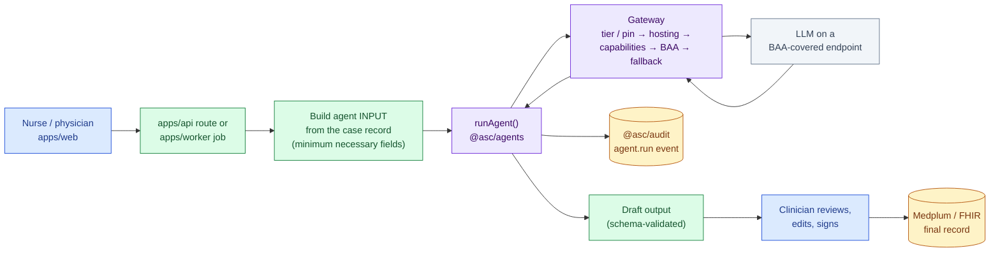
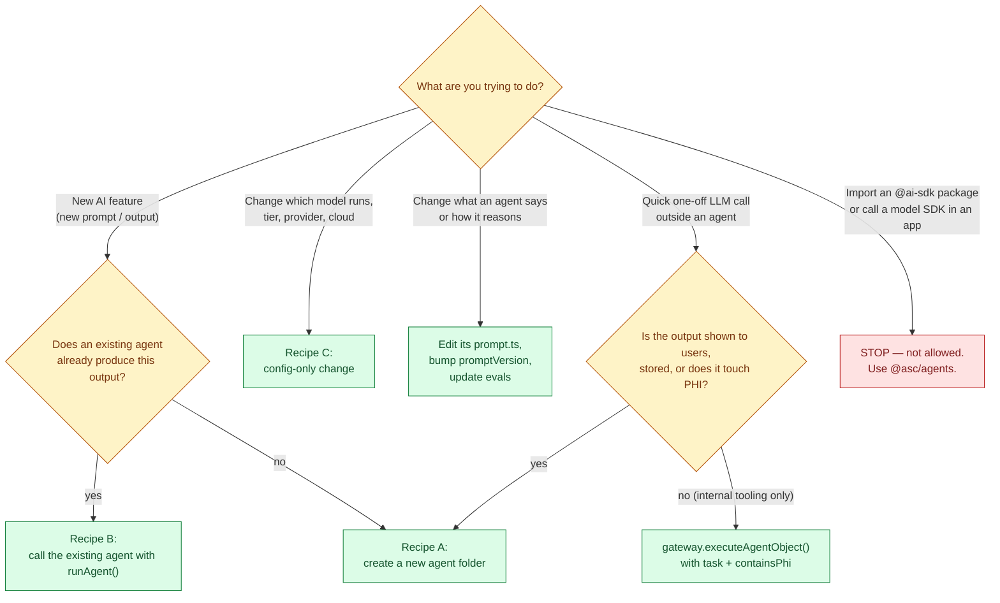
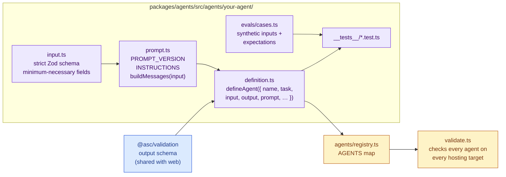
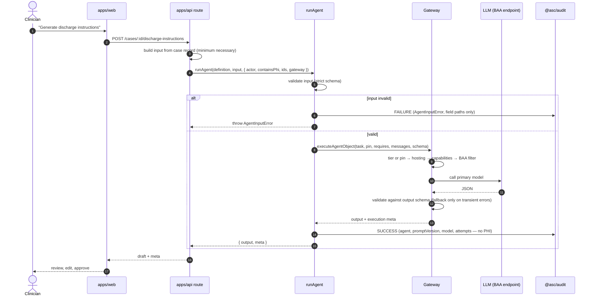
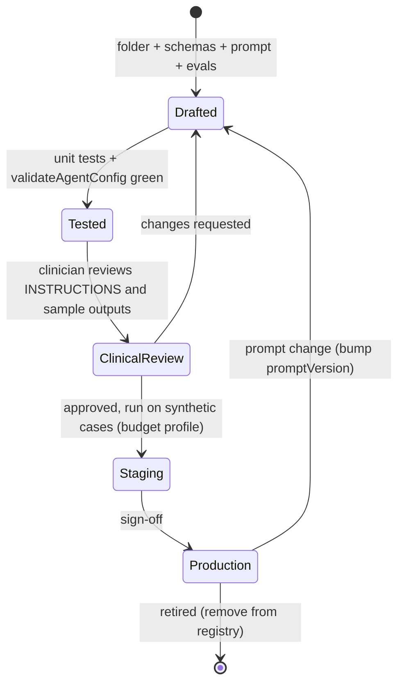

# AI Agents Guide — how to build and use LLM agents in ASC EHR

**Audience:** AI coding agents and human developers.
**Read this before** you add an AI feature, create or change an agent, change which model runs, or call an LLM from any app.
**Package reference** (all types, folder map, config diagrams): [`packages/agents/README.md`](../../packages/agents/README.md).
**Memory, skills, caching & roadmap** (proposal): [memory-skills-and-modern-techniques.md](memory-skills-and-modern-techniques.md).

---

## 1. TL;DR

- Every LLM call goes through **`@asc/agents`**. Nothing else imports an `@ai-sdk/*` package or calls a model.
- An **agent** = one folder in `packages/agents/src/agents/<name>/` that declares *what it needs* (task, input, output, prompt). It never says *which model* — config decides that.
- Apps run agents with **`runAgent(definition, input, options)`**. It validates the input, picks a compliant model, validates the output and **always writes the audit event**.
- AI output is a **draft**. A clinician confirms it before anything is signed or sent to a patient.
- PHI only reaches models on **BAA-covered** endpoints. The router enforces this; you declare `containsPhi` honestly.

## 2. The big picture

Where an agent sits in a real request (e.g. "generate discharge instructions" after a colonoscopy):



## 3. Which path do I use?



Rule of thumb: **if a human will read it, store it, or it contains PHI → it is an agent.**

## 4. Anatomy of an agent



| Field in `defineAgent` | Meaning | Example |
|---|---|---|
| `name` | kebab-case id, written to audit | `'discharge-instructions'` |
| `task` | policy: minimum tier + PHI handling (`config/tasks.ts`) | `Task.PatientInstructions` |
| `reasoning` *(optional)* | raise the tier above the task minimum | `Reasoning.High` |
| `models` *(optional)* | pin exact models (replaces the tier chain) | `[Models.claudeOpus55]` |
| `requires` *(optional)* | extra capabilities (structured output is automatic) | `[Capability.Vision]` |
| `promptVersion` | `YYYY-MM-DD.N`; bump on any prompt change | `'2026-09-25.1'` |
| `input` / `output` | Zod schemas; output lives in `@asc/validation` | — |
| `instructions` + `buildMessages` | the prompt; the **only** place data reaches the model | — |
| `tools` / `maxSteps` *(optional)* | tool calling (adds `Capability.Tools` automatically) | — |

## 5. Recipe A — create a new agent

Worked example: a `referral-letter` agent (procedure summary for the referring physician). Copy the `discharge-instructions` folder as the template.

1. **Pick or add a task** in `packages/agents/src/config/tasks.ts`. Reuse one if the policy fits. A new task needs a profile (`reasoning`, `handlesPhi`, `description`); the compiler enforces it.
2. **Output schema** → `packages/validation/src/agents/referral-letter.ts`, exported from `packages/validation/src/index.ts` (the web app renders it).
3. **Input schema** → `agents/referral-letter/input.ts`. Use `.strict()`, closed enums, numbers, booleans. **No names, DOB, MRN, addresses or free text** unless the output truly needs it — and then write down why in a comment.
4. **Prompt** → `agents/referral-letter/prompt.ts`:
   ```typescript
   export const PROMPT_VERSION = '2026-09-26.1';
   export const INSTRUCTIONS = `You draft a referral-back letter … Use ONLY the facts provided …`;
   export function buildMessages(input: ReferralLetterInput): ModelMessage[] {
     // Render each allowed field explicitly — never JSON.stringify(input).
     return [{ role: 'user', content: `Facts:\n- Procedure: ${PROCEDURE[input.procedure]}\n- …` }];
   }
   ```
5. **Definition** → `agents/referral-letter/definition.ts`:
   ```typescript
   export const referralLetterAgent = defineAgent({
     name: 'referral-letter',
     description: 'Procedure summary letter for the referring physician.',
     task: Task.PatientInstructions, // or a new Task.ClinicalCorrespondence
     promptVersion: PROMPT_VERSION,
     input: referralLetterInputSchema,
     output: referralLetterOutputSchema,
     instructions: INSTRUCTIONS,
     buildMessages,
   });
   ```
   and `agents/referral-letter/index.ts` re-exporting it.
6. **Register** it in `agents/registry.ts` (one line) and export it from `src/index.ts`.
7. **Evals** → `agents/referral-letter/evals/cases.ts`: 3+ synthetic cases (`AgentEvalCase`) with checks on the output.
8. **Tests** → `agents/referral-letter/__tests__/`: copy the discharge-instructions test. At minimum: each eval input parses; `buildMessages` includes only allowed facts; invalid input throws `AgentInputError` without calling a model; a mocked valid output round-trips through `runAgent`; audit gets SUCCESS and FAILURE events.
9. **Verify**: `pnpm -s turbo run lint check-types test --filter=@asc/agents --filter=@asc/validation`. `validateAgentConfig()` (run by the tests) proves the agent can run — with a BAA model if it handles PHI — on every hosting target.
10. **Clinical review** of `INSTRUCTIONS` before it is used with real patients; note the reviewer in the PR.

## 6. Recipe B — call an agent from an app

Create the gateway **once** at startup with the app's hosting target and routing profile, then call `runAgent` per request.

```typescript
// apps/api/src/lib/ai.ts — once at startup (values come from @asc/config's parsed env)
import { createGateway, directHosting } from '@asc/agents';
export const gateway = createGateway({ hosting: directHosting, routingProfile: 'default' });

// apps/api/src/routes/... — per request
import { dischargeInstructionsAgent, runAgent } from '@asc/agents';

const { output, meta } = await runAgent(dischargeInstructionsAgent, input, {
  actor: { type: 'user', id: request.user.id },  // who triggered it (audit)
  containsPhi: true,                              // be honest; task policy may force true anyway
  patientId: caseRecord.patientId,                // internal ids only, never names/MRNs
  surgicalCaseId: caseRecord.id,
  gateway,
});
// `output` is schema-validated DRAFT content → save as draft, show for review.
// `meta.agentExecutionId` + `meta.promptVersion` → store on the draft (FHIR Provenance later).
```



Long-running or batch work (e.g. letters for the day's cases) → enqueue a BullMQ job and call `runAgent` in `apps/worker` the same way.

## 7. Recipe C — config-only changes (no agent code)

| I want to… | Edit | Notes |
|---|---|---|
| Use a different model for a tier | `config/routing.ts` | Order = fallback order |
| Make a kind of work use a stronger tier | `config/tasks.ts` → `reasoning` | Affects every agent with that task |
| Make ONE agent use a specific model | that agent's `definition.ts` → `models: [Models.x]` | Still hosting / capability / BAA filtered |
| Require image input for an agent | `definition.ts` → `requires: [Capability.Vision]` | Router skips text-only models |
| Add a new model | `config/models/<vendor>.ts` + binding in `config/hosting/*.ts` + `routing.ts` | Typed; typos don't compile |
| Retire a model | `deprecated: true` in `config/models/` | Tests fail until removed from routing |
| Bump a model id / version | `config/hosting/<target>.ts` | One line |
| Deploy a GPT model on Azure | app settings → `createAzureHosting({ deployments })` | No package change |
| Add a provider / cloud | `config/providers/` + `config/hosting/` + validation list | See package README |
| Cheap models in staging | `createGateway({ routingProfile: 'budget' })` | Synthetic data only in staging |

After any config change: `pnpm -s turbo run test --filter=@asc/agents` — `validateAgentConfig()` fails if any tier, agent or PHI path becomes unservable on any hosting target.

## 8. Agent lifecycle



## 9. Rules

### MUST
- Route every LLM call through `@asc/agents` (`runAgent`, or the gateway for internal tooling).
- Put each agent in its own folder; register it in `agents/registry.ts`.
- Use `.strict()` input schemas with minimum-necessary fields; render fields explicitly in `buildMessages`.
- Put output schemas used by the web app in `@asc/validation`.
- Bump `promptVersion` on **any** change to `INSTRUCTIONS` or `buildMessages`.
- Pass an honest `containsPhi`, the triggering `actor`, and internal ids (`patientId`, `surgicalCaseId`) — never names or MRNs.
- Treat output as a draft; store `agentExecutionId` + `promptVersion` with it.
- Add eval cases and tests; keep `validateAgentConfig()` green.
- Get clinical review before an agent's output reaches patients or the medical record.

### MUST NOT
- Import `@ai-sdk/*` or call a model SDK outside `packages/agents/src/config/providers/`.
- Name a model inside an agent's prompt or app code (use `models` pins in the definition if truly needed).
- `JSON.stringify` a patient/case object into a prompt, or add free-text fields "just in case".
- Log prompts, model outputs, or `AgentExecutionError.cause`.
- Read `process.env` inside `@asc/agents` (the app builds hosting from `@asc/config`).
- Set `baa: true` on a provider without a countersigned BAA covering that endpoint.
- Let an agent sign, finalize, or send anything without clinician approval.

## 10. Troubleshooting

| Error | Meaning | Fix |
|---|---|---|
| `AgentInputError` | Input failed the schema (message lists field paths, no values) | Fix the caller's input mapping |
| `NoCompliantModelError` | PHI call, but no BAA-covered model for that tier/pin on this hosting target | Add a BAA model to the routing/pin, or check `baa` flags |
| `NoCapableModelError` | No model has the required capabilities (e.g. vision) | Route/pin a capable model, or check capability flags |
| `NoAvailableModelError` | Nothing in the tier/pin is hosted on this target (or all deprecated) | Add bindings in `config/hosting/` or change routing |
| `AgentExecutionError` (`retryable: false`) | Model rejected the request or output failed the schema | Inspect `name`/metadata (not `cause` in logs); fix prompt/schema |
| `AgentExecutionError` (`retryable: true`) | All models in the chain had transient failures | Provider outage/rate limit; retry later |
| `AuditStoreNotConfiguredError` | Production without a durable audit store | Call `configureAuditStore()` at app startup |

## 11. PR checklist for agent changes

- [ ] New/changed agent lives in its own folder and is registered
- [ ] Input schema is `.strict()`, minimum necessary, no identifiers
- [ ] `buildMessages` renders fields explicitly; no whole-object serialization
- [ ] `promptVersion` bumped if the prompt changed
- [ ] Output schema in `@asc/validation` (if the web renders it)
- [ ] Eval cases + tests added/updated; `pnpm -s turbo run lint check-types test` green
- [ ] No `@ai-sdk/*` imports outside `config/providers/`; no model names in app code
- [ ] Clinical reviewer named in the PR for patient-facing or record-bound output

## Related
- Package reference and config diagrams: [`packages/agents/README.md`](../../packages/agents/README.md)
- PHI rules: [`docs/COMPLIANCE_AND_PHI.md`](../COMPLIANCE_AND_PHI.md)
- Model routing decisions: [`docs/decisions/2026-09-25-centralize-agent-configuration-and-model-routing.md`](../decisions/2026-09-25-centralize-agent-configuration-and-model-routing.md)
- Planned GI agents (H&P intake, procedure note, coding, referral letter, pathology reconcile): [`docs/product/03-target-architecture.md`](../product/03-target-architecture.md)
