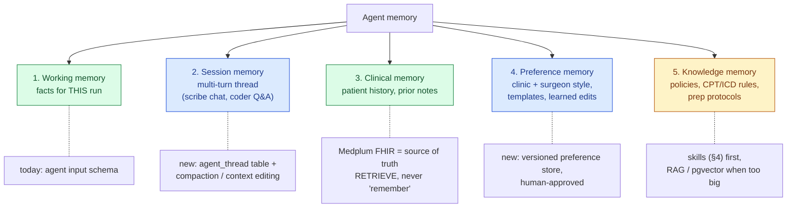
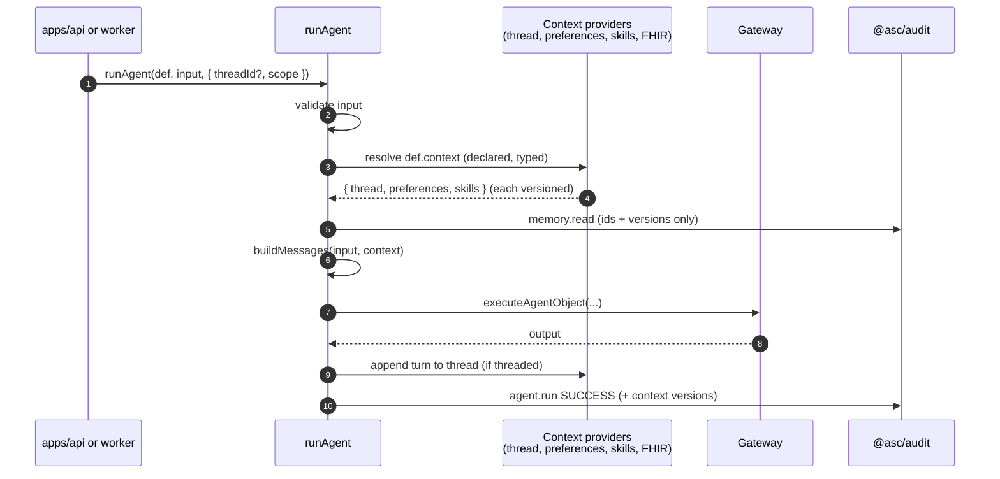
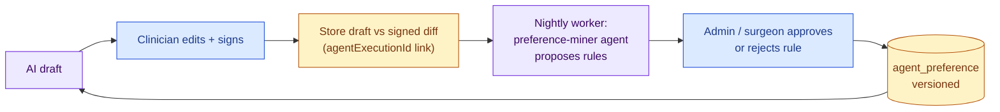

# Agent Memory, Skills & Modern Techniques — design guide for ASC EHR

**Audience:** developers and AI coding agents extending `@asc/agents`.
**Status:** proposal (nothing here is built yet). Anything that changes architecture should become an ADR before it lands.

> **Reviewed 2026-09-26 — read the [architecture review](memory-skills-proposal-review.md) first.** It supersedes this proposal where they conflict: notably refusal handling (fail closed, no cross-vendor fallback), preference *mining* (deferred; typed config instead), the missing execution/workflow state model, and the tool data boundary.
**Read with:** [AI Agents Guide](ai-agents-guide.md), [Compliance & PHI](../COMPLIANCE_AND_PHI.md), [agent routing ADR](../decisions/2026-09-25-centralize-agent-configuration-and-model-routing.md).
**Facts as of:** 2026-09-26. Vendor features move fast — re-check anything marked *verify* before building on it.

---

## 1. TL;DR — the three questions

| Question | Short answer |
|---|---|
| **"Does Anthropic handle memory so we don't have to worry?"** | **No.** The Messages API is stateless: every call only knows what we send it. Anthropic ships *building blocks* (memory tool, Managed Agents memory stores, compaction, context editing), but for an EHR **we must own memory** — PHI has to live in our BAA-covered, audited store (Medplum/Postgres), and our router can fall back to OpenAI/Gemini, which would not see an Anthropic-hosted memory. |
| **"Can we use skills inside the project during agent invocation?"** | **Yes — as our own provider-neutral "skills" concept** (versioned knowledge packs loaded into an agent's context, statically or on demand via a `load_skill` tool). Anthropic's native Agent Skills (API `container.skills`) exist, but they need Anthropic's code-execution container, don't work through OpenAI/Gemini fallbacks, and their PHI/BAA coverage must be confirmed first. Separately, **Claude Code skills** in `.claude/skills/` speed up *developers* building agents (e.g. a `create-agent` skill for Recipe A). |
| **"How do we make agents better and faster?"** | Speed and cost come mostly from **prompt caching, right-sized model/effort per task, batching, streaming, and fewer round-trips** — not from skills or memory. Quality comes from **grounded context (retrieve, don't remember), structured outputs, evals, and clinician-edit feedback**. See §5. |

---

## 2. Where we are today

`@asc/agents` is a clean *stateless, single-shot* agent layer:

```
app builds input from case record ─► runAgent(definition, input)
   ─► strict input schema ─► buildMessages() (only place data reaches the model)
   ─► gateway: tier/pin → hosting → capabilities → BAA filter → fallback
   ─► AI SDK generateText (+ structured output, optional tools/maxSteps)
   ─► output schema validation ─► audit event (no PHI) ─► DRAFT for clinician
```

That is the right foundation. Every idea below **plugs into this pipeline** — nothing bypasses `runAgent`, the BAA router, or `@asc/audit`.

What is missing: no notion of *context beyond one input object* — no conversation threads, no clinic/surgeon preferences, no reference knowledge, no retrieval.

---

## 3. Memory

### 3.1 What "memory" actually means (5 kinds)

"Memory" is five different problems. Each has a different home.



| # | Kind | Lifetime | Home | Contains PHI? |
|---|---|---|---|---|
| 1 | Working | one `runAgent` call | agent input (already done) | yes, minimum necessary |
| 2 | Session | minutes–days | new `agent_thread` / `agent_message` tables in our Postgres | yes |
| 3 | Clinical | forever | **Medplum FHIR** (Patient, Encounter, Observation, DocumentReference…) | yes |
| 4 | Preference | months, versioned | new `agent_preference` store (per clinic / per surgeon / per agent) | should not |
| 5 | Knowledge | versioned with code | skills folder (§4) → vector index later | no |

### 3.2 Why not rely on vendor memory

| Vendor option | What it is | Why it doesn't fit as our primary memory |
|---|---|---|
| **Claude.ai / Claude Code "memory"** | product feature of Anthropic's apps | not part of the API at all |
| **Memory tool** (`memory_20250818`) | model reads/writes files in a `/memories` dir; **we implement the storage backend** | useful *pattern*, but storage is ours anyway — and letting the model free-write patient "memories" creates unreviewed, possibly hallucinated clinical facts |
| **Managed Agents memory stores** (beta `agent-memory-2026-07-22`) | Anthropic-hosted, versioned text files mounted into a hosted session | PHI would sit on Anthropic infra (BAA scope must be confirmed — *verify*); Managed Agents isn't on Azure/Foundry-hosted deployments; our fallback models can't read it |
| **Compaction** (beta `compact-2026-01-12`) / **context editing** (beta `context-management-2025-06-27`) | server-side summarising / clearing *within one long conversation* | good tools for session memory (§3.4), not persistence |
| **OpenAI / Gemini equivalents** | stored responses / threads | same lock-in + retention problems |

**Rule:** vendors may *process* PHI (BAA endpoint), they never *store* our memory. Memory lives in our database, goes through `@asc/audit`, and is provider-neutral so the router keeps working.

### 3.3 Design: a `context` step in the agent pipeline

Keep `buildMessages()` as the only place data reaches the model. Add a typed, audited **context resolution** step *before* it.



Sketch (proposal — names are illustrative):

```typescript
// packages/agents/src/context/define.ts
export interface ContextScope {
  clinicId: string;
  practitionerId?: string;   // internal ids only
  patientId?: string;
  threadId?: string;
}

/** Implemented in apps (Postgres / Medplum); @asc/agents only knows the interface. */
export interface ContextProvider<T> {
  name: string;
  load(scope: ContextScope): Promise<{ value: T; version: string }>;
}

// in an agent definition
export const dischargeInstructionsAgent = defineAgent({
  // ...existing fields
  context: {
    preferences: surgeonPreferencesProvider, // "Dr X: no NSAIDs 5 days after polypectomy"
    skills: [bowelPrepSkill],                // §4 — static knowledge pack
  },
  buildMessages(input, ctx) { /* render ctx fields explicitly, like input */ },
});
```

Why this shape:
- **Dependency direction stays clean** — `@asc/agents` defines interfaces; `apps/api` wires Postgres/Medplum implementations (same pattern as `configureAuditStore`).
- **Every context version is audited** (`preferencesVersion`, `skillVersions`) next to `promptVersion`, so any draft is reproducible.
- **Testable** — eval cases inject fixed context.

### 3.4 Session memory (multi-turn agents)

Needed for e.g. an ambient scribe that refines a note over several turns, or a coder asking "why 45385 not 45380?".

1. Store turns in `agent_thread` / `agent_message` (Postgres, encrypted at rest, tenant-scoped, retention policy, audited).
2. Send the full thread each call (the API is stateless — that's normal).
3. When threads get long:
   - **Context editing** — drop stale tool results / thinking blocks.
   - **Compaction** — summarise older turns. Anthropic has it server-side (beta); for provider neutrality we can do our own: when a thread passes N tokens, a cheap-tier `thread-summary` agent writes a summary turn and older turns are archived (not deleted).
4. Keep threads **append-only** — newer Claude models (Opus 5.5, Fable 5.1) validate that earlier turns weren't edited when replaying thinking blocks; rewriting history breaks both that and prompt caching.

### 3.5 Preference memory that learns (the valuable one)

The highest-leverage "memory" for an ASC is **learning how each surgeon/clinic likes drafts**, safely:



- Proposed rules are **suggestions** until a human approves — no silent self-modification.
- Rules are *style/process* ("list diet steps as bullets", "always include GI on-call number"), never patient facts.
- Diff rate (how much clinicians edit) becomes a quality metric per agent/promptVersion.

### 3.6 Clinical memory = retrieval, not remembering

Patient history already has a perfect memory: Medplum. Agents get it via **explicit retrieval**:
- *Deterministic* (preferred): the app queries FHIR and maps to the agent's strict input (what we do today).
- *Agentic* (later, tool-loop agents): read-only FHIR tools (`get_prior_colonoscopies(patientId)`) with typed args, each call audited, `containsPhi: true`. Medplum's FHIR API could also be exposed as an MCP server, but keep tools narrow and read-only.
- Never let a model write clinical facts back without clinician sign-off.

---

## 4. Skills

### 4.1 Two different things called "skills"

| | **Dev-time skills** (Claude Code) | **Runtime skills** (inside agent invocation) |
|---|---|---|
| Who uses them | Engineers + coding agents building this repo | Our production agents when they run |
| Where | `.claude/skills/<name>/SKILL.md` | `packages/agents/src/skills/<name>/` (proposal) |
| Makes faster | *Development* — new agents in minutes, consistent | *Runtime quality* — domain knowledge on demand; speed only indirectly |
| PHI | never | knowledge only, never PHI |

### 4.2 Dev-time skills (do this now — cheap, high value)

Turn the AI Agents Guide recipes into Claude Code skills so "create an agent for X" becomes one command:

| Skill | Does |
|---|---|
| `create-agent` | Recipe A end-to-end: folder, input/output schema, prompt with `PROMPT_VERSION`, registry, evals, tests, runs `turbo lint check-types test` |
| `change-agent-prompt` | edits prompt, bumps `promptVersion`, updates evals, reminds about clinical review |
| `add-model` | Recipe C: model + hosting binding + routing, runs `validateAgentConfig` |
| `phi-review` | checks a diff for PHI in logs, `JSON.stringify(input)`, free-text fields, missing `containsPhi` |

These read `docs/agent/*.md` as their source of truth, so docs and automation don't drift.

### 4.3 Runtime skills — provider-neutral design

A **skill** = a versioned, clinically reviewed knowledge pack: instructions + reference data, e.g. `bowel-prep-protocols`, `gi-cpt-coding-rules`, `sedation-discharge-criteria`, `aspirin-anticoagulant-holds`.

```
packages/agents/src/skills/gi-cpt-coding-rules/
  SKILL.md          # name, description, version, reviewer; the instructions
  reference/        # tables the model may need (modifier rules, bundling)
  evals/            # cases proving the skill helps
  index.ts          # defineSkill({ name, version, description, body, files })
```

Two ways to use them:

| Mode | How | Use when | Pros / cons |
|---|---|---|---|
| **Static** (start here) | `defineAgent({ context: { skills: [x] } })` → skill body rendered into the stable system prefix | agent always needs the knowledge (discharge agent always needs prep/sedation rules) | deterministic, reviewable, **cache-friendly**; costs tokens every call (mostly cached) |
| **On-demand** (progressive disclosure) | agent gets a `load_skill(name)` tool; only names + one-line descriptions sit in the prompt | tool-loop agents covering many domains (coding agent: colonoscopy vs EGD vs ERCP rules) | small base context; model pulls only what it needs; one extra round-trip; works on any provider via AI SDK tools |

Rules:
- Skill version goes into the audit event and into the agent's effective prompt version — a skill change is a prompt change (evals + clinical review).
- Skills hold **knowledge and procedure, never PHI**.
- Skill text is trusted operator content; patient documents (referral PDFs, faxes) are **untrusted data** and must never be allowed to "load" or override a skill (prompt-injection guard).

### 4.4 Anthropic native Agent Skills — when to consider

Anthropic's API supports Agent Skills natively (`container: { skills: [...] }` + the code-execution tool; Skills API now GA). Good fit for **file-producing** work (generate a PDF/XLSX report) with no PHI. For clinical agents, hold off until:
1. BAA coverage of the code-execution container + Skills is confirmed in our Anthropic agreement (*verify*),
2. we accept that those agents can't fall back to OpenAI/Gemini (pin to Anthropic via `models: [...]`),
3. it's available on the hosting target we deploy (Microsoft Foundry: Anthropic-hosted deployments only — *verify*).

Our own skill format (§4.3) mirrors Anthropic's `SKILL.md` layout, so moving a skill to native Skills later is a copy, not a rewrite.

---

## 5. Modern techniques to adopt (as of Sep 2026)

Ordered by value-for-effort for this codebase.

### 5.1 Speed & cost

| Technique | What to do in `@asc/agents` | Impact |
|---|---|---|
| **Prompt caching** | Order every request *stable → volatile*: instructions + skills + preferences first, patient facts last. Mark the stable prefix cacheable (AI SDK Anthropic: `providerOptions.anthropic.cacheControl`; OpenAI/Gemini cache prefixes automatically). Never put timestamps/ids in instructions. Log `cacheReadTokens` in execution meta. | cached input ~10% of price, lower latency |
| **Right-size model + effort per task** | Map our `Reasoning` tiers to provider "effort" (Claude `output_config.effort: low…max`, OpenAI `reasoning_effort`) in routing config, not agent code. Classification/extraction → Haiku-class, `low`; clinical drafting → `high`. Note Claude Opus 5.5 defaults to `medium` — set it explicitly. | often the biggest cost lever |
| **Batch API** | Day-end work (letters for all cases, coding pre-review) → BullMQ job that submits one provider batch. | ~50% cheaper, async |
| **Streaming structured output** | `streamObject`-style partial output to the UI for long drafts. | perceived latency ↓ |
| **Parallel tool calls / fewer round-trips** | Tool-loop agents: allow parallel calls; return all results in one message. For multi-step data crunching consider **programmatic tool calling** (model writes code that calls tools; only final output enters context) — Anthropic-specific. | fewer turns |
| **Tool search / deferred tools** | When an agent has many tools (future FHIR toolset), load tool schemas on demand. | smaller prompts, better cache |

### 5.2 Quality & safety

| Technique | What to do |
|---|---|
| **Structured outputs everywhere** | Already done (Zod output schemas). Keep it. |
| **Grounding + citations** | Output schema includes `sourceFactIds` per statement; validation rejects claims not tied to an input fact. Makes clinician review faster and catches hallucination. |
| **Evals as CI gate** | Grow `evals/cases.ts` → scored eval runs (rule checks + LLM-as-judge with a stronger model) on every `promptVersion` bump; track diff-rate from real clinician edits (§3.5). |
| **Refusal handling** | Newer Claude models can return `stop_reason: "refusal"` (HTTP 200). Gateway should treat it as a routed failure and fall back like a transient error, and audit the category. |
| **Prompt-injection defense** | Wrap untrusted document text in clearly delimited data blocks; never let it trigger tools that write; keep write tools behind human confirmation. |
| **Human-in-the-loop by design** | Already the rule (drafts only). Keep "AI draft" provenance via FHIR `Provenance` with `agentExecutionId` + versions. |
| **Observability without PHI** | AI SDK telemetry → OpenTelemetry GenAI spans with `recordInputs/recordOutputs: false`; tokens, latency, cache hits, model, attempts only. |

### 5.3 Agent architecture patterns

| Pattern | Use in ASC EHR |
|---|---|
| **Workflows before agents** | Most features (discharge, referral letter, pre-op checklist) are single calls or fixed pipelines. Only use tool loops when the path is genuinely open-ended (coding review, chart Q&A). |
| **Orchestrator → sub-agents** | e.g. `coding-review` orchestrator calls `procedure-extractor` (cheap) + `modifier-checker` (strong). Each sub-agent is a normal registered agent run via `runAgent` → each audited. |
| **Advisor pattern** | Cheap executor model with an occasional stronger "advisor" consult (Anthropic has a native advisor tool; can be emulated with a sub-agent). Good for high-volume coding. |
| **MCP for integrations** | Expose read-only Medplum/FHIR queries as MCP tools for internal tooling; production agents still go through our typed tools + audit. |
| **Managed / hosted agents** | Anthropic Managed Agents (hosted loop + sandbox + memory stores + schedules) is powerful but PHI residency, BAA scope and Azure hosting make it a **not-now** for clinical work. Fine for internal non-PHI automation. |

---

## 6. Proposed roadmap

| Phase | Deliverables | Needs ADR? |
|---|---|---|
| **0 — now** | Dev-time Claude Code skills (`create-agent`, `change-agent-prompt`, `add-model`, `phi-review`); prompt-order + cache flags in gateway; log cache/token usage in meta | no |
| **1 — first real agents** | `ContextProvider` interface + `context` on `defineAgent`; static runtime skills; effort mapping in routing config; refusal → fallback; eval runner | yes — "agent context & skills" |
| **2 — multi-turn** | `agent_thread` tables, append-only threads, own compaction via summary agent | yes — "agent session memory" |
| **3 — learning** | draft-vs-signed diff capture, preference-miner agent, approval UI, `agent_preference` store | yes — "preference memory" |
| **4 — scale** | on-demand `load_skill` tool, FHIR read tools, batch jobs, RAG over policies (pgvector in the same Postgres) if skills outgrow the prompt | per feature |

## 7. Open questions to confirm before building

1. Which Anthropic / OpenAI / Azure features are inside our **BAA** scope (code execution, Files API, Skills, memory stores, batch)? Get this in writing.
2. **Data retention** settings per provider (zero-data-retention eligibility vs 30-day requirements of some newest models — e.g. Claude Fable 5.1 requires 30-day retention).
3. Retention period and deletion rules for `agent_thread` data (treat as part of the legal medical record or not?).
4. Who approves preference rules — surgeon, medical director, or both?
