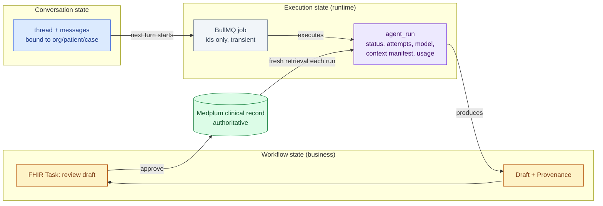

# Architecture Review — "Agent Memory, Skills & Modern Techniques" proposal

**Reviewed document:** [`memory-skills-and-modern-techniques.md`](memory-skills-and-modern-techniques.md) (2026-09-26)
**Review date:** 2026-09-26 · **Reviewer stance:** principal engineer, healthcare/PHI system, multi-provider via Vercel AI SDK
**Scope:** documentation only — no code, config, dependency or migration changes.
**Verdict:** *Direction mostly right, altitude wrong.* The proposal correctly keeps PHI and memory out of vendor state and treats Medplum as truth. But it (a) invents five kinds of "memory" while missing the two kinds of state a real EHR agent platform needs first — **execution state** and **workflow state**; (b) recommends one unsafe behaviour (refusal → cross-vendor fallback); (c) under-specifies the data boundary once tools exist; and (d) front-loads Phase 3–4 machinery (preference mining, dynamic skills, RAG, own compaction) that a project with no database and no production agent should not build yet.

Every finding is tagged:

| Tag | Meaning |
|---|---|
| **[Repo]** | verified in the current repository |
| **[Proposal]** | what the reviewed document suggests |
| **[External]** | supported by official docs or published research (sources at the end) |
| **[Assessment]** | reviewer's architectural judgement |

---

## 0. Baseline — what actually exists today [Repo]

| Area | Current state |
|---|---|
| Agent runtime | `runAgent()` → strict input parse → `buildMessages()` → `gateway.executeAgentObject()` → AI SDK `generateText` with `Output.object` → output schema validation → exactly one `@asc/audit` event (`agent.run`, SUCCESS/FAILURE, no PHI). Stateless, single call, in-process. |
| Fallback | `runWithFallback` walks a BAA-filtered chain; falls back **only** on retryable errors (408/409/429/5xx, network, timeout). Schema/validation errors, 4xx, aborts and *unknown errors fail closed*. |
| Streaming | `streamAgentTask` uses the first eligible model only; no fallback. |
| Identity | `agentExecutionId = crypto.randomUUID()` generated **per gateway call** — a retried job gets a new id. |
| Tools | `definition.tools` + `maxSteps` pass straight into `generateText`; no tool-level scoping, audit or result shaping. |
| Worker | `apps/worker`: BullMQ `Worker` with a stub processor; job data carries ids only (comment: "PHI should NOT be here"). No retries/backoff/idempotency configured. |
| API | Fastify + `fastify-sse-v2`; only a health route. |
| Data | **No database yet.** Medplum ADR accepted; resources tagged with facility `Organization` for future compartments; AI work planned as Subscription → API → BullMQ. |
| Agents | One: `discharge-instructions` (single-shot, structured output). |
| Timeline | Go-live early Dec 2026, 12 Phase-1 modules. |

This baseline matters: most of the proposal is designing for agents that don't exist yet.

---

## 1. Vocabulary first — the proposal's taxonomy is wrong

**[Proposal]** Five "memories": working, session, clinical, preference, knowledge.

**[Assessment]** Only one of those is actually *memory*. Treating everything as memory hides the design questions that matter (who owns it, who may write it, how authoritative it is, how long it lives, whether it's safe to replay). Use these eight terms, with a precise definition each, across all future docs and ADRs:

| Term | Definition | Owner / store | Written by | Lifetime | Authority |
|---|---|---|---|---|---|
| **Clinical record** | The legal medical record | Medplum FHIR | clinicians, integrations, signed drafts | permanent | **authoritative** |
| **Context** | Whatever is assembled and sent for *one* model call | nowhere (ephemeral); only a *manifest* is persisted | code (context providers, tools) | one call | derived — as good as its sources |
| **Knowledge** | Curated, reviewed reference (protocols, coding rules, prep instructions) | repo / config, versioned | clinical & coding owners via review | per version | authoritative *for the org* |
| **Skills** | *Packaging* of knowledge + procedure for a model (instructions, examples, references) | repo, versioned | engineers + clinical reviewer | per version | as knowledge |
| **Conversation state** | Ordered messages of a multi-turn thread | our Postgres | users + agent | thread lifetime + retention policy | none — it's a transcript |
| **Execution state** | Progress of one agent run: status, step, tool calls made, model served, attempts, checkpoint | our Postgres (+ queue) | runtime | run lifetime + audit retention | operational |
| **Workflow state** | Business-process state: draft awaiting review, approved, sent, superseded | domain model / FHIR `Task`, `Provenance` | runtime + humans | case lifetime | operational, auditable |
| **Memory** | Information an agent **writes** that later runs **read back** as context | (none in Phase 1) | the model | long | lowest — model-derived |
| **Cache** | A performance copy that must never change correctness | provider prompt cache; app caches | infra | seconds–hours | none |

Mapping the proposal onto this:

- "Working memory" → **context**. Not memory.
- "Clinical memory" → **clinical record** read into **context**. Calling it memory invites exactly the wrong design (model-maintained patient facts).
- "Preference memory" → **configuration/knowledge** (org/surgeon settings), *not* memory — unless the model writes it, which is the dangerous variant (§6).
- "Knowledge memory" → **knowledge**, packaged as **skills**.
- "Session memory" → **conversation state**.
- **Missing entirely: execution state and workflow state** — the two things needed for long-running, failing, human-gated, restart-surviving agents (§3).

**[Assessment] Recommendation:** in Phase 1 there is **no model-writable memory at all**. Everything the model sees is either the clinical record, reviewed knowledge, explicit configuration, or the current conversation. That single rule removes most of the poisoning, drift and PHI-leak risk discussed below.

---

## 2. Is the memory model sufficient for each agent shape?

| Agent shape | Example | What it needs | Proposal covers? |
|---|---|---|---|
| **Short-lived, single-shot** | discharge instructions, referral letter, classification | context assembly, idempotent execution record, draft → review workflow state | context: partly. execution/workflow state: **no** |
| **Multi-turn** | scribe refinement, "why this CPT?" Q&A | conversation state bound to one org/patient/case, append-only, context re-assembled each turn from *fresh* sources | conversation: yes; binding & re-freshing: **no** |
| **Long-running / tool loop** | coding review over a whole encounter, prior-auth packet assembly | execution checkpoints per step, idempotent tools, pause for human approval, survive deploys, budget/step limits | **no** |

**[Assessment]** The proposal is adequate for single-shot agents only in the data sense. For multi-turn it misses that conversation history is *not* a source of truth: turn 1's lab value may be stale by turn 5 — context must be re-retrieved per turn, not carried forward from the transcript. For long-running agents it has no execution model at all.

**[External]** Research on longitudinal clinical agents reaches the same conclusion: general-purpose memory systems "optimize for coherence by overwriting older facts with the latest statement", which is unsafe for clinical data; authoritative EHR facts should never be silently superseded by lower-authority statements ("authority monotonicity"), and memory must be temporally valid (Dual-stream reconciliation, 2604.27045; MedCache, 2608.29528; Always-On Agents survey, 2606.30306). Repeated summarisation causes cumulative *drift* (SSGM, 2603.11768) — directly relevant to the proposal's "own compaction".

---

## 3. Durable execution & resumability — the biggest gap

**[Proposal]** Silent on execution; suggests BullMQ for batch jobs only.

**[Repo]** `runAgent` is an in-process call; the worker processor is a stub; `agentExecutionId` changes on every retry; no idempotency.

### 3.1 Failure scenarios the design must answer

| Scenario | Today's behaviour | Required behaviour |
|---|---|---|
| Worker crashes mid-call | BullMQ marks stalled, re-runs → new `agentExecutionId`, second model call, possibly two drafts | run record with stable id; re-run detects existing run; at most one *committed* draft |
| Model returns, DB write fails | output lost, model cost wasted, retry regenerates a *different* draft | persist raw validated output against run id before any side effect |
| Deploy/restart during run | job re-queued; same as crash | same as crash |
| Waiting for clinician approval | n/a | approval is **workflow state**, not a paused process |
| Tool loop fails at step 4 of 7 | whole loop reruns; tools re-execute | per-step checkpoint; read tools idempotent; write tools never auto-retried |

### 3.2 Recommended model [Assessment]

1. **Human approval ends a run; it never pauses one.** A run produces a draft and completes. "Awaiting review" lives in workflow state (FHIR `Task` for the reviewer, draft linked via `Provenance` to `agentExecutionId` + versions). Approval is a new event that may start a *new* run. This makes 90% of the "suspend/resume" problem disappear and matches the draft-only rule already in the AI Agents Guide.
2. **An `agent_run` record is the unit of execution state**, created *before* the model call with an id derived from the job (idempotency key), holding status (`queued → running → succeeded | failed | cancelled`), agent, `promptVersion`, context manifest (§5), served model, attempts, token usage, output reference. The audit event references it.
3. **BullMQ is both dispatcher and executor for Phase 1** (§9) — one job = one run; job retry = run retry keyed on the same `agent_run` id.
4. **Durable step-level checkpointing only when a real tool-loop agent exists.** At that point evaluate a durable workflow engine (§10) via ADR.

### 3.3 State separation [Assessment]

Rules: **the queue holds no state that isn't reproducible from Postgres**; **conversation state never substitutes for retrieval**; **workflow state is the only thing humans act on**.

---

## 4. Clinical memory must stay retrieval from Medplum — keep, and harden

**[Proposal]** "Retrieve, never remember"; deterministic mapping preferred; read-only FHIR tools later; no model write-back without sign-off.

**[Assessment] Keep — this is the proposal's best decision.** Strengthen it with:
- **Authority levels on every fact** (authoritative record / clinician-entered today / patient-reported / device / model-derived). The model is told the level; outputs must not upgrade a lower-authority fact. **[External]** authority monotonicity (2604.27045, 2606.30306).
- **Temporal validity**: facts carry `effective`/`recorded` time; agents declare max age per fact type (e.g. INR, anticoagulant hold, last meal time). Stale → fail or flag, never silently use.
- **On-behalf-of access**: context retrieval runs with the *triggering user's* Medplum access policy (or a narrowly-scoped agent policy per task), not a super-user service account. Otherwise the agent becomes an authorization bypass.
- **Signed drafts become record; unsigned drafts never feed future context** — otherwise the model reads its own unreviewed output back as truth.

---

## 5. The `buildMessages()` boundary once tools and dynamic retrieval exist

**[Repo]** `buildMessages` is documented as "the ONLY place the agent decides what data reaches the model". That's true today only because the sole agent has no tools.

**[Assessment]** Once an agent has tools, **tool results are a second ingress path** that bypasses `buildMessages`. The invariant must be restated as: *data reaches the model only through governed boundaries*, of which there are three:

| Boundary | Governs | Required controls |
|---|---|---|
| `buildMessages(input, context)` | initial facts | typed fields, minimum necessary, explicit rendering (as today) |
| **Tool result mappers** | data returned by read tools | typed output schema per tool, minimum-necessary projection (never raw FHIR bundles), untrusted-text wrapping, per-call audit (tool name + resource ids, no values) |
| **Scope binding** | *which* patient/case/org a tool may touch | tool receives `{orgId, patientId, caseId}` from run scope — **never from model arguments**. A model-supplied patient id must be rejected. **[External]** AI SDK `toolsContext` gives each tool its own typed context — the right mechanism for this. |

Also: `prepareStep` (AI SDK) is where dynamically retrieved context should enter mid-loop, and it must go through the same mappers — not ad-hoc string concatenation.

---

## 6. `ContextProvider` — right idea, insufficient metadata

**[Proposal]** `ContextProvider<T> { name; load(scope) → { value, version } }`, context versions audited, one `memory.read` audit event per read.

**[Assessment]** Right abstraction (interfaces in `@asc/agents`, implementations in apps — mirrors `configureAuditStore`). But `{value, version}` cannot support freshness, provenance or authority decisions. Each resolved context item should carry:

| Field | Why |
|---|---|
| `source` (system, FHIR type/id, `meta.versionId`, or knowledge id + version) | provenance, reproducibility, FHIR `Provenance.entity` |
| `authority` (`record` / `clinician` / `patient-reported` / `org-config` / `knowledge` / `model-derived`) | authority monotonicity |
| `effectiveAt`, `retrievedAt`, `validUntil` / `maxAge` | temporal validity; stale detection |
| `scope` (`orgId`, `patientId?`, `caseId?`) | asserted equal to run scope — cross-patient guard |
| `sensitivity` (`phi` / `none`) + minimum-necessary class | routing (`containsPhi` derived, not declared) and logging |
| `trust` (`operator` / `untrusted-text`) | prompt-injection handling: untrusted text is always wrapped as data |
| `contentHash` | detect change between runs without storing values |

Persist a **context manifest** (all fields except values) on `agent_run`, and reference it from the single `agent.run` audit event. **[Assessment]** A separate audit event per read, as proposed, is noisy; reads of FHIR data are already audited by Medplum (`AuditEvent`), and the manifest links them.

Additional improvement: derive `containsPhi` from the manifest (`any item.sensitivity === 'phi'`) instead of trusting callers — removes a human-error path that exists today **[Repo]** (`containsPhi` is a caller-supplied boolean, forced true only for PHI tasks).

---

## 7. Preference memory could launder clinical rules — reconsider

**[Proposal]** Capture draft-vs-signed diffs → nightly "preference-miner" agent proposes rules → admin approves → versioned `agent_preference` → injected into prompts. Claims rules are "style/process, never patient facts".

**[Assessment] High risk; defer the mining loop entirely.**

- **Clinical edits look like style edits.** A surgeon deleting "resume aspirin tomorrow" is a clinical decision (perhaps patient-specific, perhaps a protocol change). A miner that generalises it creates an **unreviewed clinical rule** that reaches every future patient — bypassing the clinical-review gate that prompts and knowledge go through.
- **Patient-specific → population rule.** Edits made for one patient's contraindication get generalised.
- **Admin approval ≠ clinical governance.** A one-click approve on a model-summarised rule is rubber-stamping, not review.
- **Poisoning.** **[External]** "Forged reasoning" attacks plant entries in agent memory — including an EHR-agent example asserting "validation already done upstream" — which later runs treat as established practice (2607.05029); the memory-security survey (2604.16548) and SSGM (2603.11768) describe poisoning/drift across the memory lifecycle.
- **Free-text preferences can carry PHI** ("for Mrs. …").

**Recommended instead:**
1. Phase 1: **explicit, typed configuration** per org/surgeon with a *closed schema* of non-clinical dimensions only (reading level, tone, format, section order, contact numbers, language). No free-text rules. Changes audited, versioned.
2. Anything clinical (medications, holds, diet, activity restrictions, follow-up intervals) lives in **knowledge** with clinical review — ideally as structured data evaluated by code (§8).
3. Keep diff capture — but as an **evaluation and monitoring signal** (edit rate per agent/promptVersion/model), not as a memory source.
4. Revisit learned suggestions only with real edit data, a classifier separating clinical vs non-clinical edits, and clinical-owner approval — via ADR.

---

## 8. Skills

### 8.1 Dev-time vs runtime separation

**[Proposal]** Distinguishes Claude Code skills (`.claude/skills/`) from runtime skills (`packages/agents/src/skills/`). **[Assessment] Keep**, and make it enforceable:
- Different directories, owners and review: dev skills = engineering review; runtime knowledge = clinical/coding owner sign-off.
- Runtime code must never read `.claude/`; dev skills may *reference* runtime docs but never become runtime inputs.
- Dev skills are the cheap, high-value win now (`create-agent`, `change-agent-prompt`, `add-model`, `phi-review`) — they encode the AI Agents Guide recipes.

### 8.2 Runtime skills — provider neutrality and the deeper problem

**[Proposal]** Static injection (default) or on-demand `load_skill` tool; format mirrors Anthropic `SKILL.md`.

**[External]** The open Agent Skills specification defines `SKILL.md` with required `name`/`description`, optional `license`, `compatibility`, `metadata`, experimental `allowed-tools`, optional `scripts/`, `references/`, `assets/`, and three-level progressive disclosure. It has **no version field** (only free-form `metadata`).

**[Assessment]**
- **Static injection is provider-neutral**; it's just text. Keep as the default.
- **`load_skill` is only nominally neutral.** Tool-calling reliability and eagerness differ across providers and tiers; a fallback model may skip loading the skill and answer from priors. For clinical work, **skill selection must be deterministic code** (procedure type → skill set), not model choice. Model-selected skills are acceptable only for non-clinical/internal agents. Defer.
- **Adopt the spec's format, not its execution model.** Use `SKILL.md` frontmatter for interoperability, put `version`, `owner`, `clinicalReviewer`, `reviewedAt` in `metadata`, plus a content hash; **forbid `scripts/`** in runtime skills (no code execution in the clinical path).
- **The bigger point: clinical rules shouldn't be prose at all.** Anticoagulant hold days, prep timing, sedation discharge criteria and CPT bundling are *rules*. They belong in structured, tested data/code (the product plan already calls for a "GI coding rules engine" **[Repo]**), with the model only *explaining/phrasing* results. A runtime "skill" is then explanatory context, and the rules engine is the authority. This is safer, cheaper (smaller prompts), and trivially provider-neutral.

### 8.3 Provider-native memory/skills — what role, if any?

| Provider feature | [External] behaviour | [Assessment] role |
|---|---|---|
| Anthropic memory tool | client-side; you implement storage | pattern only; no model-writable memory in Phase 1 |
| Anthropic Managed Agents memory stores / hosted sessions | Anthropic-hosted, versioned | not for PHI; possibly internal non-PHI automation |
| Anthropic Agent Skills (API) | needs Anthropic code-execution container | not in the clinical path; maybe non-PHI document generation |
| OpenAI Responses `previous_response_id` / Conversations | responses stored 30 days by default unless `store: false`; conversation items have no 30-day TTL | **do not use** for PHI; ensure stateless calls (`store: false`) — *verify the AI SDK OpenAI provider default and set it explicitly* |
| Gemini Interactions API `previous_interaction_id` | server-side state; GA and recommended by Google | **do not use** server-side state; send full history |
| AI SDK memory providers (Letta, Mem0, Supermemory, …) | external services | no — PHI to additional processors, model-writable memory |
| Provider prompt caching | automatic (OpenAI, Gemini implicit) or opt-in (Anthropic) | **yes** — performance only, no semantic state |

**Policy [Assessment]:** *vendors compute, we store.* No server-side conversation/memory state at any provider for PHI workloads; it breaks fallback (another vendor can't see it), multiplies retention obligations, and escapes our audit. Provider-native features are acceptable when they are **stateless or cache-only**, or in non-PHI internal tooling.

---

## 9. Redis / BullMQ — dispatch, execution, or both?

**[Repo]** BullMQ worker exists; Medplum ADR routes heavy/AI work Subscription → API → BullMQ.

**[Assessment] Both, for Phase 1.** Phase-1 agents are single calls lasting seconds to a few minutes; a BullMQ job is a fine unit of execution *if*:
- the processor is **idempotent** against `agent_run` (look up by job-derived id before calling a model);
- `attempts` + exponential backoff are set; the gateway already does per-model retries, so keep job attempts low (e.g. 2–3) to avoid multiplying spend;
- lock/stall settings tolerate long model turns (newest reasoning models can take minutes on hard tasks **[External]**) so a slow call isn't treated as stalled and double-executed;
- **no PHI in Redis**: job data = ids (already the convention), *and* job `returnvalue` / `failedReason` / logs must not contain PHI — `AgentExecutionError.cause` and provider error bodies can echo prompt content. Store results in Postgres, keep Redis payloads to ids/status, use `removeOnComplete`/`removeOnFail` retention;
- multi-step pipelines use BullMQ **flows** (parent/child jobs) rather than one long job.

BullMQ is **not** a durable step-checkpointing engine; if tool-loop agents with many steps or long waits arrive, that's the trigger for §10.

Streaming to the UI: run generation in the worker, persist output, and push progress via Redis pub/sub → Fastify SSE; the client can reconnect and read the persisted result. Don't tie a generation to a single HTTP connection.

---

## 10. Do Vercel AI SDK's newer agent/workflow capabilities change the architecture?

**[External]**
- AI SDK `ToolLoopAgent` provides `stopWhen`, `prepareStep`, tool `needsApproval`, shared `runtimeContext`, and per-tool typed `toolsContext`; the memory docs offer provider tools (Anthropic memory), third-party memory providers, or custom tools — **no built-in memory**.
- `WorkflowAgent` (`@ai-sdk/workflow`) runs on the Workflow DevKit (`'use workflow'` / `'use step'`): tools marked as steps become durable, retried, persisted; it survives restarts and pauses for approval; state must be serializable; approval signing is `experimental_`. Execution backends are pluggable "Worlds": Local, Vercel (managed), and a **community-maintained** Postgres world.

**[Assessment]**
- **It changes the *shape*, not the plan.** Design the tool boundary (§5) so it maps 1:1 onto `toolsContext` (scope binding) and `needsApproval` (write tools), and keep context/scope serializable (ids, not clients) — that keeps a later move to `ToolLoopAgent`/`WorkflowAgent` cheap.
- **Don't adopt `WorkflowAgent` now.** We deploy on AKS (not Vercel); the self-hosted Postgres world is community-maintained; approvals are experimental; and §3's "approval ends a run" design removes the main need. Revisit via ADR when a real long-running tool-loop agent exists, alongside alternatives (e.g. Temporal, DBOS, Inngest) — evaluate on self-hosting, Postgres-backed durability, PHI handling in persisted step state, and fit with BullMQ.
- **Durable step state is PHI.** Any durable engine persists tool inputs/outputs; it must sit in our BAA-covered, encrypted store with retention rules — a selection criterion, not an afterthought.
- `runAgent` + gateway remain the choke point either way; any agent class must be constructed *inside* the gateway so routing, BAA filtering and audit still apply.

---

## 11. Speed & cost techniques — are they appropriate here?

| Technique | [Proposal] | [Assessment] |
|---|---|---|
| **Prompt caching** | stable-first ordering, cache flags | **Keep ordering; don't expect much yet.** Providers have minimum cacheable prefix sizes (Anthropic: model-dependent, ~0.5k–4k tokens **[External]**); today's discharge prompt is likely below that. Caches are per provider/model, so every fallback is a cold cache. Correct layering once prompts grow: global instructions → knowledge/skills → org config → surgeon config → case facts. Never put run ids/timestamps in prefixes. Measure `cacheRead` tokens before claiming savings. |
| **Model/effort per task** | map tiers to effort in routing | **Keep** — config-only, fits existing `Reasoning` tiers. But effort semantics differ per provider; evaluate each model in each chain at its configured effort. Some newest models default effort differently — set it explicitly. |
| **Batch APIs** | nightly letters/coding | **Defer.** Up-to-24h latency; BAA/retention coverage of batch endpoints must be verified per provider; Phase-1 AI work is mostly interactive. |
| **Streaming** | partial objects to UI | **Constrain.** Partial structured output is *unvalidated* — show progress, not actionable content; commit only after schema validation. Streaming path has no fallback today **[Repo]**. |
| **Parallel tool calls** | allow | OK for **read** tools only; never parallel writes. Premature until tools exist. |
| **Deferred tools / tool search** | for large toolsets | **Premature** — we have zero tools. Also provider-specific. |
| **Programmatic tool calling / advisor** | Anthropic-specific | **Premature** and not provider-neutral; breaks fallback symmetry. |

**Interaction with memory & skills [Assessment]:** caching rewards *stable, shared* prefixes — static knowledge fits; per-surgeon config fragments caches (put it late); anything freshly retrieved per run sits after the cache boundary. Dynamic skill loading appends content mid-conversation and defeats per-agent cache reuse across patients. Fallback and caching pull in opposite directions; accept it — correctness and availability beat cache hit rate in a clinical system.

---

## 12. Refusal handling & provider fallback — reverse one recommendation

**[Proposal]** "Gateway should treat refusal as a routed failure and fall back like a transient error."

**[Repo]** Today a refusal/no-object result surfaces as a non-retryable error → **fails closed**. That is the safer behaviour.

**[Assessment] Reject the proposal's change.**
- Re-sending a refused clinical request to a different vendor is **safety-shopping**: one model's policy decision is overridden by asking another.
- Each fallback **discloses the same PHI to an additional processor**. All are BAA-filtered, but minimum-necessary still argues against gratuitous fan-out — this already applies to transient fallback and is acceptable there because it's needed for availability; it's not needed for refusals.
- A refusal is a signal: surface it as "AI couldn't draft this — please write manually", audit the category (no PHI), and track rates per agent/model.
- If ever wanted, allow only an explicit, per-agent, *same-provider* opt-in (e.g. Anthropic server-side fallbacks between Claude models), decided by ADR.

Additionally **missing** from the proposal: **fallback models are unevaluated models.** Every model reachable in a chain must pass that agent's eval suite at its configured effort; `validateAgentConfig()` proves a model *can* run, not that it's *good enough*. Also add a per-agent option to disable cross-vendor fallback for high-risk tasks.

---

## 13. PHI leakage across orgs, patients, cases

| Vector | Risk | Control [Assessment] |
|---|---|---|
| Model-chosen ids in tool args | cross-patient read | scope binding (§5); reject model-supplied patient ids |
| Conversation thread reuse | patient A's facts in patient B's session | thread bound immutably to `orgId + patientId (+ caseId)`; enforced on every append/read |
| Preference/config free text | PHI in org config injected everywhere | closed, typed schema (§7) |
| Knowledge/skill examples | real patient text copied into examples | synthetic-only rule + PHI lint in CI |
| App-level caches (context, retrieval) | cache key without org/patient | keys include full scope; short TTL; never cache across users with different access |
| Agent retrieval as super-user | authorization bypass | on-behalf-of / scoped Medplum AccessPolicy |
| Redis job payloads, failure reasons | PHI in Redis/logs | ids only; sanitize errors; retention (§9) |
| Telemetry spans | prompts/outputs in traces | AI SDK telemetry with input/output recording disabled |
| Eval datasets from production | PHI in repo/CI | de-identified or synthetic only; eval data governed like PHI if not |
| Provider server-side state | retention outside our control | stateless calls; `store: false` where applicable (§8.3) |
| Durable workflow step state | PHI in engine storage | only in our encrypted, BAA-covered store |
| Provider prompt cache | — | exact-prefix match within our org account; low risk; no action beyond stateless design |

**[Assessment]** Memory/skill retrieval needs: **authorization** (on-behalf-of), **scope assertion** on every context item, **versioning** (knowledge/config/prompt/model all recorded in the run manifest), **isolation** (org compartment on every store), and **auditing** (one run event + manifest; Medplum `AuditEvent` for record reads; per-call audit for tools).

---

## 14. Evaluation strategy — insufficient

**[Proposal]** Eval cases, LLM-as-judge, clinician diff rate.

**[Assessment]** Add, before any agent reaches patients:

| Eval dimension | What to test |
|---|---|
| **Per-model-in-chain** | every fallback candidate at its effort passes the agent's suite |
| **Context correctness** | right facts included, forbidden fields excluded (minimum necessary), rendering deterministic |
| **Staleness** | stale/expired fact → agent flags or refuses, doesn't use silently |
| **Scope isolation** | tool/context attempts for other patient/org rejected (unit tests, not LLM evals) |
| **Authority** | patient-reported fact conflicting with record → record wins, conflict surfaced |
| **Prompt injection** | instructions embedded in referral PDFs/faxes/free text don't change behaviour or trigger tools |
| **Skill selection** | (if ever dynamic) correct skill loaded; deterministic mapping unit-tested |
| **Refusal / failure paths** | refusal surfaces correctly; transient fallback audited; no partial drafts committed |
| **Resumability** | kill worker mid-run / fail DB write / redeploy → exactly one committed draft, one final run status, audit consistent |
| **Regression keys** | suite re-runs on change of promptVersion, knowledge version, config schema, model id, provider SDK major |
| **Production signal** | clinician edit rate & rejection rate per agent/version/model; refusal rate |

LLM-as-judge is acceptable for style/readability; clinical correctness checks should be rule-based against the structured facts wherever possible.

---

## 15. Summary lists

### 15.1 Keep
- Stateless `runAgent` + gateway as the only LLM choke point; audit per run; drafts only.
- Medplum as clinical truth; **retrieve, never remember**; no model write-back without sign-off.
- "Vendors compute, we store" — no vendor-side memory/state for PHI.
- `ContextProvider` *interface in package, implementation in apps* pattern.
- Dev-time Claude Code skills now (`create-agent`, `change-agent-prompt`, `add-model`, `phi-review`).
- Static knowledge injection as the runtime default; `SKILL.md`-compatible format.
- Stable-prefix prompt ordering; model/effort mapping in routing config.
- Append-only conversation history; structured outputs.

### 15.2 Reconsider
- Five-memory taxonomy → the eight-term vocabulary (§1).
- Refusal → cross-vendor fallback → **fail closed** (§12).
- Preference *mining* → typed, closed-schema configuration; diffs as eval signal only (§7).
- `buildMessages` as sole boundary → three governed boundaries (§5).
- `ContextProvider {value, version}` → full metadata + run manifest (§6).
- Per-read `memory.read` audit events → one run event + manifest.
- Clinical rules as prose skills → structured rules evaluated by code; skills explain (§8.2).
- `load_skill` as a general mechanism → deterministic selection for clinical agents.
- Own compaction → for clinical threads prefer shorter, case-scoped threads plus fresh retrieval; summarisation drifts.

### 15.3 Missing
- Execution state (`agent_run`), idempotency, stable run id across retries.
- Workflow state (FHIR `Task` / `Provenance`) and "approval ends a run".
- Tool boundary: scope binding, result mappers, per-call audit, write-tool approval.
- Authority levels and temporal validity of context.
- On-behalf-of authorization for retrieval.
- Per-model-in-chain evaluation; per-agent opt-out of cross-vendor fallback.
- Redis/BullMQ PHI hygiene (payloads, failure reasons, retention).
- Explicit `store: false` / no server-side state policy per provider.
- Resumability and injection eval suites.
- Retention policy for conversation/execution state (is it part of the legal record?).

### 15.4 Premature (don't build yet)
Preference mining; dynamic `load_skill`; RAG/pgvector; own compaction; deferred tools/tool search; programmatic tool calling; advisor pattern; batch APIs; MCP for production agents; Managed Agents; provider-native Skills; `WorkflowAgent`/durable engine; conversation threads (until a multi-turn Phase-1 feature is confirmed).

### 15.5 ADRs before implementation
1. **Agent execution & state model** — `agent_run`, idempotency, BullMQ as executor, approval-ends-run, workflow state in FHIR `Task`/`Provenance`, Redis PHI hygiene.
2. **Context assembly & tool data boundary** — context item metadata, manifest, scope binding, on-behalf-of access, authority & freshness rules, derived `containsPhi`.
3. **Provider state, retention & fallback policy** — stateless calls, `store: false`, no vendor memory for PHI, refusal fails closed, per-model evaluation requirement, per-agent fallback opt-out.
4. **Clinical knowledge & runtime skills governance** — format (Agent Skills-compatible), versioning/review metadata, no scripts, deterministic selection, rules-as-code boundary.

### 15.6 Defer until real agents and real clinical workflows exist
- Conversation-state schema & compaction strategy → first confirmed multi-turn feature.
- Durable workflow engine selection → first tool-loop agent with multi-step writes or long waits.
- Preference learning → months of real clinician edit data + clinical governance owner.
- Caching/batch/effort tuning → measured token/latency profile from real traffic.
- Dynamic skills/RAG → knowledge volume that no longer fits statically.

---

## 16. Recommended architecture for the next stage (derived from this review)

**Principle:** *Stateless agents, stateful platform.* The model never owns state; the platform owns three kinds of state explicitly, and nothing is "memory" until there's a governed reason for it.

1. **Agent call (unchanged core):** `runAgent` → gateway (BAA routing, transient-only fallback, **refusal fails closed**) → structured output → validation → audit.
2. **Context assembly (new, small):** agents declare typed context providers; each item carries source, authority, time/validity, scope, sensitivity, trust, hash. Retrieval runs on-behalf-of the user within the org compartment. A context manifest (no values) is persisted per run; `containsPhi` is derived from it.
3. **Execution state (new):** `agent_run` row created before the model call, keyed by the BullMQ job; idempotent processor; output persisted before side effects; Redis carries ids only.
4. **Workflow state (new):** a completed run yields a draft + FHIR `Provenance` + a review `Task`. Approval/rejection is a domain event; a new run starts if regeneration is needed. No paused agent processes.
5. **Knowledge (new, static):** clinical rules as structured, tested data evaluated in code; explanatory knowledge as versioned, clinically reviewed `SKILL.md`-compatible packs selected deterministically and injected into the stable prompt prefix. No runtime scripts.
6. **Configuration, not memory:** org/surgeon presentation settings in a closed, typed schema.
7. **Tools (when the first tool agent arrives):** read-only, scope-bound via run context (maps to AI SDK `toolsContext`), typed result mappers, per-call audit; write tools require approval (maps to `needsApproval`). Durable engine choice by ADR at that point.
8. **Evaluation:** per agent × per model-in-chain suites covering context correctness, staleness, scope isolation, injection, refusal and resumability; clinician edit/reject rates as production signals.
9. **Developer skills:** Claude Code skills encoding the recipes, kept strictly out of the runtime path.

Build order: ADR 1 → ADR 2 → ADR 3 → first real agent end-to-end on this path (discharge instructions, via worker, with draft review Task) → ADR 4 when the first knowledge pack is authored.

---

## Sources

Official documentation:
- Vercel AI SDK — [WorkflowAgent reference](https://ai-sdk.dev/docs/reference/ai-sdk-workflow/workflow-agent), [Agents overview](https://ai-sdk.dev/docs/agents/overview), [Agent memory](https://ai-sdk.dev/docs/agents/memory)
- Workflow DevKit — [Deploying / Worlds](https://workflow-sdk.dev/docs/deploying)
- Agent Skills — [Specification](https://agentskills.io/specification)
- OpenAI — [Conversation state](https://developers.openai.com/api/docs/guides/conversation-state), [Agents SDK sessions](https://openai.github.io/openai-agents-js/guides/sessions/), [Running agents](https://openai.github.io/openai-agents-python/running_agents/)
- Google — [Gemini Interactions API](https://ai.google.dev/gemini-api/docs/interactions-overview), [Context caching](https://ai.google.dev/gemini-api/docs/caching)
- Anthropic — Claude API docs on memory tool, context editing, compaction, prompt caching, Agent Skills, Managed Agents memory stores (via the bundled `claude-api` reference, cached 2026-06-24; re-verify before implementation)

Research:
- [Detecting Clinical Discrepancies in Health Coaching Agents: Dual-Stream Memory and Reconciliation (arXiv 2604.27045)](https://arxiv.org/abs/2604.27045)
- [MedCache: Efficient and Temporally Valid Memory for Longitudinal Clinical Agents (arXiv 2608.29528)](https://arxiv.org/pdf/2608.29528)
- [Your Agent's Memories Are Not Its Own: Forged Reasoning Attacks on LLM Agent Memory (arXiv 2607.05029)](https://arxiv.org/html/2607.05029v1)
- [A Survey on Long-Term Memory Security in LLM Agents (arXiv 2604.16548)](https://arxiv.org/pdf/2604.16548)
- [Always-On Agents: A Survey of Persistent Memory, State, and Governance in LLM Agents (arXiv 2606.30306)](https://arxiv.org/pdf/2606.30306)
- [Governing Evolving Memory in LLM Agents: the SSGM Framework (arXiv 2603.11768)](https://arxiv.org/html/2603.11768v1)
- [Agentic clinical reasoning over longitudinal myeloma records (arXiv 2604.24473)](https://arxiv.org/pdf/2604.24473)

*Research papers were identified via search and summarised from abstracts/search excerpts; read the full papers before citing them in an ADR.*
