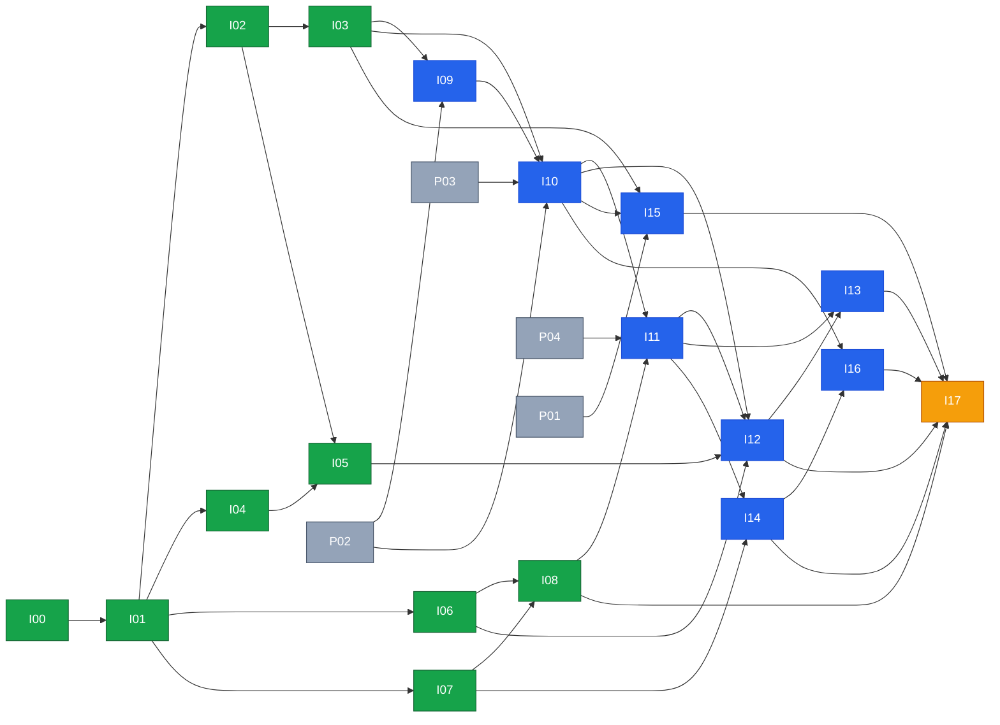

# IAM Implementation Plan — authentication, roles, permissions, tenancy

> **Status:** v1.0, 2026-10-05. Execution plan for the design in [`08-identity-access-and-tenancy`](../../product/08-identity-access-and-tenancy.md) and the [IAM ADR](../../decisions/2026-10-03-medplum-as-identity-and-access-platform.md).
> **Replaces:** [P05](../phases/P05-auth-roles.md) once I00 is signed off (I00 C9 turns P05 into a pointer). Does not replace the clinical plan: see [§6 edges into the main plan](#6-edges-into-the-main-plan).
> **Live status:** [`PROGRESS.md`](../../../PROGRESS.md). **Mistakes to avoid:** [`LEARNING_MISTAKES.md`](../../../LEARNING_MISTAKES.md).

---

## 1. Did an implementation plan already exist?

**Partly. Not enough to build from.** Checked 2026-10-05.

| Existing artefact | What it gives | Why it is not enough |
|---|---|---|
| [`P05-auth-roles.md`](../phases/P05-auth-roles.md) (main) | One phase: Medplum PKCE login, six AccessPolicies, API 401/403 | Hardcodes a role union ("Role union matches policy names") and "403 on role mismatch". No tenancy, no capabilities, no per-facility grants, no workspace layer, no role lifecycle, no commit plan. Blocked behind P02–P04, so nothing can start now. |
| 08 §13 "IAM track I0–I18" (design doc) | Phase list, dependency graph, LOC estimates | "Not yet scheduled". No tasks, no commit plan, no checklists, no per-phase acceptance. Not in `implementation-plan.md` or `PROGRESS.md`. Flaws found in review (§2). |
| ADR 2026-10-03 | Decision to use Medplum | Status `proposed`. |
| `PROGRESS.md` | Lists P05 only | No IAM phases tracked. |

This plan fixes those gaps: concrete phases, a commit-level breakdown, a dependency matrix and a checklist per phase.

---

## 2. Design corrections this plan applies (decided in I00)

These come from the architecture review of 08. They are **inputs to I00**, which records and amends them before any code.

| ID | Correction | Why |
|---|---|---|
| D-A1 | `Principal` carries **per-facility grants** (`grants[] = {scope, roleKeys, capabilities}`), and `can(principal, cap, {facilityId})` checks the grant for that facility. | 08 §6.1 flattens capabilities, so "Nurse at A, Supervisor at B" leaks Supervisor capabilities at A for non-FHIR actions. |
| D-A2 | `RoleKey` is a **string validated against loaded templates**, not a closed union. `Capability` stays a closed union. | A closed role union forces edits in a dozen exhaustive `Record<UserRole,…>` maps today (nav, dashboards, labels, signup). |
| D-A3 | Capability catalog is a `const` tuple in `@asc/types` (leaf, no deps). Logic lives in `@asc/authz`. | One source for `@asc/validation`, `@asc/authz`, `@asc/ui`; no cycles. |
| D-A4 | Add a **workspace layer**: persona = label, role = authz grouping, capability = permission, **workspace = UI config chosen from capabilities** (home route, nav, dashboard). | 08 has no persona or workspace concept. Without it "one role = one dashboard" returns. |
| D-A5 | **Role lifecycle**: immutable `key`, mutable `label`, `version`, status `active/deprecated/retired`, `replacedBy`; split/merge via explicit mapping; in-use check before retire. | 08 only covers version bump. Rename, split, remove are undefined. |
| D-A6 | Role templates are **repo-defined** for Phase 1 (versioned, PR + release). Schema leaves room for tenant-DB roles later. | Matches 08; makes the limit explicit. |
| D-A7 | One canonical P1 role list: `front-desk, rn, tech, gi-physician, anesthesia, coder, admin, auditor` + `patient` (principal kind, not a staff role). CRNA = `anesthesia` + qualification. | P05 (6), M12-1 (8), code (5) conflict. |
| D-A8 | Audit sink: Medplum `AuditEvent` for FHIR access; **app Postgres append-only `audit_events`** for IAM and business events. | `@asc/audit` has no durable store; 08 §12 does not pick one. |
| D-A9 | Numbers: disabled-user effect ≤ 60 s (`/auth/me` cache), idle 15 min / absolute 12 h, step-up window 5 min. | Q-IAM-3/4 defaults, written down as testable targets. |
| D-A10 | Cross-tenant staff = separate accounts per tenant (accepted limitation). | 08 §4.1 rule 2. |
| D-A11 | Phase 1 scope cut: I18+ ([deferred.md](deferred.md)) only when their gate in §6 is reached. | Over-engineering guard. |

---

## 3. Commit rules for this track (mandatory)

Full policy: [`incremental-commits.md` §4](../../agent/incremental-commits.md#4-size-limits-and-commit-shape).

1. **One concern per commit.** Never mix feature + refactor, code + unrelated docs, or two workspaces (exception: a contract change and the minimal consumer fix that keeps the build green).
2. **Size:** target ≤ 150 changed lines, hard cap 400 (excluding lockfiles, generated snapshots, migrations' generated SQL). Over the cap → split before committing.
3. **Green at every commit:** `pnpm turbo run lint check-types test --filter=<touched workspaces>`. No "fix later" commits. For `apps/web` changes also load the page in `pnpm dev` (LM-005).
4. **Tests ship with the code** they prove (same commit), or in the commit immediately before (red→green allowed only if the red commit is skipped by `.skip` + TODO removed in the next).
5. **Message format:** `type(scope): imperative summary` ≤ 72 chars. Types: `feat fix refactor test docs chore perf`. Body (optional) says *why*; footer `Refs: I05-C4`.
6. **Order matters:** each phase file's commit table is the order. Branch per phase `phase/I<nn>-<slug>`, one PR per phase, PR description = the checklist copied.
7. **PROGRESS.md** changes are their own commits (`chore(progress): …`), at phase start and finish only.
8. **No WIP/fixup commits on the PR branch.** Use `git commit --fixup` + autosquash locally before pushing.
9. **Expand → contract** for DB and type changes: add new alongside old (commit), migrate callers (commits), remove old (commit).
10. **Security-sensitive commits** (guards, policies, tokens, RLS) additionally run the `phi-review` skill and say so in the PR.

---

## 4. Phase map

Sizes are **estimates** in agent-days (S ≤ 1.5, M ≤ 3). Track A needs no Medplum. Track B needs P02 (local Medplum), P03 (`@asc/fhir`), P04 (clients), plus P01 (CI) for I15.

| ID | Phase | Track | Size | Depends on | File |
|---|---|---|---|---|---|
| I00 | Decide and amend design (docs, human sign-off) | A | S | — | [I00](I00-decide-and-amend.md) |
| I01 | `@asc/authz` core: types, `can()`, grants, `IdentityPort` | A | M | I00 | [I01](I01-authz-core.md) |
| I02 | Role templates (8 + patient) and role × capability matrix | A | M | I01 | [I02](I02-role-templates.md) |
| I03 | Policy compiler: template → AccessPolicy JSON | A | M | I02 | [I03](I03-policy-compiler.md) |
| I04 | Workspace layer (persona / workspace resolution) | A | S | I01 | [I04](I04-workspace-layer.md) |
| I05 | UI on mock: Principal, `useCan`, capability nav, remove `UserRole` (two PRs: I05a, I05b) | A | M | I02, I04 | [I05](I05-ui-on-mock.md) |
| I06 | Tenancy foundation in app DB: registry, `tenant_id`, RLS, `withTenant` | A | M | I01 | [I06](I06-tenancy-foundation.md) |
| I07 | Audit contract: tenant/facility fields, IAM events, append-only flag | A | S | I01 | [I07](I07-audit-contract.md) |
| I08 | API security spine: default-deny, tenant, authn port, guards, `/me` | A | M | I01, I06, I07 | [I08](I08-api-security-spine.md) |
| I09 | Medplum spikes S1, S1b, S4, S5, S6, S7 | B | S | I03, P02 | [I09](I09-medplum-spikes.md) |
| I10 | Tenant provisioner (Project, Organizations, policies, clients, memberships) | B | M | I03, I09, P02, P03 | [I10](I10-provisioner.md) |
| I11 | Medplum `IdentityPort` + real API authn | B | M | I08, I10, P04 | [I11](I11-medplum-authn.md) |
| I12 | Web sign-in: PKCE, token handler, timeouts, logout | B | M | I05, I06, I10, I11 | [I12](I12-web-signin.md) |
| I13 | MFA enforcement and step-up | B | S | I11, I12 | [I13](I13-mfa-step-up.md) |
| I14 | Durable audit store and IAM event emission | B | M | I07, I11 | [I14](I14-durable-audit.md) |
| I15 | Policy conformance suite in CI | B | M | I03, I10, P01 | [I15](I15-conformance-ci.md) |
| I16 | Role lifecycle operations (rename, split, merge, retire, disable) | B | M | I10, I14 | [I16](I16-role-lifecycle.md) |
| I17 | Go-live hardening gate (attack suite, pen test, sign-off) | B | M | I08, I11–I16 | [I17](I17-hardening-gate.md) |
| I18–I24 | Deferred, each with an entry gate | — | — | see [deferred.md](deferred.md) | [deferred](deferred.md) |

---

## 5. Dependency matrix

Reads as: row phase **needs** the columns marked `●` to be `done`. `P` = main-plan phase.

| Phase ↓ needs → | I00 | I01 | I02 | I03 | I04 | I05 | I06 | I07 | I08 | I09 | I10 | I11 | I12 | I13 | I14 | I15 | I16 | P01 | P02 | P03 | P04 |
|---|---|---|---|---|---|---|---|---|---|---|---|---|---|---|---|---|---|---|---|---|---|
| I00 |  |  |  |  |  |  |  |  |  |  |  |  |  |  |  |  |  |  |  |  |  |
| I01 | ● |  |  |  |  |  |  |  |  |  |  |  |  |  |  |  |  |  |  |  |  |
| I02 |  | ● |  |  |  |  |  |  |  |  |  |  |  |  |  |  |  |  |  |  |  |
| I03 |  |  | ● |  |  |  |  |  |  |  |  |  |  |  |  |  |  |  |  |  |  |
| I04 |  | ● |  |  |  |  |  |  |  |  |  |  |  |  |  |  |  |  |  |  |  |
| I05 |  |  | ● |  | ● |  |  |  |  |  |  |  |  |  |  |  |  |  |  |  |  |
| I06 |  | ● |  |  |  |  |  |  |  |  |  |  |  |  |  |  |  |  |  |  |  |
| I07 |  | ● |  |  |  |  |  |  |  |  |  |  |  |  |  |  |  |  |  |  |  |
| I08 |  | ● |  |  |  |  | ● | ● |  |  |  |  |  |  |  |  |  |  |  |  |  |
| I09 |  |  |  | ● |  |  |  |  |  |  |  |  |  |  |  |  |  |  | ● |  |  |
| I10 |  |  |  | ● |  |  |  |  |  | ● |  |  |  |  |  |  |  |  | ● | ● |  |
| I11 |  |  |  |  |  |  |  |  | ● |  | ● |  |  |  |  |  |  |  |  |  | ● |
| I12 |  |  |  |  |  | ● | ● |  |  |  | ● | ● |  |  |  |  |  |  |  |  | ● |
| I13 |  |  |  |  |  |  |  |  |  |  |  | ● | ● |  |  |  |  |  |  |  |  |
| I14 |  |  |  |  |  |  |  | ● |  |  |  | ● |  |  |  |  |  |  |  |  |  |
| I15 |  |  |  | ● |  |  |  |  |  |  | ● |  |  |  |  |  |  | ● |  |  |  |
| I16 |  |  |  |  |  |  |  |  |  |  | ● |  |  |  | ● |  |  |  |  |  |  |
| I17 |  |  |  |  |  |  | ● |  | ● |  |  | ● | ● | ● | ● | ● | ● |  |  |  |  |

Green = start now, no Medplum. Blue = needs Medplum (P02/P03/P04). Orange = go-live gate. Grey = main-plan phase.

**Parallel lanes (max two agents, never two in the same package):**

| Wave | Lane 1 | Lane 2 |
|---|---|---|
| A1 | I00 (human sign-off) | — |
| A2 | I01 | — |
| A3 | I02 → I03 | I04 → I06 (`@asc/db`) |
| A4 | I05 (`apps/web`) | I07 → I08 (`@asc/audit`, `apps/api`) |
| B1 | I09 (after P02) | — |
| B2 | I10 | — |
| B3 | I11 → I13 | I14 → I15 (I12 after I11) |
| B4 | I12, I16 | I15 |
| B5 | I17 | — |

Indicative: Track A ≈ 17 agent-days, ~2.5 weeks wall with two lanes, can start immediately. Track B ≈ 20 agent-days after P02–P04. Go-live target is 2026-12-07; the critical path is P02 → P04 → I09 → I10 → I11 → I12 → I17.

---

## 6. Edges into the main plan

| Main-plan phase | New dependency | Reason |
|---|---|---|
| P05 | **Superseded** by I05–I13 | Same outcome, corrected design. P05 file gets a pointer. |
| P12 Worklists, P14 Registration | I11, I12 (replace "P05") | Need real API authn and web sign-in. Work items own by **capability**, not role name (checked in I16). |
| P10 Realtime SSE | I19 before any SSE carries PHI | Stream authorisation and revocation. |
| P12 / P19 (first worker job touching PHI) | I18 | Per-tenant worker credentials and job context. |
| P24 Fax + eCW | I20 | Signed service-to-service calls. |
| P26 Go-live | I17, I22 | Hardening gate and break-glass (M12-3). |

Deferred gates are in [deferred.md](deferred.md).

---

## 7. Definition of done (every phase)

- [ ] All commits follow [§3](#3-commit-rules-for-this-track-mandatory); no commit over the hard cap.
- [ ] `pnpm turbo run lint check-types test --filter=<touched workspaces>` green, run at the **last commit and each commit**.
- [ ] Phase checklist in its file fully ticked, copied into the PR description.
- [ ] `phi-review` skill run when the phase touches `apps/api`, `@asc/audit`, logging, `@asc/db`, or queues.
- [ ] No role name compared outside `@asc/authz` (lint rule from I01 passes).
- [ ] `PROGRESS.md` updated (own commit); `LEARNING_MISTAKES.md` updated if a correction happened.
- [ ] Docs touched by the change updated in the same PR (not "later").

### Global security checklist (re-verified in I17)

- [ ] Every API route is default-deny; the route inventory test lists each public route.
- [ ] Tenant comes from host + token, never from a request body or query param.
- [ ] Cross-tenant resource ID returns 404 (not 403, not data).
- [ ] No frontend-only check protects data (UI gating is convenience).
- [ ] Tokens in memory only; refresh token is `httpOnly` on the web origin only.
- [ ] Every security event is audited with tenant, facility, actor, outcome and gate.
- [ ] Audit store is append-only in production; the app refuses to boot with a non-durable store.
- [ ] No PHI in logs, audit details, job data or telemetry.

---

## 8. Decisions needed from humans (I00 blocks on these)

| ID | Decision | Default if unanswered |
|---|---|---|
| Q-IAM-1 | Tenant = customer (BAA holder), one Medplum Project each | Yes |
| Q-IAM-2 | Canonical role list (D-A7) | As in D-A7 |
| Q-IAM-3 | Session 15 min idle / 12 h absolute | Yes |
| Q-IAM-4 | Step-up caps: `note.sign`, `coding.attest`, `discharge.approve`, `breakglass.invoke`, `admin.*` | Yes |
| Q-IAM-5 | Subdomain scheme and apex domain | `{slug}.<apex>` |
| Q-IAM-A | `agent_runs.org_id` meaning: tenant, facility, or both | New `tenant_id` + `facility_id`; `org_id` kept until agents migrate |
| Q-IAM-B | Store client IP in audit events? (identifier under HIPAA) | Truncated/hashed unless compliance says otherwise |
| Q-IAM-C | Tamper evidence for audit: insert-only role + UPDATE/DELETE trigger, or also hash chain | Insert-only + trigger; hash chain deferred |

## 9. Risks

| Risk | Mitigation |
|---|---|
| Medplum behaviours unproven (S1, S1b, S4–S7) | I09 gates I10; each failed spike records a fallback in the ADR before I10 starts. |
| `%facility` compartment filtering does not work as designed | Fallback: facility check at gate 3 plus per-facility policies; I09 decides. |
| Policy union widens access when roles combine | S1b tests it; conformance suite (I15) covers every combination we ship. |
| Big-bang refactor of `UserRole` in web | I05 is 12 small commits with expand → contract; app green each commit. |
| Schedule (go-live 2026-12-07) | Track A runs now in parallel with P02–P04; I18+ deferred. |
