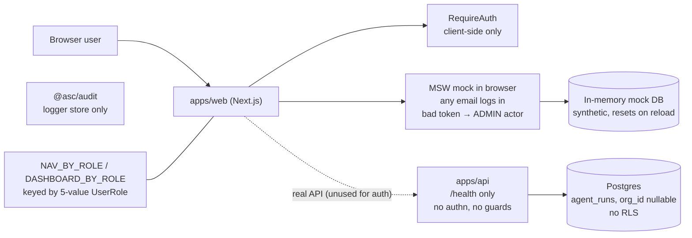
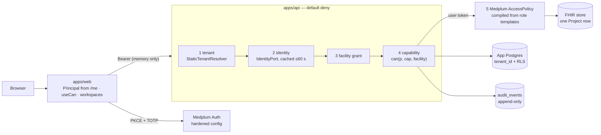
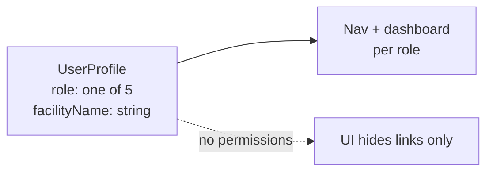
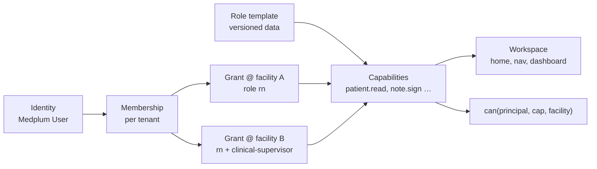
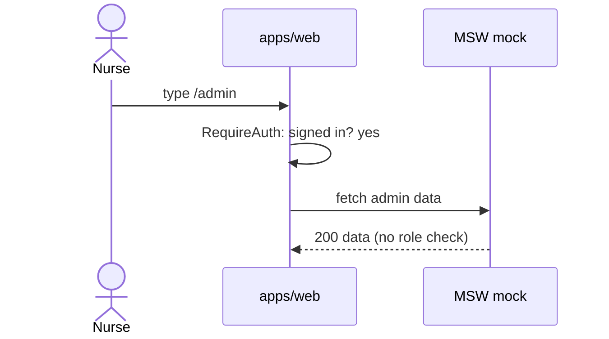
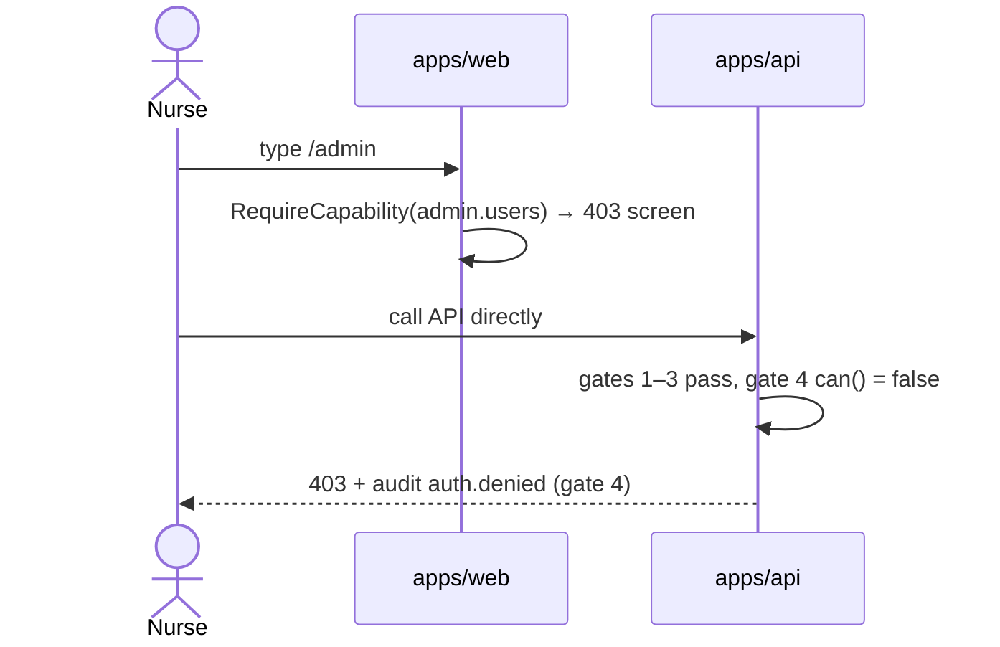

# Auth architecture — today vs after the IAM plan

> Snapshot 2026-10-05. **Today** = `main` (mock auth). **After** = [P05](../phases/P05-auth-roles.md) sub-phases P05a–P05j done: one hospital, tenant-ready ([index](README.md), design [08](../../product/08-identity-access-and-tenancy.md)). Multi-tenant host routing is a later step ([future doc](../../product/future-multi-tenancy-architecture.md)).

## 1. System view

### Today

### After

## 2. Identity and permission model

### Today

### After

## 3. Request: nurse opens `/admin` by URL

### Today

### After

## 4. What changes, in one table

| Concern | Today | After |
|---|---|---|
| Login | Mock, any password | Medplum PKCE + TOTP (SSO later) |
| Roles | 5-value enum in code | Versioned templates (data) |
| Permissions | None | Capability catalog + `can()` |
| Multi-role / multi-facility | Impossible | Grants per facility |
| UI | Keyed by role | Workspaces from capabilities |
| API enforcement | None | 5 gates, default deny |
| Tenancy | None | One tenant via `StaticTenantResolver`; `tenant_id` + RLS ready; Project per tenant for Customer #2 |
| Audit | Logger only | Append-only table + Medplum AuditEvent (`saveAuditEvents: true`) |
| Add "Technician" | ~20 files | Template file + config |
