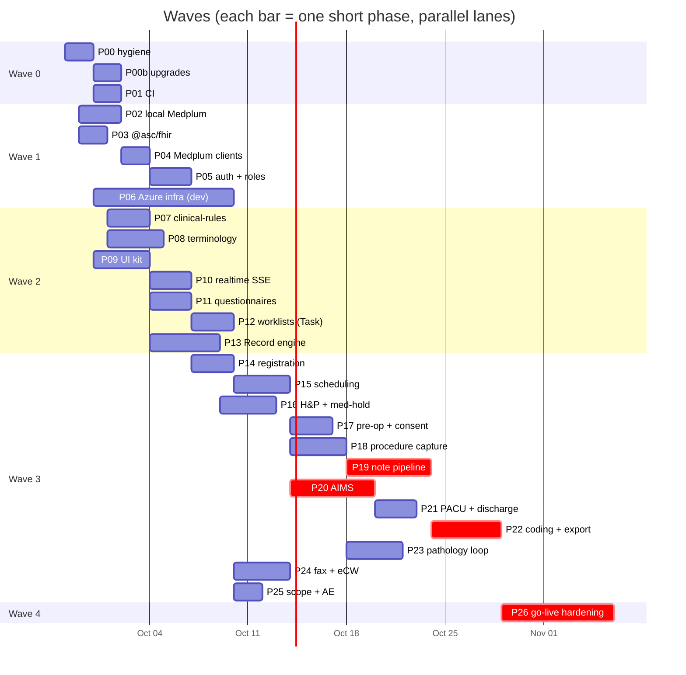
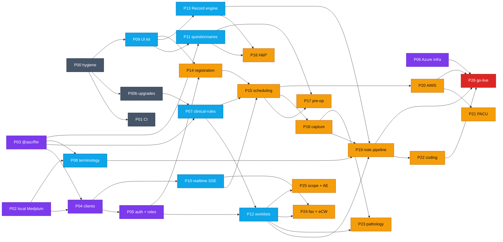

# GI ASC EHR — Phase-wise Implementation Plan

> **Status:** v1.0 (2026-09-27). **Supersedes** the Gantt in [05-delivery-plan](../product/05-delivery-plan.md) §5.1 for day-to-day execution; 05 still owns decisions (D1–D8), risks and business open questions.
> **Inputs:** [01 requirements](../product/01-requirements.md) · [02 build/reuse matrix](../product/02-build-reuse-matrix.md) · [03 target architecture](../product/03-target-architecture.md) · [04 flows](../product/04-end-to-end-flows.md) · [06 MindScript integration](../product/06-mindscript-integration.md) · [architecture rules](../agent/architecture.md) · [UI guidelines](../agent/ui-guidelines.md).
> **Live status:** [`PROGRESS.md`](../../PROGRESS.md). **Mistakes to avoid:** [`LEARNING_MISTAKES.md`](../../LEARNING_MISTAKES.md).

---

## 1. How to use this plan (agents and humans)

1. Read [`PROGRESS.md`](../../PROGRESS.md) → pick the first phase whose status is `ready` (all dependencies `done`).
2. Read [`LEARNING_MISTAKES.md`](../../LEARNING_MISTAKES.md) and the phase file in [`phases/`](phases/).
3. Mark the phase `in-progress` in `PROGRESS.md` (own commit), create branch `phase/Pxx-<slug>`.
4. Run the phase's tasks in the order of its **task dependency matrix**. Tasks on the same row of "Parallel with" may go to separate sub-agents — **never two agents in the same package at once**.
5. Each task ends green: `pnpm turbo run lint check-types test --filter=<touched workspaces>`.
6. Verify sub-agent output (diff review + tests) before accepting it ([orchestration §7](../agent/orchestration.md)).
7. Finish: tick the phase's acceptance checklist, update `PROGRESS.md` (status, PR, what's next, new open questions), add any corrected mistakes to `LEARNING_MISTAKES.md`, commit.

**Phase size rule:** a phase is ≤ 5 tasks and ≤ ~3 agent-days. Each task touches **one workspace** (one package or one app). If a phase grows past that, split it (`P15a`, `P15b`) and add the split to `PROGRESS.md`.

**Task order inside every vertical slice (never skip a layer):**

```
T1 contracts   @asc/validation (Zod) + @asc/types        ← everything depends on this
T2 domain      @asc/fhir builders + @asc/clinical-rules (pure, unit-tested)
T3 server      apps/api command/SSE route  ·  apps/worker job  ·  @asc/agents agent
T4 ui kit      @asc/ui presentational components (no fetching)
T5 app         apps/web route + features/<domain> composition
T6 proof       e2e / eval cases / docs / PROGRESS.md
```
T3 and T4 usually run in parallel (different workspaces, both only need T1/T2).

---

## 2. Phase map

**Sizes:** S ≤ 1.5 agent-days · M ≤ 3. **Lane** = who can own it in parallel.

| Wave | ID | Phase | Lane | Size | Source mix | File |
|---|---|---|---|---|---|---|
| 0 | P00 | Repo hygiene, guardrails, dependency baseline | Platform | S | NEW | [P00](phases/P00-repo-hygiene.md) |
| 0 | P00b | Library upgrades: zod 4, bullmq 6, ioredis 6 | Platform | S | NEW | [P00b](phases/P00b-library-upgrades.md) |
| 0 | P01 | CI pipeline + agent eval gate | Platform | S | NEW | [P01](phases/P01-ci.md) |
| 1 | P02 | Local Medplum stack + `apps/bots` skeleton + seed | Platform | M | MP | [P02](phases/P02-local-medplum.md) |
| 1 | P03 | `@asc/fhir` package (types, identifiers, builders) | Domain | S | MP+NEW | [P03](phases/P03-fhir-package.md) |
| 1 | P04 | Medplum client wiring (web, api, worker) | Platform | S | MP | [P04](phases/P04-medplum-clients.md) |
| 1 | P05 | Auth + roles as AccessPolicies (replace mock login) | Platform | M | MP | [P05](phases/P05-auth-roles.md) |
| 1 | P06 | Azure infra (Terraform) — dev env | Infra | M | MP | [P06](phases/P06-azure-infra.md) |
| 2 | P07 | `@asc/clinical-rules` + case state machine | Domain | M | NEW (+MS) | [P07](phases/P07-clinical-rules.md) |
| 2 | P08 | Terminology + FSH profiles | Domain | M | MP+NEW | [P08](phases/P08-terminology-profiles.md) |
| 2 | P09 | `@asc/ui` clinical kit + app shell | UI | M | NEW (+MS) | [P09](phases/P09-ui-clinical-kit.md) |
| 2 | P10 | Realtime: SSE envelope, API SSE, job progress, stream client | Platform | M | NEW (MS pattern) | [P10](phases/P10-realtime-sse.md) |
| 2 | P11 | Questionnaire renderer + forms-as-data | UI | M | MP+NEW | [P11](phases/P11-questionnaire-renderer.md) |
| 2 | P12 | Worklist engine on FHIR `Task` + first Bots | Domain | M | MP (+MS UX) | [P12](phases/P12-worklists-task.md) |
| 2 | P13 | Record engine port (MindScript → `@asc/ui/record`) | UI | M | **MS** | [P13](phases/P13-record-engine.md) |
| 3 | P14 | Registration, patient search, eligibility stub | Clinical | M | MP+NEW | [P14](phases/P14-registration.md) |
| 3 | P15 | Scheduling, case booking, whiteboard | Clinical | M | MP+MS+NEW | [P15](phases/P15-scheduling-whiteboard.md) |
| 3 | P16 | Pre-procedure H&P + med-hold + readiness gate | Clinical/AI | M | MS+MP+NEW | [P16](phases/P16-hp-medhold.md) |
| 3 | P17 | Pre-op nursing, time-out, consent + signature | Clinical | M | MP+NEW | [P17](phases/P17-preop-consent.md) |
| 3 | P18 | Procedure-room capture (events, specimens, images, STT) | Clinical | M | MP+MS+NEW | [P18](phases/P18-procedure-capture.md) |
| 3 | P19 | AI procedure-note pipeline + review + sign | AI | M | **MS**+MP+NEW | [P19](phases/P19-procedure-note-pipeline.md) |
| 3 | P20 | AIMS anesthesia flowsheet (offline-safe) | Clinical | M | MP+NEW | [P20](phases/P20-aims-flowsheet.md) |
| 3 | P21 | PACU + discharge | Clinical/AI | S | MP+NEW | [P21](phases/P21-pacu-discharge.md) |
| 3 | P22 | Coding engine, coder queue, charge export | Clinical/AI | M | MS+MP+NEW | [P22](phases/P22-coding-charge.md) |
| 3 | P23 | Pathology loop + requisition + result letters | Clinical/AI | M | MP+NEW | [P23](phases/P23-pathology-loop.md) |
| 3 | P24 | Fax (faxagnet) + eCW (Integuru) integration | Integration | M | **MS** | [P24](phases/P24-fax-ecw.md) |
| 3 | P25 | Scope reprocessing log + adverse events | Clinical | S | MP+NEW | [P25](phases/P25-scope-adverse.md) |
| 4 | P26 | Go-live hardening (audit report, break-glass, downtime, UAT) | All | M | MP+NEW | [P26](phases/P26-golive-hardening.md) |

Post go-live backlog (not yet split into phases): **P1.5** monitor HL7 via Medplum Agent, tower DICOM via Agent · **P2** GIQuIC/ADR/ASCQR export, patient SMS + portal, preference cards, inventory, referral intake queue · **P3** analytics, RCM, full eCW bridge, multi-specialty.

### 2.1 Waves on the calendar (target go-live 2026-12-07)



Dates are targets for sequencing, not commitments; `PROGRESS.md` holds actuals.

---

## 3. Global dependency matrix

### 3.1 Phase → phase (list form)

| Phase | Depends on (must be `done`) | Unblocks | Safe in parallel with |
|---|---|---|---|
| P00 | — | everything | P02, P03, P06 |
| P00b | P00 | Wave 2 (P07–P13) | P01, P02, P03, P06 |
| P01 | P00 | all merges (gate) | P02, P03, P06, P09 |
| P02 | — | P04, P06 (config parity), P08, P12 | P00, P03, P06 |
| P03 | — | P04, P07, P08, P11, P14 | P00, P02, P06, P09 |
| P04 | P02, P03 | P05, P10 | P07, P08, P09 |
| P05 | P04 | P12, P14, all clinical slices | P07–P11, P13 |
| P06 | — (P02 for config parity) | P26 | anything |
| P07 | P03 | P12, P15, P16, P19–P23 | P08–P11, P13 |
| P08 | P02, P03 | P19, P22 | P07, P09–P13 |
| P09 | P00 | P11, P13, P14, all UI | P02–P08 |
| P10 | P04 | P15, P16, P18, P19, P24 | P07–P09, P11–P13 |
| P11 | P03, P09 | P16, P17, P21, P25 | P10, P12, P13 |
| P12 | P05, P07 (P02 bots) | P19 (sign Task), P23, P24, P25 | P10, P11, P13 |
| P13 | P09 (+ Q-MS1) | P16, P19 | P10–P12 |
| P14 | P05, P09 | P15 | P16 prep, P13 |
| P15 | P14, P07, P10 | P17, P18, P20 | P16 |
| P16 | P11, P13, P10, P07 | — (feeds P19 context) | P15, P17 |
| P17 | P11, P15 | — | P16, P18 |
| P18 | P15, P10 | P19, P23 | P17, P20 |
| P19 | P18, P13, P08, P12 | P22, P26 | P20, P21, P23, P24 |
| P20 | P15, P09 (P10 optional) | P21, P26 | P18, P19 |
| P21 | P11, P20 | — | P22–P25 |
| P22 | P19, P08 | P26 | P21, P23–P25 |
| P23 | P18, P12 | — | P19–P22, P24 |
| P24 | P10, P12 (+ Q-MS4/5) | P23 letters (fax out) | P19–P23 |
| P25 | P11, P12 | — | P19–P24 |
| P26 | P19, P20, P22 (+ P06) | go-live | — |

### 3.2 Foundation × slice matrix (● hard dependency · ○ uses, can stub)

| Slice ↓ / Foundation → | P02 | P03 | P04 | P05 | P07 | P08 | P09 | P10 | P11 | P12 | P13 |
|---|---|---|---|---|---|---|---|---|---|---|---|
| P14 Registration | ● | ● | ● | ● | ○ | ○ | ● | ○ | ○ | ○ | |
| P15 Scheduling | ● | ● | ● | ● | ● | | ● | ● | | ○ | |
| P16 H&P + med-hold | ● | ● | ● | ● | ● | ○ | ● | ● | ● | ○ | ● |
| P17 Pre-op + consent | ● | ● | ● | ● | ● | | ● | ○ | ● | ○ | |
| P18 Procedure capture | ● | ● | ● | ● | ○ | ○ | ● | ● | | | ○ |
| P19 Note pipeline | ● | ● | ● | ● | ● | ● | ● | ● | | ● | ● |
| P20 AIMS | ● | ● | ● | ● | ○ | ○ | ● | ○ | | | |
| P21 PACU + discharge | ● | ● | ● | ● | ● | | ● | ○ | ● | | ○ |
| P22 Coding + export | ● | ● | ● | ● | ● | ● | ● | ○ | | ● | |
| P23 Pathology loop | ● | ● | ● | ● | ● | ○ | ● | ○ | | ● | |
| P24 Fax + eCW | ● | ● | ● | ● | | | ● | ● | | ● | |
| P25 Scope + AE | ● | ● | ● | ● | ○ | | ● | | ● | ● | |

### 3.3 Dependency graph



**Critical path:** P02 → P04 → P05 → P14 → P15 → P18 → P19 → P22 → P26. Protect it: nobody on the critical path picks up side phases.

---

## 4. Target repository structure (end of Phase 1)

`NEW` = created by the phase shown · `EDIT` = existing workspace extended. Rules from [architecture.md](../agent/architecture.md) hold everywhere: apps compose, packages own logic/types/schemas.

```text
ASC_EHR/
├── AGENTS.md                              EDIT P00  session protocol (read PROGRESS + LEARNING_MISTAKES)
├── PROGRESS.md                            NEW  P00  live status; every agent updates on finish
├── LEARNING_MISTAKES.md                   NEW  P00  corrected mistakes → rules
├── docker-compose.yml                     EDIT P02  + medplum-server, medplum-postgres, medplum-redis
├── .github/workflows/
│   ├── ci.yml                             NEW  P01  lint · check-types · test · build
│   └── evals.yml                          NEW  P01  agent evals on mock + nightly live (BAA, synthetic)
├── infra/
│   ├── medplum/
│   │   ├── medplum.config.local.json      NEW  P02
│   │   ├── access-policies/<role>.json    NEW  P05  front-desk, rn, gi-physician, anesthesia, coder, admin
│   │   └── client-apps.json               NEW  P02  web (PKCE), api (on-behalf), worker (client-credentials)
│   └── terraform/                         NEW  P06  modules/{aks,postgres,redis,storage,keyvault,appgw} · envs/{dev,staging,prod}
├── apps/
│   ├── web/                               (Next.js 16 App Router)
│   │   └── src/
│   │       ├── app/
│   │       │   ├── (auth)/login · signin/callback                     EDIT P05
│   │       │   ├── (clinical)/layout.tsx                              NEW  P09  shell, patient banner slot
│   │       │   ├── (clinical)/patients/[patientId]/page.tsx           NEW  P14
│   │       │   ├── (clinical)/schedule/page.tsx                       NEW  P15
│   │       │   ├── (clinical)/board/page.tsx                          NEW  P15  whiteboard TV
│   │       │   ├── (clinical)/cases/[caseId]/{hp,preop,procedure,anesthesia,pacu,note,coding}/page.tsx   P16–P22
│   │       │   ├── (clinical)/worklists/[kind]/page.tsx               NEW  P12
│   │       │   ├── (clinical)/faxes/page.tsx                          NEW  P24
│   │       │   └── (admin)/scope-log · adverse-events                 NEW  P25
│   │       ├── features/<domain>/{components,hooks}/                  composition only; no types/schemas/fetch clients
│   │       ├── providers.tsx                                          EDIT P04  MedplumProvider + QueryClient
│   │       └── e2e/*.spec.ts                                          NEW  P01+ Playwright
│   ├── api/                               (Fastify 5)
│   │   └── src/
│   │       ├── plugins/{medplum,auth,sse,security}.ts                 NEW  P04/P05/P10
│   │       ├── routes/{cases,appointments,patients,hp,notes,coding,fax,stt,events,exports}.ts   per slice
│   │       ├── schemas/                   Fastify JSON-schema adapters of @asc/validation ONLY
│   │       └── services/                  I/O orchestration (Medplum transactions, enqueue); rules live in @asc/clinical-rules
│   ├── worker/                            (BullMQ)
│   │   └── src/
│   │       ├── jobs/<job-name>/{index,handler}.ts                    procedure-note P19, hp-intake P16, coding P22, letters P23, fax-send/ecw-* P24, pdf P23
│   │       └── progress.ts                                          NEW  P10  publish job progress → Redis → API SSE
│   └── bots/                              NEW  P02  Medplum Bots (esbuild bundles) + admin scripts
│       ├── src/<bot-name>.ts                         P11/P12/P23  extraction, task auto-create/resolve, overdue specimens
│       ├── scripts/{seed-local,deploy-bots,upload-conformance}.ts   P02/P08/P12
│       └── esbuild.config.mjs
└── packages/
    ├── fhir/                              NEW  P03 (P08, P11)  @asc/fhir — isomorphic, no network
    │   ├── src/{identifiers,extensions,case-phase,bundle,index}.ts
    │   ├── src/builders/<resource>.ts
    │   ├── src/terminology/{codesystems,valuesets}/                 P08
    │   ├── src/questionnaires/<form>.ts                             P11  forms as data
    │   └── fsh/{sushi-config.yaml,input/fsh/*.fsh}                  P08  profiles
    ├── clinical-rules/                    NEW  P07  @asc/clinical-rules — pure functions only
    │   └── src/{case-phase,gates,med-hold,scoring/{aldrete,padss,bbps},withdrawal-time,coding/{cpt,modifiers,icd-sequence,cci},verification,checks}/
    ├── agents/                            EDIT  new agents under src/agents/<name>/ (definition, input, prompt, evals/cases, __tests__)
    │   └── src/agents/{hp-intake P16, procedure-note P19, note-critic P19, coding-suggest P22, referral-letter P23, pathology-reconcile P23}
    ├── validation/                        EDIT  src/{sse P10, patients P14, cases P15, hp P16, consent P17, capture P18, notes P19, aims P20, coding P22, pathology P23, fax P24, agents/*}
    ├── types/                             EDIT  plain TS types (no schemas)
    ├── config/                            EDIT  medplum env P02/P04, feature flags (ECW_WRITEBACK, CPT_LICENSED…), queue names per job
    ├── api-client/                        EDIT
    │   └── src/{http P00, medplum/browser P04, server P04 (server-only subpath), stream P10, react/ P10 hooks}
    ├── ui/                                EDIT  src/components/{ui (primitives), clinical P09, questionnaire P11, worklist P12, record P13, calendar P15, signature-pad P17, flowsheet P20}; CATALOG.md P09
    ├── db/                                EDIT  operational tables only: agent-runs (exists), writeback-ledger P24, sync-snapshots P24, clinician-feedback P19
    └── audit · logger · telemetry         EDIT  as needed (audit events per slice)
```

**Where does it go? (decision table for agents)**

| You are writing… | Put it in | Never in |
|---|---|---|
| Zod schema (request, response, SSE event, job data, agent I/O) | `@asc/validation` | `apps/*` |
| FHIR builder, identifier system, extension URL, Questionnaire JSON | `@asc/fhir` | `apps/*`, `@asc/validation` |
| Clinical/coding rule, gate, score, verification check | `@asc/clinical-rules` | `apps/api/services`, React components |
| LLM prompt / agent | `@asc/agents` | anywhere else |
| Fetch/SSE client, Medplum client factory, data hooks | `@asc/api-client` (`/react`, `/server` subpaths) | `apps/web/src/lib` |
| Presentational component | `@asc/ui` | `apps/web` |
| Page, layout, feature composition, route state | `apps/web` | packages |
| Medplum transaction, enqueue, auth check | `apps/api/src/services` | `@asc/*` |
| Long job step | `apps/worker/src/jobs/<job>` | `apps/api` |
| Event reaction next to data (small) | `apps/bots` | `apps/api` |
| Operational table (not clinical) | `@asc/db` | Medplum |
| Clinical data | Medplum (FHIR) | `@asc/db` |

---

## 5. Package & version baseline

Queried from the npm registry on **2026-09-27**. Pin exact versions for `@medplum/*` (all packages move together) and upgrade them together on a cadence (02 §D).

### 5.1 Medplum

| Package | Version | Used in | Phase | Notes |
|---|---|---|---|---|
| `@medplum/core` | 5.1.42 | `@asc/api-client`, `apps/api`, `apps/worker`, `apps/bots` | P04 | `MedplumClient`, search, transactions, subscriptions |
| `@medplum/fhirtypes` | 5.1.42 | `@asc/fhir` (re-exported to all) | P03 | Type-only; apps import via `@asc/fhir` |
| `@medplum/react-hooks` | 5.1.42 | `apps/web`, `@asc/api-client/react` | P04 | Headless: `MedplumProvider`, `useSearchResources`, `useResource`, `useSubscription` |
| `@medplum/definitions` | 5.1.42 | `@asc/fhir` (tests), `apps/bots` | P08 | Structure definitions for validation |
| `@medplum/mock` | 5.1.42 | dev dep in web/api/worker/bots tests | P04 | `MockClient` for unit tests |
| `@medplum/cli` | 5.1.42 | dev dep in `apps/bots` | P02 | Deploy bots, upload conformance, login |
| `@medplum/bot-layer` | 5.1.42 | dev dep in `apps/bots` | P12 | Types/deps available in the bot runtime |
| `@medplum/hl7` | 5.1.42 | `apps/bots` | P1.5 | HL7 v2 parsing for monitor ORU |
| `@medplum/agent` | 5.1.42 | **not installed in repo** — Windows service on ASC network | P1.5 | HL7 MLLP + DICOM relay |
| `@medplum/app` | 5.1.42 | **not installed** — run the admin app container/static build | P02 | Admin console only (D3) |
| Medplum server | 5.1.42 (Docker `medplum/medplum-server`) | `docker-compose.yml`, AKS | P02/P06 | Verify the image tag exists before pinning |
| `@medplum/react` | 5.1.42 | **not allowed** in `apps/web` (Mantine) | — | D2; admin tooling only |

### 5.2 Other additions (latest)

| Package | Version | Workspace | Phase | Why |
|---|---|---|---|---|
| `eventsource-parser` | 4.1.1 | `@asc/api-client` | P10 | fetch-based SSE (bearer header; `EventSource` can't send it) |
| `@tanstack/react-query` | 5.104.0 | `apps/web`, `@asc/api-client/react` | P04 | Already 5.103 in web — align |
| `@tanstack/react-table` | 9.2.4 | `@asc/ui` | P09 | Worklists, coder queue (headless) — check v9 API before use |
| `@tanstack/react-virtual` | 3.14.13 | `@asc/ui` | P09 | Long lists, flowsheet rows |
| `nuqs` | 2.10.1 | `apps/web` | P09 | URL state (filters, tabs) — no PHI in URLs |
| `sonner` | 2.0.8 | `@asc/ui` | P09 | Toasts |
| `react-hotkeys-hook` | 5.3.3 | `@asc/ui` | P09 | Keyboard-first clinical UX |
| `date-fns` / `@date-fns/tz` | 4.4.0 / 1.5.0 | `@asc/clinical-rules`, `@asc/ui` | P07 | Facility-timezone math (withdrawal time, H&P window) |
| `@tiptap/react` + `@tiptap/starter-kit` | 3.31.3 | `@asc/ui` | P13 | Record engine (MindScript uses Tiptap) |
| `signature_pad` | 5.1.4 | `@asc/ui` | P17 | Consent signatures |
| `dexie` | 4.4.6 | `@asc/api-client` (offline queue) | P20 | AIMS offline queue (encrypted, see P20) |
| `@react-pdf/renderer` | 4.9.0 | `apps/worker` | P23 | Requisition, letters, discharge PDFs |
| `@fastify/helmet` · `@fastify/cors` · `@fastify/rate-limit` | 13.1.1 · 11.3.0 · 11.2.0 | `apps/api` | P05 | Security baseline |
| `jose` | 6.2.12 | `apps/api` | P05/P24 | Verify tokens; sign short-lived faxagnet/STT tokens |
| `@deepgram/sdk` | 5.12.0 | `apps/api` | P18 | Mint short-lived STT tokens only (if Deepgram chosen) |
| `fsh-sushi` | 3.20.1 | `@asc/fhir` dev | P08 | Compile FSH profiles |
| `msw` | 2.15.0 | `apps/web` dev | P09 | Replace hand-rolled mocks in `apps/web/src/lib/mock` |
| `@playwright/test` | 1.63.0 | `apps/web` dev | P01 | e2e |
| `@testing-library/react` | 16.3.3 | `@asc/ui` dev | P09 | Component tests |

**Excluded on purpose:** `cmdk` (depends on Radix — use Base UI Combobox/Autocomplete), `@microsoft/fetch-event-source` (unmaintained), `@medplum/react` in `apps/web`, any second UI kit.

**Upgrade decision (P00-Q1, decided 2026-09-28):** upgrade `zod` 3.25 → 4.6.5 and `bullmq` 5.53 → 6.3.9 (+ `ioredis` 5.6 → 6.0.0) in phase [P00b](phases/P00b-library-upgrades.md) **before** Wave 2, one commit per library. **Deferred:** `@opentelemetry/sdk-node` 0.57 → 0.222 (revisit with P06/P26) and `react` 19.2.8 → 19.3.0. Never upgrade mid-slice.

---

## 6. Cross-phase open questions

Per-phase questions live in each phase file. Blocking questions across phases:

| ID | Question | Blocks | Owner |
|---|---|---|---|
| D1 / Q10 | Medplum self-host on Azure vs Medplum-hosted (BAA) | P06, P26 | eng lead |
| Q-MS1 | Access to `Wybit-LLC/MindScript` source | P13, P16, P19, P22, P24 | eng lead |
| Q4 | Biller file format | P22 | business |
| Q8 | CPT licence | P08, P22 | business |
| Q15 / Q-MS7 | STT vendor + BAA (Deepgram?) | P18, P19 | eng |
| Q3 | Anesthesia model (MAC/CRNA/moderate sedation) | P20 | anesthesia |
| Q12 | Pathology lab + interface | P23 | ops |
| Q-MS4 / Q-MS5 | faxagnet + Integuru hosting, BAA, outbound fax | P24 | MindScript team |
| Q-MS6 | Shared SSO with MindScript | P05 | eng lead |
| ~~P00-Q1~~ | Library upgrades (§5.2) — **decided 2026-09-28**: zod 4 + bullmq 6 + ioredis 6 in P00b; OTel deferred | — | eng lead |
