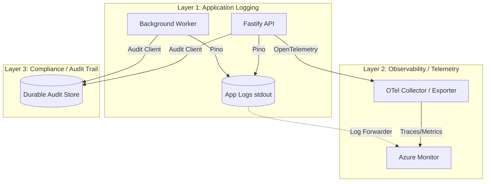

# Logging, Observability, and Audit Plan

This document outlines the plan for implementing a robust, secure, and compliance-ready logging and observability architecture for the ASC EHR platform.

## Current State

An inspection of the current repository reveals a barebones logging implementation:
- **`apps/api`**: Uses Fastify's default logger configuration (`logger: true`), which relies on Pino under the hood. No environment-specific formatting is applied.
- **`apps/worker`**: Relies entirely on unstructured `console.log` and `console.error` for job processing events.
- **Environment Behavior**: There is no distinction between development and production environments. The API logs in JSON format locally, which is hard to read, while the worker logs in plain text.
- **Redaction & Sanitization**: None. Secrets, auth headers, and PHI could easily leak into application logs.
- **Observability & Telemetry**: No OpenTelemetry or Azure Monitor integrations are currently installed or configured.
- **Audit Logging**: No dedicated audit trail exists for security or business events.
- **Correlation**: No custom correlation IDs are propagated between the API and the background worker.

## Recommended Architecture

The target architecture strictly separates concerns into three distinct layers to ensure security, compliance, and developer experience.

### 1. Application Logging
Use **Fastify + Pino** for all normal application and runtime logging across both the API and Worker.

### 2. Observability / Telemetry
Keep Azure Monitor / OpenTelemetry completely separate from the application logger. Do not intertwine local logging with remote telemetry logic.

### 3. Compliance / Audit Trail
Do **NOT** treat normal application logs as the compliance audit trail. A separate, durable audit-event model/system must be defined for security and business activity.

## Environment Model

### Development (Local)
- **Application Logging**: Use `pino-pretty` for human-readable, colorized output.
- **Observability**: OpenTelemetry / Azure Monitor integrations must be disabled completely.
- **Credentials**: No Azure credentials should be required to run the local stack.

### Staging / Production
- **Application Logging**: Output structured JSON logs.
- **Observability**: Send traces, metrics, and telemetry to Azure Monitor / Application Insights via the appropriate OpenTelemetry integrations.
- **Redaction**: Enforce Pino redaction rules to strip sensitive data.

## PHI / Security Logging Rules

**Strictly Prohibited in Application Logs (Layer 1) & Telemetry (Layer 2):**
- Passwords, secrets, tokens, and authorization headers.
- Raw patient data (PHI/PII).
- Raw FHIR resources.
- Full LLM prompts and full model outputs (unless explicitly required and scrubbed, but generally avoided in app logs).
- Sensitive request bodies or query parameters.

*Note: Application logs should be entirely PHI-safe. If an application log is accidentally exposed, it must not constitute a HIPAA breach.*

## Audit Trail

The Audit Trail (Layer 3) is a durable, structured record of "who did what, when, and why."

**What triggers an audit event:**
- PHI access (viewing a patient record).
- PHI creation, update, or deletion.
- Authentication and security events (logins, logouts, failed attempts).
- Authorization decisions (access granted/denied).
- Agent actions and tool invocations.
- Approvals, rejections, and important clinical/business mutations.

**Audit Event Schema Requirements:**
Audit records must contain metadata to reconstruct activity without unnecessarily storing raw PHI. Required fields include:
- `requestId`
- `correlationId` (to trace distributed flows)
- `userId` / `actorIdentity`
- `organizationId` / `tenantContext`
- `resourceType` & `resourceId` (e.g., `Patient`, `12345`)
- `action` (e.g., `READ`, `CREATE`, `UPDATE`)
- `source` (`user`, `system`, or `agent`)
- `agentExecutionId` (where applicable)
- `timestamp`
- `outcome` / `status` (e.g., `SUCCESS`, `FAILURE`)

## Agent Readiness

As AI agents are introduced, they will act autonomously on behalf of users or the system. This logging and audit foundation supports agents by:
- **Correlation**: `agentExecutionId` will map to standard `correlationId`s, allowing us to trace an agent's reasoning loop across multiple tool calls and worker jobs.
- **Accountability**: The audit trail treats the agent as a distinct `source`, ensuring we can definitively separate human actions from agent actions.
- **Safety**: By keeping raw prompts/outputs out of normal application logs, we prevent accidental PHI spillage from agent context windows. (A secure, separate LLM tracing system can be used if needed, bound by the same HIPAA rules as the database).

## Implementation Plan

The implementation should proceed in phased, parallelizable steps to be executed by sub-agents.

### Phase 1: Application Logging Foundation (API & Worker)
- **Dependency Update**: Install `pino` and `pino-pretty` (as a dev dependency) in a shared configuration or locally in the apps.
- **API Setup**: Update `apps/api/src/server.ts` to configure Fastify's logger to use `pino-pretty` in development and structured JSON in production.
- **Worker Setup**: Replace `console.log`/`console.error` in `apps/worker/src/index.ts` with a shared Pino logger instance matching the API's format.
- **Redaction**: Configure Fastify/Pino redaction rules for common sensitive headers (`authorization`, `cookie`, etc.).

### Phase 2: Correlation & Error Handling
- **Request IDs**: Ensure Fastify `reqId` is attached to all logs.
- **Worker Context**: Implement a mechanism to pass `correlationId` from API requests into BullMQ job data, and initialize the worker's logger with this correlation ID.
- **Error Handling**: Standardize error logging formats across both apps.

### Phase 3: Durable Audit Trail
- **Data Model**: Design the database schema for the Audit table (likely in Prisma/PostgreSQL).
- **Audit Client**: Create an internal service/utility in a shared package (e.g., `@asc/audit`) to cleanly emit audit events.
- **Integration**: Instrument critical API routes to emit audit events upon successful/failed actions.

### Phase 4: Telemetry (Staging/Production Only)
- **OpenTelemetry**: Integrate `@azure/monitor-opentelemetry` conditionally, ensuring it strictly bypasses local development.

## Open Questions
- **Audit Storage**: Should the durable audit trail reside in the primary application database, or a separate compliance database / data warehouse for long-term retention?
- **Retention Policies**: What are the strict data retention boundaries for Application Logs vs. Audit Logs in our specific compliance posture?
- **LLM Tracing**: Will we require a specialized tracing tool (like Langfuse or Braintrust) for agent evaluation, and how will we secure it for PHI?

---

## Summary

- **Current Logger/Package**: Fastify default Pino (API), `console` (Worker).
- **What should be retained**: Fastify's built-in reliance on Pino.
- **What should be changed**: 
  - Standardize Pino across both API and Worker.
  - Implement environment-specific formatting (`pino-pretty` for dev, JSON for prod).
  - Add explicit redaction for security.
- **What should be added later**: 
  - OpenTelemetry / Azure Monitor integration for production.
  - A durable, distinct Audit Trail system.
- **Risks Found**: Currently, secrets and PHI could be easily logged due to a lack of redaction. The worker is completely detached from the API's request lifecycle, making debugging difficult. No audit trail exists for compliance.

## Compliance Disclaimer

This technical implementation provides foundational security and audit capabilities but **does not** automatically guarantee HIPAA, SOC 2, or other regulatory compliance. 

Remaining organizational, legal, and vendor requirements include, but are not limited to:
- Establishing Business Associate Agreements (BAAs) with all cloud providers (e.g., Azure, OpenAI).
- Implementing organizational security policies, continuous monitoring, and incident response plans.
- Ensuring end-to-end encryption at rest and in transit.
- Conducting regular penetration testing and compliance audits.
