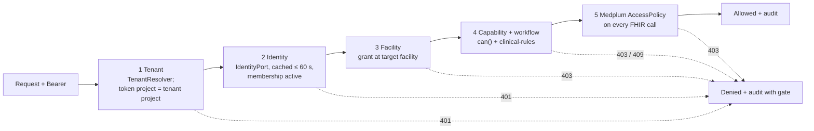
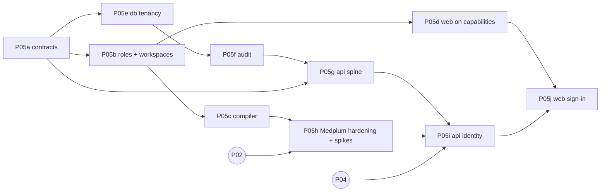

# P05 — Auth, roles and facility authorization (modular core, one hospital)

| Field | Value |
|---|---|
| Wave · Lane · Size | 1 · Platform · split into sub-phases **P05a–P05j** (each S or M) |
| Depends on | P05a–P05g: nothing outside P05 (start now, mock + local Postgres). P05h: P02. P05i–P05j: P04 |
| Unblocks | P12, P14 and every clinical slice (after P05i/P05j) |
| Source mix | MP (Medplum Auth, AccessPolicy) + NEW (`@asc/authz`) |
| Requirements | M12-1 roles · M12-2 permission scoping · M12-3 MFA + session timeout · M12-4 audit |
| Design | [08 identity, access, tenancy](../../product/08-identity-access-and-tenancy.md) · [ADR](../../decisions/2026-10-03-medplum-as-identity-and-access-platform.md) · [future multi-tenancy](../../product/future-multi-tenancy-architecture.md) |
| Branches | `phase/P05<x>-<slug>` — one PR per sub-phase |

## 1. Goal

A **small, modular auth core** for the first hospital that later phases extend without rewrites:

- identity, tenant, role, capability and UI workspace are separate concepts behind small interfaces;
- adding a role or changing its permissions is a data change in `@asc/authz`;
- tenant and facility are in every contract from day one, but only one tenant runs.

This is **not** "complete auth". Anything not needed for the first hospital's go-live has an explicit gate in §6.

## 2. Principles (apply to every sub-phase)

| Principle | Concretely |
|---|---|
| Ports, not providers | `IdentityPort` (who is this token?) and `TenantResolver` (which tenant is this request?) live in `@asc/authz`. Medplum and "static config" are adapters. |
| Capabilities, not roles | Code calls `can(principal, cap, { facilityId })`. A lint rule bans role-name comparisons outside `@asc/authz`. |
| Grants per facility | `Principal.grants[] = { scope: all \| facility, roleKeys, capabilities }`. No flat capability set (prevents a supervisor role at B leaking into A). |
| Roles are data | Versioned role templates (`key` immutable, `label` free, `version`, `status`) compiled to Medplum `AccessPolicy`. |
| UI is a workspace | Nav, home and dashboard come from capabilities via workspace definitions, never from a role enum. |
| Tenant-ready, single tenant | `tenant_id` + RLS in app Postgres, facility in `meta.accounts`; a `StaticTenantResolver` returns the one configured tenant. |
| Default deny | Every API route declares its auth; unknown = startup failure. |
| Small commits | [incremental-commits §4](../../agent/incremental-commits.md#4-size-limits-and-commit-shape): one concern, ≤ 400 lines, green each commit. |

## 3. Five gates (target request path)

## 4. Sub-phases

Commit outlines are the minimum split; split further if a commit would pass the cap. Fuller per-commit detail from the earlier IAM draft is in git history (`git show be210c9:docs/plan/iam/I01-authz-core.md`, `I02`…`I17`).

### P05a — Contracts and `@asc/authz` core · S · needs —
Workspaces: `@asc/types`, `@asc/validation`, `@asc/authz` (new, depends only on `@asc/types`).

| # | Commit |
|---|---|
| 1 | `feat(types): add capability catalog const and Capability type` |
| 2 | `feat(types): add Grant, Principal, TenantRef and RoleTemplate types` |
| 3 | `feat(validation): add authz schemas (principal, grant, role template, me)` |
| 4 | `chore(authz): scaffold @asc/authz package` |
| 5 | `feat(authz): add can() with facility-scoped grants` |
| 6 | `feat(authz): add authorize() result with gate and reason` |
| 7 | `feat(authz): add IdentityPort and TenantResolver with test fakes and StaticTenantResolver` |

- [ ] `RoleKey` is `string`; `Capability` is a closed union from one `as const` tuple with `stepUp` metadata
- [ ] `can()` without `facilityId` counts only `scope: all` grants (fail closed)
- [ ] Test: User X = `rn` @ A, `rn` + `clinical-supervisor` @ B → no supervisor capability at A
- [ ] Patient principal never gets staff capabilities
- [ ] `Principal.kind` includes `agent`; an agent principal's capabilities = caller's ∩ agent allow-list, scoped to the run's patient/case (test)
- [ ] `@asc/authz` has no I/O, no `process.env`, no fetch

### P05b — Role templates, workspaces, lint guard · S · needs P05a
Workspaces: `@asc/authz`, `@asc/eslint-config`.

| # | Commit |
|---|---|
| 1 | `feat(authz): add role template registry and loader` |
| 2 | `feat(authz): add front-desk, rn and tech templates` |
| 3 | `feat(authz): add gi-physician and anesthesia templates` |
| 4 | `feat(authz): add coder, admin, auditor and patient templates` |
| 5 | `feat(authz): build grants from role assignments` |
| 6 | `test(authz): pin role x capability matrix` |
| 7 | `feat(authz): resolve workspaces from capabilities` |
| 8 | `feat(eslint-config): ban role-name comparisons outside authz` |

- [ ] Role list = D-A7 in [IAM README](../iam/README.md); CRNA = `anesthesia` + qualification
- [ ] Matrix snapshot equals 08 §7.3; any widening is a reviewed diff
- [ ] Lint rule ships with a file-by-file baseline of today's violators; P05d empties it
- [ ] Workspace resolver takes definitions as input (no UI list hardcoded in `@asc/authz`)
- [ ] Every catalog capability is held by at least one role, and each capability has the data rights it needs (orphan test in `roles/matrix.test.ts`; follow-up PR #29)

### P05c — Policy compiler · S · needs P05b
Workspace: `@asc/authz` (pure; no `@medplum/*` dependency yet).

| # | Commit |
|---|---|
| 1 | `feat(authz): add AccessPolicy JSON types for the compiler` |
| 2 | `feat(authz): compile resource rules with facility criteria` |
| 3 | `feat(authz): compile hidden and readonly fields` |
| 4 | `feat(authz): add write constraint for signed notes` |
| 5 | `feat(authz): name and tag policies by key and version` |
| 6 | `test(authz): snapshot compiled policies and check determinism` |

- [ ] Facility criteria syntax isolated in one function (P05h spike S1 confirms it)
- [ ] No wildcard resource types; `Composition` hidden for `front-desk`; all-site roles have no facility criteria
- [ ] Shared directory data (`Practitioner`, `PractitionerRole`, `Organization`, `Location`) never gets facility criteria (rules marked `shared`); clinical data always does
- [ ] Portal (`portal.*`) templates are refused by the compiler until the patient-compartment rule exists (P2)

### P05d — Web on capabilities (mock) · M (two PRs) · needs P05b
Workspaces: `apps/web` (+ one-line `@asc/config`, small `@asc/api-client`, `@asc/types` contract changes).

**P05d1 — Principal, guards, nav**

| # | Commit |
|---|---|
| 1 | `feat(api-client): add getMe and auth.me query key` (+ route const in `@asc/config`) |
| 2 | `feat(web): add demo identities with role assignments` |
| 3 | `feat(web): mock /me returns Principal built by @asc/authz` |
| 4 | `fix(web): mock auth fails closed on unknown user or token` |
| 5 | `feat(web): keep Principal and current facility in session` |
| 6 | `feat(web): add useCan hook, Can and RequireCapability` |
| 7 | `feat(web): guard admin, audit, coding and quality routes` |
| 8 | `refactor(web): nav items declare required capability` |

**P05d2 — Workspaces, labels, remove `UserRole`**

| # | Commit |
|---|---|
| 1 | `feat(web): workspace definitions, home routing and dashboard by workspace` |
| 2 | `feat(web): add workspace and facility switcher` |
| 2b | `feat(web): guard every signed-in route from the route table` |
| 3 | `refactor(web): role labels from templates; guide switches identity` |
| 4 | `refactor(types): separate clinical participant roles from authz roles` |
| 5 | `refactor(web): replace self-signup role picker with access request` |
| 6 | `refactor(types): remove UserRole and role-keyed signup schema` |
| 7 | `chore(eslint-config): empty the role-check baseline` |
| 8 | `test(web): add tech identity with config only` |

- [ ] Each web commit loads in `pnpm dev` (LM-005); bundle budgets pass
- [ ] Direct URL to a guarded route without the capability shows 403 (test per route)
- [ ] Every signed-in route is guarded, not only admin, audit, coding and quality (P05d1 left `/referrals`, `/pathology` and the rest hidden from nav but reachable): one `RequireCapability` in the dashboard layout driven by `ROUTE_ACCESS` (`apps/web/src/lib/route-access.ts`), a test per route in that table, and a test that fails if a route has no entry
- [ ] Workspaces restore per-workspace labels dropped in P05d1 (e.g. "Sign queue" for the physician workspace)
- [ ] User X demo: switching facility changes nav and workspaces
- [ ] `grep -rn "UserRole\|NAV_BY_ROLE\|DASHBOARD_BY_ROLE"` is empty at the end
- [ ] Commit 8 touches only identity data, workspace config and a test (proves "new role = data")

### P05e — App-DB tenancy · S · needs P05a
Workspaces: `@asc/db`, `@asc/config`.

| # | Commit |
|---|---|
| 1 | `feat(config): add default tenant, Medplum project and runtime db url` |
| 2 | `feat(db): add nullable tenant_id and facility_id to agent_runs` |
| 3 | `feat(db): backfill configured tenant and make tenant_id not null` |
| 4 | `feat(db): enable and force row-level security on agent_runs` |
| 5 | `chore(db): separate owner and runtime database roles` |
| 6 | `feat(db): add withTenant and run agent run store inside it` |
| 7 | `test(db): tenant isolation and missing-context cases` |

- [ ] No `app.tenant_id` set → zero rows, insert rejected (fail closed)
- [ ] Runtime role cannot alter tables or bypass RLS
- [ ] `agent_runs.org_id` meaning resolved (default: keep until `@asc/agents` migrates; new columns are the source of truth)

### P05f — Durable audit · S · needs P05e
Workspaces: `@asc/audit`, `@asc/db`.

| # | Commit |
|---|---|
| 1 | `feat(audit): add tenant, facility, membership and gate fields` |
| 2 | `feat(audit): add IAM event vocabulary with typed details` |
| 3 | `feat(audit): require append-only durable store in production` |
| 4 | `feat(db): add append-only audit_events table with tenant RLS` |
| 5 | `feat(db): add Postgres audit store` |
| 6 | `test(db): audit store rejects update and delete` |

- [ ] Runtime role cannot `UPDATE`/`DELETE`/`TRUNCATE` `audit_events`; a trigger also blocks owner mistakes
- [ ] IAM events: `auth.login`, `auth.logout`, `auth.denied`, `membership.*`, `role.*`, `user.invited` — IDs and keys only, no names or emails
- [ ] Client IP stored hashed/truncated unless compliance says otherwise
- [ ] Allow/deny events carry decision provenance: role template versions, `@asc/authz` catalog version (git SHA), gate number, cache `hit`/`miss`/`bypass` (08 §12.3)

### P05g — API security spine · M · needs P05a, P05e, P05f
Workspace: `apps/api` (packages: `@fastify/helmet` 13.1.1, `@fastify/rate-limit` 11.2.0).

| # | Commit |
|---|---|
| 1 | `chore(api): add helmet and rate limiting keyed by tenant and user` |
| 2 | `feat(api): resolve tenant through TenantResolver (static)` |
| 3 | `feat(api): authenticate bearer token through IdentityPort` |
| 4 | `feat(api): default-deny routes without auth config` |
| 5 | `test(api): route inventory lists every public route` |
| 6 | `feat(api): requireCapability and facility guards with denied audit` |
| 7 | `feat(api): add GET /me and configure durable audit store` |
| 8 | `feat(api): refuse fake identity adapter in production` |
| 9 | `test(api): cross-facility and id-tampering cases` |

- [ ] No bearer → 401; missing capability → 403 (gate 4); capability only at B, target in A → 403 (gate 3)
- [ ] Resource id from another tenant → 404, never data
- [ ] Route registered without `config.auth` → app fails to start
- [ ] Tenant never taken from body or query

### P05h — Medplum hardening, spikes, seed, policy test · M · needs P05c, P02
Workspaces: `infra/medplum`, `apps/bots`, `docs/decisions`.

| # | Commit |
|---|---|
| 1 | `chore(infra): harden Medplum server config` |
| 2 | `test(infra): fail if Medplum hardening settings are missing` |
| 3 | `test(bots): spike S1 facility compartment, write constraint, auth time` |
| 4 | `test(bots): spike S1b union of access entries` |
| 5 | `test(bots): spike S7 record auth me payload (synthetic)` |
| 5b | `test(bots): spike S6 membership disable and policy change latency` |
| 6 | `docs(adr): record spike results and fallbacks` |
| 7 | `feat(bots): seed hospital project, facilities, policies, demo users` |
| 8 | `test(bots): policy test against local Medplum` |

**Hardening (Medplum defaults are unsafe for PHI — [server config](https://www.medplum.com/docs/self-hosting/server-config)):**

| Setting | Medplum default | Required |
|---|---|---|
| `registerEnabled` | `true` (open `/auth/newuser`, `/auth/newproject`) | `false` (invite-only) |
| `saveAuditEvents` | `false` (no AuditEvent rows stored) | `true` (M12-4) |
| `storeBotInput` | `true` (bot inputs, i.e. PHI, written to blob storage) | `false` |
| `defaultSuperAdminEmail` / `Password` | unset | set from secrets; rotated after first boot; never in app runtime config |

- [ ] Policy test: front-desk cannot read `Composition`; `rn` @ A cannot read B resources; a `final` Composition cannot be updated
- [ ] Policy test: `rn` @ A can still read `Practitioner`, `PractitionerRole`, `Organization` and `Location` (shared directory data has no facility tag; spike S1 confirms it stays readable without `%facility`)
- [ ] Every spike passes or has a fallback recorded in the ADR **before** P05i starts
- [ ] S6 measures how long a disabled membership or changed policy keeps working at gate 5 (Medplum) and with our cache (gates 1–4)
- [ ] Seed is idempotent (second run = no changes); synthetic data only
- [ ] The same hardening settings are carried into the Azure config in [P06](P06-azure-infra.md)

### P05i — Medplum identity in the API · S · needs P05g, P05h, P04
Workspaces: `@asc/api-client`, `@asc/authz`, `apps/api`.

| # | Commit |
|---|---|
| 1 | `feat(api-client): server helper to fetch auth me` |
| 2 | `feat(authz): map membership access to per-facility grants` |
| 3 | `feat(api): Medplum identity adapter with 60 s token-hash cache` |
| 4 | `feat(api): reject wrong project or inactive membership` |
| 5 | `feat(api): bypass identity cache for step-up capabilities` |
| 6 | `feat(api): invalidate identity cache from admin actions and membership webhook` |
| 7 | `test(api): integration against local Medplum` |

- [ ] Unknown or retired policy in a membership → no capabilities (fail closed)
- [ ] Medplum unreachable → 503, never allow; cache never stores the raw token; expired entries are never used as fallback
- [ ] High-risk (`stepUp`) capabilities always re-validate with Medplum (test)
- [ ] Signed webhook from a Medplum `Subscription` on `ProjectMembership`/`AccessPolicy` clears affected cache entries; our admin tools clear them in the same operation (tests)

### P05j — Web sign-in · M · needs P05d, P05i, P04
Workspaces: `apps/web`, `@asc/api-client`, `@asc/config`.

| # | Commit |
|---|---|
| 1 | `feat(api-client): browser Medplum client with in-memory storage` |
| 2 | `feat(web): PKCE login with TOTP for the configured project` |
| 3 | `feat(web): token handler with httpOnly refresh cookie and origin check` |
| 4 | `feat(web): sign-in callback, silent refresh and /me load` |
| 5 | `feat(web): idle 15 min and absolute 12 h session timeouts` |
| 6 | `feat(web): logout clears Medplum session, cookie and cache` |
| 7 | `refactor(web): register mock auth only in demo builds` |
| 8 | `test(web): build fails if mock auth ships without demo flag` |

- [ ] Refresh cookie `httpOnly`, `Secure`, `SameSite=Strict`, path `/auth`; token route checks `Origin` / `Sec-Fetch-Site`
- [ ] No token or profile in browser storage or URLs (LM-004)
- [ ] TOTP required for every staff account (M12-3)
- [ ] Access token lifetime ≤ 15 min; strict CSP (no inline scripts, host allowlist) on authenticated pages to limit XSS token theft

## 5. Dependency matrix

| Sub-phase | Depends on | Blocks | Parallel with |
|---|---|---|---|
| P05a | — | P05b, P05e | — |
| P05b | P05a | P05c, P05d | P05e |
| P05c | P05b | P05h | P05d, P05e, P05f |
| P05d | P05b | P05j | P05c, P05e–P05g |
| P05e | P05a | P05f, P05g | P05b–P05d |
| P05f | P05e | P05g | P05c, P05d |
| P05g | P05a, P05e, P05f | P05i | P05d |
| P05h | P05c, **P02** | P05i | P05d, P05g |
| P05i | P05g, P05h, **P04** | P05j | — |
| P05j | P05d, P05i, **P04** | P12, P14, clinical slices | — |

**Lanes (never two agents in one package):** Lane 1 `@asc/authz` a → b → c; Lane 2 `@asc/db`/`@asc/audit`/`apps/api` e → f → g; Lane 3 `apps/web` d after b. P05h–P05j wait for P02/P04.

## 6. Gated follow-ups (not in P05; start no later than the gate)

| Follow-up | Gate | Design ref |
|---|---|---|
| Step-up re-auth (fresh login ≤ 5 min for `stepUp` capabilities) | Before the first sign/attest route ships (P19 note sign, P21 discharge, P22 coding attest) | 08 §5.2 |
| Worker identity + job tenant context (per-tenant `ClientApplication`, IDs-only job data) | Before the first worker job that reads or writes PHI (P12 / P19) | 08 §9 |
| SSE stream auth (header auth or one-time ticket, re-validation) | Before P10 streams carry PHI | 08 §10 |
| Signed service-to-service calls and webhooks | Before P24 | 08 §11 |
| Break-glass | P26 (M12-3) | 08 §12.1 |
| Hospital SSO (`DomainConfiguration`) | First customer that requires SSO | 08 §5.3 |
| Patient portal identity | Portal phase (P2) | 08 §5.4 |
| Role lifecycle tooling (deprecate, retire, split) | First role change after go-live; until then template version bump + Medplum App | [future §8](../../product/future-multi-tenancy-architecture.md) |
| Full backend-for-frontend (proxy all FHIR reads) | Only if a security review or customer requires it; hybrid token handling is the default (ADR item 6) | ADR |
| P05h policy test in CI (disposable Medplum, role × resource matrix) | When P01 CI exists; required before go-live | ADR Confirmation |
| IAM hardening review (cross-facility attack tests, pen test, `phi-review` of the auth surface, sign-off) | Part of P26 go-live hardening | 08 §6, §12 |
| Multi-tenancy (registry, host resolver, provisioner, cross-tenant suite) | Customer #2 signed | [future §9](../../product/future-multi-tenancy-architecture.md) |

## 7. Acceptance (P05 done)

- [ ] All sub-phase checklists ticked; every commit within [incremental-commits §4](../../agent/incremental-commits.md#4-size-limits-and-commit-shape)
- [ ] No role-name comparisons in the codebase (lint, empty baseline)
- [ ] Cross-facility escalation blocked in `can()` (unit), API (P05g) and Medplum (P05h policy test)
- [ ] Every API route default-deny; denials audited with gate number in a durable, append-only store
- [ ] Medplum hardening settings enforced by test in every environment
- [ ] TOTP for all staff; 15 min idle / 12 h absolute sessions; tokens in memory only
- [ ] Adding a role = template file + matrix snapshot + seed run (demonstrated in P05d2 commit 8)
- [ ] `phi-review` run on P05e–P05j; PROGRESS.md updated per sub-phase

## 8. Open questions

| ID | Question | Default |
|---|---|---|
| Q-IAM-1 | Tenant = customer (BAA holder), one Medplum Project each | Yes |
| Q-IAM-2 | Role list (D-A7) | As proposed |
| Q-IAM-3 | 15 min idle / 12 h absolute | Yes |
| Q-IAM-A | `agent_runs.org_id` meaning | Keep; `tenant_id` + `facility_id` are the source of truth |
| Q-IAM-B | Client IP in audit | Hashed/truncated |
| Q-IAM-9 | Email sender for Medplum invites and resets | Azure Communication Services Email via SMTP |
