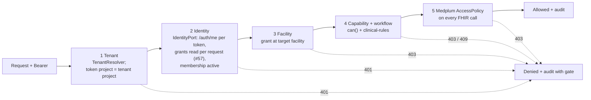
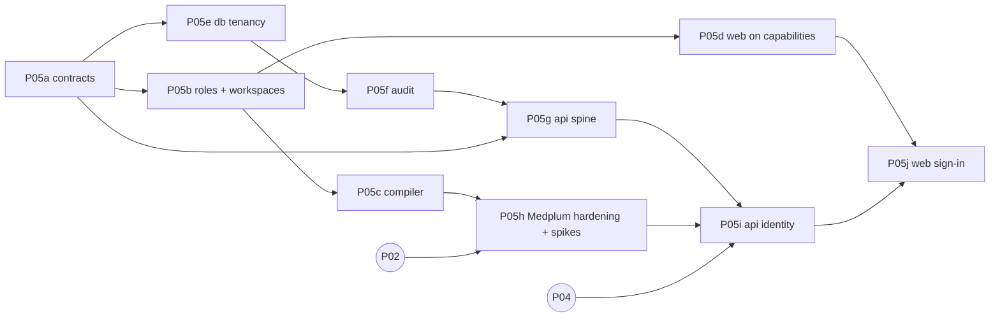

# P05 — Auth, roles and facility authorization (modular core, one hospital)

| Field | Value |
|---|---|
| Wave · Lane · Size | 1 · Platform · split into sub-phases **P05a–P05j** (each S or M) |
| Depends on | P05a–P05g: nothing outside P05 (start now, mock + local Postgres). P05h: P02. P05i–P05j: P04 |
| Unblocks | P12, P14 and every clinical slice (after P05i/P05j) |
| Source mix | MP (Medplum Auth, AccessPolicy) + NEW (`@asc/authz`) |
| Requirements | M12-1 roles · M12-2 permission scoping · M12-3 MFA + session timeout · M12-4 audit |
| Design | [08 identity, access, tenancy](../../product/08-identity-access-and-tenancy.md) · [ADR](../../decisions/2026-10-03-medplum-as-identity-and-access-platform.md) · [future multi-tenancy](../../product/future-multi-tenancy-architecture.md) |
| Branches | `phase/P05<x>-<slug>` — one PR per sub-phase |

## 1. Goal

A **small, modular auth core** for the first hospital that later phases extend without rewrites:

- identity, tenant, role, capability and UI workspace are separate concepts behind small interfaces;
- adding a role or changing its permissions is a data change in `@asc/authz`;
- tenant and facility are in every contract from day one, but only one tenant runs.

This is **not** "complete auth". Anything not needed for the first hospital's go-live has an explicit gate in §6.

## 2. Principles (apply to every sub-phase)

| Principle | Concretely |
|---|---|
| Ports, not providers | `IdentityPort` (who is this token?) and `TenantResolver` (which tenant is this request?) live in `@asc/authz`. Medplum and "static config" are adapters. |
| Capabilities, not roles | Code calls `can(principal, cap, { facilityId })`. A lint rule bans role-name comparisons outside `@asc/authz`. |
| Grants per facility | `Principal.grants[] = { scope: all \| facility, roleKeys, capabilities }`. No flat capability set (prevents a supervisor role at B leaking into A). |
| Roles are data | Versioned role templates (`key` immutable, `label` free, `version`, `status`) compiled to Medplum `AccessPolicy`. |
| UI is a workspace | Nav, home and dashboard come from capabilities via workspace definitions, never from a role enum. |
| Tenant-ready, single tenant | `tenant_id` + RLS in app Postgres, facility in `meta.accounts`; a `StaticTenantResolver` returns the one configured tenant. |
| Default deny | Every API route declares its auth; unknown = startup failure. |
| Small commits | [incremental-commits §4](../../agent/incremental-commits.md#4-size-limits-and-commit-shape): one concern, ≤ 400 lines, green each commit. |

## 3. Five gates (target request path)

## 4. Sub-phases

Commit outlines are the minimum split; split further if a commit would pass the cap. Fuller per-commit detail from the earlier IAM draft is in git history (`git show be210c9:docs/plan/iam/I01-authz-core.md`, `I02`…`I17`).

### P05a — Contracts and `@asc/authz` core · S · needs —
Workspaces: `@asc/types`, `@asc/validation`, `@asc/authz` (new, depends only on `@asc/types`).

| # | Commit |
|---|---|
| 1 | `feat(types): add capability catalog const and Capability type` |
| 2 | `feat(types): add Grant, Principal, TenantRef and RoleTemplate types` |
| 3 | `feat(validation): add authz schemas (principal, grant, role template, me)` |
| 4 | `chore(authz): scaffold @asc/authz package` |
| 5 | `feat(authz): add can() with facility-scoped grants` |
| 6 | `feat(authz): add authorize() result with gate and reason` |
| 7 | `feat(authz): add IdentityPort and TenantResolver with test fakes and StaticTenantResolver` |

- [ ] `RoleKey` is `string`; `Capability` is a closed union from one `as const` tuple with `stepUp` metadata
- [ ] `can()` without `facilityId` counts only `scope: all` grants (fail closed)
- [ ] Test: User X = `rn` @ A, `rn` + `clinical-supervisor` @ B → no supervisor capability at A
- [ ] Patient principal never gets staff capabilities
- [ ] `Principal.kind` includes `agent`; an agent principal's capabilities = caller's ∩ agent allow-list, scoped to the run's patient/case (test)
- [ ] `@asc/authz` has no I/O, no `process.env`, no fetch

### P05b — Role templates, workspaces, lint guard · S · needs P05a
Workspaces: `@asc/authz`, `@asc/eslint-config`.

| # | Commit |
|---|---|
| 1 | `feat(authz): add role template registry and loader` |
| 2 | `feat(authz): add front-desk, rn and tech templates` |
| 3 | `feat(authz): add gi-physician and anesthesia templates` |
| 4 | `feat(authz): add coder, admin, auditor and patient templates` |
| 5 | `feat(authz): build grants from role assignments` |
| 6 | `test(authz): pin role x capability matrix` |
| 7 | `feat(authz): resolve workspaces from capabilities` |
| 8 | `feat(eslint-config): ban role-name comparisons outside authz` |

- [ ] Role list = D-A7 in [IAM README](../iam/README.md); CRNA = `anesthesia` + qualification
- [ ] Matrix snapshot equals 08 §7.3; any widening is a reviewed diff
- [ ] Lint rule ships with a file-by-file baseline of today's violators; P05d empties it
- [ ] Workspace resolver takes definitions as input (no UI list hardcoded in `@asc/authz`)
- [ ] Every catalog capability is held by at least one role, and each capability has the data rights it needs (orphan test in `roles/matrix.test.ts`; follow-up PR #29)

### P05c — Policy compiler · S · needs P05b
Workspace: `@asc/authz` (pure; no `@medplum/*` dependency yet).

| # | Commit |
|---|---|
| 1 | `feat(authz): add AccessPolicy JSON types for the compiler` |
| 2 | `feat(authz): compile resource rules with facility criteria` |
| 3 | `feat(authz): compile hidden and readonly fields` |
| 4 | `feat(authz): add write constraint for signed notes` |
| 5 | `feat(authz): name and tag policies by key and version` |
| 6 | `test(authz): snapshot compiled policies and check determinism` |

- [ ] Facility criteria syntax isolated in one function (P05h spike S1 confirms it)
- [ ] No wildcard resource types; `Composition` hidden for `front-desk`; all-site roles have no facility criteria
- [ ] Shared directory data (`Practitioner`, `PractitionerRole`, `Organization`, `Location`) never gets facility criteria (rules marked `shared`); clinical data always does
- [ ] Portal (`portal.*`) templates are refused by the compiler until the patient-compartment rule exists (P2)

### P05d — Web on capabilities (mock) · M (two PRs) · needs P05b
Workspaces: `apps/web` (+ one-line `@asc/config`, small `@asc/api-client`, `@asc/types` contract changes).

**P05d1 — Principal, guards, nav**

| # | Commit |
|---|---|
| 1 | `feat(api-client): add getMe and auth.me query key` (+ route const in `@asc/config`) |
| 2 | `feat(web): add demo identities with role assignments` |
| 3 | `feat(web): mock /me returns Principal built by @asc/authz` |
| 4 | `fix(web): mock auth fails closed on unknown user or token` |
| 5 | `feat(web): keep Principal and current facility in session` |
| 6 | `feat(web): add useCan hook, Can and RequireCapability` |
| 7 | `feat(web): guard admin, audit, coding and quality routes` |
| 8 | `refactor(web): nav items declare required capability` |

**P05d2 — Workspaces, labels, remove `UserRole`**

| # | Commit |
|---|---|
| 1 | `feat(web): workspace definitions, home routing and dashboard by workspace` |
| 2 | `feat(web): add workspace and facility switcher` |
| 2b | `feat(web): guard every signed-in route from the route table` |
| 3 | `refactor(web): role labels from templates; guide switches identity` |
| 4 | `refactor(types): separate clinical participant roles from authz roles` |
| 5 | `refactor(web): replace self-signup role picker with access request` |
| 6 | `refactor(types): remove UserRole and role-keyed signup schema` |
| 7 | `chore(eslint-config): empty the role-check baseline` |
| 8 | `test(web): add tech identity with config only` |

- [ ] Each web commit loads in `pnpm dev` (LM-005); bundle budgets pass
- [ ] Direct URL to a guarded route without the capability shows 403 (test per route)
- [ ] Every signed-in route is guarded, not only admin, audit, coding and quality (P05d1 left `/referrals`, `/pathology` and the rest hidden from nav but reachable): one `RequireCapability` in the dashboard layout driven by `ROUTE_ACCESS` (`apps/web/src/lib/route-access.ts`), a test per route in that table, and a test that fails if a route has no entry
- [ ] Workspaces restore per-workspace labels dropped in P05d1 (e.g. "Sign queue" for the physician workspace)
- [ ] User X demo: switching facility changes nav and workspaces
- [ ] `grep -rn "UserRole\|NAV_BY_ROLE\|DASHBOARD_BY_ROLE"` is empty at the end
- [ ] Commit 8 touches only identity data, workspace config and a test (proves "new role = data")

#### P05d decisions (2026-10-06)

Recorded here so the next auth agent finds them. Code: `apps/web` unless noted. Rationale lives in PRs #32 and #35.

1. **Persona = label.** Demo personas are keyed by `DemoPersonaId` (`@asc/types`) in `lib/personas.ts`: label, landing page, order. They grant nothing. Role names shown in the UI (user menu, help sheet "Who sees this") come from the `@asc/authz` role templates (`lib/role-labels.ts`), never from a hard-coded list.
2. **`ParticipantRole` is not an authorization role.** `SURGEON | ANESTHESIOLOGIST | NURSE | ADMIN` (`@asc/types`) is a care-team job label on the staff directory, work-queue owners, time-out attestations and audit actors. It must **never** be used to grant, show or hide anything. Authorization uses capabilities only: `can(principal, capability, { facilityId })`, `useCan`, `RequireCapability`. If a feature seems to need "is this person a nurse?", it needs a capability (or a role template change), not a `ParticipantRole` check. `UserRole` no longer exists; `asc/no-role-name-comparison` (empty baseline, test-enforced) catches role-name branching.
3. **One route guard.** `RouteGuard` in the dashboard layout checks the first path segment against `lib/route-access.ts` (`ROUTE_ACCESS`), the same table the sidebar uses. A route **missing from the table is denied** (403). A test fails if a route folder has no entry. Add the capability there when adding a screen.
4. **No matching workspace → empty dashboard.** A user whose capabilities at the current facility open no workspace sees an empty state, not a default. Fail closed.
5. **Access request, not signup.** `POST /auth/access-requests` (`requestAccess` in `@asc/api-client`) always returns 202 for known and unknown emails (no account enumeration) and creates no account and no session. The schema drops any `role` sent. Admin review and invitations come with real Medplum (P05h/P05j).
6. **Open decision: workspace overlap.** A role whose capabilities are a subset of another's (the tech's are a subset of the nurse's and physician's) shows up as an extra option in those users' workspace switcher; their default does not change. Accepted for now. If it becomes a problem, add an optional `hiddenWhen` (capabilities that hide a workspace) to the workspace definition in `@asc/authz` (`WorkspaceDefinition`) and the resolver. Tracked as Q-IAM-C in `PROGRESS.md`.

### P05e — App-DB tenancy · S · needs P05a
Workspaces: `@asc/db`, `@asc/config`.

| # | Commit |
|---|---|
| 1 | `feat(config): add default tenant, Medplum project and runtime db url` |
| 2 | `feat(db): add nullable tenant_id and facility_id to agent_runs` |
| 3 | `feat(db): backfill configured tenant and make tenant_id not null` |
| 4 | `feat(db): enable and force row-level security on agent_runs` |
| 5 | `chore(db): separate owner and runtime database roles` |
| 6 | `feat(db): add withTenant and run agent run store inside it` |
| 7 | `test(db): tenant isolation and missing-context cases` |

- [ ] No `app.tenant_id` set → zero rows, insert rejected (fail closed)
- [ ] Runtime role cannot alter tables or bypass RLS
- [ ] `agent_runs.org_id` meaning resolved (default: keep until `@asc/agents` migrates; new columns are the source of truth)

#### P05e decisions (2026-10-06)

Recorded here so the next DB agent (P05f, P05g) finds them. Code: `packages/db` unless noted. Evidence (commands, test names) lives in PR #36; the checklist above is deliberately left unticked, as for P05a–P05d.

1. **Two roles.** The **owner** runs migrations (`DATABASE_URL`). The app connects as a member of the group role `asc_runtime` (`DATABASE_RUNTIME_URL`; login `asc_app` locally via `docker/postgres/init/01-runtime-role.sql`, created by infra in P06). Migration `0004` creates `asc_runtime` (`NOLOGIN NOSUPERUSER NOBYPASSRLS`) and grants **per table**, never default privileges. It has `SELECT, INSERT, UPDATE` on `agent_runs` and no `DELETE`, so a retention/purge job needs an owner-side path with tenant context.
2. **`withTenant` is the only client the package exports.** `createTenantDb().withTenant(tenantId, tx => …)` opens a transaction and sets `app.tenant_id` with `set_config(…, true)` (transaction-local). The tenant id comes from the principal or job context, never from a request, and a non-UUID is rejected before it reaches SQL. The owner client lives in `@asc/db/migrate` (migrations and tooling only).
3. **RLS is enabled and forced; unset context fails closed.** Policy `tenant_isolation` on `tenant_id = nullif(current_setting('app.tenant_id', true), '')::uuid`, for read and write. **Every new tenant table (P05f `audit_events`) repeats this in its own migration: `tenant_id NOT NULL`, ENABLE + FORCE, the policy, explicit grants.**
4. **FORCE applies to the owner too.** Schema-only DDL is unaffected, but any later migration or owner-side job that reads or writes `agent_runs` rows must set `app.tenant_id` in its transaction (`SELECT set_config('app.tenant_id', $1, true)`). A superuser bypasses RLS, so this only bites with a non-superuser owner, which is what Azure uses. Migration `0002` is safe only because it runs before RLS is enabled.
5. **Backfill input.** Migration `0002` backfills rows written before tenancy from the session setting `app.default_tenant_id` (`?app.default_tenant_id=<uuid>` on the migration URL, or `createMigrationDb({ defaultTenantId })`) and stops if any row would stay without a tenant.
6. **`org_id` stays** until `@asc/agents` migrates (Q-IAM-A). The run store takes an `AgentRunScope` (`tenantId`, optional `facilityId`); takeover requires the same tenant (RLS) and the same facility.
7. **Open: global primary key.** `execution_id` is still the sole primary key. Another tenant reusing an id gets an error (never data or a claim). A composite `(tenant_id, execution_id)` would remove that; decide before ids can collide across tenants.
8. **Tests.** Isolation is proven as the runtime login `asc_app`, not the owner (a local superuser owner bypasses RLS). The DB suites skip without `TEST_DATABASE_URL`; `require-db-in-ci.test.ts` fails when `CI` is set and the URL is not, so P01 CI must provide a Postgres.

### P05f — Durable audit · S · needs P05e
Workspaces: `@asc/audit`, `@asc/db`.

| # | Commit |
|---|---|
| 1 | `feat(audit): add tenant, facility, membership and gate fields` |
| 2 | `feat(audit): add IAM event vocabulary with typed details` |
| 3 | `feat(audit): require append-only durable store in production` |
| 4 | `feat(db): add append-only audit_events table with tenant RLS` |
| 5 | `feat(db): add Postgres audit store` |
| 6 | `test(db): audit store rejects update and delete` |

- [ ] Runtime role cannot `UPDATE`/`DELETE`/`TRUNCATE` `audit_events`; a trigger also blocks owner mistakes
- [ ] IAM events: `auth.login`, `auth.logout`, `auth.denied`, `membership.*`, `role.*`, `user.invited` — IDs and keys only, no names or emails
- [ ] Client IP stored hashed/truncated unless compliance says otherwise
- [ ] Allow/deny events carry decision provenance: role template versions, `@asc/authz` catalog version (git SHA), gate number, cache `hit`/`miss`/`bypass` (08 §12.3)

#### P05f decisions (2026-10-06)

Recorded here so the P05g agent finds them. Evidence (commands, test names) lives in the P05f PR; the checklist above stays unticked, as for P05a–P05e. No new env variables.

1. **Event shape is additive.** `AuditEvent` gains `tenantId`, `facilityId`, `membershipId`, `sessionId`, `gate` (1–5), `decision` (`roleVersions`, `catalogVersion`, `cache`), `clientIpPrefix` and `userAgent` (cut to 200 characters); actor types gain `worker`, `bot`, `service`. `organizationId` stays (Q-IAM-A). **P05g must set `tenantId` (from the resolved tenant) and `facilityId` on every event.**
2. **Tenant on the store, fail closed.** The Postgres store writes inside `withTenant(event.tenantId ?? defaultTenantId)`. `defaultTenantId` is `DEFAULT_TENANT_ID` from `@asc/config`, passed by the app at wiring time (`configureAuditStore(createPostgresAuditStore(tenantDb, { defaultTenantId }))`). With neither, the save is refused (`AuditTenantMissingError`), never written to a guessed tenant.
3. **Client IP (Q-IAM-B).** The client reduces `clientIp` to a /24 (IPv4) or /48 (IPv6) prefix before any store sees the event; an unparseable value is dropped, never echoed. A keyed hash was rejected: a hash of a /24 is trivially reversible. Compliance may still ask for full IPs or hashes; that is a change in `truncateClientIp` only.
4. **IAM vocabulary.** `auth.login|logout|denied`, `membership.activated|disabled|facility_granted|facility_revoked`, `role.assigned|revoked|template_changed`, `user.invited`, built with `iamEvent(action, base, details)` (typed details; `auth.denied` is always `DENIED` and needs a `gate`). Detail strings must look like identifiers (`[A-Za-z0-9._:-]`, ≤ 128): an email or name throws outside production and is dropped, with `detailsRedacted`, in production.
5. **Decision provenance.** `decision.roleVersions` (e.g. `rn-v3`), `catalogVersion` (git SHA of `@asc/authz`) and `cache` (`hit|miss|bypass`) must be short identifiers; free text throws outside production and is dropped in production. P05g fills them from the principal and the identity adapter.
6. **Production gate.** `createAuditClient` refuses a store that is not `durable` **and** `appendOnly`. The Postgres store declares both.
7. **Append-only in three layers.** The runtime role has `SELECT, INSERT` only; no UPDATE or DELETE policy exists; triggers reject UPDATE, DELETE and TRUNCATE for everyone including the owner. Known limits: an owner can drop a trigger on purpose (a reviewable DDL change), and a superuser can disable triggers with `session_replication_role = replica`. There is no purge path: retention, archiving or export is a later, owner-side design.
8. **Same RLS pattern as `agent_runs`.** `tenant_id NOT NULL`, ENABLE + FORCE, a read policy and an insert policy, explicit grants. Owner-side reads need `app.tenant_id` too (see P05e decision 4). Tests cannot `TRUNCATE` the table, so each test uses its own tenant id.
9. **Database errors are sanitized.** `withTenant` rethrows driver failures as `DatabaseError` (SQLSTATE, constraint). Drizzle's message lists all bound parameters, so `agent_runs.output` (PHI) and audit details would otherwise leak into any log or error response (LM-016; found here, also fixes the P05e run store). P05g's error handler must not read `error.cause`.
10. **Audit-write failure.** `AuditClient` propagates a store failure. The denial case is decided in the P05g decisions (item 6): a denial is never skipped. An allowed PHI read whose audit write fails is decided in [#52](https://github.com/imRahul05/ASC-EHR/issues/52) (2026-10-09): fail closed, see P05g decision 6.

### P05g — API security spine · M · needs P05a, P05e, P05f
Workspace: `apps/api` (packages: `@fastify/helmet` 13.1.1, `@fastify/rate-limit` 11.2.0).

| # | Commit |
|---|---|
| 1 | `chore(api): add helmet and rate limiting keyed by tenant and user` |
| 2 | `feat(api): resolve tenant through TenantResolver (static)` |
| 3 | `feat(api): authenticate bearer token through IdentityPort` |
| 4 | `feat(api): default-deny routes without auth config` |
| 5 | `test(api): route inventory lists every public route` |
| 6 | `feat(api): requireCapability and facility guards with denied audit` |
| 7 | `feat(api): add GET /me and configure durable audit store` |
| 8 | `feat(api): refuse fake identity adapter in production` |
| 9 | `test(api): cross-facility and id-tampering cases` |

- [ ] No bearer → 401; missing capability → 403 (gate 4); capability only at B, target in A → 403 (gate 3)
- [ ] Resource id from another tenant → 404, never data
- [ ] Route registered without `config.auth` → app fails to start
- [ ] Tenant never taken from body or query

#### P05g decisions (2026-10-07)

Recorded here so the next API agent (P05h, P05i and every route phase) finds them. Evidence (commands, test names) lives in the P05g PR; the checklist above stays unticked, as for P05a–P05f. Code: `apps/api/src/auth/*` unless noted.

1. **One explicit pipeline, in `app.ts`.** `onRequest` runs: tenant (gate 1) → flood limit (per tenant and address) → identity (gate 2, then a per tenant-and-user limit) → facility and capability (gates 3 and 4). Plugin hooks do not run where they are registered: `@fastify/rate-limit` attaches its limit per route, after every global hook, so failed authentications were never counted until the limit became an explicit hook (LM-018). Keep the chain in one place and test the order.
2. **Every route declares its auth** with `publicRoute()`, `authenticatedRoute()`, `capabilityRoute(cap, { facilityParam? })` or `capabilityAtResource(cap)` (`route-auth.ts`). A route without one makes registration throw, so the API does not start. The CORS preflight `OPTIONS *` that `@fastify/cors` adds is the one declared exception. `route-inventory.test.ts` spells out the public routes (today `GET /health`, its automatic `HEAD`, and the preflight): **adding a public route means editing that list**, so it is reviewed. Unknown paths answer 401 to an anonymous caller (no route enumeration).
3. **Where the facility comes from.** A route parameter (validated as an id; a malformed value counts as *no* facility), the resource the handler loads, or nowhere (then only all-site grants pass). Never the body, query string or a header. For `capabilityAtResource` routes the handler **must** call `app.guards.requireCapabilityAt(request, reply, capability, resource.facilityId)`, and `app.guards.requireSameTenant(request, reply, resource.tenantId)` before it for anything loaded by id; a success that skipped the facility check is replaced by a 500 (fail closed). **Order matters: load only what is needed to learn the resource's facility and tenant, run both checks, and only then read or write the rest.** The 500 fallback fires after the handler has already run, so it catches a forgotten check but cannot undo a write or stop a read that happened first. Other-tenant resources answer 404 with the same body as an unknown id.
4. **Gate numbers.** No grant at the target facility → gate 3. A grant at the facility that lacks the capability → gate 4. A capability held at facility B never widens A. (The checklist line "capability only at B, target in A → gate 3" holds when the caller has no grant at A; with a different role at A it is gate 4. Both are 403.)
5. **Responses.** Generic bodies `{ code, message }`, never which gate or why: 404 unknown tenant, 401 gate 2 (missing, malformed, unknown, wrong-project or inactive membership token), 503 while the identity provider is down (never allow, not audited: it is not a decision), 403 gates 3 and 4, 429 flood limit. A principal returned for a different tenant than gate 1 resolved is refused as `wrong-project`.
6. **Denials are audited with their gate** (`auth.denied`, decision provenance: role template versions from `roleRegistry`, `GIT_SHA` as the catalog version, identity cache state, truncated client IP). **Audit-write failure policy (P05f decision 10): a denial is never skipped.** If the write fails it is logged by error name only and the caller still gets the 4xx. **Allowed PHI read whose audit write fails: fail closed** ([#52](https://github.com/imRahul05/ASC-EHR/issues/52), decided 2026-10-09). The API returns 503 with no PHI and raises an alert (error name only); an AI tool result that carries PHI is not passed to the model unless its access is recorded. This is our policy choice: HIPAA §164.312(b) requires mechanisms that record and examine activity but does not prescribe the response to a failed audit write. Accepted trade-off: an audit-store outage stops PHI reads; revisit a sensitivity split only if the audit store proves a material cause of downtime. Built with the first PHI route (P12/P14).
7. **Identity.** `IdentityPort` only. `stepUp` capabilities pass `{ stepUp: true }` (cache bypass; removed in P05i, since [#57](https://github.com/imRahul05/ASC-EHR/issues/57) leaves no grant cache to bypass); the fresh-login check (≤ 5 min) is the gated follow-up and is not built. `DevIdentityPort` (tokens `dev-<roleKey>`, one synthetic staff identity per role at `demo-facility-1`) is **local development only**: `createIdentityPort` refuses to provide any adapter in staging and production (`NODE_ENV=production`), and `buildApp` rejects any `FakeIdentityPort` instance when `production` is set. **Consequence: until P05i supplies the Medplum adapter, a deployed API (staging or production) does not start**, and a `/health`-only API deployment (for example the hosted demo) stops working. Decide before deploying this.
8. **Startup requirements** (deployed API fails to start without them): `DEFAULT_TENANT_ID`, `MEDPLUM_PROJECT_ID`, and in staging and production `DATABASE_RUNTIME_URL` (durable, append-only audit store). Also `GIT_SHA` (optional, `unknown` when unset) and the rate-limit knobs (`RATE_LIMIT_IP_MAX` 1200, `RATE_LIMIT_USER_MAX` 300, `RATE_LIMIT_WINDOW_MS` 60000).
9. **Flood limits and proxies.** `trustProxy` is off, so `X-Forwarded-For` is ignored (tested). Behind Azure Front Door or Application Gateway the address seen is the proxy's, which makes the per-address limit coarse. **P06 sets `trustProxy` to the proxy range.** The per-address limit is high on purpose (a clinic shares one address); the per-user limit is the tight one.
10. **`GET /me`** returns the principal and the facilities its grants name, validated against `meResponseSchema`. Facility names are the ids until P05i adds the Medplum `Organization` lookup.
11. **No PHI in URLs.** Fastify's request log records the URL including the query string. Routes take ids in the path; search criteria that can be PHI (names, MRNs, dates of birth) go in a POST body, never in a query string (see COMPLIANCE_AND_PHI §4). No such route exists yet.
12. **Types stay out of the app.** `RouteAuth` is declared in the `FastifyContextConfig` augmentation (`auth/augment.ts`), not exported, because exported types are banned in `apps/*` (LM-001). If a second app needs it, move it to `@asc/types`.

### P05h — Medplum hardening, spikes, seed, policy test · M · needs P05c, P02
Workspaces: `infra/medplum`, `apps/bots`, `docs/decisions`.

| # | Commit |
|---|---|
| 1 | `chore(infra): harden Medplum server config` |
| 2 | `test(infra): fail if Medplum hardening settings are missing` |
| 3 | `test(bots): spike S1 facility compartment, write constraint, auth time` |
| 4 | `test(bots): spike S1b union of access entries` |
| 5 | `test(bots): spike S7 record auth me payload (synthetic)` |
| 5b | `test(bots): spike S6 membership disable and policy change latency` |
| 6 | `docs(adr): record spike results and fallbacks` |
| 7 | `feat(bots): seed hospital project, facilities, policies, demo users` |
| 8 | `test(bots): policy test against local Medplum` |

**Hardening (Medplum defaults are unsafe for PHI — [server config](https://www.medplum.com/docs/self-hosting/server-config)):**

| Setting | Medplum default | Required |
|---|---|---|
| `registerEnabled` | `true` (open `/auth/newuser`, `/auth/newproject`) | `false` (invite-only) |
| `saveAuditEvents` | `false` (no AuditEvent rows stored) | `true` (M12-4) |
| `storeBotInput` | `true` (bot inputs, i.e. PHI, written to blob storage) | `false` |
| `defaultSuperAdminEmail` / `Password` | unset | set from secrets; rotated after first boot; never in app runtime config |

- [ ] Policy test: front-desk cannot read `Composition`; `rn` @ A cannot read B resources; a `final` Composition cannot be updated
- [ ] Policy test: `rn` @ A can still read `Practitioner`, `PractitionerRole`, `Organization` and `Location` (shared directory data has no facility tag; spike S1 confirms it stays readable without `%facility`)
- [ ] Every spike passes or has a fallback recorded in the ADR **before** P05i starts
- [ ] S6 measures how long a disabled membership or changed policy keeps working at gate 5 (Medplum) and with our cache (gates 1–4)
- [ ] Seed is idempotent (second run = no changes); synthetic data only
- [ ] Seeded `asc-ehr-api` and `asc-ehr-worker` clients get least-privilege `AccessPolicy` (no full-project access), and a policy test proves the limits: the worker only what its jobs need, the API only on behalf of the signed-in user. **Rule: the full-access clients P02 seeds are for local development only and must never be used in any other environment. Staging and production clients get narrow policies from day one (P06 provisions them with the policy, never "fix it later").**
- [ ] The same hardening settings are carried into the Azure config in [P06](P06-azure-infra.md)

#### P05h decisions (2026-10-08)

Recorded here so P03, P04, P05i, P05j and P06 find them. Evidence (commands, test names) lives in the P05h PR; the checklist above stays unticked, as for P05a–P05g. The reasoning and the measurements are in the [spike results ADR](../../decisions/2026-10-08-medplum-spike-results-and-fallbacks.md) (status `proposed`).

1. **Live tests.** `pnpm --filter bots test:medplum` runs the spikes and the policy tests against the local stack (`apps/bots/live/*.live.ts`, own vitest config, not part of `pnpm test` or turbo). They sign in four times per run and Medplum throttles logins to 5 per window: wait about a minute between runs. They join CI when P01 can provide a disposable Medplum.
2. **Hardening is tested.** `findHardeningViolations` (`apps/bots/scripts/lib/hardening.ts`) is run over every `infra/medplum/medplum.config*.json`, so P06's Azure config is covered as soon as it is added. P06 carries the three settings and the service policies below.
3. **Every facility-scoped write names its facility.** A plain read does not return the facility tag (`meta.accounts`; the singular `meta.account` is deprecated in Medplum 5.1.42, PR #56), and Medplum checks the criteria against the new version, so a body sent back as read is refused (403). **P03 builders stamp `meta.accounts`; P04 clients never write without it.** It also stops a facility user creating or moving a resource into another facility.
4. **Several entries on one membership.** `hiddenFields` apply if any entry has them; `readonly` is lifted by any writable entry; **`writeConstraint` is order-dependent** (skipped when an entry without it comes first). The provisioner never gives one user two entries on the same constrained type at the same facility, a registry test must enforce it, and routes that edit notes also refuse a `final` note at gate 4. Each entry keeps its own `%facility`.
5. **Grants come from `PractitionerRole`, not `/auth/me`.** `/auth/me` has no `access[]` and merges the policies; `ProjectMembership` is admin-only. The seed writes a `PractitionerRole` (code system `https://asc-ehr.app/role-template`, code = role key, `organization` = facility, none for an all-site role) next to each membership. **P05i (decided in [#57](https://github.com/imRahul05/ASC-EHR/issues/57), 2026-10-09; supersedes #49's narrow-client confirmation):**
- Commit 1 still fetches `/auth/me` (identity, project, membership id), cached by token hash for the token's lifetime.
- Commit 2 maps the user's `PractitionerRole`s, read **with the user's own token on every request** (not `membership.access`, not a service client). The policy tag gives the role version.
- Grants are never cached across requests, so there is no invalidation and no webhook. A Subscription on `ProjectMembership` failed Medplum's access-policy check anyway, and a control Subscription was not delivered locally.
- `api-service-v1` is retired from `apps/api`: done early, it is no longer seeded (PR #65) and `apps/api` has no Medplum client credentials (PR #66).
6. **Revocation at Medplum is immediate** (1 to 4 ms measured for a disabled membership, an edited policy and a changed access list). A disabled client can still be issued a token; it is refused when used.
7. **Step-up: the signed `id_token` is forwarded (decided 2026-10-08, #49, option C).** The web app keeps the `id_token` in memory and sends it as `X-ID-Token` only on step-up requests; the API verifies Medplum's signature (JWKS), the same `login_id` and `sub` as the access token, and `auth_time` within `STEP_UP_MAX_AGE_SECONDS` (default 300); any failure is HTTP 403 `{ code: "step_up_required" }` (generic body, the audit event says which check failed). The refresh cookie flow is unchanged. Option C covers step-up that is not a signature (`admin.*`, break-glass, exports). **Signatures use the nonce-bound signing ceremony** (decided in [#58](https://github.com/imRahul05/ASC-EHR/issues/58), 2026-10-09; see the ADR, review amendments, decision 2). It reuses the same 403 contract, and Medplum carries the nonce into the `id_token` (verified). Controlled-substance e-prescribing goes through a certified vendor. Checks before the middleware is built: the `id_token` after a refresh, whether the login throttle counts per user or per address, and the missing `aud` claim (see the ADR, decision 2). `accessTokenLifetime: "15m"` is honoured per `ClientApplication`.
8. **Service clients are least-privilege and the policies are data.** `infra/medplum/service-policies.json`: `api-service-v1` reads `PractitionerRole`, `AccessPolicy`, `Organization` and writes nothing. It is retired from `apps/api` in P05i ([#57](https://github.com/imRahul05/ASC-EHR/issues/57), decided 2026-10-09): every API call carries the user's token. Until then it is still seeded. `system-worker-v1` reaches `Task` only and has no facility criteria, so the one shared `asc-ehr-worker` reads every facility's Tasks (shown live 2026-10-09); [#60](https://github.com/imRahul05/ASC-EHR/issues/60) (decided 2026-10-09) replaces it with one worker client per facility, `asc-ehr-worker@<facility>`, on a `%facility`-parameterized policy. A job that needs another type adds it there in its own PR with a policy test. The seed refuses a client with a membership and no named policy, and narrows older memberships. **Staging and production provision this same file from day one (P06).**
9. **Seed additions.** A second facility, one policy per staff template (`<key>-v<version>`), one demo user per staff role (`demo-<role>@example.com`, generated password in the git-ignored output file, carried forward on later runs), their `PractitionerRole` copies. Idempotent, drift is repaired, second run byte-identical.
10. **Medplum facts.** Invite with `password` and `sendEmail: false` gives a user who can sign in at once; invite reuses the Practitioner with the same email and a second invite fails ("User is already a member"); `Binary` has no search (400); `AccessPolicy` has no `description` in 5.1.42; an unchanged PUT returns 200 without being checked against `writeConstraint`.
11. **Not done here.** The CI job (P01); the membership webhook (decision 5; no longer needed, since #57 removed the grant cache); a live check comparing memberships with `PractitionerRole`s on a running server (with the provisioner); `hiddenFields`/`readonlyFields` through real role templates (no template uses them yet; S1b used custom policies).

### P05i — Medplum identity in the API · S · needs P05g, P05h, P04
Workspaces: `@asc/api-client`, `@asc/authz`, `apps/api`.

| # | Commit |
|---|---|
Commit list as decided in [#57](https://github.com/imRahul05/ASC-EHR/issues/57) (2026-10-09). It replaces the earlier list with a 60 s cache, a step-up bypass and admin invalidation.

| # | Commit |
|---|---|
| 1 | `feat(api-client): server helper to fetch auth me` |
| 2 | `feat(authz): map the user's PractitionerRoles (read with the user's token) to per-facility grants` |
| 3 | `feat(api): Medplum identity adapter, /auth/me cached per token hash for the token lifetime, grants read per request` |
| 4 | `feat(api): reject wrong project or inactive membership` |
| 5 | `chore(api): drop the IdentityPort cache fields` (`api-service-v1`, its config and env examples are already gone: PRs #65, #66) |
| 6 | `test(api): integration against local Medplum, plus a load test of the per-request grant search` |

- [x] Unknown or retired policy in a membership → no capabilities (fail closed)
- [x] Medplum unreachable → 503, never allow; the `/auth/me` cache never stores the raw token and never outlives the token
- [x] Grants are read with the user's token on every request and memoized within that request only; a revoked membership or a removed grant is refused on the next request (test)
- [x] No cross-request grant cache for `PractitionerRole`s, so no grant invalidation hooks and no membership webhook. Fallback only if the load test fails: a cache of at most 5 s, in Redis, keyed by membership, never per-instance memory
- [x] `/auth/me` is cached in memory keyed by `sha256(token)` for the token's lifetime (≤ 15m, bounded at 2,000 entries). `IdentityPort` retains `options.stepUp: boolean` and `cache: "hit" | "miss" | "bypass"`; when `stepUp: true` is passed, the `/auth/me` cache is bypassed, triggering a live verification against Medplum and emitting `cache: "bypass"` for auditing
- [x] `apps/api` holds no Medplum client secret: `api-service-v1` is removed from its runtime, `@asc/config` and `.env*.example` (done early in PRs #65, #66)
- [x] Policy test: no staff template can create or update a `PractitionerRole` carrying the role-template code system (`https://asc-ehr.app/role-template`); grant `PractitionerRole`s carry their own `meta.tag`, distinct from directory entries ([spike results ADR](../../decisions/2026-10-08-medplum-spike-results-and-fallbacks.md), review amendments, decision 4)
- [x] Policy test: every staff template can search its own `PractitionerRole`s by `practitioner` with `active=true` (live-checked for all 8 roles; the seed writes `active: true` since PR #61)
- [x] Worker jobs started by a user carry the principal's ids and re-check its grant at the job's facility before each step that reads or writes PHI, not only when queued; in-process memo of at most 5 s per job ([#57](https://github.com/imRahul05/ASC-EHR/issues/57))

### P05j — Web sign-in · M · needs P05d, P05i, P04
Workspaces: `apps/web`, `@asc/api-client`, `@asc/config`.

| # | Commit |
|---|---|
| 1 | `feat(api-client): browser Medplum client with in-memory storage` |
| 2 | `feat(web): PKCE login with TOTP for the configured project` |
| 3 | `feat(web): token handler with httpOnly refresh cookie and origin check` |
| 4 | `feat(web): sign-in callback, silent refresh and /me load` |
| 5 | `feat(web): idle 15 min and absolute 12 h session timeouts` |
| 6 | `feat(web): logout clears Medplum session, cookie and cache` |
| 7 | `refactor(web): register mock auth only in demo builds` |
| 8 | `test(web): build fails if mock auth ships without demo flag` |

- [x] Refresh cookie `httpOnly`, `Secure`, `SameSite=Strict`, path `/api/auth`; token route checks `Origin` / `Sec-Fetch-Site`
- [x] No token or profile in browser storage or URLs (LM-004); the `id_token` is kept in memory only and sent as `X-ID-Token` solely on step-up requests (P05h decision 7)
- [x] TOTP required for every staff account (M12-3)
- [x] Access token lifetime ≤ 15 min; 15-minute idle and 12-hour absolute session timeouts (M12-3); mock auth restricted strictly behind demo build flag

## 5. Dependency matrix

| Sub-phase | Depends on | Blocks | Parallel with |
|---|---|---|---|
| P05a | — | P05b, P05e | — |
| P05b | P05a | P05c, P05d | P05e |
| P05c | P05b | P05h | P05d, P05e, P05f |
| P05d | P05b | P05j | P05c, P05e–P05g |
| P05e | P05a | P05f, P05g | P05b–P05d |
| P05f | P05e | P05g | P05c, P05d |
| P05g | P05a, P05e, P05f | P05i | P05d |
| P05h | P05c, **P02** | P05i | P05d, P05g |
| P05i | P05g, P05h, **P04** | P05j | — |
| P05j | P05d, P05i, **P04** | P12, P14, clinical slices | — |

**Lanes (never two agents in one package):** Lane 1 `@asc/authz` a → b → c; Lane 2 `@asc/db`/`@asc/audit`/`apps/api` e → f → g; Lane 3 `apps/web` d after b. P05h–P05j wait for P02/P04.

## 6. Gated follow-ups (not in P05; start no later than the gate)

| Follow-up | Gate | Design ref |
|---|---|---|
| Step-up middleware (option C): verify the forwarded `X-ID-Token` (signature, same `login_id` and `sub`, `auth_time` ≤ 5 min) for step-up capabilities that are not signatures (`admin.*`, break-glass, exports); 403 `step_up_required` contract | Before the first such route ships; run the three checks in the ADR first | 08 §5.2, #49, [#58](https://github.com/imRahul05/ASC-EHR/issues/58) |
| Signing ceremony (decided in [#58](https://github.com/imRahul05/ASC-EHR/issues/58), 2026-10-09): • `POST /signing-sessions` returns a single-use nonce (Redis, 2 min) bound to the items' ids, versions and content hashes. • Re-authentication with password + TOTP, passing the nonce. • `POST /signing-sessions/:id/complete` checks the JWKS signature, the nonce (used once), `auth_time` ≤ 60 s, `sub`/`login_id` and that the hashes are unchanged. • `final` + `Provenance.signature` written with the user's token; batch signing allowed. • `agent` and `service` principals can never sign; agent drafts record the agent as contributor and the clinician as attester. • Controlled-substance e-prescribing via a certified vendor | Before the first sign/attest route ships (P16 H&P, P19 note sign, P21 discharge, P22 coding attest); first check whether the login throttle counts per user or per address | 08 §5.2, [spike results ADR](../../decisions/2026-10-08-medplum-spike-results-and-fallbacks.md), review amendments, decision 2 |
| Role-assignment reconciler: `PractitionerRole` is the desired state, `ProjectMembership.access[]` is compiled from it; idempotent, runs on every admin write and on a periodic sweep, writes an `AuditEvent`, alerts when it corrects drift (a membership edited in the Medplum App); sole holder of project-admin credentials, never in `apps/api`. Replaces the dual write and the drift test | Before the first role is assigned outside the seed (staging, P06) | [spike results ADR](../../decisions/2026-10-08-medplum-spike-results-and-fallbacks.md), review amendments, decision 4 |
| Load test: a membership with about 40 `access[]` entries (search latency); region `Organization`s in `meta.accounts` if it fails | Before the first multi-site customer | spike results ADR, review amendments (scale) |
| Worker identity + job context ([#60](https://github.com/imRahul05/ASC-EHR/issues/60), decided 2026-10-09): one worker `ClientApplication` per (tenant, facility), `asc-ehr-worker@<facility>`, with a `%facility`-parameterized `system-worker` policy; the shared unscoped worker client is removed. Job data carries `tenantId` and `facilityId` (`jobDataIdSchema`, IDs only); `facilityId` is required for any job that reads or writes PHI. The worker picks its client from the validated `job.facilityId` (never from model output or free text) and re-checks the acting user's grant before each PHI step ([#57](https://github.com/imRahul05/ASC-EHR/issues/57)). AI tools get the facility-scoped or user-scoped client only, never a raw client. Tenant-wide jobs get their own narrow client only when one exists | With P04's worker factory, before the first worker job that reads Medplum (P12) | 08 §9 |
| SSE stream auth (header auth or one-time ticket, re-validation) | Before P10 streams carry PHI | 08 §10 |
| Signed service-to-service calls and webhooks | Before P24 | 08 §11 |
| Break-glass | P26 (M12-3) | 08 §12.1 |
| Hospital SSO (`DomainConfiguration`) | First customer that requires SSO | 08 §5.3 |
| Patient portal identity | Portal phase (P2) | 08 §5.4 |
| Role lifecycle tooling (deprecate, retire, split) | First role change after go-live; until then template version bump + Medplum App | [future §8](../../product/future-multi-tenancy-architecture.md) |
| Full backend-for-frontend (proxy all FHIR reads) | Only if a security review or customer requires it; hybrid token handling is the default (ADR item 6; #49 kept it) | ADR |
| P05h policy test in CI (disposable Medplum, role × resource matrix) | When P01 CI exists; required before go-live | ADR Confirmation |
| IAM hardening review (cross-facility attack tests, pen test, `phi-review` of the auth surface, sign-off) | Part of P26 go-live hardening | 08 §6, §12 |
| Multi-tenancy (registry, host resolver, provisioner, cross-tenant suite) | Customer #2 signed | [future §9](../../product/future-multi-tenancy-architecture.md) |

## 7. Acceptance (P05 done)

- [x] All sub-phase checklists ticked; every commit within [incremental-commits §4](../../agent/incremental-commits.md#4-size-limits-and-commit-shape)
- [x] No role-name comparisons in the codebase (lint, empty baseline)
- [x] Cross-facility escalation blocked in `can()` (unit), API (P05g) and Medplum (P05h policy test)
- [x] Every API route default-deny; denials audited with gate number in a durable, append-only store
- [x] Medplum hardening settings enforced by test in every environment
- [x] TOTP for all staff; 15 min idle / 12 h absolute sessions; tokens in memory only
- [x] Adding a role = template file + matrix snapshot + seed run (demonstrated in P05d2 commit 8)
- [x] `phi-review` run on P05e–P05j; PROGRESS.md updated per sub-phase

## 8. Open questions

| ID | Question | Default |
|---|---|---|
| Q-IAM-1 | Tenant = customer (BAA holder), one Medplum Project each | Yes |
| Q-IAM-2 | Role list (D-A7) | As proposed |
| Q-IAM-3 | 15 min idle / 12 h absolute | Yes |
| Q-IAM-A | `agent_runs.org_id` meaning | Keep; `tenant_id` + `facility_id` are the source of truth |
| Q-IAM-B | Client IP in audit | Hashed/truncated |
| Q-IAM-9 | Email sender for Medplum invites and resets | Azure Communication Services Email via SMTP |
