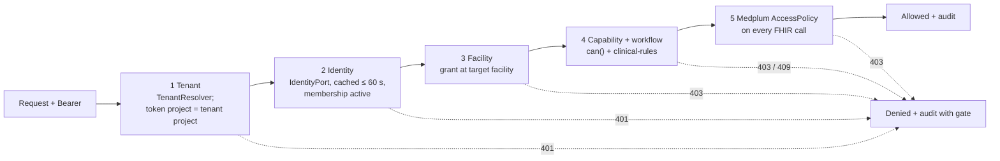

# P05 — Auth, roles and facility authorization (modular core, one hospital)

| Field | Value |
|---|---|
| Wave · Lane · Size | 1 · Platform · split into sub-phases **P05a–P05j** (each S or M) |
| Depends on | P05a–P05g: nothing outside P05 (start now, mock + local Postgres). P05h: P02. P05i–P05j: P04 |
| Unblocks | P12, P14 and every clinical slice (after P05i/P05j) |
| Source mix | MP (Medplum Auth, AccessPolicy) + NEW (`@asc/authz`) |
| Requirements | M12-1 roles · M12-2 permission scoping · M12-3 MFA + session timeout · M12-4 audit |
| Design | [08 identity, access, tenancy](../../product/08-identity-access-and-tenancy.md) · [ADR](../../decisions/2026-10-03-medplum-as-identity-and-access-platform.md) · [future multi-tenancy](../../product/future-multi-tenancy-architecture.md) |
| Branches | `phase/P05<x>-<slug>` — one PR per sub-phase |

## 1. Goal

A **small, modular auth core** for the first hospital that later phases extend without rewrites:

- identity, tenant, role, capability and UI workspace are separate concepts behind small interfaces;
- adding a role or changing its permissions is a data change in `@asc/authz`;
- tenant and facility are in every contract from day one, but only one tenant runs.

This is **not** "complete auth". Anything not needed for the first hospital's go-live has an explicit gate in §6.

## 2. Principles (apply to every sub-phase)

| Principle | Concretely |
|---|---|
| Ports, not providers | `IdentityPort` (who is this token?) and `TenantResolver` (which tenant is this request?) live in `@asc/authz`. Medplum and "static config" are adapters. |
| Capabilities, not roles | Code calls `can(principal, cap, { facilityId })`. A lint rule bans role-name comparisons outside `@asc/authz`. |
| Grants per facility | `Principal.grants[] = { scope: all \| facility, roleKeys, capabilities }`. No flat capability set (prevents a supervisor role at B leaking into A). |
| Roles are data | Versioned role templates (`key` immutable, `label` free, `version`, `status`) compiled to Medplum `AccessPolicy`. |
| UI is a workspace | Nav, home and dashboard come from capabilities via workspace definitions, never from a role enum. |
| Tenant-ready, single tenant | `tenant_id` + RLS in app Postgres, facility in `meta.accounts`; a `StaticTenantResolver` returns the one configured tenant. |
| Default deny | Every API route declares its auth; unknown = startup failure. |
| Small commits | [incremental-commits §4](../../agent/incremental-commits.md#4-size-limits-and-commit-shape): one concern, ≤ 400 lines, green each commit. |

## 3. Five gates (target request path)

## 4. Sub-phases

Commit outlines are the minimum split; split further if a commit would pass the cap. Fuller per-commit detail from the earlier IAM draft is in git history (`git show be210c9:docs/plan/iam/I01-authz-core.md`, `I02`…`I17`).

### P05a — Contracts and `@asc/authz` core · S · needs —
Workspaces: `@asc/types`, `@asc/validation`, `@asc/authz` (new, depends only on `@asc/types`).

| # | Commit |
|---|---|
| 1 | `feat(types): add capability catalog const and Capability type` |
| 2 | `feat(types): add Grant, Principal, TenantRef and RoleTemplate types` |
| 3 | `feat(validation): add authz schemas (principal, grant, role template, me)` |
| 4 | `chore(authz): scaffold @asc/authz package` |
| 5 | `feat(authz): add can() with facility-scoped grants` |
| 6 | `feat(authz): add authorize() result with gate and reason` |
| 7 | `feat(authz): add IdentityPort and TenantResolver with test fakes and StaticTenantResolver` |

- [ ] `RoleKey` is `string`; `Capability` is a closed union from one `as const` tuple with `stepUp` metadata
- [ ] `can()` without `facilityId` counts only `scope: all` grants (fail closed)
- [ ] Test: User X = `rn` @ A, `rn` + `clinical-supervisor` @ B → no supervisor capability at A
- [ ] Patient principal never gets staff capabilities
- [ ] `@asc/authz` has no I/O, no `process.env`, no fetch

### P05b — Role templates, workspaces, lint guard · S · needs P05a
Workspaces: `@asc/authz`, `@asc/eslint-config`.

| # | Commit |
|---|---|
| 1 | `feat(authz): add role template registry and loader` |
| 2 | `feat(authz): add front-desk, rn and tech templates` |
| 3 | `feat(authz): add gi-physician and anesthesia templates` |
| 4 | `feat(authz): add coder, admin, auditor and patient templates` |
| 5 | `feat(authz): build grants from role assignments` |
| 6 | `test(authz): pin role x capability matrix` |
| 7 | `feat(authz): resolve workspaces from capabilities` |
| 8 | `feat(eslint-config): ban role-name comparisons outside authz` |

- [ ] Role list = D-A7 in [IAM README](../iam/README.md); CRNA = `anesthesia` + qualification
- [ ] Matrix snapshot equals 08 §7.3; any widening is a reviewed diff
- [ ] Lint rule ships with a file-by-file baseline of today's violators; P05d empties it
- [ ] Workspace resolver takes definitions as input (no UI list hardcoded in `@asc/authz`)

### P05c — Policy compiler · S · needs P05b
Workspace: `@asc/authz` (pure; no `@medplum/*` dependency yet).

| # | Commit |
|---|---|
| 1 | `feat(authz): add AccessPolicy JSON types for the compiler` |
| 2 | `feat(authz): compile resource rules with facility criteria` |
| 3 | `feat(authz): compile hidden and readonly fields` |
| 4 | `feat(authz): add write constraint for signed notes` |
| 5 | `feat(authz): name and tag policies by key and version` |
| 6 | `test(authz): snapshot compiled policies and check determinism` |

- [ ] Facility criteria syntax isolated in one function (P05h spike S1 confirms it)
- [ ] No wildcard resource types; `Composition` hidden for `front-desk`; all-site roles have no facility criteria

### P05d — Web on capabilities (mock) · M (two PRs) · needs P05b
Workspaces: `apps/web` (+ one-line `@asc/config`, small `@asc/api-client`, `@asc/types` contract changes).

**P05d1 — Principal, guards, nav**

| # | Commit |
|---|---|
| 1 | `feat(api-client): add getMe and auth.me query key` (+ route const in `@asc/config`) |
| 2 | `feat(web): add demo identities with role assignments` |
| 3 | `feat(web): mock /me returns Principal built by @asc/authz` |
| 4 | `fix(web): mock auth fails closed on unknown user or token` |
| 5 | `feat(web): keep Principal and current facility in session` |
| 6 | `feat(web): add useCan hook, Can and RequireCapability` |
| 7 | `feat(web): guard admin, audit, coding and quality routes` |
| 8 | `refactor(web): nav items declare required capability` |

**P05d2 — Workspaces, labels, remove `UserRole`**

| # | Commit |
|---|---|
| 1 | `feat(web): workspace definitions, home routing and dashboard by workspace` |
| 2 | `feat(web): add workspace and facility switcher` |
| 3 | `refactor(web): role labels from templates; guide switches identity` |
| 4 | `refactor(types): separate clinical participant roles from authz roles` |
| 5 | `refactor(web): replace self-signup role picker with access request` |
| 6 | `refactor(types): remove UserRole and role-keyed signup schema` |
| 7 | `chore(eslint-config): empty the role-check baseline` |
| 8 | `test(web): add tech identity with config only` |

- [ ] Each web commit loads in `pnpm dev` (LM-005); bundle budgets pass
- [ ] Direct URL to a guarded route without the capability shows 403 (test per route)
- [ ] User X demo: switching facility changes nav and workspaces
- [ ] `grep -rn "UserRole\|NAV_BY_ROLE\|DASHBOARD_BY_ROLE"` is empty at the end
- [ ] Commit 8 touches only identity data, workspace config and a test (proves "new role = data")

### P05e — App-DB tenancy · S · needs P05a
Workspaces: `@asc/db`, `@asc/config`.

| # | Commit |
|---|---|
| 1 | `feat(config): add default tenant, Medplum project and runtime db url` |
| 2 | `feat(db): add nullable tenant_id and facility_id to agent_runs` |
| 3 | `feat(db): backfill configured tenant and make tenant_id not null` |
| 4 | `feat(db): enable and force row-level security on agent_runs` |
| 5 | `chore(db): separate owner and runtime database roles` |
| 6 | `feat(db): add withTenant and run agent run store inside it` |
| 7 | `test(db): tenant isolation and missing-context cases` |

- [ ] No `app.tenant_id` set → zero rows, insert rejected (fail closed)
- [ ] Runtime role cannot alter tables or bypass RLS
- [ ] `agent_runs.org_id` meaning resolved (default: keep until `@asc/agents` migrates; new columns are the source of truth)
