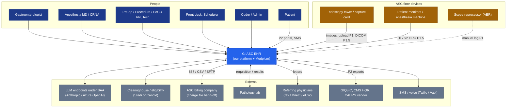
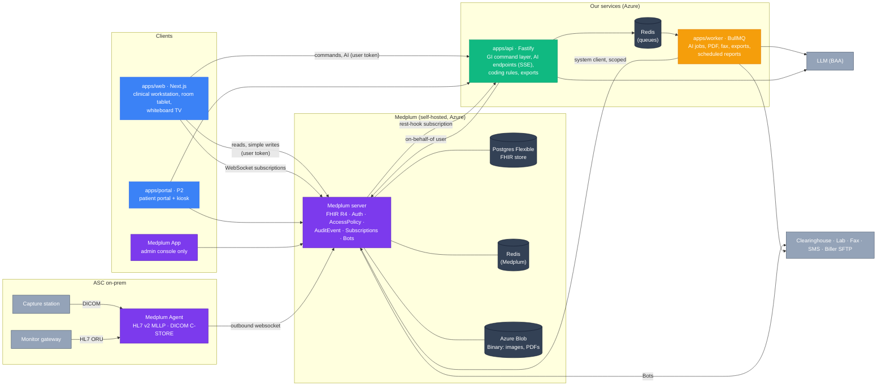
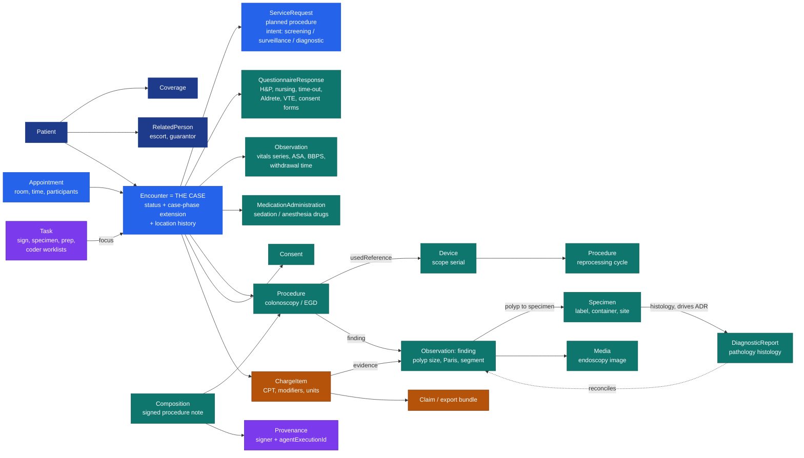
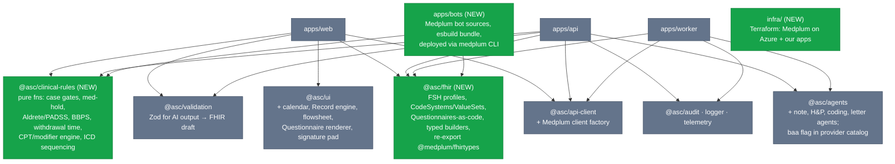
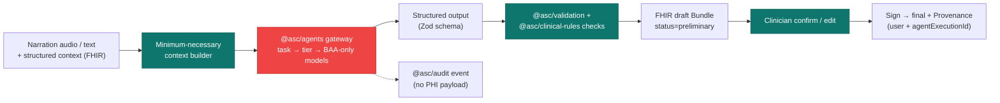
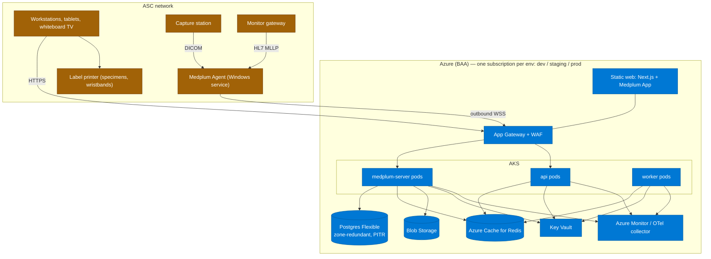

# 03 — Target Architecture

Principle: **Medplum is the system of record; our code owns GI domain logic, the AI wedge, and the UX.** No clinical data lives outside FHIR except transient job payloads.

## 1. System context

## 2. Containers

### Request-path rule (keeps us from writing proxy code)

| Kind of operation | Path | Why |
|---|---|---|
| Read / search / simple create-update with no GI rules (e.g. edit demographics, add allergy) | `web → Medplum` directly with user's token | AccessPolicy + AuditEvent apply automatically; zero API code |
| **Command** with domain rules or multi-resource transaction (book case, advance case phase, sign note, time-out attest, compute codes, export charges) | `web → Fastify command → Medplum (user token, FHIR transaction Bundle)` | Rules live in one tested place (`@asc/clinical-rules`); atomic writes |
| AI generation (H&P, note, instructions, letter, coding suggestions) | `web → Fastify (SSE)`; long jobs → BullMQ worker | Streaming UX; model routing via `@asc/agents` |
| Event reaction, small (extract QuestionnaireResponse, create/resolve Task, ACK HL7) | Medplum **Bot** on Subscription | Runs next to data; no infra |
| Event reaction, heavy (LLM, PDF batches, exports) | Subscription rest-hook → API → BullMQ → worker | Our packages, retries, observability |

## 3. FHIR data model (core of a case)

Key modeling choices:
- **Encounter = the case.** Phase (`scheduled → … → closed`) as a coded extension; `Encounter.location` history gives room/bay for the whiteboard and turnover analytics for free.
- **Finding ⇄ specimen ⇄ pathology link is first-class.** ADR, surveillance interval, GIQuIC export, and coding evidence all depend on it.
- **Intent on `ServiceRequest`** (screening/surveillance/diagnostic) set at booking — the coding engine reads it; nobody retypes it.
- **Signed = `Composition.status=final` + `Provenance` signature.** Changes after sign = new version + addendum `Provenance`; Medplum `_history` keeps every version.
- **Every resource carries `meta.account` / facility `Organization`** → AccessPolicy compartments make multi-site a config change later.
- Profiles authored in FSH in `packages/fhir/profiles`, compiled to `StructureDefinition`s, uploaded to Medplum; types generated for TS.

## 4. Monorepo layout (additions)

`@asc/clinical-rules` is shared by web (instant UI feedback), API (authoritative enforcement) and bots — exactly the anti-duplication rule in `docs/agent/architecture.md`. It must be pure and exhaustively unit-tested; coding rules get golden-case fixtures reviewed by a certified coder.

## 5. AI layer

Model configuration (tiers, tasks, logical models, routing profiles, hosting targets for vendor API / Azure / AWS) is documented with diagrams in [`packages/agents/README.md`](../../packages/agents/README.md).

Agents (task types to add to routing config): `hp_intake`, `procedure_note`, `discharge_instructions`, `referral_letter`, `coding_suggest`, `pathology_reconcile`, `surveillance_interval` (P3). Rules:
- **Deterministic first, LLM second** for coding: the rules engine decides CPT/modifiers where rules are clear; the LLM proposes only where judgement is needed and must cite evidence resource IDs.
- Every agent has an offline eval set (de-identified/synthetic) run in CI; regression blocks release (fits the staging fixture strategy in the environments ADR).
- Speech-to-text vendor must also be under BAA.

## 6. Security & compliance mapping

| Control | Implementation |
|---|---|
| Identity, MFA, SSO | Medplum Auth; Entra ID as external IdP for staff |
| Authorization | One `AccessPolicy` per role; field-level hiding (e.g. front desk ↛ `Composition`); facility compartment |
| Break-glass | Elevated policy for 1 h, mandatory reason, `@asc/audit` alert |
| PHI access audit | Medplum `AuditEvent` (automatic) |
| Business / AI audit | `@asc/audit` (actor, action, resource ids, `agentExecutionId`, no PHI) |
| Logs / traces | `@asc/logger`, `@asc/telemetry` with redaction (existing) |
| Encryption | Azure-managed keys at rest (Postgres, Blob, Redis); TLS 1.2+; Agent uses outbound TLS websocket — no inbound firewall holes at ASC |
| Backups | Postgres PITR; Blob soft-delete + versioning; quarterly restore test |
| BAAs | Azure, LLM provider(s), STT vendor, SMS/fax vendor, clearinghouse |

## 7. Deployment

Medplum's documented Azure path (Terraform: VNet, AKS, Postgres Flexible, Redis, Storage, CDN, App Gateway) is the base; our api/worker deploy to the same AKS. Staging holds synthetic data only (per environments ADR).
