# 04 — End-to-End Flows

Legend used in labels: **[MS]** = MindScript reuse · **[MP]** = Medplum primitive · **[NEW]** = we build.

## 4.1 Whole patient journey (referral → quality report)

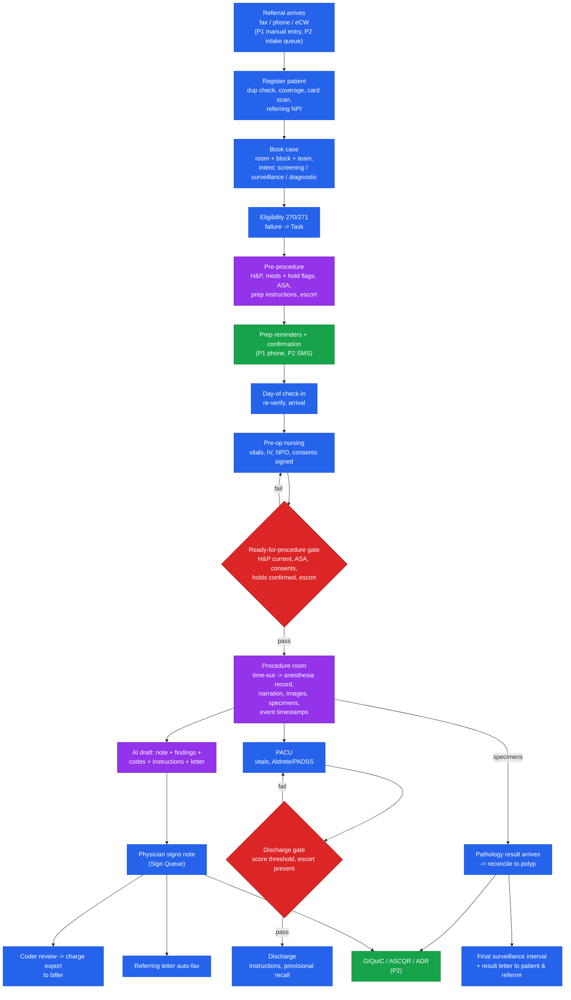

## 4.2 Case state machine (Encounter case-phase)

Transitions are **commands** in `apps/api`; gates are pure functions in `@repo/clinical-rules` (also run in the UI for instant feedback). Every transition writes `Encounter` + `Provenance` in one FHIR transaction; the whiteboard updates via Subscription.

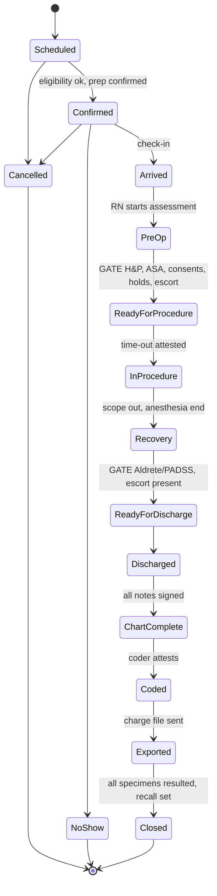

## 4.3 Scheduling & eligibility

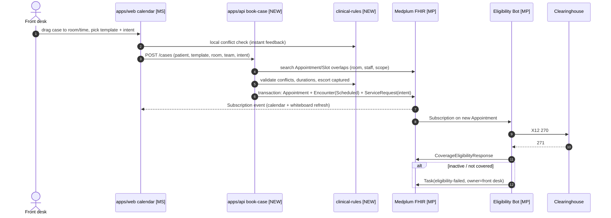

## 4.4 Pre-procedure intake, H&P & med-hold

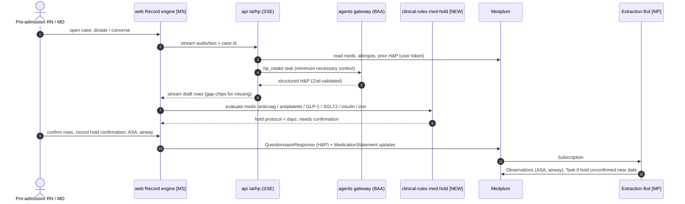

## 4.5 Procedure room: AI-native documentation

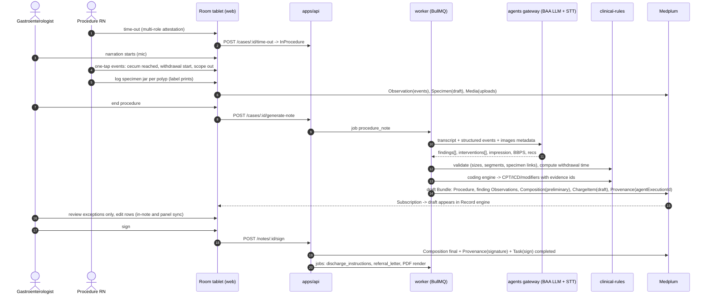

## 4.6 Image capture (P1 upload → P1.5 tower)

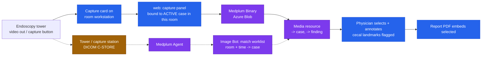

Safety rule: an image is accepted only for the case currently `InProcedure` in that room; mismatch → quarantine Task.

## 4.7 Anesthesia record (AIMS)

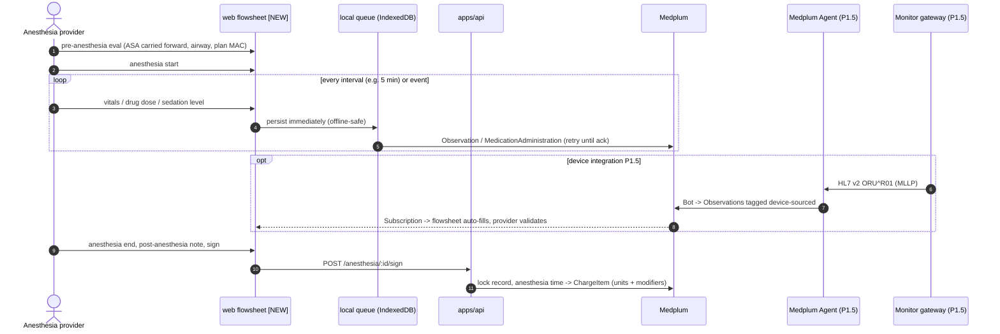

## 4.8 Specimen → pathology → ADR → surveillance (closed loop)

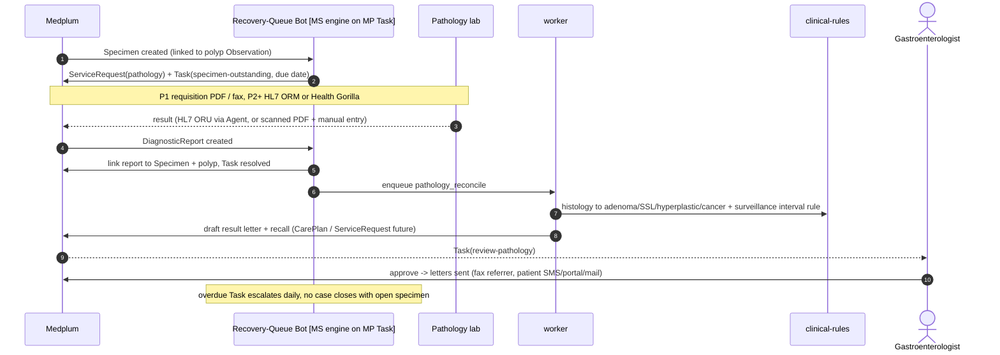

## 4.9 Coding & charge hand-off

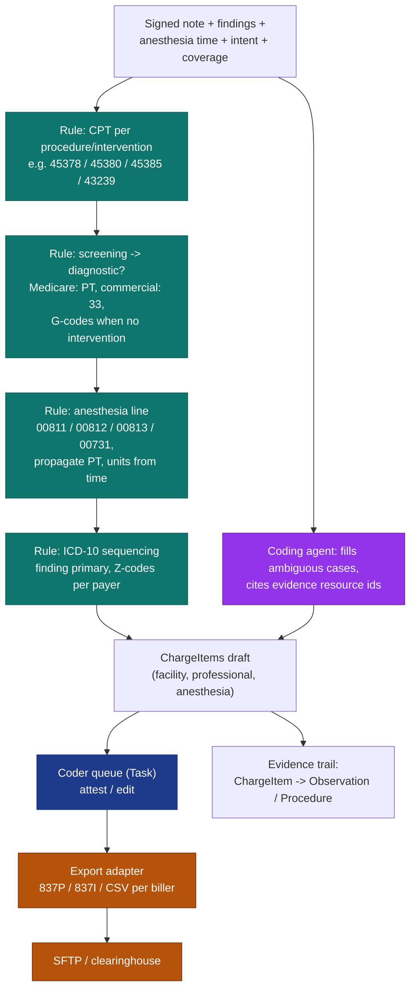

## 4.10 Security & audit on every request

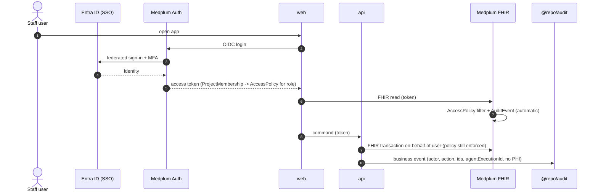

## 4.11 Referring loop & patient communications

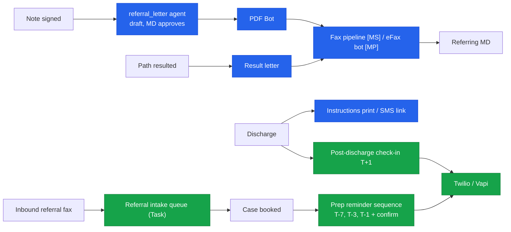

## 4.12 Quality reporting (P2)

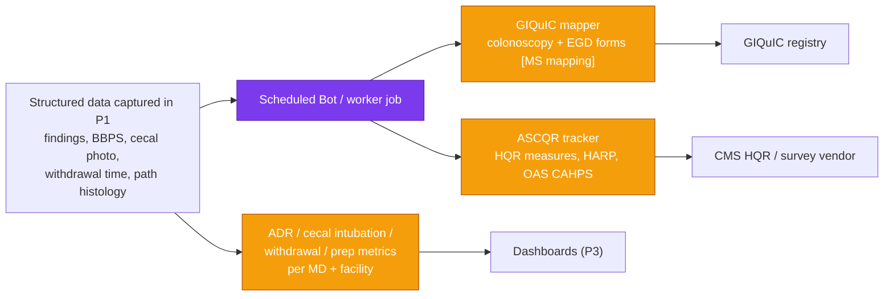

The P2 registry work is cheap **only if** P1 captures findings as structured data with the finding⇄specimen⇄histology link. That is why M05-3/M05-4 and M10-4 are P1 acceptance criteria, not nice-to-haves.
