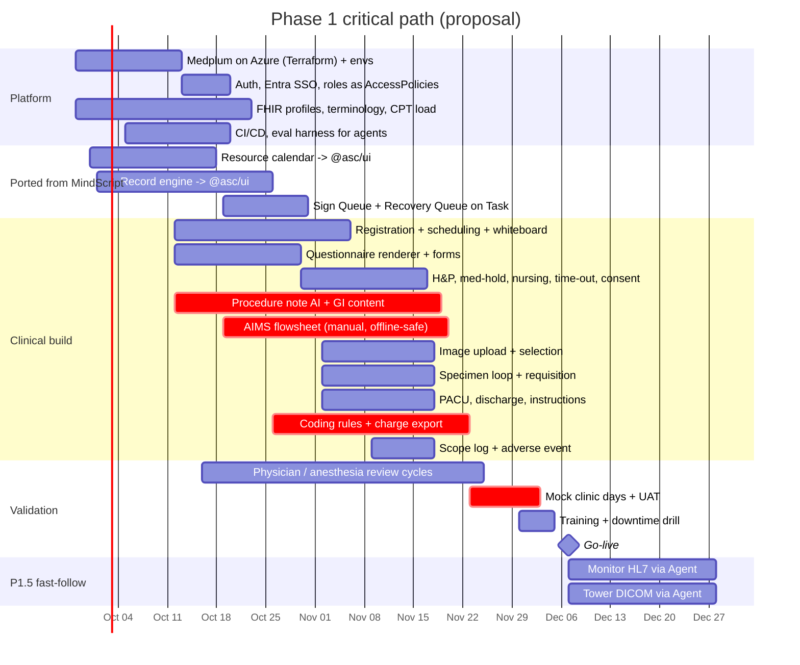

# 05 — Delivery Plan, Decisions, Risks & Open Questions

Assumptions: today 2026-09-25; go-live **early December 2026** (conflict C1 — confirm); team size unknown (plan below assumes ~5 engineers + 1 clinical informaticist/RN SME + part-time certified coder). Every workstream ships behind the same rule: **Medplum first, MindScript port second, new code last.**

## 5.1 Critical path

**Why these are on the critical path:** procedure note AI (the wedge, most clinical review), AIMS (highest liability, new time-series UX), coding + export (depends on biller format answer), mock days (only real proof of readiness).

## 5.2 Decisions (recommendations to ratify)

| ID | Decision | Recommendation | Why |
|---|---|---|---|
| D1 | Medplum hosting | **Self-host on Azure** using Medplum's Terraform path; fallback: Medplum-hosted with BAA if platform time slips past week 3 | Matches existing Azure BAA posture; data residency under our control |
| D2 | UI library for clinical app | `@asc/ui` + `@medplum/react-hooks` (headless); **no** `@medplum/react` in `apps/web` | Repo rule; one design system |
| D3 | Admin console | Medplum App in P1 | No custom admin build |
| D4 | Worklist engine | FHIR `Task` for all queues | One engine; MindScript Recovery/Sign Queue semantics port onto it |
| D5 | Coding approach | Deterministic rules engine first, LLM for ambiguity with evidence citation, human coder attests | Denial risk and audit defensibility |
| D6 | PHI to LLMs | Allowed only to BAA endpoints via gateway; amend `COMPLIANCE_AND_PHI.md` | Scribe impossible otherwise (conflict C5) |
| D7 | P1 additions | Scope reprocessing log, adverse event form, referring-letter fax | Low cost, high survey/commercial value |
| D8 | Device integrations | P1 manual + upload; P1.5 via Medplum Agent | De-risk go-live; spec already recommends |

## 5.3 Risks

| Risk | Impact | Likelihood | Mitigation |
|---|---|---|---|
| AIMS clinically unacceptable at go-live | Cannot open | Med | Anesthesia provider in weekly review from week 3; paper anesthesia record as documented downtime fallback |
| Tower model / capture output unknown | Images not in note | High | P1 = capture-card upload works with any tower; decide hardware now (Q2) |
| Biller format unknown | No revenue hand-off | Med | Get spec by week 2 (Q4); export adapter isolated behind interface |
| CPT license not in place | No codes | Med | Start AMA license now (Q8) |
| Medplum Azure ops harder than expected | Platform slip | Med | D1 fallback; pin versions; single platform owner |
| AI note quality below physician bar | Wedge fails, fall back to clicking | Med | Record engine works fully manual; AI only accelerates; eval set from mock cases |
| 10-week schedule | Scope creep kills go-live | High | Phase gates enforced; everything not P1 is parked in P2 backlog |
| Network outage in procedure room | Lost anesthesia data | Low–Med | Offline queue (M07-7); downtime packet |

## 5.4 Open questions (owner → needed by)

From the spec (still open):
1. **Procedure mix at launch** — colon/EGD only, or ERCP/EUS/motility? → physicians, week 1
2. **Tower/scope models + capture output** (Olympus / Pentax / Fujifilm; DICOM? capture card?) → physicians/ops, week 1
3. **Anesthesia model** — MAC/propofol with MD or CRNA vs moderate sedation; manual charting acceptable at go-live? → anesthesia, week 1
4. **Billing company / clearinghouse + required file format** → business, week 2
5. **Accreditation path + dates** (AAAHC / TJC / state) → business, week 2
6. **Case volume per day / rooms** → ops, week 2
7. **Certified-EHR requirement** for any program? → compliance, week 2

New from this analysis:
8. **CPT license** — who holds AMA license for embedded use? → business, week 1
9. **MindScript code access + stack** — can calendar / Record engine / queues be copied or only re-implemented? → engineering lead, week 1
10. **Medplum hosting** decision D1 ratified → engineering lead, week 1
11. **Patient monitors / anesthesia machines** — model, HL7 gateway availability → anesthesia/biomed, week 4 (P1.5)
12. **Pathology lab** — which lab; interface options (HL7, Health Gorilla, fax only)? → ops, week 3
13. **State specifics** — FL VTE registry format (map row), H&P window, record retention, adverse-event reporting → compliance, week 3
14. **Patient instruction languages** → physicians, week 4
15. **Speech-to-text vendor under BAA** + procedure-room mic hardware → engineering, week 2
16. **Label printing** (specimen jars, wristbands) — printer models → ops, week 4
17. **Team size / staffing** to confirm the plan is feasible → business, week 1
