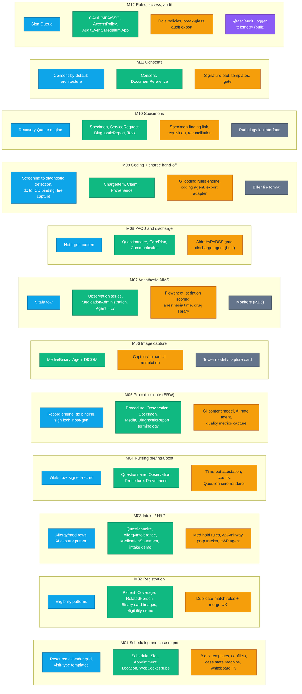
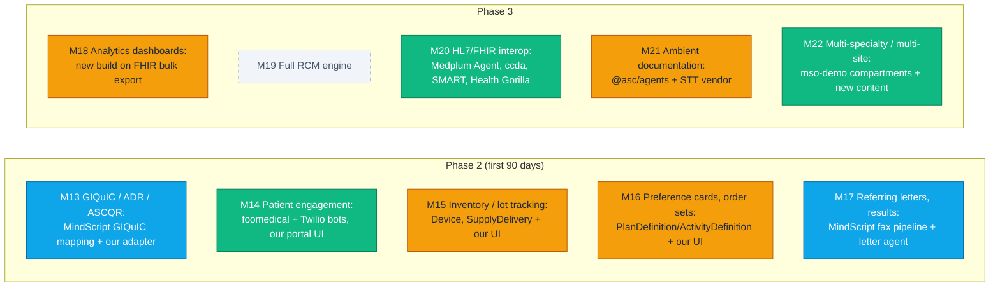

# 06 — Medplum Adoption, Source Map & Build Plan

> **Status:** draft for engineering review (2026-09-26). Builds on [02 Build/Reuse matrix](02-build-reuse-matrix.md), [03 Target architecture](03-target-architecture.md), [05 Delivery plan](05-delivery-plan.md) and the [Medplum ADR](../decisions/2026-09-25-adopt-medplum-as-clinical-data-platform.md).
> **Inputs:** `ASC EHR Feature Spec.docx` (v0.1, 22 modules / 3 phases), Medplum source `main` @ **v5.1.42** (inspected package-by-package), this repo after PR #6/#7.
> **Goal:** decide *exactly* what we take from Medplum and how, show where every part of the product comes from (MindScript / Medplum / already built / new build), and list what we can prepare **now** so implementation is fast once the company's workflows arrive.

---

## 1. TL;DR

1. **"Take Medplum" = adopt, don't absorb.** Run the Medplum **server** (and its admin **app**) self-hosted as a pinned, unmodified service in our Azure; consume Medplum **libraries** as pinned npm dependencies; **copy code only from `examples/`** (patterns) into our packages with attribution. Do **not** paste the server or libraries into our repo — it's 28 packages, and we'd inherit every security patch and migration forever. Apache-2.0 allows either; the maintenance math doesn't.
2. **Everything we customise goes through Medplum extension points** (config, `AccessPolicy`, profiles, `Questionnaire`s, `SearchParameter`s, Bots, Subscriptions, `Task`) — never by editing server code. A fork is the last resort, with a documented patch set.
3. **Four Medplum defaults are unsafe for PHI and must be changed** (verified in `server-config.md`): `saveAuditEvents` is **off** by default, `registerEnabled` is **on**, `storeBotInput` is **on** (writes every bot input — PHI — to blob storage), and the built-in `$ai` operation calls OpenAI directly if a project secret is set (bypasses our BAA gateway). See §5.
4. **Net-new build is concentrated in five places:** GI content + rules (`@asc/fhir`, `@asc/clinical-rules`), clinical UI (`@asc/ui`: calendar, Record engine, flowsheet, Questionnaire renderer), GI commands (`apps/api`), Bots (`apps/bots`), and AI agents (`@asc/agents`, already hardened).
5. **We can start ~2 weeks of foundation work today** without the company's workflows (§8); workflow-dependent items are flagged so nobody builds them on guesses.

---

## 2. How we take Medplum — four adoption modes

| Mode | What it means | Upgrade path | Use for |
|---|---|---|---|
| **RUN** | Deploy Medplum's official artifact (container / Helm chart / static app), pinned version, configured by us | Bump pinned version in staging on a cadence | `server`, `app`, `agent` |
| **DEP** | `pnpm add @medplum/<pkg>@<pinned>`, imported by our packages/apps | Renovate PR, run tests | `core`, `fhirtypes`, `definitions`, `react-hooks`, `hl7`, `mock`, `cli` |
| **COPY** | Copy source from `medplum/examples/*` into our package, adapt to our stack, keep Apache-2.0 header + attribution | We own it after copy | Example apps' patterns (provider app, intake, task worklist, eligibility, eFax, FSH profiles, websocket subscriptions) |
| **REFERENCE** | Read to learn the pattern; re-implement in our design system | n/a | Mantine-based UI (`@medplum/react`, `react-scheduling`) |
| **SKIP** | Not needed / out of scope | n/a | eRx, AWS-only infra, internal tooling |

**Fork policy (only if unavoidable):** fork `medplum/medplum` at a release tag into a separate repo, keep a `PATCHES.md` (one line per patch + reason + upstream issue link), rebuild the container in our CI, re-apply on every upgrade. Prefer upstreaming. Trigger for a fork: a security/compliance need that config + extension points cannot meet.

**License obligations (Apache-2.0):** keep Medplum's `LICENSE` and `NOTICE` with any copied code (`third_party/medplum/NOTICE` + per-file headers), mark modified files, and **don't use the "Medplum" name/branding for our product** (registered trademark per `NOTICE`).

---

## 3. Package-by-package decision (Medplum v5.1.42)

| Medplum package | What it is | Mode | Where it lands in our repo | Phase |
|---|---|---|---|---|
| `@medplum/server` | FHIR R4 server (Express, Postgres, Redis, BullMQ), auth/OAuth/SMART, AccessPolicy, Subscriptions, Bots, terminology, `$operations` | **RUN** | AKS (Helm chart `charts/`), Azure Postgres Flexible + Redis + Blob (Terraform `terraform/azure`) | P1 |
| `@medplum/app` | Admin web app (users, access policies, Questionnaires, Bots, CodeSystems) | **RUN** (internal only, SSO, private network) | Static on Azure CDN/Blob | P1 |
| `@medplum/core` | `MedplumClient`, FHIR utils, search, auth | **DEP** | `@asc/api-client` (client factory), `apps/web`, `apps/api`, `apps/worker`, `apps/bots` | P1 |
| `@medplum/fhirtypes` | FHIR R4 TypeScript types | **DEP** | Re-exported from `@asc/fhir` | P1 |
| `@medplum/definitions` | FHIR StructureDefinitions / search params data | **DEP** | `@asc/fhir` validation, tests | P1 |
| `@medplum/react-hooks` | Headless React hooks (`useMedplum`, `useSearch`, `useResource`, …) | **DEP** | `apps/web`, `@asc/ui` data components | P1 |
| `@medplum/react` | Mantine component library (ResourceForm, QuestionnaireForm, SignatureInput…) | **REFERENCE** (allowed only in internal admin tools) | Port patterns into `@asc/ui` (shadcn/Base UI) | P1 |
| `@medplum/react-scheduling` | Mantine scheduling components (Schedule/Slot/Appointment) | **REFERENCE** | Scheduling logic reference for M01 calendar in `@asc/ui` | P1 |
| `@medplum/hl7` | HL7 v2 parse/build | **DEP** | `apps/bots` / `apps/worker` (monitor ORU, lab ORM/ORU) | P1.5–P2 |
| `@medplum/agent` | On-prem agent (Windows service): HL7 MLLP, DICOM C-STORE, etc. | **RUN** (at the ASC) | Facility PC / capture station | P1.5 |
| `@medplum/cli` / `medplum` | Deploy bots, load CodeSystems, super-admin ops | **DEP** (dev/CI tooling) | Root scripts, CI deploy of bots + terminology | P1 |
| `@medplum/mock` + `@medplum/fhir-router` | In-memory `MockClient` FHIR server for tests | **DEP** (dev) | Unit tests in api/worker/bots/rules | P1 |
| `@medplum/ccda` | C-CDA export | **DEP** later | Referring letters / interop | P3 |
| `@medplum/health-gorilla-core/-react` | Labs network SDK | **Evaluate** | Pathology routing (M10) if lab uses Health Gorilla | P1–P2 (Q12) |
| `@medplum/bot-layer` | AWS Lambda bot runtime | **SKIP** (AWS) | Bots run via VM context or Fission on AKS (decision §5) | — |
| `@medplum/cdk` | AWS CDK infra | **SKIP** | We use `terraform/azure` + Helm | — |
| `@medplum/dosespot-*`, `scriptsure-react` | eRx | **SKIP** | eRx out of scope | — |
| `@medplum/generator`, `graphiql`, `docs`, `e2e`, `eslint-config`, `storybook`, `create-medplum`, `examples` pkg | Medplum's own tooling | **SKIP** (GraphiQL optional in dev) | — | — |

### Examples worth copying (COPY mode)

| Example | Take for | Our destination |
|---|---|---|
| `medplum-provider` | Clinician app patterns: encounter/chart layout, task handling, resource editing | `apps/web` patterns, `@asc/ui` |
| `medplum-task-demo` | FHIR `Task` worklists (Sign Queue, Recovery Queue, specimen overdue) | `@asc/ui` worklist + `apps/bots` task automation |
| `medplum-patient-intake-demo` | Questionnaire → resource extraction | `apps/bots` extraction, `@asc/fhir` Questionnaires |
| `medplum-questionnaire-hooks` | Questionnaire rendering hooks | `@asc/ui` Questionnaire renderer |
| `medplum-eligibility-demo` | X12 270/271 via partner | M02 eligibility bot (MindScript patterns compared first) |
| `medplum-efax-demo` | eFax send/receive | Referring letters (compare with MindScript fax pipeline) |
| `medplum-fsh-profiles` | FHIR profiles authored in FSH | `@asc/fhir` profiles |
| `medplum-websocket-subscriptions-demo` | Live updates | Whiteboard (M01) |
| `medplum-valueset-selector` | Coded-field pickers | `@asc/ui` terminology picker |
| `medplum-client-external-idp-demo` / `medplum-token-exchange-demo` | External IdP (Entra ID) | SSO setup |
| `medplum-demo-bots` | Bot patterns | `apps/bots` |
| `medplum-mso-demo` | Multi-org compartments | Multi-site readiness (P3) |
| `medplum-local-k8s` | Local Kubernetes deploy | Staging rehearsal |
| `foomedical` | Patient portal reference | P2 portal |

---

## 4. Whole-project source map

**Colour key** (same in every diagram):

| Colour | Source |
|---|---|
| 🟦 blue | **MindScript** — port/re-implement a proven component or engine |
| 🟩 green | **Medplum** — run / depend on / copy example |
| 🟪 purple | **Already built in this repo** (scaffold + PR #6 agent/db work) |
| 🟧 amber | **New build** (our GI + AI + ASC-specific work) |
| ⬜ slate | **External vendor / hardware** (needs a contract or device decision) |
| ▫️ dashed grey | **Out of scope** (spec decision) |

### 4.1 Runtime architecture by source

```mermaid
flowchart TB
    classDef ms fill:#0ea5e9,stroke:#0369a1,color:#fff
    classDef mp fill:#10b981,stroke:#047857,color:#fff
    classDef built fill:#8b5cf6,stroke:#5b21b6,color:#fff
    classDef nb fill:#f59e0b,stroke:#b45309,color:#1f2937
    classDef ext fill:#64748b,stroke:#334155,color:#fff
    classDef out fill:#f1f5f9,stroke:#94a3b8,stroke-dasharray:5 5,color:#475569

    subgraph Users["Users"]
        CLIN["Physicians, CRNA/anesthesia,<br/>nurses, front desk, coders"]:::ext
        ADMIN["Admins"]:::ext
    end

    subgraph Web["apps/web · Next.js"]
        WEBSHELL["App shell, auth, personas<br/>(scaffold)"]:::built
        CAL["Scheduling calendar + whiteboard"]:::ms
        REC["Record engine: procedure note,<br/>sign lock, gap chips"]:::ms
        FLOW["AIMS flowsheet (time series)"]:::nb
        QR["Questionnaire renderer<br/>(H&P, nursing, time-out, consent)"]:::nb
        WL["Worklists: Sign Queue,<br/>Recovery Queue, coder queue"]:::ms
        HOOKS["@medplum/react-hooks"]:::mp
    end

    subgraph Backend["Our services (AKS)"]
        API["apps/api · Fastify<br/>GI commands, SSE AI endpoints"]:::built
        CMD["Case state machine, sign,<br/>time-out attest, charge export"]:::nb
        WORKER["apps/worker · BullMQ<br/>AI jobs, PDF, fax, exports"]:::built
        BOTS["apps/bots: extraction, Task automation,<br/>HL7/DICOM inbound, PDFs"]:::nb
    end

    subgraph Pkgs["Shared packages"]
        AGENTS["@asc/agents: gateway, run state,<br/>context (PR 6)"]:::built
        AIAG["Note, H&P, coding, letter,<br/>discharge agents"]:::nb
        RULES["@asc/clinical-rules: med-hold,<br/>Aldrete/PADSS, BBPS, CPT/ICD engine"]:::nb
        FHIRP["@asc/fhir: GI profiles, CodeSystems,<br/>Questionnaires-as-code"]:::nb
        DBP["@asc/db: agent_runs (PR 6)"]:::built
        UIP["@asc/ui design system (scaffold)"]:::built
        CORE["@medplum/core, fhirtypes,<br/>definitions, hl7, mock"]:::mp
    end

    subgraph MP["Medplum (self-hosted, pinned)"]
        MPS["Medplum server: FHIR R4, auth/MFA/SSO,<br/>AccessPolicy, AuditEvent, Subscriptions,<br/>Bots runtime, terminology"]:::mp
        MPA["Medplum App (admin console)"]:::mp
        AGT["Medplum Agent (on-prem):<br/>HL7 MLLP, DICOM"]:::mp
    end

    subgraph Data["Azure data (BAA)"]
        PG[("Postgres Flexible:<br/>Medplum DB + app DB")]:::mp
        REDIS[("Redis")]:::built
        BLOB[("Blob: images, PDFs, consents")]:::mp
    end

    subgraph Ext["External"]
        LLM["LLMs on BAA endpoints"]:::ext
        TOWER["Endoscopy tower / capture card"]:::ext
        MON["Anesthesia monitors"]:::ext
        LAB["Pathology lab"]:::ext
        BILL["Billing company / clearinghouse"]:::ext
        FAX["Fax pipeline (MindScript)"]:::ms
        ELIG["Eligibility partner (MindScript patterns)"]:::ms
        IDP["Entra ID (SSO)"]:::ext
    end

    RCM["Full RCM / claims adjudication, eRx,<br/>ONC certification"]:::out

    CLIN --> Web
    ADMIN --> MPA
    Web --> HOOKS --> MPS
    Web --> API --> CMD --> MPS
    API --> WORKER --> AGENTS --> LLM
    AGENTS --> AIAG
    WORKER --> DBP --> PG
    CMD --> RULES
    BOTS --> MPS
    MPS --> PG
    MPS --> BLOB
    MPS --> REDIS
    TOWER --> AGT --> MPS
    MON --> AGT
    BOTS --> LAB
    WORKER --> FAX
    CMD --> BILL
    BOTS --> ELIG
    MPS --> IDP
    FHIRP --> MPS
    RULES -.- WEB_NOTE["shared by web, api, bots"]
    Backend -. not in scope .-> RCM
```

### 4.2 Phase-1 modules — what each is made of

Each module shows its ingredients by source. Read left to right: what we reuse → what Medplum gives → what we build.

### 4.3 Phase 2 and 3 — primary source per module

---

## 5. Self-hosted Medplum hardening checklist (must-do before any PHI)

Verified against Medplum `packages/docs/docs/self-hosting/server-config.md` (v5.1.42) and server source.

| Setting / area | Default | Required value | Why |
|---|---|---|---|
| `saveAuditEvents` | `false` | **`true`** | HIPAA access audit relies on `AuditEvent` for every auth + REST operation. (Earlier docs assumed this was automatic — it is not by default.) |
| `logAuditEvents` / `redactAuditEvents` | — | Decide: store full `AuditEvent` in DB (PHI store) but **redact** in logs | Keep human-readable PHI out of log pipelines |
| `registerEnabled` | `true` | **`false`** | No self-service user/project creation on a clinical server |
| `storeBotInput` | `true` | **`false`** in production (or encrypted blob with retention) | Otherwise every bot input (often PHI) is written to blob storage |
| `$ai` operation / `aiRealtimeTranscriptionUrl` | active if project secret `OPENAI_API_KEY` exists | **Never set `OPENAI_API_KEY` / `LLM_BASE_URL` project secrets; leave transcription URL unset** | Medplum's `$ai` calls OpenAI directly — bypasses our BAA gateway, `store:false`, audit |
| `mcpEnabled` | `false` | keep `false` | Beta; no model access to PHI outside our gateway |
| Bot runtime | Lambda (AWS) / `vmContextBotsEnabled=false` | Choose: **VM context** (in-process, simplest) or **Fission** (isolated on AKS) | No Lambda on Azure; isolation vs simplicity trade-off (open question E3) |
| `binaryStorage` | — | Azure Blob (`azure:` storage) with private endpoint, encryption | Images, consents, PDFs |
| Database | — | Azure Postgres Flexible, TLS required, CMK optional, PITR backups | PHI at rest |
| Redis | — | Azure Cache for Redis, TLS, private endpoint | Cache/pubsub/jobs |
| External auth | — | Entra ID via `externalAuthProviders`; MFA enforced | SSO + MFA (M12) |
| `allowedOrigins` / CORS | — | Only our web origins | |
| Super-admin | default creds in config | Rotate, store in Key Vault, break-glass procedure | |
| Rate limits | `rateLimitsEnabled` | on, tuned | |
| Upgrades | — | Pin version; staging soak; follow `upgrading-server.md` | Fast-moving project |
| Branding | — | Our own name/logo (Medplum trademark) | `NOTICE` |

---

## 6. What remains to build (net-new backlog)

Grouped by where the code lives. **W** = needs the company's real workflow before building details; **N** = can start now.

| Where | Item | Modules | Size | W/N |
|---|---|---|---|---|
| **Platform** | Local Medplum stack (docker compose) + seed script (project, clients, sample AccessPolicies) | all | S | **N** |
| | Azure Terraform + Helm for Medplum (staging first) | all | M | **N** |
| | `@asc/api-client` Medplum client factory (user token, service token for bots/worker) | all | S | **N** |
| | Bots pipeline: `apps/bots` + esbuild + `medplum` CLI deploy in CI | many | S | **N** |
| **`@asc/fhir`** | Package scaffold: re-export `fhirtypes`, typed builders, FSH toolchain | all | S | **N** |
| | GI profiles: procedure, finding (polyp size/morphology/location/Paris), specimen, anesthesia record | M05, M07, M10 | M | **W** (procedure mix Q1) |
| | Terminology: ICD-10-CM load, SNOMED subsets, MST terms, **CPT (license Q8)** | M05, M09 | M | N (ICD) / W (CPT) |
| | Questionnaires-as-code: H&P, nursing, time-out, Aldrete/PADSS, consent, adverse event | M03, M04, M08, M11, X2 | M | **W** (forms from facility) |
| **`@asc/clinical-rules`** | Case state machine + gates | M01 | M | W |
| | Med-hold rules, ASA gating, H&P currency window | M03 | M | W (state rules Q13) |
| | Aldrete/PADSS, BBPS, withdrawal time, ADR calc | M05, M08, M13 | S | N (published scores) |
| | GI CPT/modifier engine + ICD sequencing (golden cases from certified coder) | M09 | L | W |
| **`@asc/ui`** | Questionnaire renderer (one renderer for all forms) | M03, M04, M08, M11 | M | **N** |
| | Resource calendar grid (port MindScript) | M01 | M | N (needs MindScript access Q9) |
| | Record engine (port MindScript) | M05 | L | N/W |
| | Flowsheet grid (time series, fast entry, offline queue) | M07 | L | N (shape) / W (fields Q3) |
| | Worklist (Task) components, signature pad, terminology picker, image annotator | M01, M06, M10, M11 | M | N |
| **`apps/api`** | GI commands: book case, advance phase, sign, attest time-out, charge export | M01, M04, M05, M09 | M | W |
| **`apps/bots`** | Questionnaire → resource extraction; Task auto-create/resolve; PDF render; DICOM/HL7 inbound | many | M | N (framework) / W (rules) |
| **`@asc/agents`** | Note, H&P, coding, letter agents + context providers from FHIR | M03, M05, M09, M17 | M–L | N (framework built) / W (content) |
| **Integrations** | Eligibility, fax, pathology lab, biller export, tower capture | M02, M06, M09, M10, M17 | M | **W** (vendors Q2, Q4, Q12) |

---

## 7. MindScript: what we take (and what we need to confirm)

| MindScript asset | Used in | How | Blocking question |
|---|---|---|---|
| Resource calendar grid + visit templates | M01 | Port to `@asc/ui`, back with FHIR `Schedule/Slot/Appointment` | Q9 code access + stack |
| **Record engine** (click-to-edit rows, panel sync, text→structure, gap chips, sign lock) | M05 (core wedge) | Port to `@asc/ui`; data → FHIR `Procedure/Observation/Composition` | Q9 |
| Sign Queue, Recovery Queue | M10, M12 | Re-implement semantics on FHIR `Task` + Bots | Q9 |
| dx-code binding, screening→diagnostic detection, fee capture | M05, M09 | Logic → `@asc/clinical-rules` (golden tests) | Q9 + certified coder |
| Note-generation patterns, AI capture | M03, M05, M08 | Prompts/patterns → `@asc/agents` agents (through the hardened gateway) | Q9 |
| Fax pipeline | M17 (P1 letters per D7) | Call as external service from worker, or port | Is it BAA-covered & reusable as a service? |
| Eligibility patterns | M02 | Compare with Medplum eligibility demo; pick one | Q9 |
| GIQuIC mapping | M13 | Mapping tables → `@asc/fhir` / exporter | Q9 |

---

## 8. What we can prepare now (before workflows arrive)

A ~2-week foundation sprint that is **workflow-independent**:

| # | Deliverable | Done when |
|---|---|---|
| F1 | **Local Medplum** in our `docker-compose.yml` (server + app, separate DB from `@asc/db`), seed script | `pnpm medplum:up` → login to admin app, seeded project/clients |
| F2 | **Hardened config** (§5) as a checked-in config template for local/staging | Audit events saved; registration off; bot input not stored; `$ai` unusable |
| F3 | **`@asc/fhir`** scaffold + FSH toolchain + one sample profile + ICD-10-CM load script | `$validate` passes against local Medplum |
| F4 | **Medplum client factory** in `@asc/api-client` (+ `MockClient` test utilities) | api/worker can read/write FHIR with a user token in tests |
| F5 | **`apps/bots`** skeleton + CI deploy via `medplum` CLI + one Questionnaire-extraction bot | Bot deployed to local Medplum and triggered by Subscription |
| F6 | **Questionnaire renderer** in `@asc/ui` (Base UI), rendering a sample H&P | Renders + submits `QuestionnaireResponse` |
| F7 | **AccessPolicy skeleton** for the 7 roles in the spec (proceduralist, anesthesia, nurse, tech, front desk, admin, biller) | Policies loaded; negative tests (front desk cannot read notes) |
| F8 | **FHIR `ContextProvider`s** for the discharge agent (reads case facts via Medplum, emits `ContextItem`s) | Discharge agent runs end-to-end on synthetic FHIR data |
| F9 | **Staging Terraform/Helm** dry run (`terraform/azure`, `charts/`) in a sandbox subscription | Plan applies; teardown documented |
| F10 | ADR: **Medplum adoption mode** (RUN/DEP/COPY, fork policy, bot runtime) | Accepted |

---

## 9. Questions to resolve (engineering + business)

> Multi-tenancy (customer isolation, sites, shared content, tenant fields in our code) is designed in [07 — Multi-tenancy](07-multi-tenancy.md); its foundation items belong in the §8 sprint.

Existing spec/05 questions still gate specific items: **Q1** procedure mix (profiles, note content), **Q2** tower models (M06), **Q3** anesthesia model (flowsheet fields), **Q4** biller format (M09 export), **Q8** CPT license, **Q9** MindScript code access/stack, **Q12** pathology lab, **Q13** state rules.

New Medplum/engineering questions:

| # | Question | Blocks | Recommendation |
|---|---|---|---|
| E1 | Run official Medplum images unmodified, or fork? | Upgrades, patching | Unmodified + config/extension points; fork only with `PATCHES.md` |
| E2 | One Postgres server with two databases (Medplum + `@asc/db`) or two servers? | Terraform | Two databases on one Flexible Server for P1; separate roles |
| E3 | Bot runtime on AKS: VM context vs Fission | Bot isolation, ops | VM context for P1 (simple), Fission when untrusted/heavy bots appear |
| E4 | Admin app exposure | Security | Private network + Entra SSO only |
| E5 | Where do AI agents read FHIR: worker with service token vs user token? | On-behalf-of retrieval | User token for interactive, scoped service account per task for jobs (AccessPolicy) |
| E6 | Medplum version pin + upgrade cadence | Stability | Pin 5.1.x; monthly staging upgrade window |
| E7 | Terminology licensing (CPT, SNOMED US edition) | M05, M09 | Business to confirm AMA/UMLS licenses |
| E8 | Retention policy for `AuditEvent`, bot logs, `agent_runs` | Compliance | Compliance owner to set with accreditation path (Q5) |
| E9 | Is Medplum-hosted (with BAA) acceptable as fallback if self-hosting slips (D1)? | Timeline | Decide by week 3 |

---

## Sources

- Medplum repository (`main`, v5.1.42): https://github.com/medplum/medplum — `packages/*/package.json`, `packages/server/src/config/types.ts`, `packages/server/src/fhir/operations/ai.ts`, `packages/docs/docs/self-hosting/server-config.md`, `install-on-azure.md`, `terraform/azure`, `charts/`, `examples/`, `NOTICE`, `LICENSE.txt`
- Medplum Azure install guide: https://www.medplum.com/docs/self-hosting/install-on-azure
- Medplum server config reference: https://www.medplum.com/docs/self-hosting/server-config
- Feature spec: `ASC EHR Feature Spec.docx` (WYBIT, working draft v0.1)
- Existing product docs: [02](02-build-reuse-matrix.md), [03](03-target-architecture.md), [05](05-delivery-plan.md), [appendix](appendix-feature-traceability.md)
