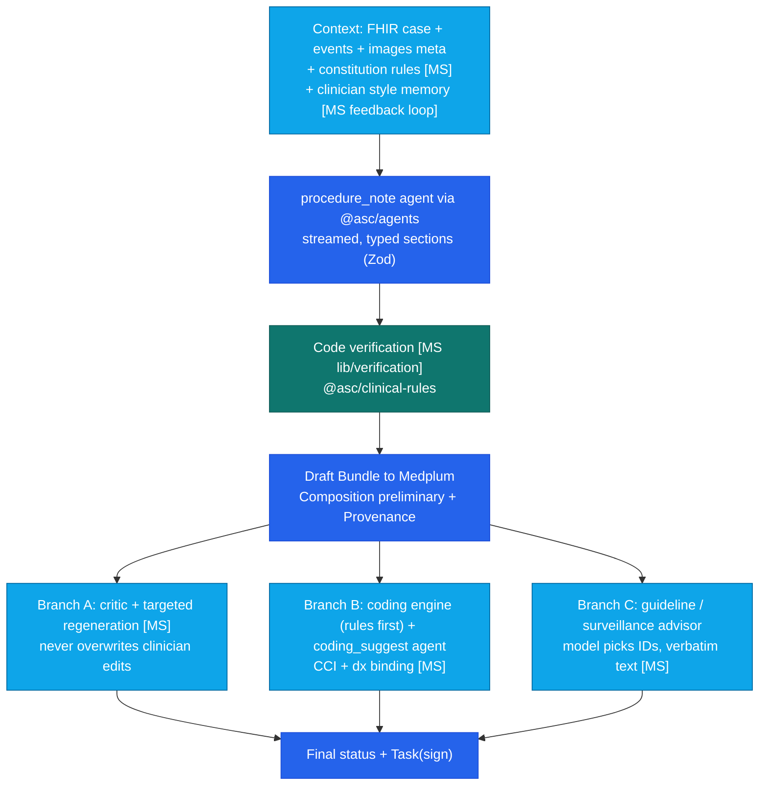
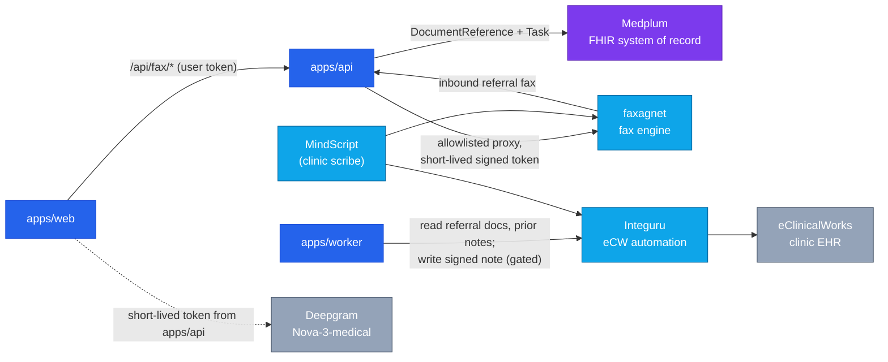

# 06 — MindScript Integration: Reality Check & Wiring

> **Status:** Working draft v0.1 (2026-09-27).
> **Source:** [MindScript — How It Works](../MindScript-How-It-Works.md) from the MindScript dev team (`Wybit-LLC/MindScript` @ `4468979`, app v1.73.0). The MindScript repo is **not** readable from this repo's tooling, so anything the overview does not state is marked **confirm** and listed in §7.

Docs 01–05 were written before we had a description of MindScript. They assumed MindScript was a reusable set of *UI engines* (calendar, Record engine, Sign Queue, Recovery Queue, fax pipeline). The overview shows something slightly different: MindScript is an **ambulatory AI scribe overlaid on eClinicalWorks**, with a strong AI pipeline and two external services (Integuru for eCW, faxagnet for fax). This doc corrects the earlier assumptions and says how each piece wires into ASC EHR.

---

## 1. What changes, in one screen

| # | Finding | Effect on our plan |
|---|---|---|
| F1 | **Stack is close enough to copy UI.** React + Tailwind + shadcn/ui + TanStack Query + Tiptap, Drizzle + Postgres, Pino. | Q9 (05) mostly answered: UI ports are **copy-and-adapt**, not re-implementations. Adaptation cost: Vite/Wouter → Next.js App Router, shadcn Radix primitives → **Base UI** (repo rule), OpenAPI/Orval client → `@asc/validation` + `@asc/api-client`. |
| F2 | **Backend is not portable as-is.** Express 5, Clerk auth, `setImmediate` in-process jobs, direct Anthropic SDK calls, app-owned clinical tables. | Port *logic*, never the plumbing: Fastify commands, Medplum auth, BullMQ, `@asc/agents` `runAgent`, FHIR resources. |
| F3 | **MindScript "Recovery queue" = cancelled-appointment follow-up**, filled by eCW schedule sync. It is *not* a pathology/result gap engine. | M10 specimen / pathology "Recovery Queue (pathology variant)" is **Build [NEW] on FHIR `Task`**, reusing only the worklist *pattern*. Appendix rows 83/126/127 and 05 Gantt `ms3` re-labelled. |
| F4 | **Sign Queue is not in the overview.** MindScript has sign + lock + pre-sign validation (`GET /encounters/:id/validate`: CCI, low confidence, MDM gap, E&M mismatch). | Treat Sign Queue as **confirm**; plan it as Build on `Task`. Pre-sign validation *is* a strong port (→ `@asc/clinical-rules`). |
| F5 | **"Fax pipeline" is a separate service, faxagnet** (`fax.wybit.io`), with MindScript as its only UI via a server-side proxy (allowlist, 60 s signed service token). Overview shows **inbound** only (inbox, search, attach to eCW). | Wire ASC EHR to faxagnet **as a service**, same proxy pattern. Outbound send (X3 referring letter) is **confirm**; fallback is Medplum eFax bot. faxagnet needs a BAA-covered deployment and a "attach to Medplum" target instead of eCW. |
| F6 | **eCW bridge already exists** (`lib/ecw/*` via Integuru: schedule, chart documents, progress notes, note write-back). | M20 "eCW bridge (Integuru)" moves from Build [NEW] P3 to **Port [MS]**, and a read-only slice (referral docs + prior notes for H&P) becomes a **P1.5/P2 candidate**. |
| F7 | **"Calendar" is the eCW "Today" schedule mirror** (hash-diff sync, SSE push, rows marked removed never deleted). Room × time booking grid is not described. | Calendar grid port = **confirm** (does MindScript have a multi-column resource grid?). Booking, conflicts and block templates stay Build. Sync pattern is a direct port for the eCW bridge. |
| F8 | **GI content exists** — a `gastroenterology` constitution rule set, must-not-miss checks, and a Guideline Advisor with verbatim ACG/AGA text. | Big head start for `@asc/clinical-rules` and agent knowledge — but it is **office-visit** GI (E&M, ambulatory notes), not procedure notes, Paris/BBPS, withdrawal time or ASC facility coding. |
| F9 | **AI pipeline patterns are proven**: draft-first streaming, code-based verification, critic + targeted regeneration, parallel enrichment branches, "model picks IDs, code builds text", LLM-judge eval harness, failure-rate alert. | Adopt as the design of our `procedure_note`, `hp_intake` and `coding_suggest` agents (§4). |
| F10 | **STT is Deepgram Nova-3-medical**, browser streams audio directly with a short-lived token. | Q15 (05) has a candidate. Our 4.5 flow routed STT through the agents gateway — decide (§5.3). BAA with Deepgram = **confirm**. |
| F11 | **Physician feedback loop** (`code_edit`, `note_edit`, `text_feedback`, `style_rule`). | Direct input to the agent-memory proposal (per-clinician style memory) in [memory-skills doc](../agent/memory-skills-and-modern-techniques.md). |

---

## 2. Stack side by side

| Layer | MindScript | ASC EHR | Port implication |
|---|---|---|---|
| Web | React + Vite + Wouter | Next.js App Router | Components copy; routing/data-loading rewritten |
| UI kit | Tailwind + shadcn/ui (primitive lib **confirm**, likely Radix) | Tailwind v4 + shadcn on **Base UI** in `@asc/ui` | Swap primitives when moving into `@asc/ui`; no Radix in the repo |
| Rich text | Tiptap | — | Add Tiptap to `@asc/ui` only (never to `apps/web`) |
| Data fetching | TanStack Query + Orval hooks from `openapi.yaml` | `@asc/api-client` + Medplum React hooks | Hooks re-pointed; request/response Zod → `@asc/validation` |
| API | Express 5, 36 routers | Fastify commands (`apps/api`) | Route *logic* → `services/`; no Express |
| Background work | In-process `setImmediate` + boot reconcilers | BullMQ in `apps/worker` | Pipeline steps become jobs; reconcilers not needed (BullMQ retries) |
| Auth | Clerk + optional MFA | Medplum Auth + Entra SSO, MFA mandatory | Drop Clerk. Shared identity with MindScript = **Q-MS6** |
| Clinical data | 51 app tables in Postgres (Drizzle) | Medplum FHIR R4 | Map tables → resources (§3); only operational data goes to `@asc/db` |
| App data | Same Postgres | `@asc/db` (Drizzle, SQL migrations) | Same ORM — schema helpers portable; we keep drizzle-kit migrations, not direct SQL runbooks |
| LLM | Anthropic SDK direct, Sonnet 4.6 / Haiku 4.5 | `@asc/agents` gateway, BAA routing (`claudeSonnet5`, `claudeHaiku45`) | Every prompt becomes an agent + task; no direct SDK |
| STT | Deepgram Nova-3-medical | none yet | Candidate vendor (F10) |
| Logs / PHI | Pino + PHI redaction, AES-256-GCM on DOB, audit + breach detection | `@asc/logger` / `@asc/audit` / `@asc/telemetry`, Medplum `AuditEvent`, Azure encryption at rest | Compare redaction rules; `breachDetection.ts` rules worth porting to `@asc/audit` alerts |
| Hosting | Replit autoscale (Dockerfile exists for Azure) | Azure AKS | faxagnet/Integuru hosting under BAA = **Q-MS4** |

---

## 3. Component-by-component wiring

**Modes:** **Port** = copy code into an `@asc/*` package and adapt · **Call** = use the running MindScript-family service over the network · **Pattern** = re-implement the proven design · **Skip** = not for ASC.

| MindScript component | Mode | Lands in | Notes |
|---|---|---|---|
| Section editors on `note_section.structuredData` (the "Record engine") | Port | `@asc/ui` (Record components) + `@asc/validation` (section schemas) | Rows render from typed data — same shape as our FHIR draft → Record flow. Re-type sections to GI procedure schema. |
| Sign + lock, pre-sign validation (`/validate`) | Port | `@asc/clinical-rules` (checks) + `apps/api` sign command | Checks run in UI (instant) and API (authoritative). E&M/MDM checks → replace with ASC facility + pro-fee checks. |
| Sign Queue | Pattern (**confirm**) | FHIR `Task` + web worklist | Not in overview. |
| Recovery queue (cancelled appts) | Pattern | FHIR `Task` from Appointment `cancelled`/`noshow` | Reuse for scheduling follow-up; pathology variant is separate new build (F3). |
| Today schedule + `scheduleSync` (hash diff, SSE, never delete) | Port (pattern for eCW bridge) | `apps/worker` job + `@asc/db` snapshot table | Only if we read eCW clinic schedule (e.g. referral pipeline). Our own schedule lives in Medplum `Appointment`. |
| Resource calendar grid | Port (**confirm** exists) | `@asc/ui` | If absent, build on `Appointment`/`Slot`. |
| `lib/pipeline.ts` (draft-first, 3 branches) | Pattern | `apps/worker` job graph + `@asc/agents` | §4 |
| `lib/constitution` (+ `gastroenterology.json`, condition modules) | Port (content) | `@asc/agents` knowledge/skills + `@asc/clinical-rules` | Data files, not code — cheapest reuse. Review for procedure relevance. |
| `lib/verification` | Port | `@asc/clinical-rules` (pure fns) + `@asc/validation` | "Facts trace to transcript", "code maps to dx", "risk score only with inputs" — exactly the §5 validation step in 03. |
| `lib/checks` (must-not-miss) | Port | `@asc/clinical-rules` | Adapt to GI procedure elements (cecal landmarks, BBPS, withdrawal time). |
| Coding: ICD-10 / CPT + CCI, dx→code binding | Port (partial) | `@asc/clinical-rules` coding engine + `coding_suggest` agent | CCI + dx binding carry over. E&M does not apply to ASC facility claims. Screening→diagnostic detection not in overview — **confirm**. |
| Guideline Advisor (model picks snippet IDs, verbatim ACG/AGA text) | Port | `@asc/agents` agent + curated snippets | Ideal for `surveillance_interval` (currently P3) — could move to P2. |
| Chart review + lens engine | Pattern | `hp_intake` pre-procedure context | Facts with sources, conflicts kept visible. Useful for referral packets. |
| Pre-visit prep brief | Pattern | `hp_intake` | "Pending review" label = our draft status. |
| Mid-visit precompute | Pattern | worker job during procedure | Helps hit "AI draft ≤ 60 s" NFR. |
| DDI, risk scores, orders, E&M | Skip for P1 | — | Office-visit features; revisit DDI for med-hold. |
| Evals (LLM judge, graded cases, latency baseline) | Port | `packages/agents/src/testing` + CI eval job | Feeds 05 `pl4` "eval harness". |
| `failureRateAlert.ts` | Pattern | `@asc/telemetry` alert | |
| faxagnet (fax engine) | **Call** | `apps/api` fax proxy route (allowlist, short-lived signed token, no cookies) | Inbound referral fax → Medplum `DocumentReference`; outbound = **confirm**. |
| eCW client via Integuru (`lib/ecw/*`) | Port or **Call** | `apps/worker` integration + `@asc/config` flags | Needed for referral docs / prior notes, and for pushing the signed procedure note back to the clinic chart. |
| Note write-back (`ECW_NOTE_WRITEBACK`, once per encounter) | Port | worker job after sign | Idempotent "pushed once" table → `@asc/db`. |
| Demo mode | Pattern | staging synthetic data | Matches environments ADR. |
| `dependencyCheck.ts`, `/health/detailed` | Port | `apps/api` + `@asc/config` `parseEnv()` | Fail-loud boot. |
| Deepgram short-lived token route | Port | `apps/api` route | §5.3 |
| Mobile (Expo) | Skip | — | ASC uses tablets on the web app. |
| RCM (Stedi, off), patient create/edit (off) | Skip | — | Out of P1 scope. |

---

## 4. AI pipeline: MindScript design applied to `procedure_note`

Each box is a BullMQ job (not `setImmediate`); each LLM call is a `runAgent` call with `containsPhi: true` (see [AI agents guide](../agent/ai-agents-guide.md)). Draft-first is what makes "AI draft ≤ 60 s" achievable: the clinician sees the note while coding and critic still run.

---

## 5. How the systems wire together

### 5.1 Target wiring

- **No shared database.** ASC EHR never reads MindScript's Postgres; MindScript never reads Medplum. Integration is over faxagnet, Integuru/eCW and (later) FHIR.
- **Patient identity:** store the eCW patient ID on `Patient.identifier` (system `urn:wybit:ecw:<practice>`), mirroring MindScript's `(practice_id, external_id)` unique key, so both products resolve the same person.
- **Service auth:** same pattern as MindScript → faxagnet: our API holds the credential, signs a short-lived token, allowlists paths, never forwards user cookies. Secrets via Key Vault / `parseEnv()`.

### 5.2 Request-path additions (extends 03 §2 table)

| Operation | Path |
|---|---|
| Work inbound referral fax | `web → apps/api fax proxy → faxagnet`; attach → `DocumentReference` in Medplum + `Task` (referral intake) |
| Send referring letter (X3) | `worker → faxagnet outbound` if supported, else Medplum eFax bot |
| Pull eCW referral docs / prior notes for H&P | `worker → Integuru` (system credential, per-practice), results stored as `DocumentReference` |
| Push signed procedure note to clinic chart | `worker → Integuru` after sign, once, behind a feature flag in `@asc/config` |

### 5.3 Speech-to-text decision

| Option | Pro | Con |
|---|---|---|
| Browser → Deepgram direct with short-lived token (MindScript) | Proven, lowest latency, no audio through our servers | Audio path outside `@asc/agents`; needs its own BAA + audit event on token issue |
| Audio → `apps/api` → STT via gateway (our 4.5 flow) | Single egress, uniform audit | More infra, more latency |

**Recommendation:** use the MindScript pattern (proven in production), issue tokens from `apps/api` with an `@asc/audit` event, and record the Deepgram BAA in the provider catalog. Needs an ADR once confirmed.

---

## 6. Porting rules (checklist per ported module)

1. Code lands in an `@asc/*` package first; `apps/*` only wire it ([architecture rules](../agent/architecture.md)).
2. Remove Clerk, `setImmediate`, Express types, direct `@anthropic-ai/sdk` imports; LLM calls become agents.
3. Replace Radix-based shadcn primitives with Base UI equivalents.
4. MindScript tables become FHIR resources unless the data is operational (sync snapshots, write-back ledger, feedback edits) → `@asc/db`.
5. Constitution / guideline content: re-review for ASC procedure use; no real patient data in examples ([phi-review](../../.claude/skills/phi-review)).
6. Keep MindScript's "model picks IDs, code builds text" wherever the output is shown verbatim to clinicians.
7. Record the source commit in the PR (`Wybit-LLC/MindScript@<sha>`) so later MindScript fixes can be pulled.

---

## 7. Open questions for the MindScript team

| ID | Question | Blocks |
|---|---|---|
| Q-MS1 | Can ASC EHR engineers read / copy `Wybit-LLC/MindScript`? (our GitHub tooling gets 404) | All ports |
| Q-MS2 | Does a **Sign Queue** (unsigned-chart worklist) exist? Where? | M12-7 |
| Q-MS3 | Does a **multi-column resource calendar** exist, or only the eCW Today list? | M01 port size |
| Q-MS4 | faxagnet: outbound send supported? hosting + BAA? can it attach to a non-eCW target (webhook / API)? multi-tenant per practice? | X3, M17, referral intake |
| Q-MS5 | Integuru: BAA, rate limits, which eCW actions are allowed for a second product? | eCW bridge |
| Q-MS6 | Will the same clinicians use both products? Shared SSO (Clerk ↔ Entra/Medplum) or separate logins? | M12 identity |
| Q-MS7 | Deepgram BAA in place? Reusable account/contract for ASC? | STT (05 Q15) |
| Q-MS8 | Is screening→diagnostic detection implemented (overview does not mention it)? | M09 |
| Q-MS9 | Which shadcn primitive layer (Radix vs Base UI) and Tailwind version? | UI port effort |
| Q-MS10 | Licence of verbatim ACG/AGA guideline text — does it extend to a second product? | Guideline Advisor port |

---

## 8. Docs updated from this review

| Doc | Change |
|---|---|
| [README](README.md) | Added this doc to reading order; reuse box corrected |
| [02 matrix](02-build-reuse-matrix.md) | Caveat rewritten with confirmed stack; M09/M10/M12/M18–22 MindScript column corrected; fax + eCW rows |
| [03 architecture](03-target-architecture.md) | System context + containers show faxagnet, Integuru/eCW, STT; request-path rows; `Patient.identifier` for eCW ID |
| [05 delivery plan](05-delivery-plan.md) | Gantt `ms3` re-labelled; Q9/Q15 updated; Q-MS link |
| [01 requirements](01-requirements.md) | M10-3, M12-7, X3 source notes |
| [Appendix](appendix-feature-traceability.md) | Recovery Queue pathology rows → Build on Task; Sign Queue flagged; eCW bridge → Port |
