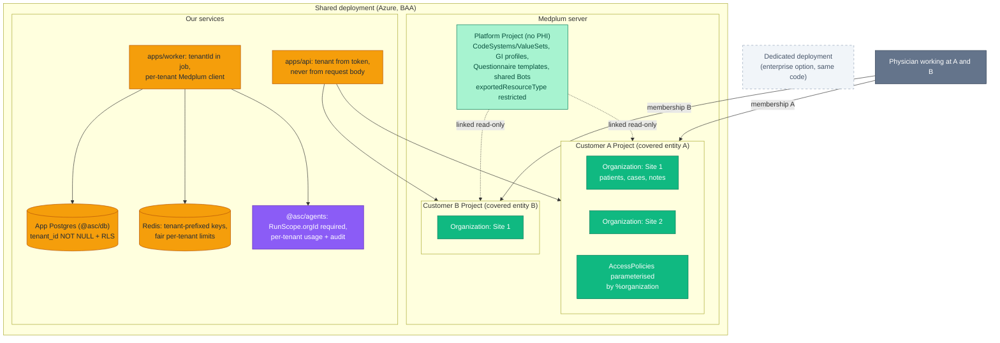

# 07 — Multi-Tenancy Design

> **Status:** draft for engineering review (2026-09-26). Needs an ADR before implementation (§8).
> **Read with:** [06 Medplum adoption](06-medplum-adoption-and-build-plan.md), [03 Target architecture](03-target-architecture.md), [Compliance & PHI](../COMPLIANCE_AND_PHI.md).
> **Sources:** Medplum docs in source (`access/projects.md`, `access/multi-tenant-access-policy.md`, `access/tenant-selector.mdx`), this repo after PR #6.

---

## 1. TL;DR

- There are **two different "tenants"** and we need both:
  1. **Customer tenant** = one legal entity / HIPAA covered entity (an ASC business, e.g. "Gastro Center LLC"). Its data must *never* be visible to another customer. → **Medplum `Project` per customer** (hard isolation).
  2. **Site** = a facility/location inside one customer (multi-site expansion, spec M22). Staff may work across sites. → **`Organization` compartments inside the customer's Project** (Medplum multi-tenant access policies).
- **Shared, non-PHI content** (terminology, GI profiles, Questionnaire templates, Bots) lives in one **platform Project linked read-only** into every customer Project (`exportedResourceType` set).
- **Our own stack must carry the tenant everywhere** — today it mostly doesn't (§5). The fix is cheap now and very expensive after go-live: `tenantId` becomes required in job data, run records, audit, context scope, telemetry and cost tracking; Postgres gets row-level security.
- **Go-live has one customer**, but we build **tenant-ready from day one** (one Project, one Organization), so customer #2 is configuration, not a migration.
- A **dedicated deployment** (own Medplum + DB) is a premium option for customers who contractually require it — same code, different infra.

---

## 2. Tenancy options compared

| Option | Isolation | Ops cost | Cross-tenant users | Fit |
|---|---|---|---|---|
| **A. Deployment per customer** (own AKS namespace, Medplum, Postgres) | Strongest (infra) | High × N | Separate logins per deployment | Enterprise add-on only |
| **B. Medplum Project per customer** on a shared deployment | Hard data boundary: resources in one Project cannot reference another; separate user admin, settings, secrets | Low | One user, multiple `ProjectMembership`s (tenant selector) | ✅ **Default for customers** |
| **C. One Project, `Organization` compartments** | Policy-enforced (AccessPolicy + `meta.accounts`) — a policy bug can leak | Lowest | Natural (membership lists multiple orgs) | ✅ **Sites within one customer** only |
| D. Tenant column in our own schema only | Application-enforced | Low | — | ❌ Medplum is our clinical store; not applicable |

**Why B for customers, not C:** different customers are different covered entities with separate BAAs, retention rules, accreditation and admins. A missing compartment rule in C leaks PHI across legal entities; in B the boundary is structural. C is right *within* a customer, where staff legitimately share patients across sites.

---

## 3. Target model

Colour key: 🟩 Medplum (tenant data) · light green = shared platform Project (no PHI) · 🟪 already built (needs tenant hardening) · 🟧 new/changed for tenancy · dashed = optional.

---

## 4. Layer-by-layer rules

| Layer | Rule | Mechanism |
|---|---|---|
| **Identity** | A user may belong to several customers; each session is bound to **one** active tenant | `ProjectMembership` per Project; Medplum tenant selector; Entra ID SSO per customer or one IdP with per-customer groups |
| **Tenant resolution** | The active tenant comes from the **authenticated token/membership** only — never from a request body, query param or job payload chosen by a client | API middleware derives `tenantId` (Project id) + allowed `orgIds` from the Medplum token |
| **Clinical data** | All PHI in the customer's Project; site via `meta.accounts` compartments | `$set-accounts` on Patient (propagates to patient-related resources); AccessPolicy per role parameterised by `%organization` |
| **Shared content** | Terminology, profiles, Questionnaire templates, generic Bots in the platform Project; **no PHI** there | Project linking, `exportedResourceType` restricted |
| **Per-tenant config** | Secrets, SMTP, bot secrets, feature flags per customer | Medplum Project settings/secrets; our config keyed by tenant |
| **Bots** | Tenant-specific bots deployed per Project; shared bots via platform link; a bot only ever uses its own Project's credentials | Medplum Bots + per-Project client credentials |
| **Service access (worker, bots, agents)** | One **scoped client per tenant** (ClientApplication in that Project with a narrow AccessPolicy) — no cross-tenant super-admin tokens at runtime | Key Vault secret per tenant; client factory in `@asc/api-client` takes `tenantId` |
| **App DB (`@asc/db`)** | Every table has `tenant_id NOT NULL`; **Postgres Row-Level Security** keyed on a per-transaction setting | `SET LOCAL app.tenant_id = …` in a db wrapper; RLS policies; migration adds column + policies |
| **Queues / Redis** | Job data carries `tenantId`; keys prefixed; rate limits and concurrency fair per tenant (one busy customer can't starve others) | `@asc/validation` job contract; BullMQ group/rate-limit keys per tenant |
| **Blob / files** | Medplum `Binary` stays inside the Project; any app-level files in a per-tenant container/prefix | Medplum storage; Azure Blob container per tenant |
| **AI agents** | `tenantId` + `orgId` required in `RunScope`; `isSameRunOwner` already compares org; context providers read with that tenant's scoped client; token usage + cost attributed per tenant | `@asc/agents` context/run-state; audit + telemetry attributes |
| **Audit** | Every event has `organizationId` (tenant) — required, not optional | `@asc/audit`; Medplum `AuditEvent` is already per Project |
| **Telemetry / logs** | `tenant.id` attribute on spans/logs (an id, not PHI) for per-tenant SLOs and cost | `@asc/telemetry`, `@asc/logger` |
| **Backup / export / offboarding** | Per-tenant export and deletion must be possible | Medplum Project export / bulk FHIR export; app DB delete by `tenant_id`; documented runbook |
| **Terminology licences** | CPT (AMA) licensing may be per customer or per platform | Confirm (Q8) before loading CPT into the shared Project |

---

## 5. Gaps in the current code (after PR #6)

| Where | Today | Change |
|---|---|---|
| `packages/validation/src/jobs.ts` | Job data: `correlationId`, `actorId`, `patientId`, `surgicalCaseId` — **no tenant** | Add required `tenantId` (+ `orgId` for site); worker rejects jobs without it |
| `packages/db/src/schema/agent-runs.ts` | `org_id` nullable, no RLS | Add `tenant_id NOT NULL` (+ `org_id`), RLS policies, index `(tenant_id, status, started_at)` |
| `packages/agents/src/context/types.ts` `RunScope` | `orgId` required but no tenant | Add required `tenantId`; include it in `isSameRunOwner` and the Postgres `begin` owner check |
| `packages/agents/src/agents/run.ts` | Audit `organizationId` not passed; `orgId` only from context | Require `tenantId` in `RunAgentOptions`; always set audit `organizationId`; tag usage by tenant |
| `packages/audit/src/index.ts` | `organizationId?` optional | Make required for PHI-touching actions (or all) |
| `packages/config/src/queues.ts` / worker | Queue limits are global | Per-tenant rate-limit key / fairness |
| `@asc/api-client` (planned) | No Medplum client factory yet | Factory takes `tenantId` → that Project's scoped credentials |
| `@asc/telemetry` / `@asc/logger` | No tenant attribute | Add `tenant.id` context propagation |

All of these are small today because there is almost no data and only one agent. They are the migration we avoid later.

---

## 6. Phasing

| When | Do |
|---|---|
| **Now (foundation sprint)** | Tenant fields in code (§5); RLS in `@asc/db`; platform Project + one customer Project in local Medplum seed; tenant resolution middleware skeleton; tests proving cross-tenant access fails |
| **Go-live (1 customer)** | One customer Project, one or more site Organizations, production AccessPolicies |
| **Customer #2** | New Project + link platform Project + per-tenant secrets/clients — config and runbook, no code change |
| **Multi-site (M22)** | More `Organization`s + membership parameters inside a customer Project |
| **Enterprise** | Dedicated deployment from the same Helm/Terraform |

---

## 7. Tests that must exist (security gate)

- User with membership in A cannot read/search/reference any B resource (Medplum Project boundary) — integration test against local Medplum.
- Site-1-only nurse cannot read a Site-2 patient in the same customer (compartment policy).
- Worker job with `tenantId` A cannot load context for a patient in B (scoped client + scope assertion).
- `agent_runs` RLS: a session set to tenant A sees zero rows of tenant B; `begin` never claims another tenant's run.
- Queue fairness: tenant A backlog does not delay tenant B interactive jobs beyond the limit.
- Linked platform Project exposes only `exportedResourceType` types; no PHI resource types present.

---

## 8. Decisions and questions

| # | Decision / question | Recommendation | Owner |
|---|---|---|---|
| T1 | Customer isolation model | Project per customer (B); compartments only for sites (C) | Eng lead → ADR |
| T2 | Is Wybit a multi-customer SaaS, or single-ASC first with SaaS later? | Build tenant-ready either way (§6) | Business |
| T3 | Identity: one Entra tenant with per-customer groups, or customer's own IdP per Project? | Support external IdP per Project; start with ours | Eng + customer IT |
| T4 | Physicians working at several customers | Separate memberships + tenant selector; no cross-customer views | Physicians / compliance |
| T5 | App DB isolation: RLS on shared tables vs schema-per-tenant | RLS (simpler ops, enforced in DB) | Eng |
| T6 | CPT/terminology licence scope (per platform vs per customer) | Confirm with AMA/UMLS | Business |
| T7 | Per-tenant BAA & data residency with LLM providers (one account vs per-customer) | One platform BAA per provider, tenant tagged in audit/usage | Compliance |
| T8 | Backup/restore and offboarding SLAs per tenant | Runbook with Medplum Project export + app DB tenant delete | Ops |

---

## Sources

- Medplum Projects & project linking: `packages/docs/docs/access/projects.md` — https://www.medplum.com/docs/access/projects
- Medplum multi-tenant access control: `packages/docs/docs/access/multi-tenant-access-policy.md` — https://www.medplum.com/docs/access/multi-tenant-access-policy
- Medplum tenant selector: https://www.medplum.com/docs/access/tenant-selector
- Medplum MSO example: `examples/medplum-mso-demo`
