# 08 — Identity, Access Control and Tenancy (Architecture)

> **Status:** Proposed architecture (amended 2026-10-05); becomes accepted with the ADR ratification.
> **Scope:** A modular identity, RBAC and facility-authorization core for the first hospital / ASC customer. Not "complete auth": follow-ups (step-up, SSO, break-glass, worker and stream auth) start at the gates listed in [P05 §6](../plan/phases/P05-auth-roles.md#6-gated-follow-ups-not-in-p05-start-no-later-than-the-gate).
> **Tenancy Model:** Contracts and data are **tenant-ready** (`tenant_id`, `facility_id`, `meta.accounts`, `TenantResolver` port); one tenant runs. Multi-tenant routing, registry, provisioner and cross-tenant suites wait for Customer #2: [`future-multi-tenancy-architecture.md`](future-multi-tenancy-architecture.md). Sections below that describe several tenants (§4.2, §9, §11) are the target design for that stage.
> **Implementation Plan:** [`P05 — Auth & Roles`](../plan/phases/P05-auth-roles.md), sub-phases P05a–P05j.
> **Hosting:** Medplum runs **self-hosted from its open-source code** (upstream `medplum/medplum-server` Docker images) in our Azure subscription, with the hardening settings in P05h. The Medplum-hosted service is not used.
> **Decision record:** [ADR — Medplum as identity and access platform](../decisions/2026-10-03-medplum-as-identity-and-access-platform.md) (proposed).
> **Related:** [03 Target architecture §6 security](03-target-architecture.md) · [COMPLIANCE_AND_PHI](../COMPLIANCE_AND_PHI.md) · `LEARNING_MISTAKES.md` LM-004 (no tokens in browser storage).

**Summary.** **Medplum** handles identity and data authorization, eliminating the need for Better Auth or Clerk.

- **Hospital & Sites.** The hospital customer is a **Medplum Project**. Physical sites/rooms are **`Organization`** resources inside that Project.
- **Roles are data.** A role is a *role template* in `@asc/authz`. It contains capabilities and compiles to a parameterized `AccessPolicy` (`%facility`) that Medplum enforces on every FHIR read/write.
- **Code never checks role names.** It only asks `can(principal, "note.sign", { facilityId })`. Adding or modifying roles is a configuration update, not a code rewrite.
- **Tenant-Ready Data Layer:** App Postgres tables include `tenant_id uuid NOT NULL` and `facility_id text NULL` with Postgres RLS via `withTenant()`. FHIR resources attach `meta.accounts` pointing to the facility `Organization`.
- **Ports:** `IdentityPort` (Medplum adapter) and `TenantResolver` (static adapter now, host-based later) keep providers and tenancy swappable.
- **Deferred on purpose:** subdomain routing, tenant registry and multi-tenant provisioner wait for Customer #2.

Work that **does not need Medplum** can start now (P05a–P05g in §13). P05h–P05j wait for P02/P04.

**Interactive diagrams** (standalone HTML with zoom, path tracing, light/dark themes and export; open locally in a browser). They are built with Archify, and the JSON source sits next to each HTML file:

| Diagram | Type | File |
|---|---|---|
| Identity, access and tenancy big picture (§3) | architecture | [iam-big-picture.html](diagrams/iam/iam-big-picture.html) |
| Staff sign-in with tenant, SSO/MFA and token handler (§5.1) | sequence | [staff-sign-in.html](diagrams/iam/staff-sign-in.html) |
| One API command through the five gates (§6) | sequence | [api-authorization-gates.html](diagrams/iam/api-authorization-gates.html) |
| Adding or changing a role (§8) | workflow | [add-or-change-role.html](diagrams/iam/add-or-change-role.html) |
| Break-glass access (§12.1) | lifecycle | [break-glass-access.html](diagrams/iam/break-glass-access.html) |

---

## Contents

1. [Goals and non-goals](#1-goals-and-non-goals)
2. [Decision: Medplum vs Better Auth vs Clerk](#2-decision-medplum-vs-better-auth-vs-clerk)
3. [Big picture](#3-big-picture)
4. [Tenancy model](#4-tenancy-model)
5. [Authentication](#5-authentication)
6. [Authorization: the five gates](#6-authorization-the-five-gates)
7. [RBAC model: capabilities, role templates, policies](#7-rbac-model-capabilities-role-templates-policies)
8. [Adding or changing a role](#8-adding-or-changing-a-role)
9. [Machine identities: API, worker, Bots](#9-machine-identities-api-worker-bots)
10. [Realtime: SSE and WebSocket security](#10-realtime-sse-and-websocket-security)
11. [External services: MindScript, faxagnet, Integuru, webhooks](#11-external-services-mindscript-faxagnet-integuru-webhooks)
12. [Break-glass, support access, audit](#12-break-glass-support-access-audit)
13. [Implementation plan](#13-implementation-plan)
14. [Spikes to run before building](#14-spikes-to-run-before-building)
15. [Open questions](#15-open-questions)

---

## 1. Goals and non-goals

**Goals**

| # | Goal | How this design meets it |
|---|---|---|
| G1 | One deployment serves many hospitals and ASCs | Project per tenant, subdomain routing, tenant registry (§4) |
| G2 | Hard isolation between tenants, defence in depth | Medplum Project boundary, plus app-DB row-level security (RLS), plus tenant-scoped keys, queues and streams (§4.4) |
| G3 | Sites inside a tenant can be scoped | `Organization` per facility, `%facility` policy parameter (§4.3) |
| G4 | New roles without code changes | Role templates = data; code checks capabilities (§7, §8) |
| G5 | Workflow can change later | Workflow guards consume capabilities; authz does not encode phases (§7.5) |
| G6 | Hospitals bring their own SSO | Medplum `DomainConfiguration` per email domain (§5.3) |
| G7 | Every service-to-service hop is authenticated and least-privilege | Per-tenant client apps, signed short-lived JWTs, HMAC-signed webhooks (§9, §11) |
| G8 | HIPAA audit for every access | Medplum `AuditEvent` + `@asc/audit` with tenant, facility and actor fields (§12) |

**Non-goals (for now):** a dedicated deployment per tenant (supported later as a *silo* option, §4.2), ABAC beyond facility and patient compartments, cross-tenant patient sharing (HIE), and our own IdP UI.

---

## 2. Decision: Medplum vs Better Auth vs Clerk

### 2.1 Options compared

| Criterion | **Medplum Auth** (chosen) | Better Auth (OSS library) | Clerk (SaaS) | Keycloak (OSS IdP) |
|---|---|---|---|---|
| Where identities live | Medplum Postgres, inside our Azure tenant | Our Postgres | Clerk's cloud | Our Keycloak cluster |
| Enforces **data-level** authz on FHIR | **Yes**: `AccessPolicy` on every read and write | No, needs a bridge to Medplum | No, needs a bridge | No, needs a bridge |
| Identity stores to keep in sync with Medplum | **0** | 1 (users ↔ ProjectMembership) | 1 | 1 |
| BAA | **None needed**: self-hosted from open source in our Azure (the Azure BAA covers it) | None needed (self-host) | Must be confirmed with Clerk | None needed |
| MFA | TOTP built in | 2FA plugin | Yes | Yes |
| SSO / federation | Per-domain external IdP via `DomainConfiguration` (Okta documented; Entra via OIDC, to verify in S2) | SSO plugin | Yes (enterprise plans) | Yes, very mature |
| Multi-tenant primitive | **Project** (hard FHIR boundary) | Organization plugin (app level only) | Organizations | Realms |
| Patient (portal) identity | Same system, `Patient` profile | Separate wiring | Separate wiring | Separate wiring |
| Built for healthcare | Yes (SMART-on-FHIR, AuditEvent) | No | No | No |
| Ops cost | Already running Medplum (self-hosted for the FHIR store anyway) | Low | None | High (Java cluster) |
| Lock-in | Open source (Apache-2.0); FHIR-standard data | Low | High | Low |

### 2.2 Why Medplum

1. **One policy decision point for PHI.** The rule "front desk cannot read the procedure note" lives in Medplum and holds even if our UI or API has a bug. With Better Auth or Clerk the rule lives in our code, and every Medplum call would run as a super-user, which is the riskier HIPAA posture.
2. **No identity sync.** Every other option needs a user to exist twice, once in the IdP and once as a Medplum `ProjectMembership`. Deprovisioning drift ("disabled in Clerk, still active in Medplum") is a classic audit finding.
3. **Tenancy comes free.** A Medplum Project is "a hard boundary between FHIR resources", and a user "can be a member of one, or multiple Projects, with different privileges in each" ([Medplum docs: Projects](https://www.medplum.com/docs/access/projects)). That is exactly the hospital-per-tenant model.
4. **Hospital SSO is still possible.** Medplum federates to the hospital's own IdP by email domain, so SSO does not force a separate IdP product.
5. **Battle-tested open source we run ourselves.** Medplum is Apache-2.0. We run its published server images in our own Azure subscription, so there is no vendor contract, no per-user pricing, and PHI never leaves our tenant. Login, MFA, OAuth, password storage and policy enforcement come from code used in production by other healthcare products, instead of code we would have to write and harden.
6. **Login UI stays ours.** `@medplum/core` exposes the login API (`startLogin` → MFA → `processCode`), so `apps/web` renders a branded login with `@asc/ui`. `@medplum/react` stays banned (D2).

### 2.3 What would make us revisit

- Medplum's login lacks a capability a hospital insists on that federation cannot provide (for example passkeys without an external IdP). Response: federate to Entra or Okta; we would **not** switch the IdP of record.
- We move off Medplum as the data platform. That is a **re-platform, not an adapter swap**: Medplum also provides the FHIR store, AccessPolicy enforcement (gate 5), `AuditEvent`, Subscriptions and Bots, and all of those would need replacing under a new ADR. `IdentityPort` only keeps the *identity provider* replaceable.

**Identity-provider flexibility rule.** An enterprise IdP (Entra, Okta, Google) is added by **federating into Medplum** (`DomainConfiguration`), so Medplum still issues the user's token and checks its AccessPolicy on every FHIR call. We never let an external IdP's token replace the Medplum user token for FHIR access, and we never call Medplum with a service account on a user's behalf: either would remove gate 5. The long-term boundary is `IdP (federated) → Medplum token → app authorization (gates 1–4) → Medplum AccessPolicy (gate 5) → FHIR`.

**Compliance is ours to operate.** Self-hosting in Azure under a BAA covers infrastructure obligations only. It does not make the system HIPAA- or SOC 2-compliant, and Medplum's own attestations cover its hosted service, not our deployment. We still own access reviews, audit retention and review, incident response, backup/restore tests, vulnerability management and workforce policies (tracked in P26).

### 2.4 How we run Medplum (self-hosted from open source)

We take Medplum's code as released and run it ourselves. **We do not fork it.** A fork would make every upstream security fix a merge job. We change Medplum's behaviour only through configuration, AccessPolicies, Bots and its APIs.

| Part | What we take from Medplum (no code to write) | What we own |
|---|---|---|
| Server | `medplum/medplum-server` image, pinned to 5.1.42 (same version as `@medplum/*` packages) | Upgrades through staging, CVE patching cadence |
| Database, cache | Medplum's schema and migrations | Azure Postgres Flexible (PITR backups) and Redis; restore tests |
| Auth | OAuth2/OIDC server, PKCE, password hashing, TOTP MFA, account lockout, token issuing and refresh, `DomainConfiguration` SSO | Choosing settings (token lifetime, MFA required), email sender config |
| Authorization | AccessPolicy engine on every FHIR call, `ProjectMembership`, Projects | Policy *content* (generated by our compiler, §7) |
| Audit | `AuditEvent` on every FHIR access | Retention and export for compliance |
| Realtime, events | WebSocket subscriptions, signed rest-hooks, Bots runtime | Hook receivers and Bot code |
| Admin | Medplum App (super-admin and tenant admin console in P1) | Who holds super-admin; keep it off the internet (private endpoint or IP allowlist) |
| Infra | Medplum's Azure Terraform guide | Our Terraform in `infra/` (P06) |

Self-host duties to staff explicitly:

- **Upgrade cadence:** review Medplum releases monthly; take security releases within 7 days via staging.
- **Super-admin credential:** stored in Key Vault, used only by the provisioning pipeline, MFA on, access audited.
- **Email:** Medplum needs an email sender for invites, password resets and patient magic links (Q-IAM-9).
- **Backups:** Postgres point-in-time restore plus Blob versioning, meeting RPO 15 min / RTO 4 h (M12), with a quarterly restore test.

---

## 3. Big picture

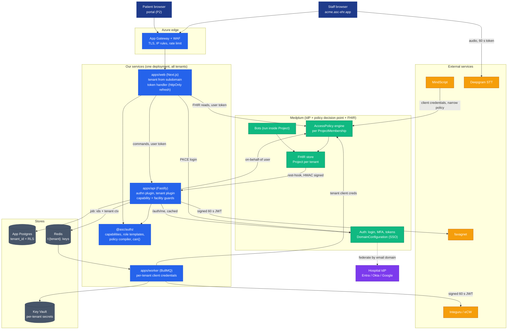

**Reading it:** Medplum is the only system that knows who a user is and which rows they may touch. Our services add three things on top: *which tenant* (from the subdomain), *which action* (capabilities), and *which workflow state* (clinical rules). Every arrow carries a credential scoped to one tenant.

---

## 4. Tenancy model

> **Phase 1 runs one tenant.** `StaticTenantResolver` returns the configured hospital (tenant id + Medplum Project id); there is no registry, no subdomain routing and no provisioner yet. Facility scoping (§4.3) and data isolation columns + RLS (§4.4) **are** built in Phase 1. Host routing (§4.2), the registry and multi-project provisioning are the Customer #2 target, with steps in [future-multi-tenancy-architecture.md](future-multi-tenancy-architecture.md).

### 4.1 Hierarchy

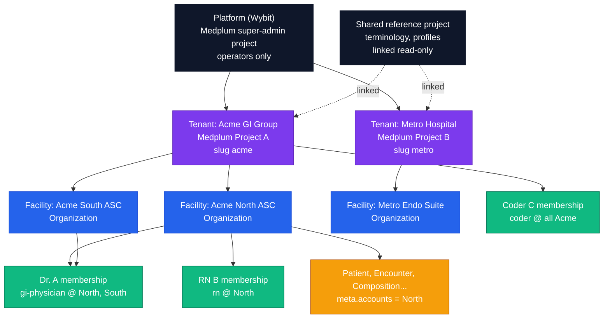

| Level | Medplum primitive | Our identifier | Boundary strength |
|---|---|---|---|
| Platform | Super-admin Project | — | Operators only; never used by app code |
| **Tenant** (customer, BAA holder) | `Project` | `tenantId` (UUID in tenant registry) ↔ `medplumProjectId` | **Hard**: resources cannot reference across Projects |
| **Facility** (site) | `Organization` + compartment (`meta.accounts`) | `facilityId` = Organization id | Policy-enforced via `%facility` parameter |
| User | `User` (project-scoped) + `ProjectMembership` | `membershipId` | One membership per tenant |
| Shared reference data | Linked Project | — | Read-only into every tenant |

**Rules**

1. **Tenant = BAA holder.** One customer contract means one Project. Never put two customers in one Project, even if they are small.
2. **Clinicians are project-scoped users.** A clinician working at two customers has two accounts. Each hospital controls its own users, and offboarding at one never affects the other. Server-scoped users are for Wybit operators only.
3. **Every clinical resource carries its facility in `meta.accounts`.** `@asc/fhir` builders set this (P03 acceptance), so facility scoping is a policy change, not a migration.
4. **Terminology and profiles are shared** through a linked read-only Project, so we load CPT, ICD and FSH profiles once.

### 4.2 Deployment topology: one deployment, many tenants

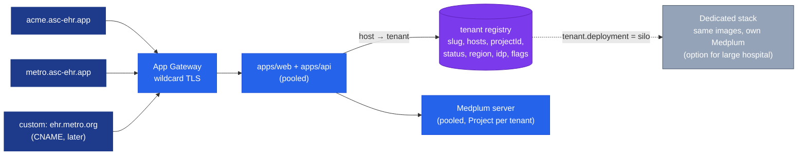

- **Pooled by default.** A new hospital means a new registry row, a new Project, and its policies and clients. There is no new deployment and no code change.
- **Tenant resolution is by host.** Web middleware and the API tenant plugin both look the host up in the registry (cached). Unknown hosts get a 404, not a login page.
- **The token must match the host.** After login, the API rejects a token whose Medplum `project.id` differs from the tenant resolved from the host. This stops a valid token for `acme` from being used on `metro`.
- **Silo option.** `tenant.deployment = "silo"` routes to a dedicated stack built from the same images. Use it for data residency or a contract demand. Code is identical, so silo is only a deployment choice.

### 4.3 Facility scoping inside a tenant

Medplum supports *parameterized* policies. A `ProjectMembership.access` entry binds a policy to parameters, and multiple entries combine as a **union** ([Medplum docs: Access Policies](https://www.medplum.com/docs/access/access-policies)):

```json
{
  "resourceType": "ProjectMembership",
  "access": [
    { "policy": { "reference": "AccessPolicy/rn-v3" },
      "parameter": [{ "name": "facility", "valueReference": { "reference": "Organization/acme-north" } }] },
    { "policy": { "reference": "AccessPolicy/rn-v3" },
      "parameter": [{ "name": "facility", "valueReference": { "reference": "Organization/acme-south" } }] }
  ]
}
```

A user working at two sites gets two entries for the same role. "All sites" roles (a coder for the whole group) get a policy without a `%facility` criterion.

### 4.4 Isolation in every store, not just Medplum

| Store / channel | Tenant isolation | Facility isolation |
|---|---|---|
| Medplum FHIR | Project boundary | `%facility` criteria |
| App Postgres (`@asc/db`) | `tenant_id NOT NULL` + **Postgres RLS** using `app.tenant_id` set per transaction | `facility_id` column, filtered by the API guard |
| Redis / BullMQ | Key prefix `t:{tenantId}:`; job data carries `{tenantId, facilityId, actor}` (IDs only) | in job data |
| SSE / pub-sub channels | Channel name `t:{tenantId}:case:{caseId}` | checked at subscribe |
| Blob (Medplum `Binary`) | Inside the Project | via resource policy |
| Key Vault | Secret names `tenant-{tenantId}-*` | — |
| Logs / traces | `tenant.id` attribute, no PHI | `facility.id` attribute |
| Rate limits | Key by `tenantId:userId` | — |

App-DB RLS sketch (lives in `@asc/db`):

```sql
ALTER TABLE agent_runs ADD COLUMN tenant_id uuid NOT NULL;
ALTER TABLE agent_runs ENABLE ROW LEVEL SECURITY;
ALTER TABLE agent_runs FORCE ROW LEVEL SECURITY;          -- applies to table owner too
CREATE POLICY tenant_isolation ON agent_runs
  USING (tenant_id = current_setting('app.tenant_id')::uuid)
  WITH CHECK (tenant_id = current_setting('app.tenant_id')::uuid);
-- every request/job: BEGIN; SELECT set_config('app.tenant_id', $1, true); ... COMMIT;
```

`@asc/db` exposes only `withTenant(tenantId, tx => …)`. A raw client without a tenant context is not exported. The runtime DB role is not the table owner, and migrations run as a separate role.

---

## 5. Authentication

### 5.1 Staff sign-in (password + MFA, or hospital SSO)

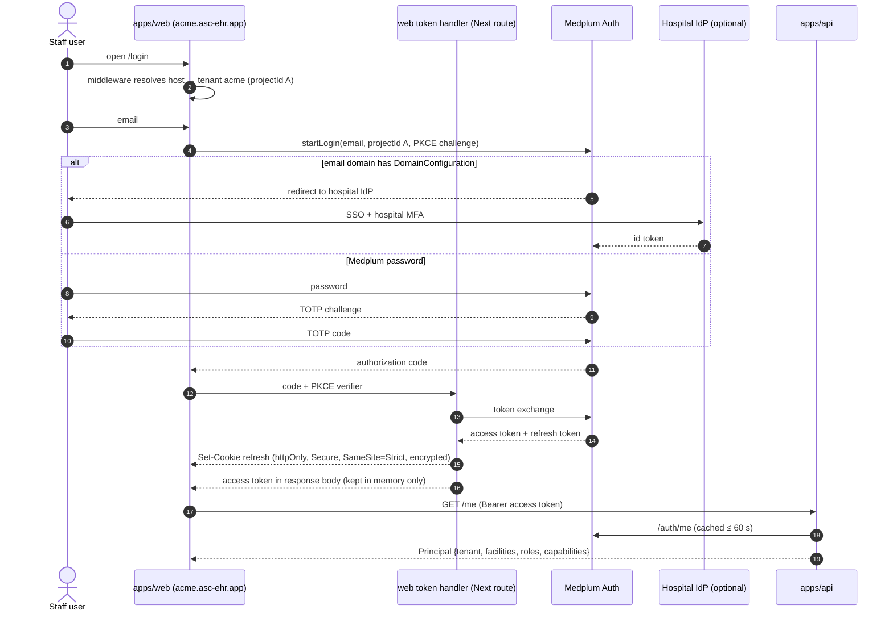

**Token rules** (they follow LM-004)

| Token | Where it lives | Lifetime | Notes |
|---|---|---|---|
| Access token | JS memory only (`MedplumClient` with in-memory storage, not the default `localStorage`) | Short, target 15 min (S1: confirm `ClientApplication` lifetime setting) | Sent as Bearer to Medplum and `apps/api` |
| Refresh token | Encrypted `httpOnly` cookie on the **web** origin, path `/auth` | ≤ 12 h absolute | Only the token-handler route reads it; the API never sees cookies (the CORS ADR stays bearer-only) |
| Medplum login session | Medplum's own | Medplum default | Logout calls Medplum logout + clears cookie + clears query cache |

**Session policy (proposal, M12-3):** 15 min idle (client activity timer, and the token handler refuses refresh after idle), 12 h absolute, logout on browser close for shared workstations (tenant setting).

### 5.2 Step-up for high-risk actions

Signing a note, attesting coding, break-glass and admin changes need a **fresh login** (within 5 min).

1. The API returns `401 step_up_required` with the capability that asked for it.
2. The UI re-runs the login flow with `prompt=login`, which also re-asks MFA.
3. The API checks the new token's issue time (S1: confirm the claim Medplum exposes) and allows the action once.

### 5.3 Hospital SSO (federation per tenant)

- **Mechanism:** Medplum `DomainConfiguration`. Users whose email is on `metro.org` are sent to Metro's IdP. It needs the authorize, token and userinfo URLs plus a client id and secret ([Medplum docs: domain-level IdPs](https://www.medplum.com/docs/auth/domain-level-identity-providers)).
- **Who configures it:** on our self-hosted Medplum, our super-admin creates the `DomainConfiguration` (a seed/ops script for the first hospital; the tenant provisioner once multi-tenancy arrives). No paid plan is involved.
- **Provisioning:**
  - *P1:* invite-only. A tenant admin invites users, which creates a membership with a role and facilities.
  - *Later:* SCIM from the hospital IdP (S2: confirm Medplum SCIM coverage), or just-in-time creation mapped from IdP groups to role templates.
- **MFA:** under SSO the hospital IdP is responsible for MFA, and the tenant registry records `mfa: "idp"`. Without SSO, Medplum TOTP is mandatory for every staff role, including front desk and coder, because all of them see PHI.

### 5.4 Patients (portal, P2)

- Patients are **project-scoped `User`s with a `Patient` profile** in the tenant's Project. Sign-in is a magic link or email/SMS OTP.
- They get one `patient` policy whose criteria use `%profile`, for example `Observation?subject=%profile` and `Composition?subject=%profile&status=final`. A patient sees only their own final documents.
- A patient has **no capabilities** beyond `portal.*`, and the portal is a separate app (`apps/portal`), never `apps/web`.

### 5.5 Identity linking with MindScript

P1 keeps logins separate (Q-MS6). Later both products can federate to the **same hospital IdP**, which gives single sign-on without sharing a user database.

---

## 6. Authorization: the five gates

Every request passes five independent gates. A failure at any gate stops it. Gates 1–4 run in `apps/api` (and the web middleware for gate 1); gate 5 runs in Medplum.

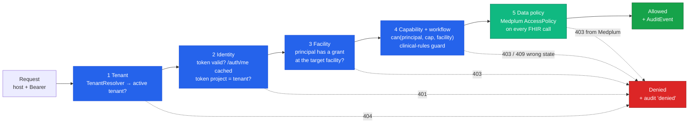

| Gate | Question | Owner | Failure |
|---|---|---|---|
| 1 Tenant | Which active tenant is this request for? | `TenantResolver` port: `StaticTenantResolver` (config) in Phase 1; host-based resolver + web middleware for Customer #2 | 404 (unknown host, multi-tenant only) |
| 2 Identity | Is the token valid, the membership active, and was the token issued for this tenant's Project? | `apps/api` authn plugin → `IdentityPort` (Medplum `/auth/me`) | 401 |
| 3 Facility | Does the principal hold a grant at the target resource's facility? | `apps/api` guard (`@asc/authz`) | 403 |
| 4 Capability + workflow | Does a grant **at that facility** include the capability, and does the case state allow it now? | `@asc/authz` `can(principal, cap, { facilityId })` + `@asc/clinical-rules` | 403 / 409 |
| 5 Data policy | May this membership read or write this resource and field? | **Medplum** `AccessPolicy` | 403 |

Gate 5 is the safety net: even if gates 3–4 had a bug, Medplum would still refuse. Gates 3–4 exist for clear errors, workflow rules and non-FHIR actions such as export and AI generation.

**Authorization freshness (cache policy).** Gate 2 caches the `/auth/me` result to avoid a Medplum call per request. Rules:

| Rule | Detail |
|---|---|
| Cache key and TTL | SHA-256 of the token; TTL ≤ 60 s; never stores the raw token; bounded size |
| High-risk capabilities bypass the cache | Any capability flagged `stepUp` (sign, attest, discharge, `admin.*`, break-glass) re-validates against Medplum on every call |
| Our admin actions invalidate | Every role, facility or membership change made through our tools clears that user's cache entries in the same operation |
| Out-of-band changes invalidate | A Medplum `Subscription` on `ProjectMembership` (and `AccessPolicy`) calls a signed API webhook that clears affected entries, so edits made in the Medplum App are not missed |
| Fail closed | Medplum unreachable → 503; an expired entry is never used as a fallback |
| Worst case documented | Without a delivered invalidation, a revoked user keeps API access (gates 1–4) for at most the TTL; gate 5 behaviour is measured by spike S6 |

### 6.1 API request lifecycle

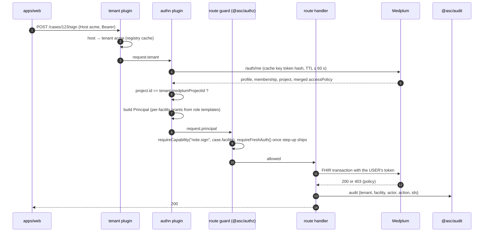

`Principal` (type in `@asc/types`, schema in `@asc/validation`):

```ts
type Grant = {
  scope: { kind: "all" } | { kind: "facility"; facilityId: string }; // Organization id
  roleKeys: RoleKey[];           // display and audit only — never for checks
  capabilities: Capability[];    // what this grant allows at this scope
};

type Principal = {
  kind: "staff" | "patient" | "service" | "agent"; // humans, workers and AI never share a kind
  tenantId: string;              // from TenantResolver
  projectId: string;             // Medplum Project
  membershipId: string;
  profile: { type: "Practitioner" | "Patient" | "ClientApplication"; id: string };
  grants: Grant[];               // the ONLY thing can() reads
  authTime: number;              // for step-up
  onBehalfOf?: { agentExecutionId: string }; // AI runs
};
```

Capabilities are **never flattened across facilities**. `can(p, cap, { facilityId })` is true only if a grant with `scope: all` or with that `facilityId` lists `cap`; `can(p, cap)` without a facility counts only `scope: all` grants. Example: a user who is `rn` at North and `rn` + `clinical-supervisor` at South cannot use supervisor capabilities on a North resource.

---

## 7. RBAC model: capabilities, role templates, policies

### 7.1 Three building blocks

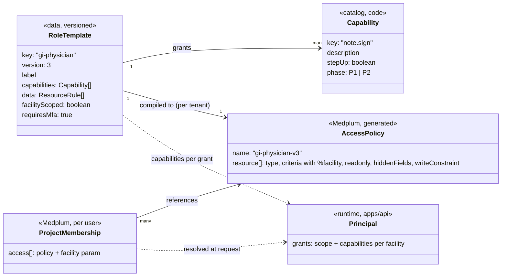

- **Capability:** a verb on a domain, such as `note.sign` or `schedule.manage`. Capabilities are a closed catalog in code, so typos fail typecheck. Each one is small and stable, and new ones are appended, never renamed.
- **Role template:** data that names a role, lists its capabilities, and lists its data rules. It is versioned.
- **AccessPolicy:** *generated* from the template by the **policy compiler**, once per tenant. It is never hand-edited in production.
- **Membership:** binds a user to one or more templates, each with facility parameters.

Code only ever calls `can(principal, "note.sign")`. Role names appear in exactly two places: the templates and the audit trail.

### 7.2 P1 capability catalog (proposal)

| Domain | Capabilities |
|---|---|
| Patient | `patient.read`, `patient.register`, `patient.merge`, `patient.eligibility.check` |
| Schedule | `schedule.read`, `schedule.manage`, `whiteboard.read` |
| Case | `case.read`, `case.advance`, `case.cancel` |
| Pre-procedure | `hp.document`, `medhold.review`, `consent.collect`, `consent.witness` |
| Intra-procedure | `timeout.participate`, `procedure.document`, `specimen.manage`, `image.manage` |
| Anesthesia | `anesthesia.document` |
| Note | `note.draft` (AI), `note.edit`, **`note.sign`** ⓢ, `note.addend` ⓢ |
| Recovery | `pacu.document`, **`discharge.approve`** ⓢ |
| Coding | `coding.review`, **`coding.attest`** ⓢ, `charge.export` |
| Pathology | `pathology.reconcile`, `pathology.letter.send` |
| Referral / fax | `referral.triage`, `fax.send` |
| AI | `ai.generate` (any agent run); per-agent caps are possible later |
| Admin | `admin.users`, `admin.roles`, `admin.facility`, `audit.read`, **`breakglass.invoke`** ⓢ |
| Portal | `portal.self.read`, `portal.self.forms` |

ⓢ = needs step-up (fresh login).

### 7.3 Role template × capability (P1 proposal; merges code, P05 and M12-1 lists)

| Capability group | front-desk | rn | tech | gi-physician | anesthesia | coder | admin | auditor |
|---|---|---|---|---|---|---|---|---|
| patient.read / register | ✔ / ✔ | ✔ / – | ✔ / – | ✔ / – | ✔ / – | ✔ / – | ✔ / ✔ | ✔ / – |
| schedule.manage | ✔ | – | – | – | – | – | ✔ | – |
| case.advance | ✔ (check-in) | ✔ | – | ✔ | ✔ | – | – | – |
| hp.document, medhold.review | – | ✔ | – | ✔ | ✔ | – | – | – |
| consent.collect | ✔ | ✔ | – | ✔ | ✔ | – | – | – |
| procedure.document, specimen.manage | – | ✔ | ✔ | ✔ | – | – | – | – |
| anesthesia.document | – | – | – | – | ✔ | – | – | – |
| note.draft / note.sign | – | – | – | ✔ / ✔ | – / ✔ (anesthesia note) | – | – | – |
| pacu.document / discharge.approve | – | ✔ / ✔ | – | – / ✔ | ✔ / ✔ | – | – | – |
| coding.review / attest / charge.export | – | – | – | ✔ / – / – | – | ✔ / ✔ / ✔ | – | – |
| pathology.reconcile | – | ✔ | – | ✔ | – | – | – | – |
| admin.* | – | – | – | – | – | – | ✔ | – |
| audit.read | – | – | – | – | – | – | ✔ | ✔ |
| breakglass.invoke | – | ✔ | – | ✔ | ✔ | – | – | – |
| Facility-scoped | yes | yes | yes | yes | yes | no (all) | no (all) | no (all) |

CRNA is not a separate role. `anesthesia` plus the practitioner's `qualification` distinguishes MD from CRNA (P05 Q2 default), and a workflow rule can require MD co-sign if the state demands it.

### 7.4 Data rules (what each role sees in Medplum)

| Resource | front-desk | rn / tech | gi-physician | anesthesia | coder | auditor |
|---|---|---|---|---|---|---|
| Patient, Coverage, Appointment | RW | R | R | R | R | R |
| Encounter (case) | RW (status fields only via API) | RW | RW | RW | R | R |
| QuestionnaireResponse (H&P, nursing) | – | RW | RW | RW | R | R |
| Composition (procedure note) | **hidden** | R | RW (`writeConstraint`: no edit once `final`) | R | R | R |
| MedicationAdministration, Observation (AIMS) | – | R | R | RW | R | R |
| ChargeItem | – | – | R | – | RW | R |
| AuditEvent | – | – | – | – | – | R |

Medplum features used: `criteria` with `%facility`, `readonly`, `hiddenFields`, `readonlyFields`, and `writeConstraint` (FHIRPath with `%before`/`%after`). For example, a signed note can never be overwritten: `%before.exists() implies %before.status != 'final'`.

Example compiled policy (gi-physician, v3, one entry shown):

```json
{
  "resourceType": "AccessPolicy",
  "name": "gi-physician-v3",
  "meta": { "tag": [{ "system": "https://asc-ehr.app/role-template", "code": "gi-physician", "version": "3" }] },
  "resource": [
    { "resourceType": "Patient", "criteria": "Patient?_compartment=%facility" },
    { "resourceType": "Composition",
      "criteria": "Composition?_compartment=%facility",
      "writeConstraint": [{ "language": "text/fhirpath",
        "expression": "%before.exists() implies %before.status != 'final'" }] },
    { "resourceType": "ChargeItem", "criteria": "ChargeItem?_compartment=%facility", "readonly": true }
  ]
}
```

(S1 confirms `_compartment=%facility` with `meta.accounts` on Medplum 5.1.42.)

### 7.5 Unknown workflow: how this stays flexible

The clinical workflow (which phase follows which, who may move it) is **not final**. Authorization is therefore kept separate from workflow:

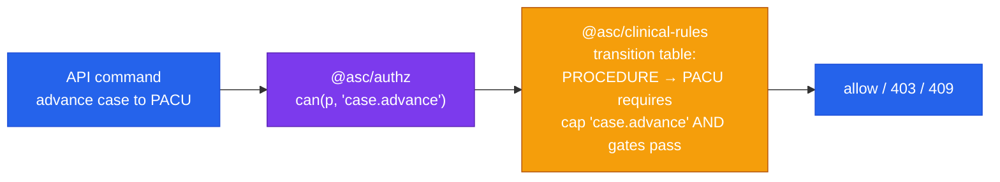

- The **transition table** (data in `@asc/clinical-rules`) names the capability each transition needs. When the real workflow arrives, we edit the table. New phases get new capabilities, which are appended to the catalog and granted in templates.
- The authz engine, policies and guards do not change.

### 7.6 Package boundaries

| Piece | Package | Why there |
|---|---|---|
| Capability catalog (`as const` tuple), `Capability`, `RoleKey` (string), `Grant`, `Principal`, `TenantRef`, `RoleTemplate` types | `@asc/types` | Shared contracts with no deps (LM-001) |
| Zod for `/me`, principal, role templates (tenant registry rows later) | `@asc/validation` | Schemas live here |
| Role templates, `can()`, `authorize()`, workspace resolver, policy compiler, `IdentityPort` and `TenantResolver` interfaces (+ test fakes, `StaticTenantResolver`), membership → `Principal` mapping | **`@asc/authz`** (new, pure TS, no I/O) | Testable without Medplum; used by web, api, worker, bots |
| `/auth/me` fetch helper | `@asc/api-client` (server subpath, per P04) | Fetch / Medplum clients live here |
| Medplum `IdentityPort` adapter, Fastify plugins (tenant, authn, default-deny, guards) | `apps/api` | Wiring only |
| Token-handler route, `useCan()`, `<Can>`, `<RequireCapability>`, workspace definitions | `apps/web` | UI gating is convenience, never enforcement |
| RLS, `withTenant()`, append-only `audit_events` (tenant registry table later) | `@asc/db` | App data |
| Hospital seed (Phase 1); tenant provisioner (Customer #2) | `apps/bots/scripts/` | Next to Medplum tooling |

---

## 8. Adding or changing a role

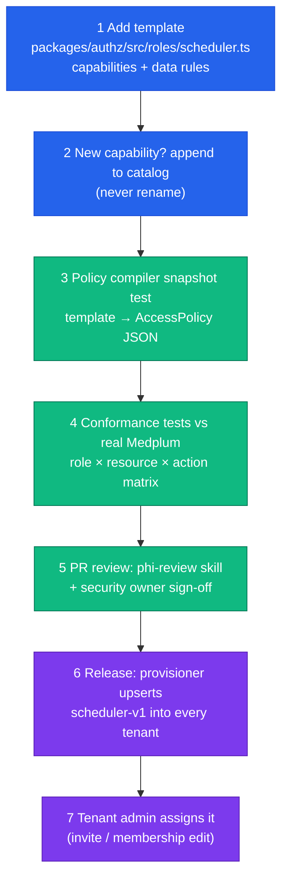

- **Changing a role** works the same way. Bump the template `version`, and the provisioner creates `gi-physician-v4` and repoints memberships in one transaction per tenant. Old policies are kept until no membership references them, so rollback is a repoint.
- **Tenant-specific roles** (P3) are allowed later. They clone a template as `tenant:<slug>:<key>` and may only *remove* capabilities and data rights, never add beyond the base template. Hospitals can tighten, not widen.
- **Guardrail test:** `can()` is called with a literal capability, and a lint check bans comparisons like `role === "..."` outside `@asc/authz`.

---

## 9. Machine identities: API, worker, Bots

| Caller | Identity | Medplum access | Notes |
|---|---|---|---|
| `apps/api` for a user | The **user's** token (forwarded) | User's policy | Default for every command (P04 Q1) |
| `apps/worker` | **One `ClientApplication` per tenant** (`worker@acme`) using client credentials; secret in Key Vault `tenant-{id}-worker` | `system-worker` policy: only the resource types its jobs touch | Never a server-wide super-admin token |
| Bots | Run inside the tenant Project as their own `Bot` identity | Bot's own AccessPolicy | Tenant-scoped by construction |
| AI agents | Their own principal kind `agent`, never the raw user or worker credential | Capabilities = caller's capabilities ∩ the agent's allow-list; data scoped to the run's tenant, patient and case | `Provenance` and audit record `agentExecutionId` and `onBehalfOf`; `@asc/agents` context-scope assertions reject items outside the run scope; model-supplied IDs are never trusted |
| Provisioner (CI/ops) | Super-admin, ops-only pipeline | Platform | Never present in app runtime config |

**Job context propagation**

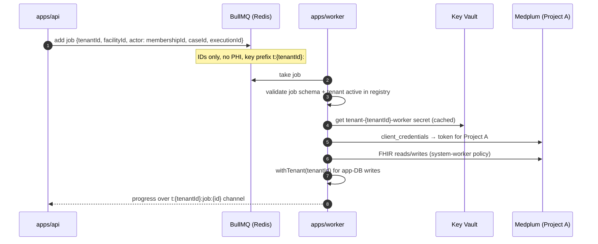

---

## 10. Realtime: SSE and WebSocket security

There are two realtime paths.

**1. Our SSE (`apps/api`, P10).** This carries AI token streams and job progress. The client already uses **fetch plus `eventsource-parser` with a Bearer header** (PROGRESS decisions log, 2026-09-27), so no token goes in the URL.

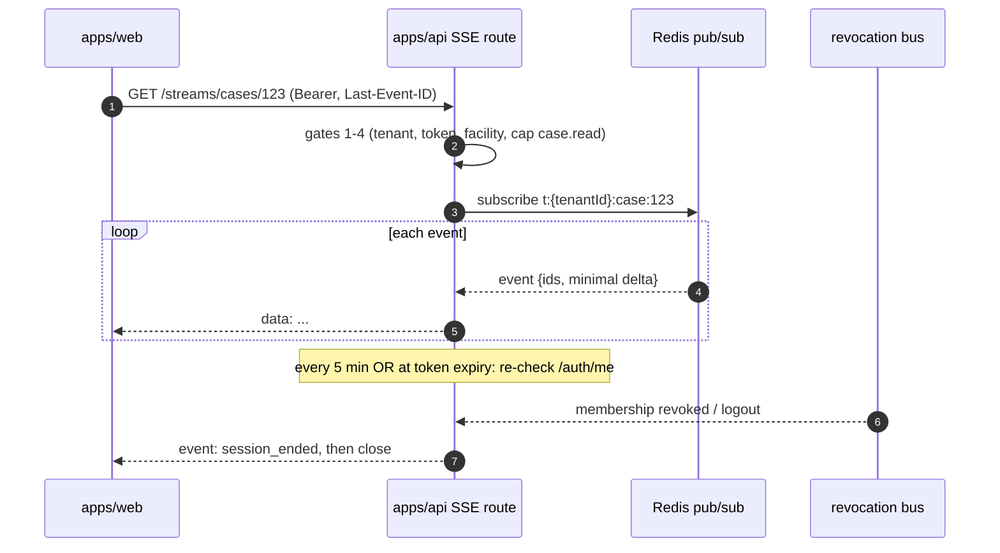

Rules for SSE:

- Authorize at connect, then **re-validate every ≤ 5 min and at token expiry**. Close the stream on revocation; the revocation bus is fed by logout and admin deactivation.
- Channel names always include `tenantId`. The server builds channel names from the *principal*, never from client input alone.
- Events carry IDs and minimal deltas. AI text deltas may contain PHI (P10 Q1), so streams are TLS only, are never logged, and App Gateway buffering is off.
- `EventSource` is not used. If a client cannot send headers, the API issues a **one-time stream ticket** (`POST /stream-tickets` returns a ticket that is single-use, 30 s, bound to user, tenant and stream) instead of a token in the query string.

**2. Medplum WebSocket subscriptions** (whiteboard, worklists). Medplum authenticates the socket with a short-lived binding token obtained using the user's access token. Notifications are evaluated against the subscriber's AccessPolicy (S3: confirm that criteria-filtered delivery honours `%facility`). We never proxy these through our API.

**If we ever add our own WebSocket server:** same ticket flow, check `Origin` against the tenant's hosts, run an authorization check per message for any write, and re-validate on the same 5 min cadence.

---

## 11. External services: MindScript, faxagnet, Integuru, webhooks

### 11.1 Trust zones

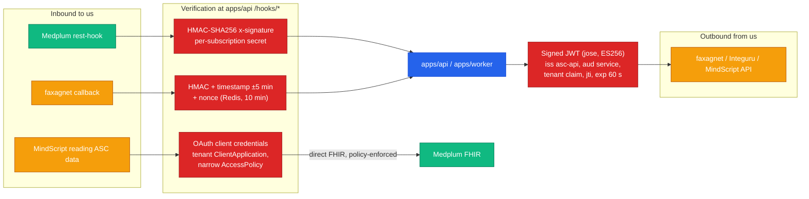

| Integration | Direction | Authentication | Authorization / scope | Notes |
|---|---|---|---|---|
| Medplum Subscription → `apps/api` | in | `subscription-secret` extension → `x-signature` HMAC-SHA256 ([Medplum docs](https://www.medplum.com/docs/subscriptions/subscription-extensions)) | Hook URL includes `tenantId`; payload `meta.project` must match | Idempotent by notification id; enqueue only |
| faxagnet → `apps/api` callback | in | HMAC + timestamp + nonce | Per-tenant secret; path `/hooks/fax/{tenantId}` | Copy MindScript proxy hardening (06 §5) |
| `apps/api` → faxagnet | out | 60 s signed service JWT (MindScript pattern) | Allowlisted paths; tenant claim | Upstream 401 mapped to 502; no cookies |
| `apps/worker` → Integuru (eCW) | out | Per-practice credential from Key Vault + signed JWT | Flags `ECW_READ` / `ECW_WRITEBACK` per tenant | Write-back ledger once-only |
| MindScript → ASC data (future) | in | **OAuth2 client credentials** (prefer `private_key_jwt`) as a `ClientApplication` in the tenant Project | Dedicated `mindscript-reader` AccessPolicy, e.g. read-only `Patient`, `Composition` final | No shared DB; revoke = delete client |
| ASC → MindScript (future) | out | Signed JWT or MindScript-issued client credentials | Per tenant | Decide with the MindScript team (Q-MS6) |
| Browser → Deepgram | out | 60 s Deepgram token minted by `apps/api` + audit | One token per capture session | Audio never transits our servers |

**Common rules**

- All secrets live in Key Vault, are read through `@asc/config`, and are rotated at least every 90 days.
- Outbound calls go through an egress allowlist.
- Webhooks reject anything older than 5 min.
- Every inbound or outbound call writes an audit event with `tenantId` and the counterparty, never the payload.

---

## 12. Break-glass, support access, audit

### 12.1 Break-glass (emergency access beyond normal scope)

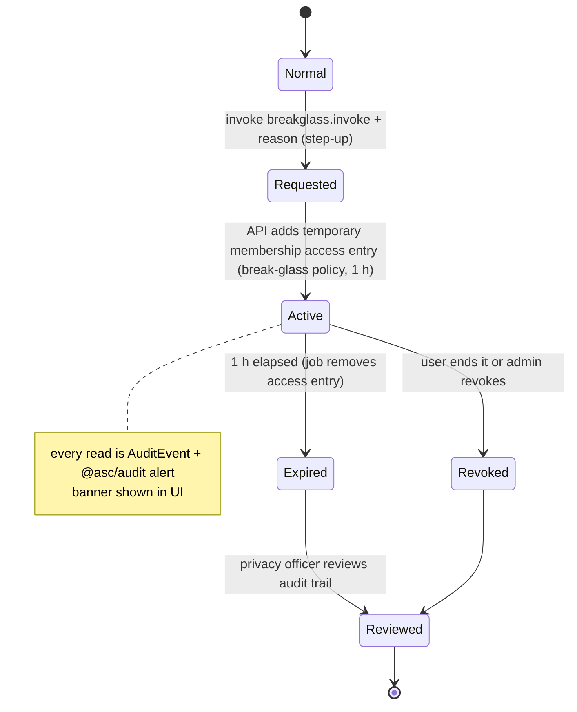

### 12.2 Support access (Wybit staff into a tenant)

Wybit staff never use super-admin to read PHI.

1. A tenant admin approves a **time-boxed support membership** (max 4 h, read-only policy unless scoped otherwise).
2. The approval, the use and the expiry are all audited and visible to the tenant.

### 12.3 Audit fields (every event)

| Field | Source |
|---|---|
| `tenantId`, `facilityId` | Principal / job context |
| `actor.membershipId`, `actor.profile`, `actor.kind` (user / worker / bot / service / agent) | Principal |
| `onBehalfOf.agentExecutionId` | AI runs |
| `action` (capability or `auth.login`, `auth.denied`, `breakglass.start`…) | Guard / handler |
| `target` (resource type + id; never content) | Handler |
| `outcome` (`allowed` / `denied` + gate number) | Guard |
| `sessionId`, `ip`, `userAgent` | API |

- Medplum `AuditEvent` covers FHIR access automatically. `@asc/audit` covers everything else and **fails closed**.
- Denied events include the gate number, which makes misconfigured roles easy to spot.

---

## 13. Implementation plan

The plan lives in **[`P05 — Auth & Roles`](../plan/phases/P05-auth-roles.md)** as small sub-phases, each one PR with a commit outline and checklist.

| Sub-phase | What | Needs |
|---|---|---|
| P05a | Contracts, `can()` with facility grants, `IdentityPort`, `TenantResolver` | — |
| P05b | Role templates (§7.3), grants builder, workspace resolver, role-name lint rule | P05a |
| P05c | Policy compiler: template → parameterized `AccessPolicy` | P05b |
| P05d | Web on capabilities (mock): `Principal`, `useCan`, route guards, workspaces, remove `UserRole` | P05b |
| P05e | App-DB tenancy: `tenant_id`, RLS, `withTenant()` | P05a |
| P05f | Durable append-only audit store and IAM events | P05e |
| P05g | API spine: default deny, gates 1–4, `/me` | P05a, P05e, P05f |
| P05h | Medplum hardening, spikes (§14), seed, policy test | P05c, P02 |
| P05i | Medplum identity adapter in the API | P05g, P05h, P04 |
| P05j | Web sign-in: PKCE + TOTP, token handler, timeouts, logout | P05d, P05i, P04 |

Follow-ups that are not part of P05 (step-up, worker and stream auth, service-to-service signing, break-glass, SSO, patient identity, role lifecycle tooling, multi-tenancy) start at the gates in [P05 §6](../plan/phases/P05-auth-roles.md#6-gated-follow-ups-not-in-p05-start-no-later-than-the-gate). Multi-tenant activation steps are in [`future-multi-tenancy-architecture.md` §9](future-multi-tenancy-architecture.md#9-evolution-checklist-activating-multi-tenancy-customer-2-onboarding).

---

## 14. Spikes to run before building

| ID | Spike (≤ ½ day each, on local Medplum 5.1.42) | Confirms | Runs in |
|---|---|---|---|
| S1 | Parameterized policy with `_compartment=%facility` + `meta.accounts`; `writeConstraint` on `Composition`; access-token lifetime setting on `ClientApplication`; claim that carries auth time for step-up | §4.3, §5.1, §5.2, §7.4 | **P05h** |
| S1b | Two `access[]` entries with different policies: union behaviour for `hiddenFields`, `readonly`, `writeConstraint` | §4.3, §7.4 | **P05h** |
| S7 | `/auth/me` payload carries membership `access[]` with parameters (enough to build grants) | §6.1 | **P05h** |
| S2 | `DomainConfiguration` with Entra ID (OIDC) on self-hosted; SCIM endpoint coverage | §5.3 | SSO follow-up |
| S3 | WebSocket subscription auth and that notifications respect the subscriber's `%facility` criteria | §10 | SSE auth follow-up |
| S4 | Project-scoped users: same email in two Projects, login with `projectId`, project selection UX | §4.1 rule 2 | Customer #2 |
| S5 | Per-tenant `ClientApplication` client credentials, scoped by its own AccessPolicy | §9 | Worker identity follow-up |

If a spike fails, record the fallback in the ADR before building the sub-phase that depends on it. Follow-up gates: [P05 §6](../plan/phases/P05-auth-roles.md#6-gated-follow-ups-not-in-p05-start-no-later-than-the-gate).

---

## 15. Open questions

| ID | Question | Default until answered | Blocks |
|---|---|---|---|
| Q-IAM-1 | Tenant = customer (BAA holder): agreed? | Yes, one Project per customer | P05e, P05h |
| Q-IAM-2 | Single role list (§7.3), CRNA as qualifier | As proposed | P05b |
| Q-IAM-3 | Session timeouts: 15 min idle / 12 h absolute; logout on browser close configurable per tenant | As proposed | P05j |
| Q-IAM-4 | Step-up for `note.sign`, `coding.attest`, `discharge.approve`, `breakglass.invoke` | As proposed | Step-up follow-up |
| Q-IAM-5 | Subdomain scheme and apex domain (`*.asc-ehr.app`?) | `{slug}.<apex>` | Customer #2 |
| Q-IAM-6 | First pilot hospital IdP (Entra / Okta / Google) | Entra | SSO follow-up |
| ~~Q-IAM-7~~ | Medplum hosting (D1) | **Decided 2026-10-03: self-host from open source, no hosted service** | — |
| Q-IAM-9 | Email sender for Medplum invites, password reset, magic links (SMTP relay or Azure Communication Services Email) | Azure Communication Services Email via SMTP | P05h, P05j |
| Q-IAM-8 | Patient login channel: email OTP, SMS OTP, magic link | Email magic link | Portal (P2) |
| Q-MS6 | Shared login with MindScript | Separate in P1; same hospital IdP later | SSO follow-up |
