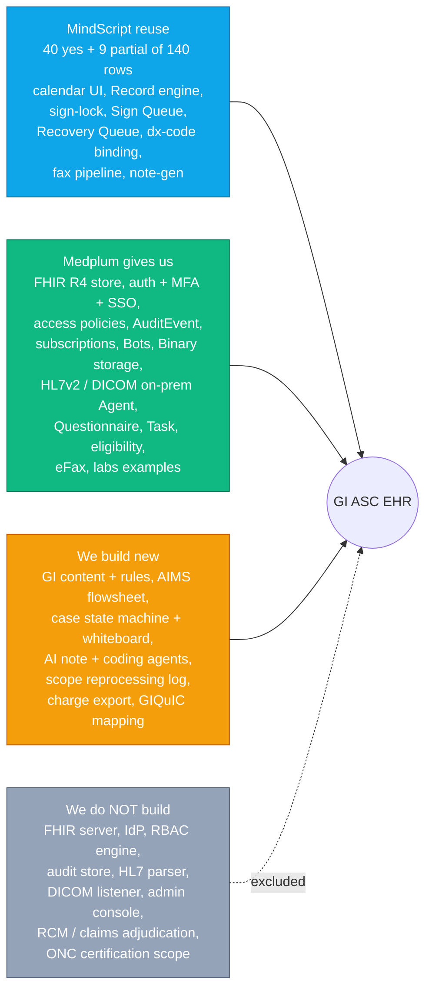

# GI ASC EHR — Product Requirements & Target Architecture

> **Status:** Working draft v0.1 (2026-09-25) — for red-lining with physicians and engineering.
> **Sources merged:** `ASC EHR Feature Spec.docx` (22 modules, 3 phases), `Roadmap GI ASC Feature-map.xlsx` (140 features tagged against MindScript), this repo (`ASC_EHR` scaffold), and the [Medplum](https://github.com/medplum/medplum) open-source platform.

## Read in this order

| # | Document | Answers |
|---|----------|---------|
| 1 | [Requirements](01-requirements.md) | *What do we need?* Every module, per phase, with GI-specific acceptance criteria and non-functional requirements. |
| 2 | [Build / Reuse / Medplum matrix](02-build-reuse-matrix.md) | *What already exists (MindScript), what Medplum gives us free, what we must build, and what we must NOT build.* |
| 3 | [Target architecture](03-target-architecture.md) | *How it fits together:* system context, containers, FHIR data model, package layout, security, Azure deployment. |
| 4 | [End-to-end flows](04-end-to-end-flows.md) | Mermaid flows for the whole patient journey and each critical sub-flow. |
| 5 | [Delivery plan & open questions](05-delivery-plan.md) | Critical path to go-live, workstreams, risks, decisions still owed by physicians/business. |
| 6 | [Medplum adoption, source map & build plan](06-medplum-adoption-and-build-plan.md) | *Exactly which Medplum packages we run / depend on / copy, PHI hardening of self-hosted Medplum, colour-coded source map (MindScript / Medplum / built / new), net-new backlog, work we can start before workflows arrive.* |
| 7 | [Multi-tenancy design](07-multi-tenancy.md) | *Customer = Medplum Project (hard isolation), site = Organization compartment, shared platform Project; tenant rules per layer, gaps in current code, security tests.* |
| A | [Feature traceability appendix](appendix-feature-traceability.md) | All 140 roadmap rows → phase, MindScript reuse, Medplum primitive, build type. |
| ADR | [Adopt Medplum as clinical data platform](../decisions/2026-09-25-adopt-medplum-as-clinical-data-platform.md) | Proposed decision record. |

## Executive summary

**Product.** An AI-native EHR for a gastroenterology ambulatory surgery center (colonoscopy / EGD first). Phase 1 is the legal + operational minimum to open: scheduling, registration, H&P, nursing, procedure note, image capture, anesthesia (AIMS), PACU/discharge, specimen tracking, consents, coding + charge **hand-off**, security/audit.

**The wedge.** Incumbents (gGastro, Provation) drive a navigation tree of forms. We generate structured documentation from clinician narration and confirmed data — *the interface is the AI*. That is the only part worth being original about. Everything underneath it is commodity healthcare plumbing.

**The leverage.** Three sources cover most of the surface so we write only the wedge + GI-specific logic:

**Five decisions this doc recommends** (details in the linked sections):

1. **Medplum self-hosted on Azure is the system of record** (FHIR R4). Our Fastify API becomes a thin *command* layer for GI domain logic; reads go straight to Medplum under the user's token. → [ADR](../decisions/2026-09-25-adopt-medplum-as-clinical-data-platform.md)
2. **UI stays on `@asc/ui` (shadcn/Base UI)** using headless `@medplum/react-hooks` + `@medplum/core`. `@medplum/react` (Mantine) is allowed only in internal admin tooling; the Medplum App is our Phase-1 admin console.
3. **Forms are data, not code.** H&P, nursing, time-out, Aldrete, consent, VTE, adverse event = FHIR `Questionnaire`s rendered by one renderer we build once; extraction to `Observation`s via Bots.
4. **One worklist engine = FHIR `Task`.** Sign Queue, Recovery Queue (pathology), prep escalation, eligibility failures, outstanding specimens all are `Task`s auto-created/resolved by Bots.
5. **Move three items into Phase 1** that the spec had left out or later: *scope reprocessing log*, *basic adverse-event reporting*, *auto-fax of referring letter* (the letter is generated anyway; MindScript fax pipeline exists).

**Biggest risks to December go-live:** AIMS (highest liability, new time-series capability), scope-tower image capture (hardware unknown), CPT licensing + biller file format (unknown), and schedule (~10 weeks). See [delivery plan](05-delivery-plan.md).
