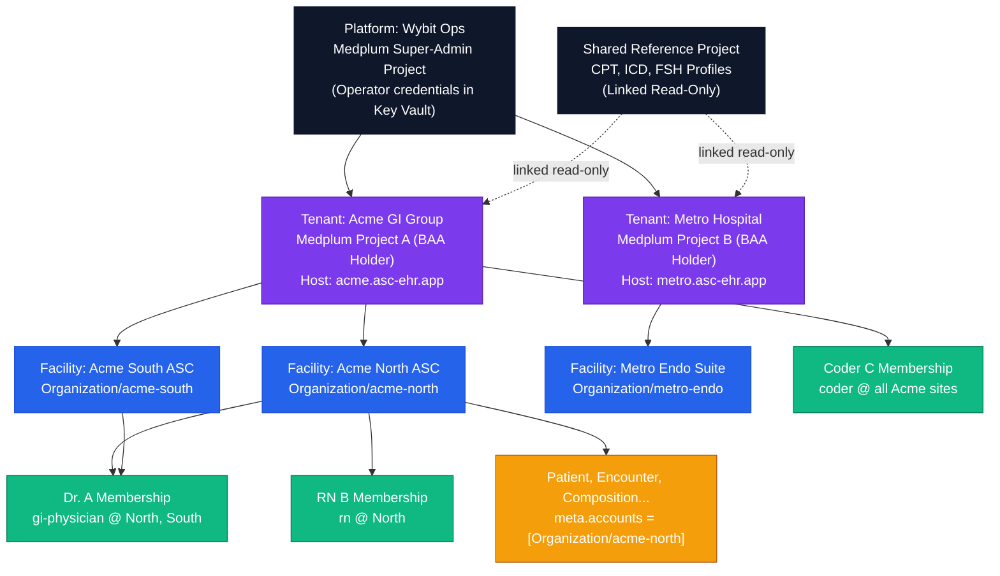
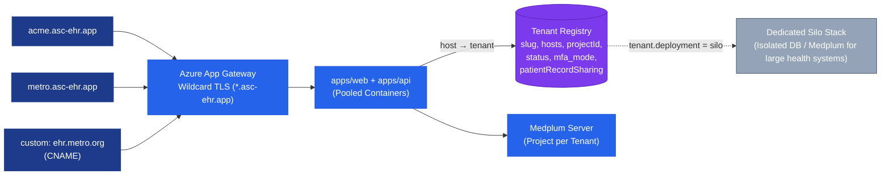
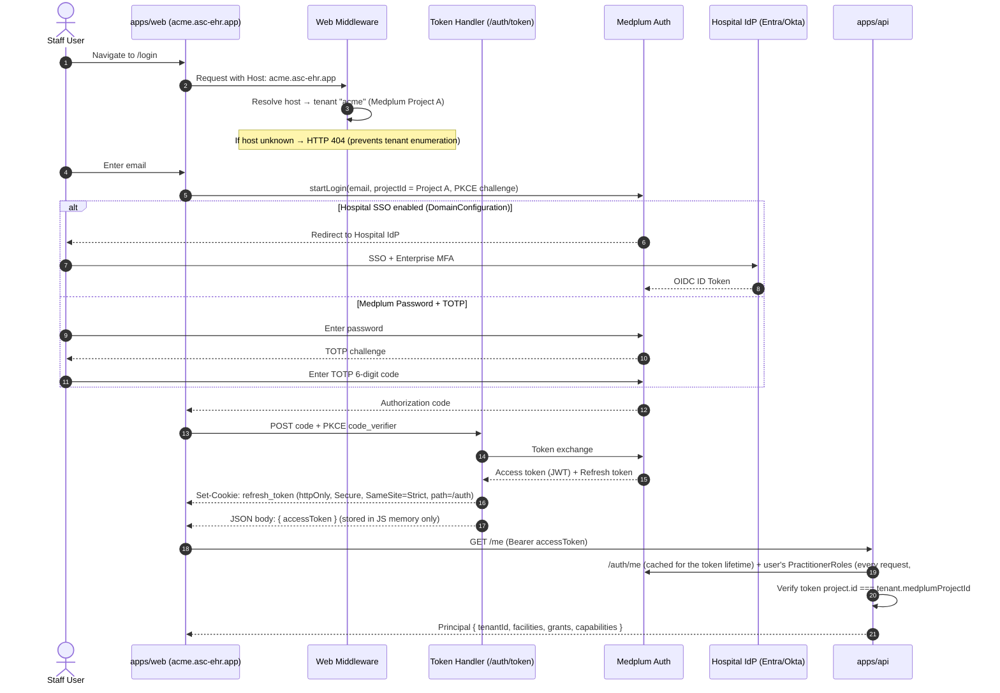
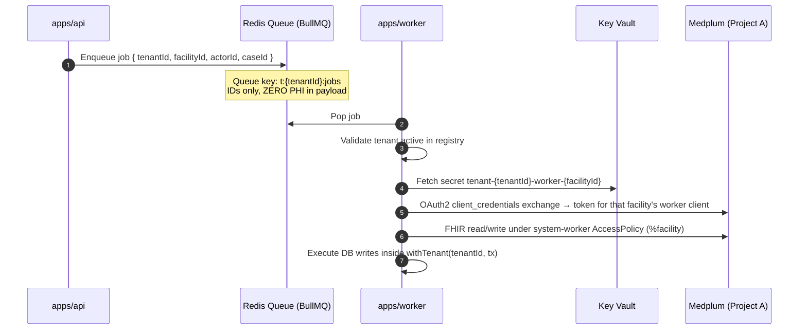

# Future Multi-Tenancy Architecture (Scale & Evolution Guide)

> **Status:** Architecture Reference & Evolution Plan (Snapshot 2026-10-05)  
> **Context:** Preserves the multi-tenant architecture, reasoning, diagrams, and operational specifications designed in PR #20 and PR #21. While the immediate deployment targets a single hospital / ASC group (detailed in [`08-identity-access-and-tenancy.md`](08-identity-access-and-tenancy.md)), all data models, schemas, and abstractions remain strictly **tenant-ready**. When Customer #2 is onboarded, this document serves as the implementation blueprint.

---

## 1. Executive Summary & Evolution Philosophy

Our platform uses a **tenant-ready core**:
1. **Zero hardcoding:** Every database table includes `tenant_id uuid NOT NULL`, every FHIR resource lists its facility `Organization` in `meta.accounts` (the singular `meta.account` is deprecated in Medplum 5.1.42), and the `@asc/authz` authorization library enforces facility-scoped capability grants.
2. **Phase 1 (Single Hospital):** Deploys with a single active tenant context (configured via environment variables / config). Subdomain dynamic parsing, tenant registries, and multi-project CLI provisioners are bypassed to accelerate clinical go-live.
3. **Phase 2 (Multi-Tenant SaaS):** Enables host-based tenant resolution (`{slug}.asc-ehr.app`), multi-project Medplum provisioning, and cross-tenant attack verification **without changing clinical schemas, authorization code or business rules**. It does add new pieces: a tenant registry migration, a host-based `TenantResolver` adapter (replacing the static one from P05a), web host middleware, the provisioner and DNS/TLS (§9).

---

## 2. Multi-Tenant Tenancy Model & Hierarchy



### Hierarchy Rules

| Level | Medplum Primitive | App Primitive | Boundary Strength |
|---|---|---|---|
| **Platform** | Super-Admin Project | `ops` role | Operators only; never used by application runtime |
| **Tenant** | `Project` | `tenantId` (UUID) ↔ `medplumProjectId` | **Hard**: FHIR resources cannot reference across Projects |
| **Facility** | `Organization` + Compartment (`meta.accounts`) | `facilityId` = Organization ID | Policy-enforced via parameterized `%facility` AccessPolicies |
| **User** | Project-scoped `User` + `ProjectMembership` | `membershipId` | One membership per tenant |
| **Reference** | Linked Read-Only Project | Standard CodeSystems | Read-only into every tenant |

1. **Tenant = Customer (BAA Holder):** One customer organization equals exactly one Medplum Project. Multiple customers never share a Project, preventing cross-tenant data leakage by FHIR database design.
2. **Project-Scoped Clinicians:** Clinicians practicing across multiple independent hospital organizations hold separate project-scoped accounts. Offboarding or suspension at Hospital A has zero impact on Hospital B.
3. **Compartments for Physical Sites:** Within a tenant, multiple physical locations (e.g. North ASC, South ASC) are distinct `Organization` resources. All clinical records carry their site in `meta.accounts`.

---

## 3. Deployment Topology: Pooled vs. Silo



- **Pooled by default:** A shared application cluster and Medplum server serve all tenants. Adding a customer requires creating a Project, Organizations, and AccessPolicies—no container redeployments.
- **Silo option:** For large health systems with dedicated hardware requirements, `tenant.deployment = "silo"` directs traffic to dedicated containers using identical code images.

---

## 4. Multi-Store Isolation Matrix

Defense in depth is enforced across all persistence and streaming layers:

| Store / Layer | Tenant Isolation Mechanism | Facility Isolation Mechanism |
|---|---|---|
| **Medplum FHIR** | Project boundary (hard isolation) | `%facility` criteria via `meta.accounts` |
| **App Postgres (`@asc/db`)** | `tenant_id NOT NULL` + **Postgres Row-Level Security (RLS)** via `current_setting('app.tenant_id')` | `facility_id` column checked by API guards |
| **Redis / BullMQ** | Key prefix `t:{tenantId}:`; job payloads carry `{ tenantId, facilityId, actor }` (IDs only, zero PHI) | In job metadata |
| **SSE / PubSub** | Channel format `t:{tenantId}:case:{caseId}` | Validated at subscription time |
| **Blob Storage (`Binary`)** | Stored within Medplum Project container | Resource-level AccessPolicy |
| **Azure Key Vault** | Secret names `tenant-{tenantId}-*` | — |
| **Audit Logs** | `tenant_id` attribute, append-only store | `facility_id` attribute |
| **Rate Limiting** | Rate-limit buckets keyed by `tenantId:userId` | — |

### Postgres Row-Level Security (RLS) Specification

```sql
-- Schema enforcement in @asc/db
ALTER TABLE agent_runs ADD COLUMN tenant_id uuid NOT NULL;
ALTER TABLE agent_runs ADD COLUMN facility_id text NULL;
ALTER TABLE agent_runs ENABLE ROW LEVEL SECURITY;
ALTER TABLE agent_runs FORCE ROW LEVEL SECURITY;

CREATE POLICY tenant_isolation ON agent_runs
  USING (tenant_id = current_setting('app.tenant_id', true)::uuid)
  WITH CHECK (tenant_id = current_setting('app.tenant_id', true)::uuid);
```

All database queries run through a session wrapper:
```ts
// packages/db/src/tenant.ts
export async function withTenant<T>(
  db: Database,
  tenantId: string,
  fn: (tx: Transaction) => Promise<T>
): Promise<T> {
  return db.transaction(async (tx) => {
    await tx.execute(sql`SELECT set_config('app.tenant_id', ${tenantId}, true)`);
    return fn(tx);
  });
}
```
If `app.tenant_id` is unset, `current_setting(..., true)` returns `NULL`, causing queries to return 0 rows and inserts to fail (fail-closed).

---

## 5. End-to-End Multi-Tenant Sign-In Flow



---

## 6. Machine Identities & Worker Isolation

In a multi-tenant system, asynchronous background workers (`apps/worker`) and Bots must not run with super-admin permissions:



1. **Per-Facility Client Applications:** Each (tenant, facility) has its own worker `ClientApplication` in Medplum with a `system-worker` AccessPolicy parameterized by `%facility`, granting only the resources its jobs need at that facility ([#60](https://github.com/imRahul05/ASC-EHR/issues/60), decided 2026-10-09). The worker chooses the client from the validated `job.facilityId`. Tenant-wide jobs get their own narrow client only when one exists.
2. **Bot Execution:** Medplum Bots execute within the customer's Project container, automatically inheriting that tenant's boundaries.

---

## 7. Automated Multi-Tenant Provisioning Design

When onboarding Customer #2, provisioning is driven by an automated, idempotent CLI script (`apps/bots/scripts/provision/index.ts`):

```bash
pnpm --filter bots provision-tenant \
  --slug metro \
  --name "Metro Healthcare System" \
  --facilities ./metro-facilities.json \
  --admin-email "admin@metro.org" \
  --plan
```

### Provisioning Steps (Idempotent)
1. **Medplum Project:** Upserts Project with name and slug.
2. **Organizations:** Upserts `Organization` resources for each site (e.g. `metro-main`, `metro-west`).
3. **AccessPolicies:** Compiles and uploads all versioned role templates (`gi-physician-v1`, `rn-v1`, etc.) tagged with version metadata.
4. **OAuth Clients:** Creates PKCE `ClientApplication` for Web and client_credentials `ClientApplication` for Workers. Stores secrets in Key Vault.
5. **Admin User:** Invites initial customer administrator with the `admin` role template and facility grants.
6. **Tenant Registry:** Writes record to app database `tenants` and `tenant_hosts` tables.

---

## 8. Role Lifecycle Operations (SaaS Operations)

At multi-tenant scale, changing roles must not break active users:

| Lifecycle Action | Mechanism | Zero Downtime Guarantee |
|---|---|---|
| **Rename Role** | Update role template `label` only; immutable `key` unchanged | Pure metadata update; memberships and policies untouched |
| **Update Permissions** | Bump version (`rn-v1` → `rn-v2`). Provisioner compiles `rn-v2`. | Existing users run on `v1` until `role repoint rn --to v2` is executed. Rollback is a simple repoint to `v1`. |
| **Deprecate Role** | Set template `status: "deprecated"` | New user assignments blocked; existing users continue uninterrupted. |
| **Retire Role** | Set template `status: "retired"` | Provisioner rejects retirement until 0 memberships reference the template. |
| **Split Role** | Run `role split --from front-desk --to [reception, registration] --map mapping.csv` | Assigns new roles first, verifies coverage, then removes deprecated role. |
| **Disable User** | Set Medplum `ProjectMembership.active = false` | Access ends on the next request: there is no cross-request grant cache ([#57](https://github.com/imRahul05/ASC-EHR/issues/57), decided 2026-10-09), and Medplum refuses the token immediately. |

---

## 9. Evolution Checklist: Activating Multi-Tenancy (Customer #2 Onboarding)

When the business signs its second customer, follow this operational checklist:

- [ ] **Step 1: Deploy Tenant Registry Table** (`tenants` and `tenant_hosts` in `@asc/db`). Populate Tenant #1 retroactively. Each tenant records `patientRecordSharing` (`on-encounter` | `isolated`, [#59](https://github.com/imRahul05/ASC-EHR/issues/59)), set at onboarding with the customer's compliance contact. `on-encounter` is for facilities that form one covered entity; `isolated` is for separate legal entities. Until the registry exists, Tenant #1's value lives in `@asc/config` (`on-encounter`).
- [ ] **Step 2: Enable Web Host Middleware** (Next 16 middleware/proxy file — check `node_modules/next/dist/docs`, LM-008): Resolve `Host` header to `tenantId` via registry cache. Return 404 for unknown hosts.
- [ ] **Step 3: Swap the API `TenantResolver`** from `StaticTenantResolver` (P05a) to a host-based resolver backed by the registry; the existing gate-1 check (token `project.id` = resolved tenant's project) stays unchanged.
- [ ] **Step 4: Configure Wildcard DNS & TLS** (`*.asc-ehr.app` on Azure App Gateway).
- [ ] **Step 5: Run Multi-Tenant Cross-Contamination Test Suite**:
  - Test Tenant A token accessing Tenant B endpoint → HTTP 401/404.
  - Test Postgres RLS: Tenant A transaction attempting to read Tenant B row returns 0 rows.
  - Test BullMQ: Worker processing Tenant A job cannot write to Tenant B FHIR store.
- [ ] **Step 6: Run Provisioner for Customer #2**: Execute `provision-tenant --slug customer2`.
