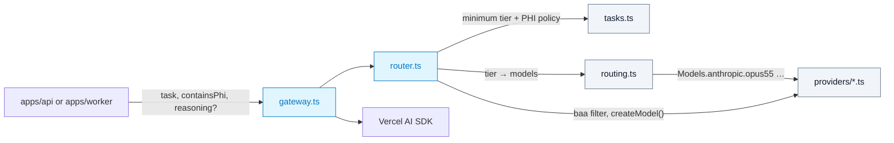

# @repo/agents

Single entry point for every LLM call: model configuration, routing, PHI/BAA enforcement, fallback, and audit metadata. Both `apps/api` and `apps/worker` use it, so there is exactly one place to change models.

## Configuration at a glance

Everything lives in `src/config/` — nothing model-related is written anywhere else.

| File | What it holds | You edit it when… |
|---|---|---|
| `reasoning.ts` | `Reasoning.Low / Medium / High` + what each tier is for | never (tiers are stable) |
| `tasks.ts` | `Task.*` catalog + per-task policy: minimum tier, `handlesPhi`, description | adding a new kind of AI work |
| `providers/<name>.ts` | One `defineProvider(...)` per vendor: BAA flag, SDK adapter, its models | adding/removing a model or vendor |
| `routing.ts` | Tier → ordered models, per routing profile (`default`, `budget`) | changing which model serves a tier |
| `validate.ts` | `validateAgentConfig()` — static checks, run in tests | never |



### Rules
- **No raw strings.** Use `Reasoning.High`, `Task.MedicalCoding`, `Models.anthropic.opus55`. Lint-free code with autocomplete and hover docs.
- **Tiers live in routing only.** Models don't declare a tier; the routing table decides which models serve which tier.
- **A model is defined once** — in its provider file. Routing references the model *object*, so a provider/model mismatch cannot compile.
- **Every PHI-capable tier needs a BAA model.** `validateAgentConfig()` fails the test suite otherwise.

## Calling the gateway

```typescript
import { executeAgentObject, Reasoning, Task } from '@repo/agents';

const res = await executeAgentObject({
  task: Task.MedicalCoding,        // sets minimum tier (High) and PHI policy (always PHI)
  containsPhi: true,               // REQUIRED — does this prompt contain PHI?
  reasoning: Reasoning.High,       // optional: escalate above the task minimum (never lowers it)
  messages,
  schema: CodingSuggestionSchema,
});

res.output;            // schema-typed result
res.agentExecutionId;  // write to @repo/audit with task, tier, provider, modelId, attempts
```

- **Effective tier** = max(task minimum, `reasoning` override).
- **Effective PHI flag** = `containsPhi` OR the task's `handlesPhi`. PHI calls route only to providers with `baa: true`; if none, `NoCompliantModelError` is thrown before any model is called.
- **Fallback only on transient errors** (408/409/429/5xx/529, network, timeout). Non-retryable errors (400, 401/403, schema/`NoObjectGeneratedError`, aborts, unknown) throw `AgentExecutionError` immediately. The SDK retries the same model first (`maxRetriesPerModel`, default 2).
- **Metadata on every result:** `agentExecutionId`, `task`, `tier`, `containsPhi`, `provider`, `modelKey`, `modelId`, `attempts`. Failures carry the same on `AgentExecutionError` (SDK error in `.cause` — never log `cause` verbatim).
- **Prompts and outputs are never logged.** Stream errors default to a no-op handler.
- **Streaming** (`streamAgentTask`) uses the first eligible model only (no mid-stream failover).

### Routing profiles
`createGateway({ routingProfile: 'budget' })` uses the cost-controlled table for staging/automated tests. The app decides the profile from its parsed env config — this package never reads `process.env`.

### UI / settings screens
`getRoutingOverview()` returns every tier's configured chain (labels, descriptions, BAA flags, deprecation) with no keys or adapters — safe to send to the frontend. `REASONING_TIER_INFO` describes each tier.

## Common changes

**Add a model** — add one entry to the provider file, then reference it in `routing.ts`:
```typescript
// providers/anthropic.ts → models: { …, opus6: { id: 'claude-opus-6', label: 'Claude Opus 6', description: '…' } }
// routing.ts → [Reasoning.High]: [Models.anthropic.opus6, Models.anthropic.opus55, …]
```

**Retire a model** — set `deprecated: true` on it. `validateAgentConfig()` fails until it is removed from every routing profile.

**Add a task** — add it to `Task` and give it a profile in `TASK_PROFILES` (the compiler rejects a task without one).

**Add a provider (e.g. Azure OpenAI under the Microsoft BAA)**
1. `pnpm --filter @repo/agents add @ai-sdk/azure`
2. Create `providers/azure.ts`:
   ```typescript
   import { createAzure } from '@ai-sdk/azure';
   import { defineProvider } from '../define.js';

   const azure = createAzure({ resourceName: process.env.AZURE_RESOURCE_NAME }); // wire via @repo/config in practice

   export const azureOpenai = defineProvider({
     name: 'azureOpenai',
     displayName: 'Azure OpenAI',
     baa: true, // only after confirming the deployment is covered by the Microsoft BAA
     createModel: (deploymentName) => azure(deploymentName),
     models: {
       gpt6Astra: { id: 'gpt-6-astra-deployment', label: 'GPT-6 Astra (Azure)', description: '…' },
     },
   });
   ```
3. Add it to `PROVIDERS` and `Models` in `providers/index.ts`, then use `Models.azureOpenai.gpt6Astra` in `routing.ts`.

## Testing
`createGateway({ registry, routing, taskProfiles })` accepts injected config. Tests build fixture providers with the same `defineProvider` backed by the SDK's `MockLanguageModelV4` — no API keys, no network.

ADRs: `docs/decisions/2026-09-25-adopt-vercel-ai-sdk-for-agent-orchestration.md`, `docs/decisions/2026-09-25-centralize-agent-configuration-and-model-routing.md`
