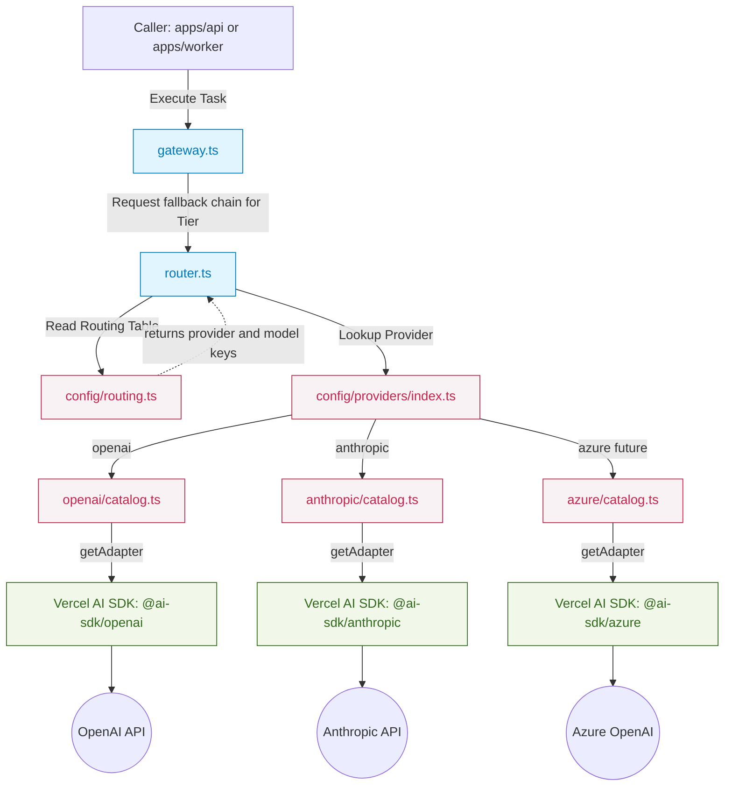

# @repo/agents

This package centralizes all Vercel AI SDK integration, model configuration, routing, and agent fallback logic. By keeping this logic in a shared package, both the `apps/api` (Fastify) and `apps/worker` (BullMQ) can execute AI agent tasks using the exact same configuration without duplicating logic.

## 🧠 Model Routing & Configuration

We use a modular, dependency-inverted architecture for configuring and routing AI models. 

### Architecture Flow



### How it Works

The configuration is structured in `src/config/`:

1. **`providers/`**: Each LLM provider (OpenAI, Anthropic, Google) has its own directory. 
   - `constants.ts`: Contains the exact string IDs of the models to prevent typos (e.g., `GPT_6_ASTRA`).
   - `catalog.ts`: Exports a `ProviderCatalog` that lists all models for that provider, their reasoning tier (`high`, `medium`, `low`), and implements a `getAdapter` function.
2. **`types.ts`**: Defines the shared interfaces, including the `ProviderCatalog` which enforces the `getAdapter: (modelId: string) => LanguageModel` method.
3. **`routing.ts`**: Defines the `ROUTING_TABLE`. This maps a `ReasoningTier` to an ordered array of `(provider, modelKey)` fallback entries. If the first model fails (e.g., rate limit), the gateway automatically tries the next one in the chain.

### The Dependency Inversion Principle
Notice that `src/router.ts` **does not** import `@ai-sdk/openai` or any other provider directly. It simply resolves the requested model from the `PROVIDER_REGISTRY` and calls `catalog.getAdapter(modelId)`. The actual initialization of the Vercel AI adapter happens natively inside each provider's `catalog.ts` file.

---

## 🚀 Future Deployments (Azure OpenAI / AWS Bedrock)

This modular setup is designed to be **100% compatible** with enterprise cloud providers like Azure OpenAI or AWS Bedrock. You will not need to rewrite the router or the gateway.

### Steps to Add Azure or AWS:

When you are ready to deploy to Azure (using `@ai-sdk/azure`) or AWS (`@ai-sdk/amazon-bedrock`), follow these exact steps:

1. **Install the adapter:**
   ```bash
   pnpm add @ai-sdk/azure --filter @repo/agents
   ```
2. **Add Provider Type:**
   In `src/config/types.ts`, add `'azure'` to the `ProviderName` type:
   ```typescript
   export type ProviderName = 'openai' | 'anthropic' | 'google' | 'azure';
   ```
3. **Create Provider Directory:**
   Create a new folder `src/config/providers/azure/`.
   - Create `constants.ts` with your custom Azure deployment names.
   - Create `catalog.ts` and initialize the adapter:
   ```typescript
   import { createAzure } from '@ai-sdk/azure';
   import { AZURE_MODELS } from './constants.js';
   import { type ProviderCatalog } from '../../types.js';

   // Initialize the Azure client (it will automatically pick up AZURE_API_KEY and AZURE_RESOURCE_NAME from the environment)
   const azure = createAzure();

   export const AZURE_CATALOG: ProviderCatalog = {
     displayName: 'Azure OpenAI',
     providerKey: 'azure',
     models: { /* ... */ },
     getAdapter: (modelId) => azure(modelId),
   };
   ```
4. **Register Provider:**
   Export it in `src/config/providers/index.ts` and add `AZURE_CATALOG` to the `PROVIDER_REGISTRY`.
5. **Update Routing:**
   In `src/config/routing.ts`, swap out the default OpenAI/Anthropic models for your Azure models in the `ROUTING_TABLE`.

Because of the dependency-inverted architecture, `router.ts` will instantly pick up the new Azure adapter without any code changes required in the routing logic itself.
