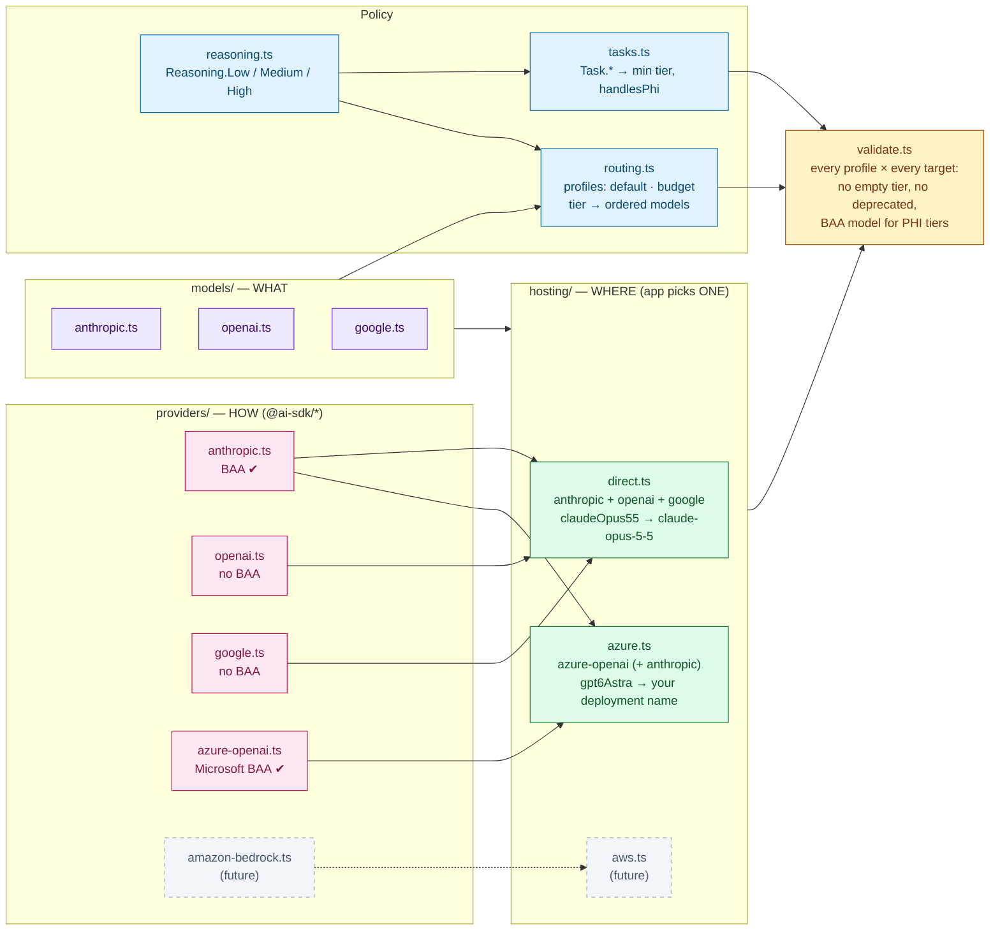
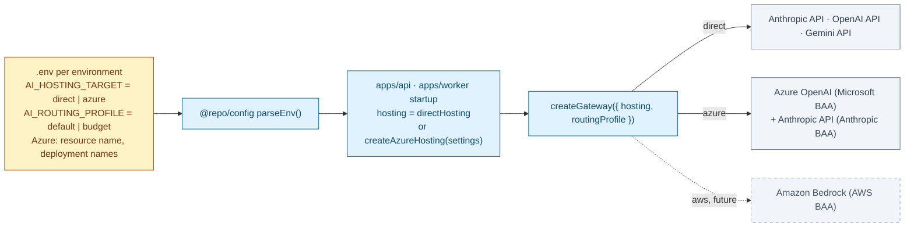

# @repo/agents

Single entry point for every LLM call: model configuration, routing, hosting (vendor APIs / Azure / later AWS), PHI/BAA enforcement, fallback, and audit metadata. `apps/api` and `apps/worker` both use it, so there is exactly one place to change models.

## Folder map

```
src/
├── gateway.ts              executeAgentTask / executeAgentObject / streamAgentTask, createGateway()
├── router.ts               task → tier → models → hosting → BAA filter
├── errors.ts               NoCompliantModelError, AgentExecutionError, retry classifier
└── config/
    ├── reasoning.ts        Reasoning.Low | Medium | High  (+ what each tier is for)
    ├── tasks.ts            Task.*  → minimum tier, handlesPhi, description
    ├── routing.ts          ROUTING_PROFILES (default, budget): tier → ordered models
    ├── validate.ts         validateAgentConfig() — run in tests
    ├── models/             WHAT  — logical models, one file per vendor (no API ids)
    │   ├── anthropic.ts        claudeOpus55, claudeSonnet5, …
    │   ├── openai.ts           gpt6Astra, gpt6Sol, …
    │   └── google.ts           gemini38Flash, …
    ├── providers/          HOW   — one file per Vercel AI SDK provider (@ai-sdk/*): BAA flag + model factory
    │   ├── anthropic.ts        @ai-sdk/anthropic   (BAA ✔)
    │   ├── openai.ts           @ai-sdk/openai      (no BAA)
    │   ├── google.ts           @ai-sdk/google      (no BAA)
    │   └── azure-openai.ts     @ai-sdk/azure       (Microsoft BAA ✔, factory: resource + credentials)
    └── hosting/            WHERE — which providers serve which models, with real ids / deployment names
        ├── direct.ts           vendor APIs (default today)
        └── azure.ts            createAzureHosting(settings): GPT on Azure OpenAI (+ Claude on Anthropic API)
```

| Question | Look in |
|---|---|
| Which models do we use? | `config/models/<vendor>.ts` |
| Which SDK / account talks to a vendor, and is it under a BAA? | `config/providers/<sdk>.ts` |
| What is the exact model id / Azure deployment name? | `config/hosting/<target>.ts` |
| Which model answers a High-tier call, and what is the fallback? | `config/routing.ts` |
| What tier / PHI policy does a task get? | `config/tasks.ts` |

**Why three folders instead of one file per vendor:** the same model runs in different places with different ids (`claude-opus-5-5` on the Anthropic API; a deployment name you choose on Azure OpenAI; a Bedrock id on AWS), and the **BAA belongs to the provider endpoint**, not the model vendor (GPT on OpenAI API: no BAA; GPT on Azure OpenAI: Microsoft BAA). Keeping *what* (models), *how* (SDK providers) and *where* (hosting) separate means moving production to Azure changes only `hosting/`; routing, tasks and models stay the same.

## 1. How the config fits together



## 2. How one call is resolved


## 3. Choosing where production runs



`@repo/agents` never reads `process.env`; the app builds the hosting target from its parsed config.

## Calling the gateway

```typescript
import { createGateway, createAzureHosting, Reasoning, Task } from '@repo/agents';

// At app startup (values from @repo/config's parsed env):
const gateway = createGateway({
  routingProfile: 'default',
  hosting: createAzureHosting({
    azureOpenAI: { resourceName: env.AZURE_OPENAI_RESOURCE, tokenProvider }, // Entra ID / managed identity
    deployments: { gpt6Astra: 'prod-gpt6-astra', gpt6Luna: 'prod-gpt6-luna' },
  }),
});

// Per request:
const res = await gateway.executeAgentObject({
  task: Task.MedicalCoding,        // sets minimum tier (High) and PHI policy (always PHI)
  containsPhi: true,               // REQUIRED — does this prompt contain PHI?
  reasoning: Reasoning.High,       // optional: escalate above the task minimum (never lowers it)
  messages,
  schema: CodingSuggestionSchema,
});

res.output;            // schema-typed result
res.agentExecutionId;  // write to @repo/audit with task, tier, hostingTarget, endpoint, modelId, attempts
```

Without `hosting`, the module-level `executeAgentTask` / `executeAgentObject` / `streamAgentTask` use `directHosting` and the `default` profile.

- **Fallback only on transient errors** (408/409/429/5xx/529, network, timeout). Non-retryable errors (400, 401/403, schema/`NoObjectGeneratedError`, aborts, unknown) throw `AgentExecutionError` immediately. The SDK retries the same model first (`maxRetriesPerModel`, default 2).
- **Prompts and outputs are never logged.** Never log `AgentExecutionError.cause` verbatim.
- **Streaming** (`streamAgentTask`) uses the first eligible model only (no mid-stream failover).
- **Settings screen:** `getRoutingOverview({ hosting })` returns each tier's models with label, availability on the target, provider endpoint and BAA flag — no keys or adapters.

## Common changes

**Add a model** — `models/<vendor>.ts`, then a binding in each `hosting/` target that serves it, then use it in `routing.ts`:
```typescript
// models/anthropic.ts   claudeOpus6: { vendor: 'anthropic', label: 'Claude Opus 6', description: '…' }
// hosting/direct.ts     claudeOpus6: { endpoint: 'anthropic', id: 'claude-opus-6' }
// routing.ts            [Reasoning.High]: [Models.claudeOpus6, Models.claudeOpus55, …]
```

**Deploy a GPT model on Azure** — create the deployment in the Azure resource, then add `deployments: { gpt6Sol: '<deployment name>' }` to the app's `createAzureHosting` settings. Nothing in this package changes.

**Retire a model** — set `deprecated: true` in `models/`. `validateAgentConfig()` fails until it is removed from every routing profile.

**Add a task** — add it to `Task` and give it a profile in `TASK_PROFILES` (the compiler rejects a task without one).

**Add a provider / cloud (e.g. AWS Bedrock)**
1. `pnpm --filter @repo/agents add @ai-sdk/amazon-bedrock`
2. `providers/amazon-bedrock.ts` — a factory returning an `Endpoint` (`baa: true` only once the AWS BAA covers the account/region).
3. `hosting/aws.ts` — `createAwsHosting(settings)` binding logical models to Bedrock model ids.
4. Add it to `HOSTING_TARGETS_FOR_VALIDATION` in `hosting/index.ts` so tests prove every routing profile still works — and has a BAA model for PHI tasks — on that cloud.

Validation already runs every routing profile against both `direct` and an **Azure-only** target (no Anthropic), which is how the `budget` profile was found to have no Azure-deployable model for its medium/low tiers (fixed by adding `gpt6Luna`).

## Testing
`createGateway({ hosting, routing, taskProfiles })` accepts injected config. Fixtures (`src/__tests__/fixtures.ts`) define logical models plus two mock hosting targets (a direct-like one and a cloud-like one hosting only Claude under different ids) backed by the SDK's `MockLanguageModelV4` — no API keys, no network.

ADRs: `docs/decisions/2026-09-25-adopt-vercel-ai-sdk-for-agent-orchestration.md`, `docs/decisions/2026-09-25-centralize-agent-configuration-and-model-routing.md`
