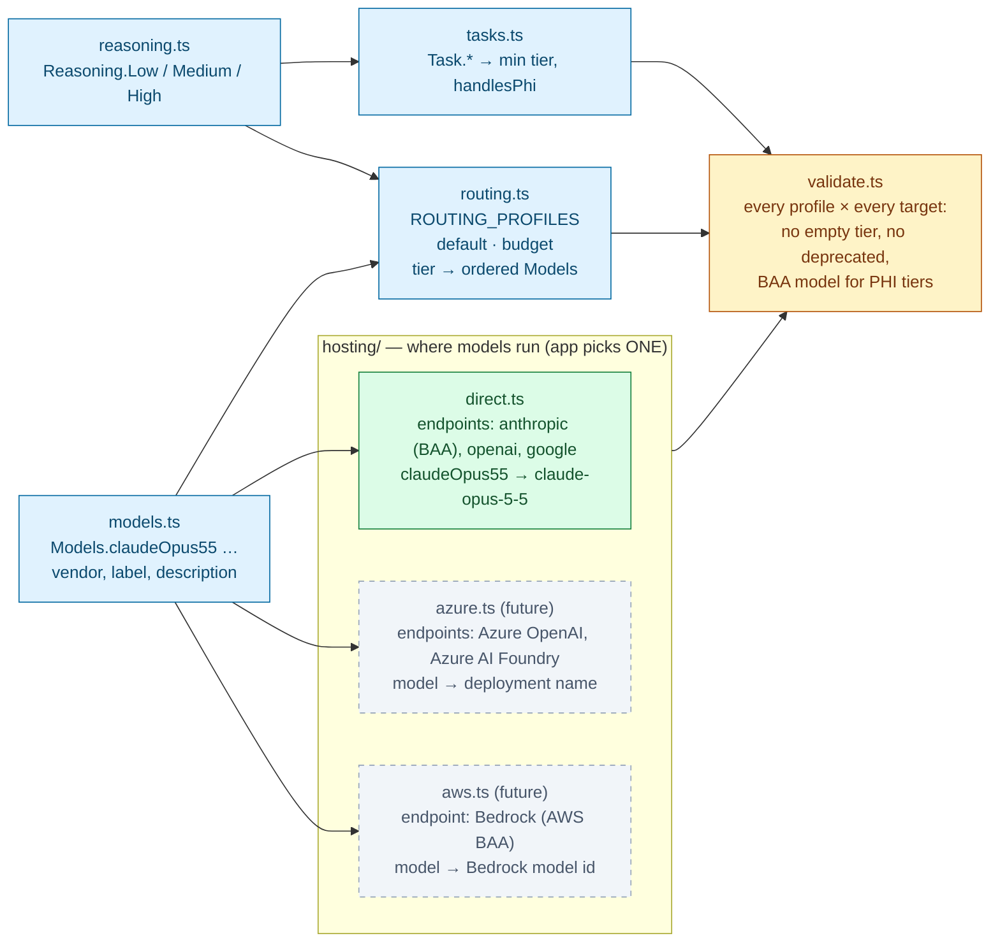
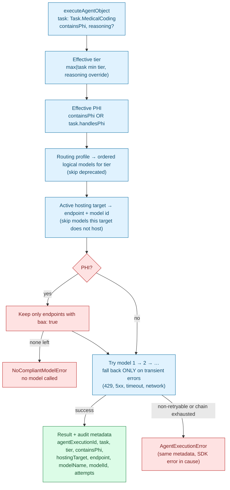
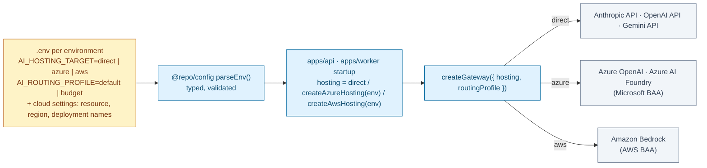

# @repo/agents

Single entry point for every LLM call: model configuration, routing, hosting (vendor API / Azure / AWS), PHI/BAA enforcement, fallback, and audit metadata. `apps/api` and `apps/worker` both use it, so there is exactly one place to change models.

## Configuration at a glance

Everything lives in `src/config/`. Each fact is written **once**; everything else references it by typed name.

| File | Answers | Example | You edit it when… |
|---|---|---|---|
| `reasoning.ts` | What quality tiers exist? | `Reasoning.High` | never (tiers are stable) |
| `tasks.ts` | What AI work do we do, min tier, always PHI? | `Task.MedicalCoding` | adding a new kind of AI work |
| `models.ts` | **What** models do we use? (vendor, label, description — no API ids) | `Models.claudeOpus55` | adding / retiring a model |
| `routing.ts` | Which models serve each tier, in fallback order? (per profile) | `ROUTING_PROFILES.default` | changing which model serves a tier |
| `hosting/<target>.ts` | **Where** do models run? Endpoints (BAA flag, SDK adapter) + the real model id / deployment name per model | `directHosting` | moving to Azure/AWS, new region, new deployment |
| `validate.ts` | Is the combination safe? (run in tests) | `validateAgentConfig()` | never |

**Why ids are not in `models.ts`:** the same model has a different id depending on where it runs: `claude-opus-5-5` on the Anthropic API, a Bedrock model id on AWS, a deployment name you choose on Azure. The **BAA also belongs to the endpoint**, not the model vendor (Claude via Bedrock is covered by the AWS BAA; GPT via Azure OpenAI by the Microsoft BAA). So ids and BAA flags live in the hosting target, and the routing table stays the same on every cloud.

### 1. How the config fits together



### 2. How one call is resolved



### 3. Choosing where production runs



The routing table, tasks and models do **not** change between clouds. Only the hosting target does. `@repo/agents` never reads `process.env`; the app builds the target from its parsed config.

## Calling the gateway

```typescript
import { executeAgentObject, Reasoning, Task } from '@repo/agents';

const res = await executeAgentObject({
  task: Task.MedicalCoding,        // sets minimum tier (High) and PHI policy (always PHI)
  containsPhi: true,               // REQUIRED — does this prompt contain PHI?
  reasoning: Reasoning.High,       // optional: escalate above the task minimum (never lowers it)
  messages,
  schema: CodingSuggestionSchema,
});

res.output;            // schema-typed result
res.agentExecutionId;  // write to @repo/audit with task, tier, hostingTarget, endpoint, modelId, attempts
```

- **Fallback only on transient errors** (408/409/429/5xx/529, network, timeout). Non-retryable errors (400, 401/403, schema/`NoObjectGeneratedError`, aborts, unknown) throw `AgentExecutionError` immediately. The SDK retries the same model first (`maxRetriesPerModel`, default 2).
- **Prompts and outputs are never logged.** Never log `AgentExecutionError.cause` verbatim.
- **Streaming** (`streamAgentTask`) uses the first eligible model only (no mid-stream failover).
- **Settings screen:** `getRoutingOverview({ hosting })` returns each tier's models with label, availability on the target, endpoint, BAA flag — no keys or adapters.

## Common changes

**Add a model** — one entry in `models.ts`, one binding per hosting target that serves it, then use it in `routing.ts`:
```typescript
// models.ts    claudeOpus6: { vendor: 'anthropic', label: 'Claude Opus 6', description: '…' }
// direct.ts    claudeOpus6: { endpoint: 'anthropic', id: 'claude-opus-6' }
// routing.ts   [Reasoning.High]: [Models.claudeOpus6, Models.claudeOpus55, …]
```

**Retire a model** — set `deprecated: true` in `models.ts`. `validateAgentConfig()` fails until it is removed from every routing profile.

**Add a task** — add it to `Task` and give it a profile in `TASK_PROFILES` (the compiler rejects a task without one).

**Add a hosting target (Azure / AWS)** — when production's cloud is decided:
1. Install the SDK provider: `pnpm --filter @repo/agents add @ai-sdk/azure` (or `@ai-sdk/amazon-bedrock`).
2. Create `hosting/azure.ts` as a **factory**, because resource names and deployment names differ per environment:
   ```typescript
   import { createAzure } from '@ai-sdk/azure';
   import { defineHostingTarget } from './define.js';

   export interface AzureHostingSettings {
     resourceName: string;
     deployments: { gpt6Astra: string; gpt6Sol: string; gpt6Luna: string };
   }

   export function createAzureHosting(settings: AzureHostingSettings) {
     const azure = createAzure({ resourceName: settings.resourceName }); // key via env / managed identity
     return defineHostingTarget({
       name: 'azure',
       displayName: 'Azure',
       endpoints: {
         // Only after confirming this resource is covered by the Microsoft BAA.
         azureOpenai: { displayName: 'Azure OpenAI', baa: true, createModel: (d) => azure(d) },
       },
       models: {
         gpt6Astra: { endpoint: 'azureOpenai', id: settings.deployments.gpt6Astra },
         gpt6Sol: { endpoint: 'azureOpenai', id: settings.deployments.gpt6Sol },
         gpt6Luna: { endpoint: 'azureOpenai', id: settings.deployments.gpt6Luna },
         // Claude models: add a second endpoint here if they are served on this cloud.
       },
     });
   }
   ```
3. Register it for validation in `hosting/index.ts` (e.g. with placeholder settings) so `validateAgentConfig()` proves every tier still has a model — and a BAA model for PHI tasks — on that cloud.
4. In the app: add `AI_HOSTING_TARGET` + the cloud settings to the env schema in `@repo/config`, build the target at startup, and pass it to `createGateway({ hosting })`.

Models a target does not host are skipped automatically, so a cloud that only offers some vendors still works as long as validation passes.

## Testing
`createGateway({ hosting, routing, taskProfiles })` accepts injected config. Fixtures (`src/__tests__/fixtures.ts`) define logical models plus two mock hosting targets (a direct-like one and a cloud-like one hosting only Claude under different ids) backed by the SDK's `MockLanguageModelV4` — no API keys, no network.

ADRs: `docs/decisions/2026-09-25-adopt-vercel-ai-sdk-for-agent-orchestration.md`, `docs/decisions/2026-09-25-centralize-agent-configuration-and-model-routing.md`
