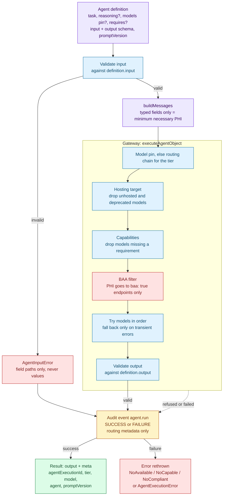
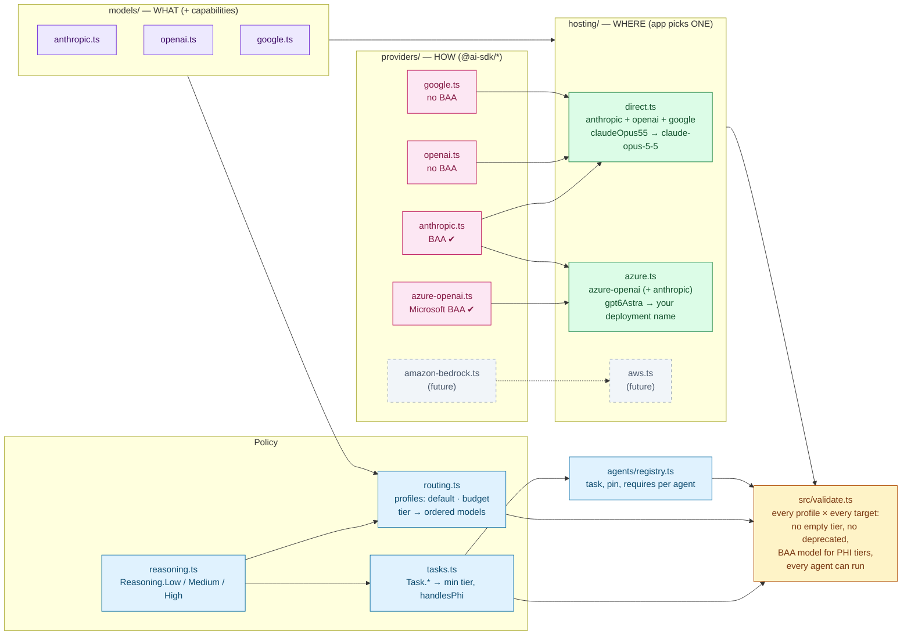
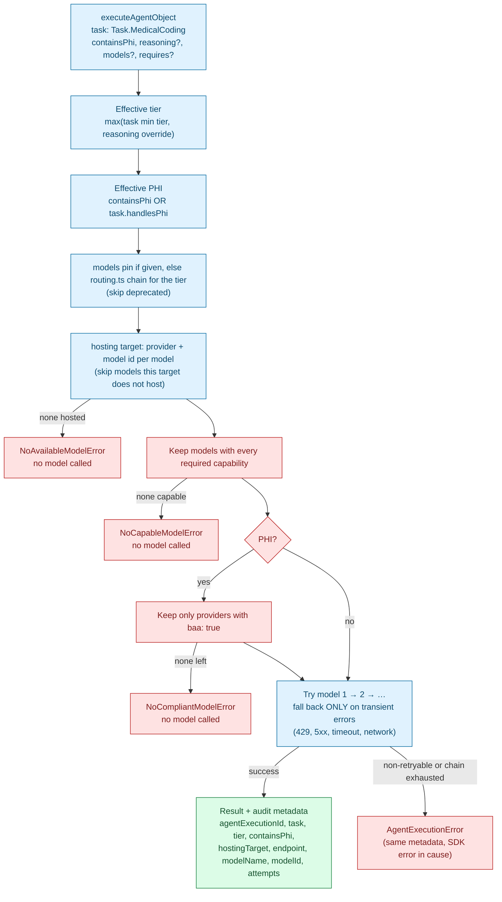
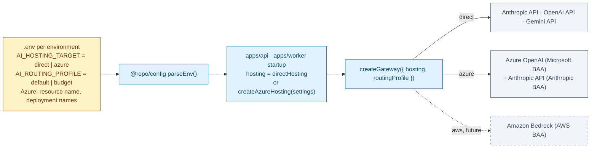

# @repo/agents

Single entry point for every LLM call: agent definitions, model configuration, routing, hosting (vendor APIs / Azure / later AWS), PHI/BAA enforcement, fallback, and audit. `apps/api` and `apps/worker` both use it, so there is exactly one place to change models or agents.

> **New here?** Start with the workflow guide [`docs/agent/ai-agents-guide.md`](../../docs/agent/ai-agents-guide.md) — which path to take, step-by-step recipes, rules and troubleshooting. This README is the detailed package reference.

Three layers, each depending only on the ones below it:

| Layer | Answers | Folder |
|---|---|---|
| **Agents** | What does this agent do, with which data, under which prompt version? | `agents/` |
| **Runtime** | Which model serves this call, and what happens when it fails? | `runtime/` |
| **Config** | Which models exist, what can they do, where are they hosted, which are under a BAA? | `config/` |

## Folder map

```
src/
├── index.ts                public API (explicit exports)
├── validate.ts             validateAgentConfig() — config + every registered agent (run in tests)
├── agents/                 WHAT an agent is
│   ├── define.ts               defineAgent(), AgentDefinition, AgentEvalCase
│   ├── run.ts                  runAgent(): validate input → messages → gateway → audit
│   ├── registry.ts             AGENTS (name → definition), AgentName
│   └── discharge-instructions/ first agent (one folder per agent)
│       ├── definition.ts           task, schemas, prompt wiring
│       ├── input.ts                minimum-necessary input schema (strict, no identifiers)
│       ├── prompt.ts               versioned instructions + buildMessages(input)
│       ├── evals/cases.ts          synthetic eval cases
│       └── index.ts
├── runtime/                HOW a call runs
│   ├── gateway.ts              executeAgentTask / executeAgentObject / streamAgentTask, createGateway()
│   ├── router.ts               pin or tier chain → hosting → capabilities → BAA filter
│   └── errors.ts               NoAvailable / NoCapable / NoCompliant model errors, AgentExecutionError, retry classifier
├── config/                 policy + catalog (no runtime state)
│   ├── reasoning.ts            Reasoning.Low | Medium | High  (+ what each tier is for)
│   ├── tasks.ts                Task.*  → minimum tier, handlesPhi, description
│   ├── routing.ts              ROUTING_PROFILES (default, budget): tier → ordered models
│   ├── models/             WHAT  — logical models + capabilities, one file per vendor (no API ids)
│   │   ├── anthropic.ts        claudeOpus55, claudeSonnet5, …
│   │   ├── openai.ts           gpt6Astra, gpt6Sol, …
│   │   └── google.ts           gemini38Flash, …
│   ├── providers/          HOW   — one file per Vercel AI SDK provider (@ai-sdk/*): BAA flag + model factory
│   │   ├── anthropic.ts        @ai-sdk/anthropic   (BAA ✔)
│   │   ├── openai.ts           @ai-sdk/openai      (no BAA)
│   │   ├── google.ts           @ai-sdk/google      (no BAA)
│   │   └── azure-openai.ts     @ai-sdk/azure       (Microsoft BAA ✔, factory: resource + credentials)
│   └── hosting/            WHERE — which providers serve which models, with real ids / deployment names
│       ├── direct.ts           vendor APIs (default today)
│       └── azure.ts            createAzureHosting(settings): GPT on Azure OpenAI (+ Claude on Anthropic API)
└── testing/fixtures.ts     mock models, hosting targets, gateway, audit recorder (tests only, not exported)
```

Tests live in `__tests__/` next to the code they test. Agent **output** schemas that `apps/web` also uses live in `@repo/validation` (`packages/validation/src/agents/`).

| Question | Look in |
|---|---|
| Which agents exist? | `agents/registry.ts` |
| What data does an agent send to the model? | `agents/<name>/prompt.ts` → `buildMessages` |
| Which models do we use, and what can they do? | `config/models/<vendor>.ts` |
| Which SDK / account talks to a vendor, and is it under a BAA? | `config/providers/<sdk>.ts` |
| What is the exact model id / Azure deployment name? | `config/hosting/<target>.ts` |
| Which model answers a High-tier call, and what is the fallback? | `config/routing.ts` |
| What tier / PHI policy does a task get? | `config/tasks.ts` |

**Why three config folders instead of one file per vendor:** the same model runs in different places with different ids (`claude-opus-5-5` on the Anthropic API; a deployment name you choose on Azure OpenAI; a Bedrock id on AWS), and the **BAA belongs to the provider endpoint**, not the model vendor (GPT on OpenAI API: no BAA; GPT on Azure OpenAI: Microsoft BAA). Keeping *what* (models), *how* (SDK providers) and *where* (hosting) separate means moving production to Azure changes only `hosting/`; routing, tasks, models and agents stay the same.

## 1. How an agent runs



## 2. How the config fits together



## 3. How one gateway call is resolved



## 4. Choosing where production runs



`@repo/agents` never reads `process.env`; the app builds the hosting target from its parsed config.

## Running an agent

```typescript
import { AGENTS, createGateway, runAgent } from '@repo/agents';

const gateway = createGateway({ hosting, routingProfile: 'default' }); // once, at startup

const { output, meta } = await runAgent(AGENTS['discharge-instructions'], input, {
  actor: { type: 'user', id: session.userId }, // who triggered the run
  containsPhi: true,                            // REQUIRED, as for the gateway
  patientId,                                    // internal ids for the audit trail (optional)
  surgicalCaseId,
  gateway,                                      // defaults to defaultGateway (direct, default profile)
});
// output: typed by the agent's output schema (@repo/validation)
// meta:   gateway metadata + agent + promptVersion
```

`runAgent` validates the input (`AgentInputError` lists field paths only), builds messages with the agent's `buildMessages`, calls `executeAgentObject` (the output is validated against the agent's schema), and **always** writes one `agent.run` audit event through `@repo/audit` — `SUCCESS` or `FAILURE`:

- **Actor:** the agent (`actorType: 'agent'`, `actorId: <agent name>`). The triggering user or system is in `details.triggeredByType` / `details.triggeredById`, and `agentExecutionId` links the event to the model call.
- **Details:** routing metadata only — agent, promptVersion, task, tier, hostingTarget, endpoint, modelName, modelId, attempts, and errorName on failure. Never input values, prompts or output.
- **Sink:** defaults to `getAuditClient()`, resolved before any model is called, so production without a durable audit store fails closed. Tests inject `audit`. If the audit write fails, that error propagates — audit loss is never silent.

### Add an agent

1. Create `src/agents/<agent-name>/` (kebab-case, e.g. `procedure-note-summary`).
2. `input.ts` — a `.strict()` Zod schema with only the fields the model needs: enums, numbers, booleans. No names, DOB, MRN or addresses; avoid free text.
3. Output schema — in `@repo/validation` (`packages/validation/src/agents/<agent-name>.ts`) when the web app renders it; otherwise next to the input.
4. `prompt.ts` — `PROMPT_VERSION` (`YYYY-MM-DD.N`), `INSTRUCTIONS`, and `buildMessages(input)` rendering each field explicitly (never `JSON.stringify(input)`). Bump the version on every change.
5. `definition.ts` — `defineAgent({ name, description, task, reasoning?, models?, requires?, promptVersion, input, output, instructions, buildMessages })`. Pick (or add) a `Task`: it sets the minimum tier and whether the agent is always routed as PHI.
6. `evals/cases.ts` — a few synthetic `AgentEvalCase`s (input + output expectations).
7. One line in `agents/registry.ts`. `validateAgentConfig()` then proves the agent can run on every hosting target and routing profile.
8. Tests in `src/agents/<agent-name>/__tests__/` — see `discharge-instructions` for the pattern (minimum-necessary messages, eval inputs validate, mocked round-trip, audit events).

### Capabilities

Every model lists `capabilities` (`Capability.Vision`, `Capability.Tools`, `Capability.StructuredOutput`) in `config/models/<vendor>.ts`. A gateway call's or an agent's `requires` drops models lacking any of them; `runAgent` always adds `StructuredOutput`, plus `Tools` when the agent has tools. If nothing is left, the call fails with `NoCapableModelError` (tier, hosting target, required capabilities) before any model is called. Capability flags must be verified against vendor docs.

### Model pin

`models: [Models.claudeOpus55, Models.gpt6Astra]` — on a gateway call or an agent definition — **replaces** the tier's routing chain, for needs like "coding must use Opus". The pin is still filtered by hosting, deprecation, capabilities and BAA, and the task's tier is still reported in metadata. `validateAgentConfig()` checks pinned agents on every hosting target.

## Calling the gateway directly

Prefer `runAgent`. For one-off calls without an agent definition:

```typescript
import { Capability, createAzureHosting, createGateway, Models, Reasoning, Task } from '@repo/agents';

// At app startup (values from @repo/config's parsed env):
const gateway = createGateway({
  routingProfile: 'default',
  hosting: createAzureHosting({
    azureOpenAI: { resourceName: env.AZURE_OPENAI_RESOURCE, tokenProvider }, // Entra ID / managed identity
    deployments: { gpt6Astra: 'prod-gpt6-astra', gpt6Luna: 'prod-gpt6-luna' },
  }),
});

// Per request:
const res = await gateway.executeAgentObject({
  task: Task.MedicalCoding,        // sets minimum tier (High) and PHI policy (always PHI)
  containsPhi: true,               // REQUIRED — does this prompt contain PHI?
  reasoning: Reasoning.High,       // optional: escalate above the task minimum (never lowers it)
  requires: [Capability.Vision],   // optional: only models with these capabilities
  models: [Models.claudeOpus55],   // optional: pin, replaces the tier's chain
  messages,
  schema: CodingSuggestionSchema,
});

res.output;            // schema-typed result
res.agentExecutionId;  // direct gateway callers must write their own @repo/audit event
```

Without `hosting`, `defaultGateway` and the module-level `executeAgentTask` / `executeAgentObject` / `streamAgentTask` use `directHosting` and the `default` profile.

- **Fallback only on transient errors** (408/409/429/5xx/529, network, timeout). Non-retryable errors (400, 401/403, schema/`NoObjectGeneratedError`, aborts, unknown) throw `AgentExecutionError` immediately. The SDK retries the same model first (`maxRetriesPerModel`, default 2).
- **Prompts and outputs are never logged.** Never log `AgentExecutionError.cause` verbatim.
- **Streaming** (`streamAgentTask`) uses the first eligible model only (no mid-stream failover).
- **Settings screen:** `getRoutingOverview({ hosting })` returns each tier's models with label, capabilities, availability on the target, provider endpoint and BAA flag — no keys or adapters.

## Common changes

**Add a model** — `models/<vendor>.ts` (with its capabilities), then a binding in each `hosting/` target that serves it, then use it in `routing.ts`:
```typescript
// models/anthropic.ts   claudeOpus6: { vendor: 'anthropic', label: 'Claude Opus 6', description: '…', capabilities: MULTIMODAL_CAPABILITIES }
// hosting/direct.ts     claudeOpus6: { endpoint: 'anthropic', id: 'claude-opus-6' }
// routing.ts            [Reasoning.High]: [Models.claudeOpus6, Models.claudeOpus55, …]
```

**Deploy a GPT model on Azure** — create the deployment in the Azure resource, then add `deployments: { gpt6Sol: '<deployment name>' }` to the app's `createAzureHosting` settings. Nothing in this package changes.

**Retire a model** — set `deprecated: true` in `models/`. `validateAgentConfig()` fails until it is removed from every routing profile and agent pin.

**Add a task** — add it to `Task` and give it a profile in `TASK_PROFILES` (the compiler rejects a task without one).

**Add a provider / cloud (e.g. AWS Bedrock)**
1. `pnpm --filter @repo/agents add @ai-sdk/amazon-bedrock`
2. `providers/amazon-bedrock.ts` — a factory returning an `Endpoint` (`baa: true` only once the AWS BAA covers the account/region).
3. `hosting/aws.ts` — `createAwsHosting(settings)` binding logical models to Bedrock model ids.
4. Add it to `HOSTING_TARGETS_FOR_VALIDATION` in `hosting/index.ts` so tests prove every routing profile and agent still works — and has a BAA model for PHI — on that cloud.

Validation already runs every routing profile and agent against both `direct` and an **Azure-only** target (no Anthropic), which is how the `budget` profile was found to have no Azure-deployable model for its medium/low tiers (fixed by adding `gpt6Luna`).

## Testing

`createGateway({ hosting, routing, taskProfiles })` accepts injected config, and `runAgent(…, { gateway, audit })` accepts an injected gateway and audit sink. `src/testing/fixtures.ts` defines logical models plus two mock hosting targets (a direct-like one and a cloud-like one hosting only Claude under different ids) backed by the SDK's `MockLanguageModelV4`, a test gateway, an in-memory audit recorder and a minimal test agent — no API keys, no network.

**Next step — live evals.** `agents/<name>/evals/cases.ts` holds synthetic cases with output expectations. Today the tests only check that the inputs validate and that the expectations behave; running the cases through `runAgent` against real BAA-covered models (budget profile) and reporting pass rates per `promptVersion` is not built yet.

ADRs: `docs/decisions/2026-09-25-adopt-vercel-ai-sdk-for-agent-orchestration.md`, `docs/decisions/2026-09-25-centralize-agent-configuration-and-model-routing.md`
